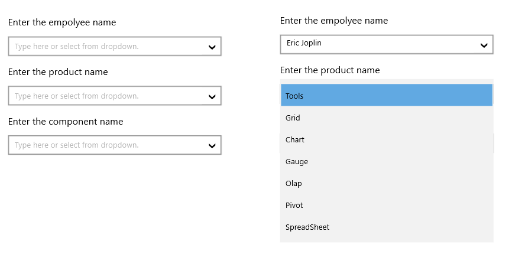
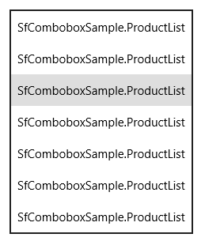
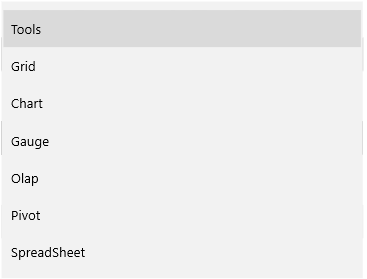
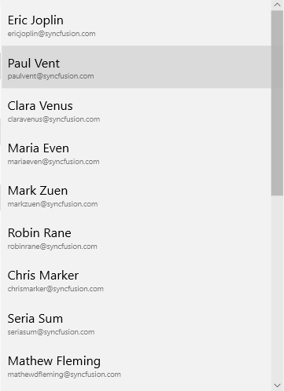

# Getting Started with UWP ComboBox (SfComboBox)

The SfComboBox control allows the user to select an item from a list of suggestions.

## Adding SfComboBox control

Create a Universal Windows Platform project in Visual Studio and refer to the following assemblies.

* Syncfusion.SfInput.UWP

* Syncfusion.SfShared.UWP

1.Include the namespace for Syncfusion.SfInput.UWP assembly in MainPage.xaml





<Page xmlns="http://schemas.microsoft.com/winfx/2006/xaml/presentation"

xmlns:x="http://schemas.microsoft.com/winfx/2006/xaml"

xmlns:input="using:Syncfusion.UI.Xaml.Controls.Input">





2.Now add the `SfComboBox` control with a required optimal name using the included namespace





<input:SfComboBox x:Name="combobox">





SfComboBox combobox = new SfComboBox();





Dim combobox As New SfComboBox()





## Populating Items

### Items Source

SfComboBoxItems can be populated with the business object collection. The below example is illustrated to create a SfComboBox that display a list of products. 

1.Create the Product model as follows.





public class ProductList
{
    public string Name { get; set; } 
}





Public Class ProductList

    Public Property Name() As String

End Class





2.Create a ViewModel class with Products property and Products property is initialized with several data objects in constructor.




public class ViewModel
{
    private List<ProductList> _products;

    public List<ProductList> Products
    {
        get { return _products; }
        set { _products = value; }
    }

    public ViewModel()
    {
        _products = new List<ProductList>();

        _products.Add(new ProductList() { Name = "Tools" });

        _products.Add(new ProductList() { Name = "Grid" });

        _products.Add(new ProductList() { Name = "Chart" });

        _products.Add(new ProductList() { Name = "Gauge" });

        _products.Add(new ProductList() { Name = "Olap" });

        _products.Add(new ProductList() { Name = "Pivot" });

        _products.Add(new ProductList() { Name "SpreadSheet" });
    }
}





Public Class ViewModel
    Private _products As List(Of ProductList)

    Public Property Products As List(Of ProductList)
        Get
            Return _products
        End Get
        Set(value As List(Of ProductList))
            _products = value
        End Set
    End Property

    Public Sub New()
        _products = New List(Of ProductList)()

        _products.Add(New ProductList() With {.Name = "Tools"})
        _products.Add(New ProductList() With {.Name = "Grid"})
        _products.Add(New ProductList() With {.Name = "Chart"})
        _products.Add(New ProductList() With {.Name = "Gauge"})
        _products.Add(New ProductList() With {.Name = "Olap"})
        _products.Add(New ProductList() With {.Name = "Pivot"})
        _products.Add(New ProductList() With {.Name = "SpreadSheet"})
    End Sub
End Class





### Binding to Data

Bind the Products collection to the ItemsSource property of the SfComboBox.



<Page x:Class="GettingStarted.MainPage"
      xmlns="http://schemas.microsoft.com/winfx/2006/xaml/presentation"
      xmlns:x="http://schemas.microsoft.com/winfx/2006/xaml"
      xmlns:d="http://schemas.microsoft.com/expression/blend/2008"
      xmlns:local="using:GettingStarted"
      xmlns:mc="http://schemas.openxmlformats.org/markup-compatibility/2006"
      xmlns:editors="using:Syncfusion.UI.Xaml.Controls.Input"
      mc:Ignorable="d">
    <Page.DataContext>
        <local:ViewModel />
    </Page.DataContext>
    <Grid>
        <editors:SfComboBox x:Name="comboBox"
                               ItemsSource="{Binding Products}" />
    </Grid>
</Page>



In another way, set the `SfComboBox.ItemsSource` property in C# as follows,



ViewModel viewModel = new ViewModel();
comboBox.ItemsSource = viewModel.Products;



The above steps populate the SfComboBox as illustrated in the following screenshot.

### DisplayMemberPath

The DisplayMemberPath property of the SfComboBox is used to define the model’s property that is to be displayed inside the header of the tab items. 



< editors:SfComboBox

DisplayMemberPath="Name" ItemsSource="{Binding Products}" />



This populates the SfComboBox as illustrated in the following screenshot. 

### Item Template

The ItemTemplate property of the SfComboBox can be used to customize the content part of the SfComboBoxItems.



<editors:SfComboBox ItemsSource="{Binding Products}">          
    <editors:SfComboBox.ItemTemplate>
        <DataTemplate>
            <Grid>
                <StackPanel>
                    <TextBlock Text="{Binding Name}" FontSize="17"/>
                    <TextBlock Text="{Binding Email}" FontSize="10" Opacity="0.5"/>
                </StackPanel>
            </Grid>
        </DataTemplate>
    </editors:SfComboBox.ItemTemplate>
</editors:SfComboBox>



This populates the SfComboBox as illustrated in the following screenshot.

