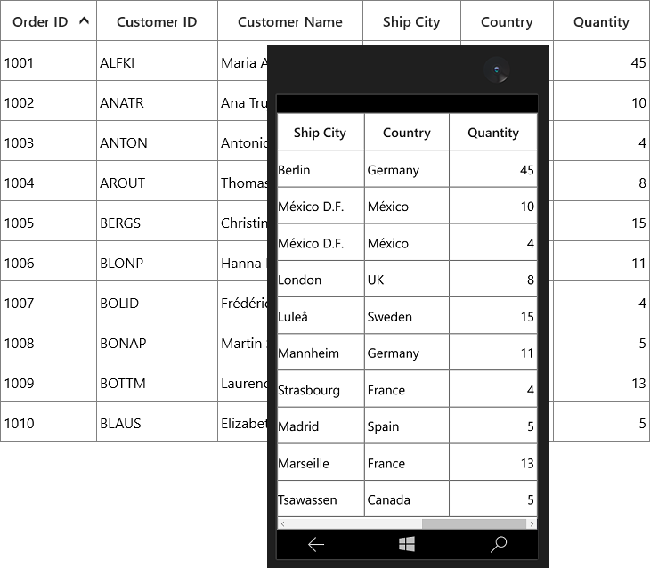
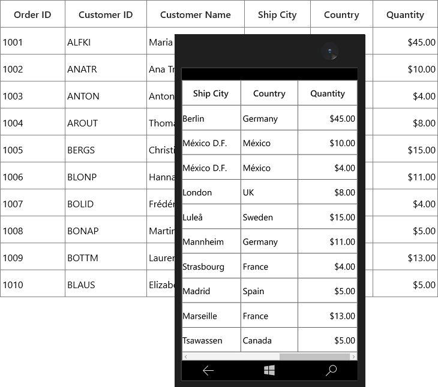

# Column Types in UWP DataGrid (SfDataGrid)

SfDataGrid provides support for various built-in column types. Each column has its own properties and renderer to handle different types of data.
 
You can also add or override existing columns and renderers as you need.

<table>
<tr>
<th>
Column Type
</th>
<th>
Renderer 
</th>
<th>
Description
</th>
</tr>
<tr>
<td>
{{'[GridTextColumn](https://help.syncfusion.com/cr/uwp/Syncfusion.UI.Xaml.Grid.GridTextColumn.html)'| markdownify }}
</td>
<td>
{{'[GridCellTextBoxRenderer](https://help.syncfusion.com/cr/uwp/Syncfusion.UI.Xaml.Grid.Cells.GridCellTextBoxRenderer.html)'| markdownify }}
</td>
<td>
Use to display the string data. 
</td>
</tr>
<tr>
<td>
{{'[GridNumericColumn](https://help.syncfusion.com/cr/uwp/Syncfusion.UI.Xaml.Grid.GridNumericColumn.html)'| markdownify }}
</td>
<td>
{{'[GridCellNumericRenderer](https://help.syncfusion.com/cr/uwp/Syncfusion.UI.Xaml.Grid.Cells.GridCellNumericRenderer.html)'| markdownify }}
</td>
<td>
Use to display the numeric data.
</td>
</tr>
<tr>
<td>
{{'[GridDateTimeColumn](https://help.syncfusion.com/cr/uwp/Syncfusion.UI.Xaml.Grid.GridDateTimeColumn.html)'| markdownify }}
</td>
<td>
{{'[GridCellDateTimeRenderer](https://help.syncfusion.com/cr/uwp/Syncfusion.UI.Xaml.Grid.Cells.GridCellDateTimeRenderer.html)'| markdownify }}
</td>
<td>
Use to display the date time value.
</td>
</tr>
<tr>
<td>
{{'[GridComboBoxColumn](https://help.syncfusion.com/cr/uwp/Syncfusion.UI.Xaml.Grid.GridComboBoxColumn.html)'| markdownify }}
</td>
<td>
{{'[GridCellComboBoxRenderer](https://help.syncfusion.com/cr/uwp/Syncfusion.UI.Xaml.Grid.Cells.GridCellComboBoxRenderer.html)'| markdownify }}
</td>
<td>
Use to display the IEnumerable data using <code>ComboBox</code>.
</td>
</tr>
<tr>
<td>
{{'[GridCheckBoxColumn](https://help.syncfusion.com/cr/uwp/Syncfusion.UI.Xaml.Grid.GridCheckBoxColumn.html)'| markdownify }}
</td>
<td>
{{'[GridCellCheckBoxRenderer](https://help.syncfusion.com/cr/uwp/Syncfusion.UI.Xaml.Grid.Cells.GridCellCheckBoxRenderer.html)'| markdownify }}
</td>
<td>
Use to display the boolean type data.
</td>
</tr>
<tr>
<td>
{{'[GridImageColumn](https://help.syncfusion.com/cr/uwp/Syncfusion.UI.Xaml.Grid.GridImageColumn.html)'| markdownify }}
</td>
<td>
{{'[GridCellImageRenderer](https://help.syncfusion.com/cr/uwp/Syncfusion.UI.Xaml.Grid.Cells.GridCellImageRenderer.html)'| markdownify }}
</td>
<td>
Use to display the image in each row.
</td>
</tr>
<tr>
<td>
{{'[GridHyperlinkColumn](https://help.syncfusion.com/cr/uwp/Syncfusion.UI.Xaml.Grid.GridHyperlinkColumn.html)'| markdownify }}
</td>
<td>
{{'[GridCellHyperLinkRenderer](https://help.syncfusion.com/cr/uwp/Syncfusion.UI.Xaml.Grid.Cells.GridCellHyperlinkRenderer.html)'| markdownify }}
</td>
<td>
Use to display the URI data.
</td>
</tr>
<tr>
<td>
{{'[GridTemplateColumn](https://help.syncfusion.com/cr/uwp/Syncfusion.UI.Xaml.Grid.GridTemplateColumn.html)'| markdownify }}
</td>
<td>
{{'[GridCellTemplateRenderer](https://help.syncfusion.com/cr/uwp/Syncfusion.UI.Xaml.Grid.Cells.GridCellTemplateRenderer.html)'| markdownify }}
</td>
<td>
Use to display the custom template-specified content.
</td>
</tr>
<tr>
<td>
{{'[GridUnboundColumn](https://help.syncfusion.com/cr/uwp/Syncfusion.UI.Xaml.Grid.GridUnBoundColumn.html)'| markdownify }}
</td>
<td>
{{'[GridUnBoundCellTextBoxRenderer](https://help.syncfusion.com/cr/uwp/Syncfusion.UI.Xaml.Grid.Cells.GridUnBoundCellTextBoxRenderer.html)'| markdownify }}
{{'[GridUnBoundCellTemplateRenderer](https://help.syncfusion.com/cr/uwp/Syncfusion.UI.Xaml.Grid.Cells.GridUnBoundCellTemplateRenderer.html)'| markdownify }}
</td>
<td>
Use to display custom information of each record.
</td>
</tr>
<tr>
<td>
{{'[GridMultiColumnDropDownList](https://help.syncfusion.com/cr/uwp/Syncfusion.UI.Xaml.Grid.GridMultiColumnDropDownList.html)'| markdownify }}
</td>
<td>
{{'[GridCellMultiColumnDropDownRenderer](https://help.syncfusion.com/cr/uwp/Syncfusion.UI.Xaml.Grid.Cells.GridCellMultiColumnDropDownRenderer.html)'| markdownify }}
</td>
<td>
Use to display the IEnumerable data using {{'[SfMultiColumnDropdownControl](https://help.syncfusion.com/cr/uwp/Syncfusion.UI.Xaml.Grid.SfMultiColumnDropDownControl.html)'| markdownify }}
</td>
</tr>
<tr>
<td>
{{'[GridUpDownColumn](https://help.syncfusion.com/cr/uwp/Syncfusion.UI.Xaml.Grid.GridUpDownColumn.html)'| markdownify }}
</td>
<td>
{{'[GridCellUpDownRenderer](https://help.syncfusion.com/cr/uwp/Syncfusion.UI.Xaml.Grid.Cells.GridCellUpDownRenderer.html)'| markdownify }}
</td>
<td>
Use to display the numeric data using <code>SfNumericUpDown</code>.
</td>
</tr>
<tr>
<td>
{{'[GridToggleSwitchColumn](https://help.syncfusion.com/cr/uwp/Syncfusion.UI.Xaml.Grid.GridToggleSwitchColumn.html)'| markdownify }}
</td>
<td>
{{'[GridCellToggleSwitchRenderer](https://help.syncfusion.com/cr/uwp/Syncfusion.UI.Xaml.Grid.Cells.GridCellToggleSwitchRenderer.html)'| markdownify }}
</td>
<td>
Use to display the boolean data using <code>ToggleSwitch</code>.
</td>
</tr>
<tr>
<td>
{{'[GridCheckBoxSelectorColumn](https://help.syncfusion.com/cr/uwp/Syncfusion.UI.Xaml.Grid.GridCheckBoxSelectorColumn.html)'| markdownify }}
</td>
<td>
{{'[GridCellCheckBoxSelectorRenderer](https://help.syncfusion.com/cr/uwp/Syncfusion.UI.Xaml.Grid.Cells.GridCellCheckBoxSelectorRenderer.html)'| markdownify }}
</td>
<td>
Selects or deselects rows based on the check box value, which is not bound with data object.
</td>
</tr>
</table>

## GridColumn

[GridColumn](https://help.syncfusion.com/cr/uwp/Syncfusion.UI.Xaml.Grid.GridColumn.html) is an abstract class provides base functionalities for all the column types in SfDataGrid.

### Mapping column to particular property

Column can be bound to a property in data object using [GridColumn.MappingName](https://help.syncfusion.com/cr/uwp/Syncfusion.UI.Xaml.Grid.GridColumnBase.html#Syncfusion_UI_Xaml_Grid_GridColumnBase_MappingName) property. In addition, it supports to format or bind different property for display and edit mode separately via [GridColumn.DisplayBinding](https://help.syncfusion.com/cr/uwp/Syncfusion.UI.Xaml.Grid.GridColumnBase.html#Syncfusion_UI_Xaml_Grid_GridColumnBase_DisplayBinding) and [GridColumn.ValueBinding](https://help.syncfusion.com/cr/uwp/Syncfusion.UI.Xaml.Grid.GridColumnBase.html#Syncfusion_UI_Xaml_Grid_GridColumnBase_ValueBinding).

When you set `MappingName`, `DisplayBinding` and `ValueBinding` are created based on `MappingName`, if these properties are not defined explicitly. You can use `DisplayBinding` property to format the column in display, by setting `Converter` property of `Binding`.



public class DisplayBindingConverter : IValueConverter
{
    public object Convert(object value, Type targetType, object parameter, string language)
    {
        return string.Format("{0:C2}", value);
    }

    public object ConvertBack(object value, Type targetType, object parameter, string language)
    {
        return value;
    }
}





<syncfusion:GridTextColumn DisplayBinding="{Binding Path=UnitPrice,
                                                    Converter={StaticResource Converter}}"
                           HeaderText="Unit Price"
                           MappingName="UnitPrice"
                           ValueBinding="{Binding Path=Quantity}" />



In the below screenshot, Unit Price column display value is formatted to currency by setting `DisplayBinding` property.

By default, Columns handling the data operations (sorting and grouping) based on `MappingName` property. You can perform data operations based on `ValueBinding` by setting [GridColumn.UseBindingValue](https://help.syncfusion.com/cr/uwp/Syncfusion.UI.Xaml.Grid.GridColumn.html#Syncfusion_UI_Xaml_Grid_GridColumn_UseBindingValue) to `true`, when the standard reflection not works or binding column with complex or indexer properties.

### CellTemplate in GridColumn

You can load any UWP control in the display mode for all columns by setting [GridColumn.CellTemplate](https://help.syncfusion.com/cr/uwp/Syncfusion.UI.Xaml.Grid.GridColumnBase.html#Syncfusion_UI_Xaml_Grid_GridColumnBase_CellTemplate) property. In edit mode, corresponding editor will be loaded based on column type.
 
In the below code snippet, `GridNumericColumn` is loaded with `ProgressBar` and `TextBlock`. When you start editing `DoubleTextBox` will be loaded as Editor.



<syncfusion:SfDataGrid x:Name="dataGrid"
                       AllowEditing="True"
                       AutoGenerateColumns="False"
                       ItemsSource="{Binding Orders}">
    <syncfusion:SfDataGrid.Columns>
        <syncfusion:GridNumericColumn HeaderText="Unit Price" MappingName="UnitPrice">
            <syncfusion:GridNumericColumn.CellTemplate>
                <DataTemplate>
                    <Grid>
                        <ProgressBar x:Name="progressBar"
                                     Height="50"
                                     Background="Transparent"
                                     BorderThickness="0"
                                     Maximum="50"
                                     Minimum="0"
                                     Visibility="Visible"
                                     Value="{Binding Path=UnitPrice}" />
                        <TextBlock HorizontalAlignment="Right"
                                   VerticalAlignment="Center"
                                   Text="{Binding Path=UnitPrice}"
                                   TextAlignment="Center" />
                    </Grid>
                </DataTemplate>
            </syncfusion:GridNumericColumn.CellTemplate>
        </syncfusion:GridNumericColumn>
    </syncfusion:SfDataGrid.Columns>
</syncfusion:SfDataGrid>



`CellTemplate` is not support by `GridHyperlinkColumn`, `GridCheckboxColumn` and `GridImageColumn` columns.

#### Reusing same DataTemplate for multiple columns

By default, underlying record is `DataContext` for CellTemplate. So you have to define, template for each column to display values based on `MappingName`.
 
You can use the same [DataTemplate](https://msdn.microsoft.com/en-us/library/windows/apps/windows.ui.xaml.datatemplate.aspx) for all columns to display value based on MappingName by setting [GridColumn.SetCellBoundValue](https://help.syncfusion.com/cr/uwp/Syncfusion.UI.Xaml.Grid.GridColumnBase.html#Syncfusion_UI_Xaml_Grid_GridColumnBase_SetCellBoundValue) property to `true`. Setting `SetCellBoundValue` to true, changes the
 DataContext for CellTemplate to [DataContextHelper](https://help.syncfusion.com/cr/uwp/Syncfusion.UI.Xaml.Grid.Cells.DataContextHelper.html) which has the following members,
 
* `Value` - Return the value base on `MappingName`.
* `Record` - Returns the underlying data object.



<Page.Resources>
    <DataTemplate x:Key="cellTemplate">
        <TextBlock Margin="3,0,0,0"
                   Foreground="Red"
                   Text="{Binding Path=Value}" />
    </DataTemplate>
</Page.Resources>

<syncfusion:SfDataGrid x:Name="dataGrid"
                       AutoGenerateColumns="False"
                       ItemsSource="{Binding Orders}">
    <syncfusion:SfDataGrid.Columns>
        <syncfusion:GridTextColumn CellTemplate="{StaticResource cellTemplate}"
                                   HeaderText="Order ID"
                                   MappingName="OrderID"
                                   SetCellBoundValue="True" />
        <syncfusion:GridTextColumn CellTemplate="{StaticResource cellTemplate}"
                                   HeaderText="Customer Name"
                                   MappingName="CustomerName"
                                   SetCellBoundValue="True" />
    </syncfusion:SfDataGrid.Columns>
</syncfusion:SfDataGrid>



#### Setting CellTemplate based on custom logic using TemplateSelector

`GridColumn` provides support to choose different [DataTemplate](https://msdn.microsoft.com/en-us/library/windows/apps/windows.ui.xaml.datatemplate.aspx) based on underlying data object using [GridColumn.CellTemplateSelector](https://help.syncfusion.com/cr/uwp/Syncfusion.UI.Xaml.Grid.GridColumnBase.html#Syncfusion_UI_Xaml_Grid_GridColumnBase_CellTemplateSelector) property.
  
For example, two different templates loaded alternatively in OrderID column.
 


<App.Resources>
    <local:CustomCellTemplateSelector x:Key="cellTemplateSelector"/>
    <DataTemplate   x:Key="DefaultTemplate">
        <TextBlock  Background="Wheat"
                    Foreground="Red"
                    Text="{Binding Path=OrderID}"
                    TextAlignment="Center" />
    </DataTemplate>
    <DataTemplate   x:Key="AlternateTemplate">
        <TextBlock  Background="Beige"
                    Foreground="Green"
                    Text="{Binding Path=OrderID}"
                    TextAlignment="Center" />
    </DataTemplate>    
</ App.Resources>



Below code returns the `DefaultTemplate` and `AlternateTemplate` based on OrderID’s value.



public class CustomCellTemplateSelector: DataTemplateSelector
{

    protected override DataTemplate SelectTemplateCore(object item, DependencyObject container)
    {

        if (item == null)
            return null;
        var data = item as OrderInfo;

        if (data.OrderID % 2 == 0)
            return App.Current.Resources["AlternateTemplate"] as DataTemplate;

        else
            return App.Current.Resources["DefaultTemplate"] as DataTemplate;
    }
}



In the below code, the custom template selector set to `GridColumn.CellTemplateSelector` and set `SetCellBoundValue` to `true`.



<syncfusion:SfDataGrid  x:Name="dataGrid"
                        AutoGenerateColumns="False"
                        ItemsSource="{Binding Orders}">
    <syncfusion:SfDataGrid.Columns>
        <syncfusion:GridTextColumn CellTemplateSelector="{StaticResource cellTemplateSelector}"
                                   HeaderText="Order ID"
                                   MappingName="OrderID" />
    </syncfusion:SfDataGrid.Columns>
</syncfusion:SfDataGrid>



N> Non-Editable columns does not support `CellTemplate`.

#### Binding ViewModel properties with CellTemplate

You can bind properties in ViewModel with the controls in CellTemplate.
 
Below command defined in ViewModel is bound to `Button` inside `CellTemplate`. Below code, denote the base command.



public class BaseCommand : ICommand
{
    #region Fields
    readonly Action<object> _execute;
    readonly Predicate<object> _canExecute;
    public event EventHandler CanExecuteChanged;
    #endregion
    #region Constructors
    
    /// 

    /// Creates a new command that always execute.
    /// 

    /// <param name="execute">The execution logic.</param>
    public BaseCommand(Action<object> execute)
        : this(execute, null)
    {
    }
    /// 

    /// Creates a new command.
    /// 

    /// <param name="execute">The execution logic.</param>
    /// <param name="canExecute">The execution status logic.</param>

    public BaseCommand(Action<object> execute, Predicate<object> canExecute)
    {

        if (execute == null)
            throw new ArgumentNullException("execute");
        _execute = execute;
        _canExecute = canExecute;
    }

    #endregion        

    bool ICommand.CanExecute(object parameter)
    {
        return _canExecute == null ? true : _canExecute(parameter);
    }

    void ICommand.Execute(object parameter)
    {
        _execute(parameter);
    }                
}



Below code, defines the command for `Button` in ViewModel.



public class ViewModel
{    
    private BaseCommand deleteRecord;

    public BaseCommand DeleteRecord
    {
        get
        {

            if (deleteRecord == null)
                deleteRecord = new BaseCommand(OnDeleteRecordClicked, OnCanDelete);
            return deleteRecord;
        }
    }

    private static bool OnCanDelete(object obj)
    {
        return true;
    }

    private void OnDeleteRecordClicked(object obj)
    {

        //TODO ACTION.
    }
}



In the below code, Button inside CellTemplate bound to the command in ViewModel.
 


<syncfusion:SfDataGrid x:Name="dataGrid"
                       AutoGenerateColumns="False"
                       ItemsSource="{Binding Orders}">
    <syncfusion:SfDataGrid.Columns>
        <syncfusion:GridTextColumn MappingName="Delete">
            <syncfusion:GridTextColumn.CellTemplate>
                <DataTemplate>
                    <Button Command="{Binding DataContext.DeleteRecord,
                                              ElementName=dataGrid}"
                            CommandParameter="{Binding}"
                            Content="Delete" />
                    <!--  or  -->
                    <Button Command="{Binding DeleteRecord,
                                              Source={StaticResource viewModel}}"
                            CommandParameter="{Binding}"
                            Content="Delete" />
                </DataTemplate>
            </syncfusion:GridTextColumn.CellTemplate>
        </syncfusion:GridTextColumn>
    </syncfusion:SfDataGrid.Columns>
</syncfusion:SfDataGrid>



### Data Formatting

`GridColumn` supports to format the data using [Converter](https://msdn.microsoft.com/en-us/library/windows/apps/windows.ui.xaml.data.binding.converter.aspx) properties, by defining `GridColumn.DisplayBinding` and `GridColumn.ValueBinding`. `GridColumn.DisplayBinding` formats the data in display mode. `GridColumn.ValueBinding` formats the data in edit mode.

#### Format column using Converter

You can format the column using `Converter` property by defining `DisplayBinding`.
 


public class CurrencyFormatConverter : IValueConverter
{

    public object Convert(object value, Type targetType, object parameter, string language)
    {
        return string.Format("{0:C2}", value);
    }

    public object ConvertBack(object value, Type targetType, object parameter, string language)
    {
        return value;
    }
}


 


<Page.Resources>
    <local:CurrencyFormatConverter x:Key="currencyFormatConverter" />
</Page.Resources>

<syncfusion:SfDataGrid x:Name="dataGrid"
                       AllowEditing="True"
                       AutoGenerateColumns="False"
                       ItemsSource="{Binding Orders}">
    <syncfusion:SfDataGrid.Columns>
        <syncfusion:GridNumericColumn DisplayBinding="{Binding UnitPrice,
                                                               Converter={StaticResource currencyFormatConverter}}"
                                      HeaderText="Unit Price"
                                      MappingName="UnitPrice" />
    </syncfusion:SfDataGrid.Columns>
</syncfusion:SfDataGrid>



When column is auto-generated, you can set the `Converter` by handling `AutoGeneratingColumn` event.



this.dataGrid.AutoGeneratingColumn += DataGrid_AutoGeneratingColumn;

private void DataGrid_AutoGeneratingColumn(object sender, Syncfusion.UI.Xaml.Grid.AutoGeneratingColumnArgs e)
{

    if (e.Column.MappingName == "UnitPrice")
    {

        if (e.Column is GridNumericColumn)
        {
            e.Column = new GridTextColumn() { MappingName = "UnitPrice", HeaderText = "Unit Price" };
        }
        e.Column.DisplayBinding = new Binding() { Path = new PropertyPath(e.Column.MappingName), Converter = new CurrencyFormatConverter() };
    }
}



### Styling GridColumn

`GridColumn` support to customize the style of particular column using [GridColumn.CellStyle](https://help.syncfusion.com/cr/uwp/Syncfusion.UI.Xaml.Grid.GridColumnBase.html#Syncfusion_UI_Xaml_Grid_GridColumnBase_CellStyle) property. For more information, refer [Styling and Template](https://help.syncfusion.com/uwp/sfdatagrid/styles-and-templates) section.

#### Change the font setting

You can change the font settings such as `FontSize`, `FontFamily`, `FontWeight` etc. by writing style of TargetType `GridCell` or `GridColumn.CellStyle` property.



<syncfusion:SfDataGrid x:Name="dataGrid"                                                                       
                       AutoGenerateColumns="False" 
                       ItemsSource="{Binding Orders}">
    <syncfusion:SfDataGrid.Columns>
        <syncfusion:GridTextColumn MappingName="CustomerName">
            <syncfusion:GridTextColumn.CellStyle>
                
            </syncfusion:GridTextColumn.CellStyle>
        </syncfusion:GridTextColumn>
    </syncfusion:SfDataGrid.Columns>
</syncfusion:SfDataGrid>



When column is auto-generated, you can style the column by handling `AutoGeneratingColumn` event.



<Page.Resources>
    
        
</Page.Resources>





this.dataGrid.AutoGeneratingColumn += DataGrid_AutoGeneratingColumn;

private void DataGrid_AutoGeneratingColumn(object sender, Syncfusion.UI.Xaml.Grid.AutoGeneratingColumnArgs e)
{  

    if (e.Column.MappingName == "CustomerName")
        e.Column.CellStyle = this.Resources["cellStyle"] as Style;               
}



#### Styles based on custom logic

You can apply the styles to columns based on certain condition using [GridColumn.CellStyleSelector](https://help.syncfusion.com/cr/uwp/Syncfusion.UI.Xaml.Grid.GridColumnBase.html#Syncfusion_UI_Xaml_Grid_GridColumnBase_CellStyleSelector) property.

Below code creates two different styles by TargetType `GridCell`.



<Application.Resources>
    
    
    
    
</Application.Resources>



In the below code, returns the style based on OrderID value. Using `Container` you can format the columns data based on `GridCell`.



public class CustomCellStyleSelector: StyleSelector
{

    protected override Style SelectStyleCore(object item, DependencyObject container)
    {
        var gridCell = container as GridCell;
        var mappingName = gridCell.ColumnBase.GridColumn.MappingName;
        var record = gridCell.DataContext;
        var cellValue = record.GetType().GetProperty(mappingName).GetValue(record);

        if (mappingName.Equals("OrderID"))
        {

            if (Convert.ToInt16(cellValue) <= 1005)
                return App.Current.Resources["cellStyle1"] as Style;

            else
                return App.Current.Resources["cellStyle2"] as Style;
        }
        return base.SelectStyleCore(item, container);
    }
}



Below code, sets the customized style selector to `GridColumn.CellStyleSelector` property.



<Page.Resources>
    <local:CustomCellStyleSelector x:Key="cellStyleSelector"/>
</Page.Resources>

<syncfusion:SfDataGrid x:Name="dataGrid"
                       ItemsSource="{Binding Orders}"  
                       AutoGenerateColumns="False" >
    <syncfusion:SfDataGrid.Columns>
        <syncfusion:GridTextColumn MappingName="OrderID" CellStyleSelector="{StaticResource cellStyleSelector}">
    </syncfusion:SfDataGrid.Columns>
</syncfusion:SfDataGrid>



When column is auto-generated, you can style the column by handling `AutoGeneratingColumn` event.



this.dataGrid.AutoGeneratingColumn += DataGrid_AutoGeneratingColumn;

private void DataGrid_AutoGeneratingColumn(object sender, Syncfusion.UI.Xaml.Grid.AutoGeneratingColumnArgs e)
{

    if (e.Column.MappingName == "OrderID")
    {
        e.Column.CellStyleSelector = new CustomCellStyleSelector();
    }
}



![Applying cell style to the columns by using CellStyleSelector in UWP SfDataGrid]](Column-Types_images/Column-Types_img7.png)

### UI Interaction

#### Hide Column

You can hide or unhide the particular column programmatically by setting [GridColumn.IsHidden](https://help.syncfusion.com/cr/uwp/Syncfusion.UI.Xaml.Grid.GridColumnBase.html#Syncfusion_UI_Xaml_Grid_GridColumnBase_IsHidden) property. For allowing end-user to hide or unhide column in UI refer [Resizing Columns](http://help.syncfusion.com/uwp/sfdatagrid/columns#resizing-columns) section.

#### Disable column

You can disable column by setting [GridColumn.AllowFocus](https://help.syncfusion.com/cr/uwp/Syncfusion.UI.Xaml.Grid.GridColumnBase.html#Syncfusion_UI_Xaml_Grid_GridColumnBase_AllowFocus) property. Therefore, that column can’t be selected or edited.
 
### Width, alignment and padding settings

#### Width

The width of `GridColumn` can be changed by setting [Width](https://help.syncfusion.com/cr/uwp/Syncfusion.UI.Xaml.Grid.GridColumnBase.html#Syncfusion_UI_Xaml_Grid_GridColumnBase_Width) property. Column width set based on [GridColumn.MinimumWidth](https://help.syncfusion.com/cr/uwp/Syncfusion.UI.Xaml.Grid.GridColumnBase.html#Syncfusion_UI_Xaml_Grid_GridColumnBase_MinimumWidth) and [GridColumn.MaximumWidth](https://help.syncfusion.com/cr/uwp/Syncfusion.UI.Xaml.Grid.GridColumnBase.html#Syncfusion_UI_Xaml_Grid_GridColumnBase_MaximumWidth) properties.
 
N> If the `GridColumn.Width` is defined explicitly takes priority than `GridColumn.ColumnSizer`.

#### Padding

GridColumn allows you to the change the padding of cell content by setting `[Padding](https://help.syncfusion.com/cr/uwp/Syncfusion.UI.Xaml.Grid.GridColumnBase.html#Syncfusion_UI_Xaml_Grid_GridColumnBase_Padding) property.
 
#### Alignment

GridColumn allows you to change the alignment of `GridCell` and `GridHeaderCellControl` content using [TextAlignment](https://help.syncfusion.com/cr/uwp/Syncfusion.UI.Xaml.Grid.GridColumnBase.html#Syncfusion_UI_Xaml_Grid_GridColumnBase_TextAlignment), [VerticalAlignment](https://help.syncfusion.com/cr/uwp/Syncfusion.UI.Xaml.Grid.GridColumnBase.html#Syncfusion_UI_Xaml_Grid_GridColumnBase_VerticalAlignment) and [HorizontalHeaderContentAlignment](https://help.syncfusion.com/cr/uwp/Syncfusion.UI.Xaml.Grid.GridColumnBase.html#Syncfusion_UI_Xaml_Grid_GridColumnBase_HorizontalHeaderContentAlignment) properties.

## GridTextColumnBase

[GridTextColumnBase](https://help.syncfusion.com/cr/uwp/Syncfusion.UI.Xaml.Grid.GridColumnBase.html) is the abstract class derived from `GridColumn`. The following columns are derived from the `GridTextColumnBase`.

1. GridTextColumn

2. GridDateTimeColumn

3. GridTemplateColumn

4. GridMultiColumnDropDownList

### GridTextColumnBase properties

* Text trimming - You can [trim](https://msdn.microsoft.com/en-us/library/windows/apps/windows.ui.xaml.texttrimming.aspx) the column’s data using `TextTrimming` property.
* Text wrapping - You can [wrap](https://msdn.microsoft.com/en-us/library/windows/apps/windows.ui.xaml.textwrapping.aspx) the column’s data using `TextWrapping` property.



<syncfusion:SfDataGrid x:Name="dataGrid"
                       AutoGenerateColumns="False"
                       ItemsSource="{Binding Orders}">
    <syncfusion:SfDataGrid.Columns>
        <syncfusion:GridTextColumn Width="60"
                                   HeaderText="Customer Name"
                                   MappingName="CustomerName"
                                   TextTrimming="CharacterEllipsis"
                                   TextWrapping="Wrap" />
    </syncfusion:SfDataGrid.Columns>
</syncfusion:SfDataGrid>



## GridTextColumn

`GridTextColumn` derived from `GridTextColumnBase` which hosts `TextBox` in edit mode.



<syncfusion:SfDataGrid x:Name="dataGrid"
                       AutoGenerateColumns="False"
                       ItemsSource="{Binding Orders}">
    <syncfusion:SfDataGrid.Columns>
        <syncfusion:GridTextColumn HeaderText="Customer Name" MappingName="CustomerName" />
    </syncfusion:SfDataGrid.Columns>
</syncfusion:SfDataGrid>



this.dataGrid.Columns.Add(new GridTextColumn()
{
    HeaderText = "Customer Name",
    MappingName = "CustomerName",                               
});



### Spell check while editing

You can enable spell check in GridTextColumn using [IsSpellCheckEnabled](https://help.syncfusion.com/cr/uwp/Syncfusion.UI.Xaml.Grid.GridTextColumn.html#Syncfusion_UI_Xaml_Grid_GridTextColumn_IsSpellCheckEnabled) property.


<syncfusion:GridTextColumn HeaderText="Ship City"
                           IsSpellCheckEnabled="True"
                           MappingName="ShipCity" />


this.dataGrid.Columns.Add(new GridTextColumn() { HeaderText = "Ship City", MappingName = "ShipCity", IsSpellCheckEnabled = true });



## GridNumericColumn

`GridNumericColumn` derived from `GridTextColumnBase` which displays columns data as numeric. It hosts `SfNumericTextBox` in editing mode.



<syncfusion:SfDataGrid x:Name="dataGrid"                                                                       
                       AutoGenerateColumns="False" 
                       ItemsSource="{Binding Orders}">
    <syncfusion:SfDataGrid.Columns>
            <syncfusion:GridNumericColumn HeaderText="Quantity" MappingName="Quantity" />
    </syncfusion:SfDataGrid.Columns>
</syncfusion:SfDataGrid>


this.dataGrid.Columns.Add(new GridNumericColumn() { MappingName = "Quantity", HeaderText = "Quantity" });



### Data formatting

`GridNumericColumn` allows you to format the numeric data by specifying the [predefined format specifier](https://msdn.microsoft.com/en-us/library/dwhawy9k.aspx)  or  [custom numeric format strings](https://msdn.microsoft.com/en-us/library/0c899ak8.aspx) into [GridNumericColumn.FormatString](https://help.syncfusion.com/cr/uwp/Syncfusion.UI.Xaml.Grid.GridNumericColumn.html#Syncfusion_UI_Xaml_Grid_GridNumericColumn_FormatString) property. 



<syncfusion:GridNumericColumn FormatString="c"
                              HeaderText="Unit Price"
                              MappingName="UnitPrice" />


this.dataGrid.Columns.Add(new GridNumericColumn() { HeaderText = "Unit Price", MappingName = "UnitPrice", FormatString = "c" });



### Null value support

GridNumericColumn provides support to restrict or allow null value in columns based on [AllowNullInput](https://help.syncfusion.com/cr/uwp/Syncfusion.UI.Xaml.Grid.GridNumericColumn.html#Syncfusion_UI_Xaml_Grid_GridNumericColumn_AllowNullInput) property. Instead of displaying null values, you can display hint text using [Watermark](https://help.syncfusion.com/cr/uwp/Syncfusion.UI.Xaml.Grid.GridNumericColumn.html#Syncfusion_UI_Xaml_Grid_GridNumericColumn_WaterMark) property.
 
The `Watermark` property won’t work, when the `AllowNullInput` is `false`.



<syncfusion:GridNumericColumn AllowNullInput="True"
                              HeaderText="Unit Price"
                              MappingName="UnitPrice"
                              WaterMark="Enter unit price" />


this.dataGrid.Columns.Add(new GridNumericColumn() { HeaderText = "Unit Price", MappingName = "UnitPrice", AllowNullInput = true, WaterMark = "Enter unit price" });



### Parsing Mode

You can bind either `Decimal` or `Double` values with GridNumericColumn by using `ParsingMode` property. The default parsing mode is `Double`.

### Percent Display Mode

You can allow users to display the value in `Value` mode  or `Compute` mode by setting by [PercentDisplayMode](https://help.syncfusion.com/cr/uwp/Syncfusion.UI.Xaml.Grid.GridNumericColumn.html#Syncfusion_UI_Xaml_Grid_GridNumericColumn_PercentDisplayMode) property. `Value` mode displays the value with percentage symbol and `Compute` mode displays the computed value with percentage symbol.


<syncfusion:GridNumericColumn HeaderText="UnitPrice" MappingName="UnitPrice" PercentDisplayMode="Compute"/>


this.sfDataGrid.Columns.Add(new GridNumericColumn() { MappingName = "UnitPrice", HeaderText = "UnitPrice", PercentDisplayMode = PercentDisplayMode.Value });



## GridDateTimeColumn

`GridDateTimeColumn` derived from `GridTextColumnBase` and it displays columns data as date time. It hosts `SfDatePicker` element in editing mode.



<syncfusion:SfDataGrid x:Name="dataGrid"                                                                       
                       AutoGenerateColumns="False" 
                       ItemsSource="{Binding Orders}">
                       
    <syncfusion:SfDataGrid.Columns>
        <syncfusion:GridDateTimeColumn HeaderText="Order Date" MappingName="OrderDate" />
    </syncfusion:SfDataGrid.Columns>
    
</syncfusion:SfDataGrid>


this.dataGrid.Columns.Add(new GridDateTimeColumn() { HeaderText = "Order Date", MappingName = "OrderDate" });



### Formatting date time value

You can format the date time value by specifying the [predefined format specifier](https://msdn.microsoft.com/en-us/library/az4se3k1.aspx) into `GridDateTimeColumn.FormatString` property.
 


<syncfusion:GridDateTimeColumn FormatString="f"
                               HeaderText="Order Date"
                               MappingName="OrderDate" />


this.dataGrid.Columns.Add(new GridDateTimeColumn() { HeaderText = "Order Date", MappingName = "OrderDate", FormatString = "f" });



When the predefined format specifier does not meet your requirement, you can set the [custom date and time format strings](https://msdn.microsoft.com/en-us/library/8kb3ddd4.aspx) into `FormatString` property.



<syncfusion:GridDateTimeColumn FormatString="yyyy/dd/MM"
                               HeaderText="Order Date"
                               MappingName="OrderDate"
                               SelectorFormatString="yyyy/dd/MM" />


this.dataGrid.Columns.Add(new GridDateTimeColumn() { HeaderText = "Order Date", MappingName = "OrderDate", FormatString = "yyyy/dd/MM" ,SelectorFormatString= "yyyy/dd/MM" });



### Editing support 

By default, the user can input the date time value by selecting through date selector. You can allow users to input or delete the date time value from the keyboard by setting [AllowInlineEditing](https://help.syncfusion.com/cr/uwp/Syncfusion.UI.Xaml.Grid.GridDateTimeColumn.html#Syncfusion_UI_Xaml_Grid_GridDateTimeColumn_AllowInlineEditing) to `true`.

### Setting input scope for On-Screen Keyboard

You can set the input scope for On-Screen Keyboard using `InputScope` property when `AllowInlineEditing` is set to `true`.



<syncfusion:GridDateTimeColumn AllowInlineEditing="True"
                               HeaderText="Order Date"
                               InputScope="Number"
                               MappingName="OrderDate" />



this.dataGrid.Columns.Add(new GridDateTimeColumn() { HeaderText = "Order Date", MappingName = "OrderDate", AllowInlineEditing = true, InputScope = InputScopeNameValue.Number });



### Null value support

`GridDateTimeColumn` provides support to restrict or allow null value in columns based on [AllowNullValue](https://help.syncfusion.com/cr/uwp/Syncfusion.UI.Xaml.Grid.GridDateTimeColumn.html#Syncfusion_UI_Xaml_Grid_GridDateTimeColumn_AllowNullValue) property. Instead of displaying null values, you can display hint text using [Watermark](https://help.syncfusion.com/cr/uwp/Syncfusion.UI.Xaml.Grid.GridDateTimeColumn.html#Syncfusion_UI_Xaml_Grid_GridDateTimeColumn_WaterMark) property.

The `Watermark` property won’t work, when the `AllowNullValue` is `false`.



<syncfusion:GridDateTimeColumn AllowNullValue="True"
                               HeaderText="Order Date"
                               MappingName="OrderDate"
                               WaterMark="Enter order date" />


this.dataGrid.Columns.Add(new GridDateTimeColumn() { HeaderText = "Order Date", MappingName = "OrderDate", AllowNullValue = true, WaterMark = "Enter order date" });



### Setting date time value range

You can restrict and display the input value with in the range using [MinDate](https://help.syncfusion.com/cr/uwp/Syncfusion.UI.Xaml.Grid.GridDateTimeColumn.html#Syncfusion_UI_Xaml_Grid_GridDateTimeColumn_MinDate) and [MaxDate](https://help.syncfusion.com/cr/uwp/Syncfusion.UI.Xaml.Grid.GridDateTimeColumn.html#Syncfusion_UI_Xaml_Grid_GridDateTimeColumn_MaxDate) properties.



public class ViewModel
{
    DateTime minDate = new DateTime(2015 , 2 , 2);

    public DateTime MinDate
    {
        get { return minDate; }
        set { minDate = value; RaisePropertyChanged("MinDate"); }
    }
    DateTime maxDate = new DateTime(2015 , 5 , 5);
    
    public DateTime MaxDate
    {
        get { return maxDate; }
        set { maxDate = value; RaisePropertyChanged("MaxDate"); }
    }
}





<Page.Resources>
    <local:ViewModel x:Key="viewModel" />
</Page.Resources>

<syncfusion:GridDateTimeColumn HeaderText="Order Date"
                               MappingName="OrderDate"
                               MaxDate="{Binding MaxDate,
                                                 Source={StaticResource viewModel}}"
                               MinDate="{Binding MinDate,
                                                 Source={StaticResource viewModel}}" />



### Dropdown customization

You can hide or unhide the dropdown button by using [ShowDropDownButton](https://help.syncfusion.com/cr/uwp/Syncfusion.UI.Xaml.Grid.GridDateTimeColumn.html#Syncfusion_UI_Xaml_Grid_GridDateTimeColumn_ShowDropDownButton) property. The height of dropdown can be changed using [DropDownHeight](https://help.syncfusion.com/cr/uwp/Syncfusion.UI.Xaml.Grid.GridDateTimeColumn.html#Syncfusion_UI_Xaml_Grid_GridDateTimeColumn_DropDownHeight) property.
 

### Styling

You can style the SelectorItem with solid color using [AccentBrush](https://help.syncfusion.com/cr/uwp/Syncfusion.UI.Xaml.Grid.GridDateTimeColumn.html#Syncfusion_UI_Xaml_Grid_GridDateTimeColumn_AccentBrush) property.



<syncfusion:GridDateTimeColumn AccentBrush="Red"
                               HeaderText="Order Date"
                               MappingName="OrderDate" />



this.dataGrid.Columns.Add(new GridDateTimeColumn() { HeaderText = "Order Date", MappingName = "OrderDate", AccentBrush = new SolidColorBrush(Colors.Red) });



### SelectorItem customization

#### Height and width customization

The height and width of SelectorItem can be customized using [SelectorItemWidth](https://help.syncfusion.com/cr/uwp/Syncfusion.UI.Xaml.Grid.GridDateTimeColumn.html#Syncfusion_UI_Xaml_Grid_GridDateTimeColumn_SelectorItemWidth) and [SelectorItemHeight](https://help.syncfusion.com/cr/uwp/Syncfusion.UI.Xaml.Grid.GridDateTimeColumn.html#Syncfusion_UI_Xaml_Grid_GridDateTimeColumn_SelectorItemHeight) property.



<syncfusion:GridDateTimeColumn HeaderText="Order Date"
                               MappingName="OrderDate"                               
                               SelectorItemHeight="80"
                               SelectorItemWidth="80" />



this.dataGrid.Columns.Add(new GridDateTimeColumn() { HeaderText = "Order Date", MappingName = "OrderDate", SelectorItemHeight = 80, SelectorItemWidth = 80});



#### SelectorItem formatting

You can specify the format for the selector using [SelectorFormatString](https://help.syncfusion.com/cr/uwp/Syncfusion.UI.Xaml.Grid.GridDateTimeColumn.html#Syncfusion_UI_Xaml_Grid_GridDateTimeColumn_SelectorFormatString) property.



<syncfusion:GridDateTimeColumn HeaderText="Order Date"
                               MappingName="OrderDate"
                               SelectorFormatString="yyyy/MM/dd" />


this.dataGrid.Columns.Add(new GridDateTimeColumn() { HeaderText = "Order Date", MappingName = "OrderDate", SelectorFormatString = "yyyy/MM/dd" });



#### SelectorItem spacing and count customization

You can customize the space between date, month and year selector items using [SelectorItemSpacing](https://help.syncfusion.com/cr/uwp/Syncfusion.UI.Xaml.Grid.GridDateTimeColumn.html#Syncfusion_UI_Xaml_Grid_GridDateTimeColumn_SelectorItemSpacing) property.

You can restrict the number of item to displayed in selector using [SelectorItemCount](https://help.syncfusion.com/cr/uwp/Syncfusion.UI.Xaml.Grid.GridDateTimeColumn.html#Syncfusion_UI_Xaml_Grid_GridDateTimeColumn_SelectorItemCount) property.
 


<syncfusion:GridDateTimeColumn HeaderText="Order Date"
                               MappingName="OrderDate"
                               SelectorItemCount="3"
                               SelectorItemSpacing="15"/>



this.dataGrid.Columns.Add(new GridDateTimeColumn() { HeaderText = "Order Date", MappingName = "OrderDate", SelectorItemSpacing = 15, SelectorItemCount = 3 });



## GridCheckBoxColumn

`GridCheckBoxColumn` derived from `GridColumn` and it used display and edit `Boolean` type data. It hosts `CheckBox` element as `GridCell` content.



<syncfusion:SfDataGrid x:Name="dataGrid"                                                                       
                       AutoGenerateColumns="False" 
                       ItemsSource="{Binding Orders}">
    <syncfusion:SfDataGrid.Columns>
        <syncfusion:GridCheckBoxColumn HeaderText="Is Delivered" MappingName="IsDelivered" />
    </syncfusion:SfDataGrid.Columns>
</syncfusion:SfDataGrid>


this.dataGrid.Columns.Add(new GridCheckBoxColumn() { HeaderText = "Is Delivered", MappingName = "IsDelivered" });



`GridCheckBoxColumn` allows you to customize check box state and its alignment.

* [IsThreeState](https://help.syncfusion.com/cr/uwp/Syncfusion.UI.Xaml.Grid.GridCheckBoxColumn.html#Syncfusion_UI_Xaml_Grid_GridCheckBoxColumn_IsThreeState) - By default, the `GridCheckBoxColumn` has `Checked` and `Unchecked**`** state. You can enable another `Intermediate` state setting `IsThreeState` property to `true`.

* [HorizontalAlignment](https://help.syncfusion.com/cr/uwp/Syncfusion.UI.Xaml.Grid.GridCheckBoxColumn.html#Syncfusion_UI_Xaml_Grid_GridCheckBoxColumn_HorizontalAlignment) - You can change the horizontal alignment of CheckBox using `HorizontalAlignment` property.

## GridTemplateColumn

`GridTemplateColumn` derived from `GridTextColumnBase` and it displays the template-specified cell content. You can load any UWP control in the display mode for all columns by setting [CellTemplate](https://help.syncfusion.com/cr/uwp/Syncfusion.UI.Xaml.Grid.GridColumnBase.html#Syncfusion_UI_Xaml_Grid_GridColumnBase_CellTemplate) and [EditTemplate](https://help.syncfusion.com/cr/uwp/Syncfusion.UI.Xaml.Grid.GridTemplateColumn.html#Syncfusion_UI_Xaml_Grid_GridTemplateColumn_EditTemplate) properties.



<syncfusion:SfDataGrid x:Name="dataGrid"                                                                       
                       AutoGenerateColumns="False" 
                       ItemsSource="{Binding Orders}">
    <syncfusion:SfDataGrid.Columns>
        <syncfusion:GridTemplateColumn MappingName="CustomerID">           
            <syncfusion:GridTemplateColumn.CellTemplate>
                <DataTemplate>
                    <TextBlock Text="{Binding CustomerID}" />
                </DataTemplate>
            </syncfusion:GridTemplateColumn.CellTemplate>
            <syncfusion:GridTemplateColumn.EditTemplate>
                <DataTemplate>
                    <TextBox Text="{Binding CustomerID, Mode=TwoWay}"  syncfusion:FocusManagerHelper.FocusedElement="True"/>
                </DataTemplate>
            </syncfusion:GridTemplateColumn.EditTemplate>        
            </syncfusion:GridTemplateColumn>       
    </syncfusion:SfDataGrid.Columns>
</syncfusion:SfDataGrid>


StringBuilder sb1 = new StringBuilder();
sb1.Append("<DataTemplate xmlns=\"http://schemas.microsoft.com/winfx/2006/xaml/presentation\">");          
sb1.Append("<TextBlock Text=\"{Binding CustomerID}\" />");                       
sb1.Append("</DataTemplate>");
DataTemplate cellTemplate = (DataTemplate)XamlReader.Load(sb1.ToString());

StringBuilder sb2 = new StringBuilder();
sb2.Append("<DataTemplate xmlns=\"http://schemas.microsoft.com/winfx/2006/xaml/presentation\">");
sb2.Append("<TextBox Text=\"{Binding CustomerID, Mode=TwoWay}\" />");
sb2.Append("</DataTemplate>");
DataTemplate editTemplate = (DataTemplate)XamlReader.Load(sb2.ToString());

this.dataGrid.Columns.Add(new GridTemplateColumn() { MappingName = "IsClosed", CellTemplate = cellTemplate, EditTemplate = editTemplate });



### Keyboard interaction for UIElement loaded inside CellTemplate

You can allow `UIElement` loaded inside `CellTemplate` to handle keyboard interaction by setting [FocusManagerHelper.WantsKeyInput](https://help.syncfusion.com/cr/uwp/Syncfusion.UI.Xaml.Grid.FocusManagerHelper.html#Syncfusion_UI_Xaml_Grid_FocusManagerHelper_WantsKeyInputProperty) attached property to `GridColumn`. You can use this when loading edit element in CellTemplate.
 
In this case SfDataGrid handles the below key operations and other keys are handled by UIElement loaded inside `CellTemplate`.
 
* <kbd>Tab</kbd>
* <kbd>Enter</kbd>
* <kbd>PageUp</kbd>
* <kbd>PageDown</kbd>



<syncfusion:GridTemplateColumn MappingName="CustomerName" syncfusion:FocusManagerHelper.WantsKeyInput="True">
    <syncfusion:GridTemplateColumn.CellTemplate>
        <DataTemplate>
            <TextBox Text="{Binding CustomerName}" />
        </DataTemplate>
    </syncfusion:GridTemplateColumn.CellTemplate>
</syncfusion:GridTemplateColumn>



### Setting focus to particular element inside Template when cell gets activated or edited

You can allow logical focus to specific UIElement loaded inside `EditTemplate` or `CellTemplate` by setting [FocusManagerHelper.FocusedElement](https://help.syncfusion.com/cr/uwp/Syncfusion.UI.Xaml.Grid.FocusManagerHelper.html#Syncfusion_UI_Xaml_Grid_FocusManagerHelper_FocusedElementProperty) attached property.
 
You can use this property to start editing the template column value as like normal column when the user gets into edit mode.



<syncfusion:SfDataGrid x:Name=”dataGrid”                                                                       
                       AutoGenerateColumns="False" 
                       ItemsSource="{Binding Orders}">
    <syncfusion:SfDataGrid.Columns>
        <syncfusion:GridTemplateColumn MappingName="CustomerName">
            <syncfusion:GridTemplateColumn.CellTemplate>
                <DataTemplate>
                    <Grid>
                        <TextBlock Text="{Binding CustomerName}" />
                    </Grid>
                </DataTemplate>
            </syncfusion:GridTemplateColumn.CellTemplate>
            <syncfusion:GridTemplateColumn.EditTemplate>
                <DataTemplate>
                    <Grid>
                        <TextBox Text="{Binding CustomerName}" syncfusion:FocusManagerHelper.FocusedElement="True" />
                    </Grid>
                </DataTemplate>
            </syncfusion:GridTemplateColumn.EditTemplate>
        </syncfusion:GridTemplateColumn>
    </syncfusion:SfDataGrid.Columns>
</syncfusion:SfDataGrid>



### Binding CellTemplate and EditTemplate based on MappingName

By default, underlying record is `DataContext` for CellTemplate. So you have to define, template for each column to display values based on `MappingName`.
 
You can use the same [DataTemplate](https://msdn.microsoft.com/en-us/library/windows/apps/windows.ui.xaml.datatemplate.aspx) for all columns to display value based on MappingName by setting [SetCellBoundValue](https://help.syncfusion.com/cr/uwp/Syncfusion.UI.Xaml.Grid.GridColumnBase.html#Syncfusion_UI_Xaml_Grid_GridColumnBase_SetCellBoundValue) property to `true`. Setting `SetCellBoundValue` to `true`, changes the DataContext for CellTemplate to [DataContextHelper](https://help.syncfusion.com/cr/uwp/Syncfusion.UI.Xaml.Grid.Cells.DataContextHelper.html) which has the following members,

* `Value` - Return the value base on `MappingName`.

* `Record` - Returns the underlying data object.

N> EditTemplate support available only for GridTemplateColumn.



<syncfusion:SfDataGrid x:Name="dataGrid"                                                                       
                       AutoGenerateColumns="False" 
                       ItemsSource="{Binding Orders}">
    <syncfusion:SfDataGrid.Columns>
        <syncfusion:GridTemplateColumn MappingName="OrderID" SetCellBoundValue="True">
            <syncfusion:GridTemplateColumn.CellTemplate>
                <DataTemplate>
                    <Grid>
                        <TextBlock Text="{Binding Value}" />
                    </Grid>
                </DataTemplate>
            </syncfusion:GridTemplateColumn.CellTemplate>
            <syncfusion:GridTemplateColumn.EditTemplate>
                <DataTemplate>
                    <Grid>
                        <TextBox Text="{Binding Value}" syncfusion:FocusManagerHelper.FocusedElement="True"  />
                    </Grid>
                </DataTemplate>
            </syncfusion:GridTemplateColumn.EditTemplate>
        </syncfusion:GridTemplateColumn>
    </syncfusion:SfDataGrid.Columns>
</syncfusion:SfDataGrid>



### Sets EditTemplate based on custom logic

`GridTemplateColumn` provides support to load different edit elements based on underlying data object using [GridTemplateColumn.EditTemplateSelector](https://help.syncfusion.com/cr/uwp/Syncfusion.UI.Xaml.Grid.GridTemplateColumn.html#Syncfusion_UI_Xaml_Grid_GridTemplateColumn_EditTemplateSelector) property.

Below code returns the `DefaultTemplate` and `AlternateTemplate` based on OrderID’s value.



<DataTemplate x:Key="DefaultCellTemplate">
    <TextBlock VerticalAlignment="Center"
               Foreground="Red"
               Text="{Binding Path=OrderID}"
               TextAlignment="Center" />
</DataTemplate>

<DataTemplate x:Key="AlternateCellTemplate">
    <TextBlock VerticalAlignment="Center"
               Foreground="Green"
               Text="{Binding Path=OrderID}"
               TextAlignment="Center" />
</DataTemplate>

<DataTemplate x:Key="DefaultEditTemplate">
    <TextBox Height="45"
             VerticalAlignment="Center"
             Foreground="Red"
             Text="{Binding Path=OrderID}"
             TextAlignment="Center" />
</DataTemplate>

<DataTemplate x:Key="AlternateEditTemplate">
    <TextBox Height="45"
             VerticalAlignment="Center"
             Foreground="Green"
             Text="{Binding Path=OrderID}"
             TextAlignment="Center" />
</DataTemplate>





public class CustomEditTemplateSelector: DataTemplateSelector
{
 
    protected override DataTemplate SelectTemplateCore(object item, DependencyObject container)
    {
 
        if (item == null)
            return null;

        var data = item as OrderInfo;
 
        if (data.OrderID % 2 == 0)
            return App.Current.Resources["AlternateEditTemplate"] as DataTemplate;
 
        else
            return App.Current.Resources["DefaultEditTemplate"] as DataTemplate;
    }
}



In the below code, custom template selector set to `GridTemplateColumn.EditTemplateSelector`.



<Page.Resources>    
    <local:CustomCellTemplateSelector x:Key="cellTemplateSelector" />
    <local:CustomEditTemplateSelector x:Key="editTemplateSelector" />
</Page.Resources>

<syncfusion:SfDataGrid x:Name="dataGrid"                                                                       
                       AutoGenerateColumns="False" 
                       ItemsSource="{Binding Orders}">
    <syncfusion:SfDataGrid.Columns>
        <syncfusion:GridTemplateColumn MappingName="OrderID"
                                       CellTemplateSelector="{StaticResource cellTemplateSelector}"
                                       EditTemplateSelector="{StaticResource editTemplateSelector}"/>
    </syncfusion:SfDataGrid.Columns>
</syncfusion:SfDataGrid>



## GridComboBoxColumn

`GridComboBoxColumn` derived from `GridColumn` which hosts `ComboBox` as edit element. The data source to ComboBox can be set by using [GridComboBoxColumn.ItemsSource](https://help.syncfusion.com/cr/uwp/Syncfusion.UI.Xaml.Grid.GridComboBoxColumn.html#Syncfusion_UI_Xaml_Grid_GridComboBoxColumn_ItemsSource) property.

By default, `GridComboBoxColumn` displays the value using `MappingName` property. You can set [DisplayMemberPath](https://help.syncfusion.com/cr/uwp/Syncfusion.UI.Xaml.Grid.GridComboBoxColumn.html#Syncfusion_UI_Xaml_Grid_GridComboBoxColumn_DisplayMemberPath) which denotes the path to a value on the source object (GridComboBoxColumn.ItemsSource) to serve as the visual representation of object. You can set the [SelectedValuePath](https://help.syncfusion.com/cr/uwp/Syncfusion.UI.Xaml.Grid.GridComboBoxColumn.html#Syncfusion_UI_Xaml_Grid_GridComboBoxColumn_SelectedValuePath) which denotes the path to get the SelectedValue from the SelectedItem. 



<syncfusion:SfDataGrid x:Name="dataGrid"                                                                       
                       AutoGenerateColumns="False" 
                       ItemsSource="{Binding Orders}">
                       
    <syncfusion:SfDataGrid.Columns> 
        <syncfusion:GridComboBoxColumn  HeaderText="Customer ID"
                                        ItemsSource="{Binding ComboItems, Source={StaticResource viewModel}}"
                                        MappingName=" Customer ID " />
    </syncfusion:SfDataGrid.Columns> 
</syncfusion:SfDataGrid>


this.dataGrid.Columns.Add(new GridComboBoxColumn() { HeaderText = " Customer ID ", MappingName = " Customer ID ", ItemsSource = viewModel.ComboItems });



SfDataGrid triggers, [CurrentCellDropDownSelectionChanged](https://help.syncfusion.com/cr/uwp/Syncfusion.UI.Xaml.Grid.SfDataGrid.html) event, when the SelectedValue is changed. [CurrentCellDropDownSelectionChangedEventArgs](https://help.syncfusion.com/cr/uwp/Syncfusion.UI.Xaml.Grid.CurrentCellDropDownSelectionChangedEventArgs.html) of `CurrentCellDropDownSelectionChanged` event provides the information about the changed cell value.

`SelectedIndex` property returns the index of selected item.
`SelectedItem` property returns the selected item from drop down list.

### Improving dropdown opening time

You can improve the drop-down opening time on loading by setting [VirtualizingStackPanel](https://msdn.microsoft.com/en-us/library/windows/apps/windows.ui.xaml.controls.virtualizingstackpanel.aspx) as [ItemsPanelTemplate](https://msdn.microsoft.com/en-us/library/windows/apps/windows.ui.xaml.controls.itemspaneltemplate.aspx) of `ComboBox`, when the large number of items loaded in it.



<Page.Resources>
    
</Page.Resources>



### Opening dropdown popup in single-click

You can open the drop down within single click by setting [ComboBox.IsDropDownOpen](https://msdn.microsoft.com/en-us/library/windows/apps/windows.ui.xaml.controls.combobox.isdropdownopen.aspx) property to `true` in `OnEditElementLoaded` method by overriding existing renderer.

Below code, creates `GridCellComboBoxRendererExt` to set `IsDropDownOpen` property. Replace the default renderer with created renderer in `SfDataGrid.CellRenderers` collection.



this.dataGrid.CellRenderers.Remove("ComboBox");
this.dataGrid.CellRenderers.Add("ComboBox", new GridCellComboBoxRendererExt());

public class GridCellComboBoxRendererExt: GridCellComboBoxRenderer
{

    protected override void OnEditElementLoaded(object sender, Windows.UI.Xaml.RoutedEventArgs e)
    {
        (sender as ComboBox).IsDropDownOpen = true;
        base.OnEditElementLoaded(sender, e);
    }
}



N> This is applicable when the `SfDataGrid.EditTrigger` is set as `OnTap`.

### Customizing GroupCaptionText based on DisplayMemberPath

By default, the `GroupCaptionText` will be displayed based on `MappingName`. You can display the `GroupCaptionText` based on `DisplayMemberPath` using `GroupColumnDescription.Converter` property.



<syncfusion:SfDataGrid x:Name="dataGrid"
                       AutoGenerateColumns="False"
                       ItemsSource="{Binding Orders}">
    <syncfusion:SfDataGrid.Columns>
        <syncfusion:GridComboBoxColumn DisplayMemberPath="CustomerID"
                                       HeaderText="Customer ID"
                                       ItemsSource="{Binding Orders, Source={StaticResource viewModel}}"
                                       MappingName="CustomerName"
                                       SelectedValuePath="CustomerName" />
    </syncfusion:SfDataGrid.Columns>
</syncfusion:SfDataGrid>



Below code returns the group caption based on `GridComboBoxColumn.ItemsSource`.



public class GroupCaptionConverter : IValueConverter
{
    object IValueConverter.Convert(object value, Type targetType, object parameter, string language)
    {

        if (!(parameter is GridComboBoxColumn))
            return value;
        var column = parameter as GridComboBoxColumn; 
        var record = value as OrderInfo;
    
        foreach (var item in column.ItemsSource)
        {

            if (record.CustomerName == (item as OrderInfo).CustomerName)
                return (item as OrderInfo).CustomerID;
        }
        return null;
    }

    object IValueConverter.ConvertBack(object value, Type targetType, object parameter, string language)
    {
        throw new NotImplementedException();
    }
}



In the below code snippet, `GroupCaptionConverter` set to `GroupColumnDescription.Converter` while grouping.



this.dataGrid.GroupColumnDescriptions.CollectionChanged += GroupColumnDescriptions_CollectionChanged;

private void GroupColumnDescriptions_CollectionChanged(object sender, System.Collections.Specialized.NotifyCollectionChangedEventArgs e)
{

    if (e.Action == NotifyCollectionChangedAction.Add)
    {
        var groupDescription = e.NewItems[0] as GroupColumnDescription;
        
        if (groupDescription.ColumnName == "CustomerName")
            groupDescription.Converter = new GroupCaptionConverter();
    }
}



### Loading Different ItemSource for each row of GridComboBoxColumn

You can load the different ItemsSource to each row of GridComboBoxColumn by setting  [SfDataGrid.ItemsSourceSelector](https://help.syncfusion.com/cr/uwp/Syncfusion.UI.Xaml.Grid.IItemsSourceSelector.html) property. 

### Implementing IItemsSourceSelector

`ItemsSourceSelector` needs to implement [IItemsSourceSelector](https://help.syncfusion.com/cr/uwp/Syncfusion.UI.Xaml.Grid.IItemsSourceSelector.html) interface which requires you to implement [GetItemsSource](https://help.syncfusion.com/cr/uwp/Syncfusion.UI.Xaml.Grid.IItemsSourceSelector.html#Syncfusion_UI_Xaml_Grid_IItemsSourceSelector_GetItemsSource_System_Object_System_Object_) method which receives the below parameters,
<ul>
<li> <b>Record</b> – data object associated with row.</li>
<li> <b>Data Context</b>  – Data context of data grid.</li>
</ul>

In the below code, ItemsSource for ShipCity column returned based on ShipCountry column value using the record and data context of data grid passed to `GetItemsSource` method.




<Page.Resources>
        <local:ItemsSourceSelector x:Key="itemsSourceSelector"/>
</Page.Resources>

<syncfusion:SfDataGrid x:Name="sfdatagrid"
                               AllowEditing="True"
                               AutoGenerateColumns="False"
                               CurrentCellEndEdit="CurrentCellEndEditEventAction"
                               ItemsSource="{Binding OrderDetails}"
                               ColumnSizer="Star">
    <syncfusion:SfDataGrid.Columns>
		<syncfusion:GridTextColumn MappingName="OrderID" />
		<syncfusion:GridTextColumn MappingName="CustomerID" />
		<syncfusion:GridTextColumn MappingName="ProductName" />
		<syncfusion:GridTextColumn MappingName="NoOfOrders" />
		<syncfusion:GridComboBoxColumn MappingName="ShipCountry"  ItemsSource="{Binding Path=DataContext.CountryList, ElementName=sfdatagrid}"/>
		<syncfusion:GridComboBoxColumn HeaderText="ShipCity"  DisplayMemberPath="ShipCityName"
								   ItemsSourceSelector="{StaticResource itemsSourceSelector}"
								   MappingName="ShipCityID" SelectedValuePath="ShipCityID" />
	</syncfusion:SfDataGrid.Columns>
</syncfusion:SfDataGrid>


/// 

/// Implementation class for ItemsSourceSelector interface
/// 

public class ItemsSourceSelector : IItemsSourceSelector
{
    public IEnumerable GetItemsSource(object record, object dataContext)
    {
        if (record == null)
            return null;
  
        var orderDetails = record as OrderDetails;
        var countryName = orderDetails.ShipCountry;
  
        var viewModel = dataContext as ViewModel;
  
        //Returns ShipCity collection based on ShipCountry.
        if (viewModel.ShipCities.ContainsKey(countryName))
        {
            ObservableCollection<ShipCityDetails> shipCities = null;
            viewModel.ShipCities.TryGetValue(countryName, out shipCities);
            return shipCities.ToList();
        }
        return null;
    }
}



The following screenshot illustrates the different ShipCity ItemsSource bound to each row of the ComboBox based on the Country Name.

You can download the sample from [here](http://www.syncfusion.com/downloads/support/directtrac/general/ze/ComboBoxColumnUWP-1974208434.zip).

## GridMultiColumnDropDownList

`GridMultiColumnDropDownList` derived from `GridTextColumnBase` and it displays enumeration as cell contents. It hosts `SfMultiDropDownControl` in editing mode. `GridMultiColumnDropDownList` allows you to define the predefined columns in its drop-down like SfDataGrid.

By default, ` GridMultiColumnDropDownList ` displays the value using `MappingName` property. You can set `DisplayMember` which denotes the property that is contained in the `GridMultiColumnDropDownList.ItemsSource` to serve as the visual representation of object.
You can set the property to `ValueMember` from which to get values that correspond to the selections in the drop-down list. 

You can change the value by selecting the item from drop down or you can edit the `SfMultiColumnDropDownControl.Editor`. You can disable the editing by setting [IsTextReadOnly](https://help.syncfusion.com/cr/uwp/Syncfusion.UI.Xaml.Grid.GridMultiColumnDropDownList.html#Syncfusion_UI_Xaml_Grid_GridMultiColumnDropDownList_IsTextReadOnly).



<syncfusion:SfDataGrid x:Name="dataGrid"
                       AllowEditing="True"
                       AutoGenerateColumns="False"
                       ItemsSource="{Binding Orders}">
    <syncfusion:SfDataGrid.Columns>
        <syncfusion:GridMultiColumnDropDownList AutoGenerateColumns="False"
                                                DisplayMember="CustomerID"
                                                HeaderText="Customer ID"
                                                ItemsSource="{Binding Orders, Source={StaticResource viewModel}}"
                                                MappingName="OrderID"
                                                ValueMember="OrderID">
            <syncfusion:GridMultiColumnDropDownList.Columns>
                <syncfusion:Columns>
                    <syncfusion:GridTextColumn HeaderText="Customer ID" MappingName="CustomerID" />
                    <syncfusion:GridTextColumn HeaderText="Order ID" MappingName="OrderID" />
                </syncfusion:Columns>
            </syncfusion:GridMultiColumnDropDownList.Columns>
        </syncfusion:GridMultiColumnDropDownList>
    </syncfusion:SfDataGrid.Columns>
</syncfusion:SfDataGrid>



var viewModel = this.dataGrid.DataContext as ViewModel;
Columns columns = new Columns();
columns.Add(new GridTextColumn() { HeaderText = "Order ID", MappingName = "OrderID" });
columns.Add(new GridTextColumn() { HeaderText = "Customer ID", MappingName = "CustomerID" });
this.dataGrid.Columns.Add(new GridMultiColumnDropDownList() { ItemsSource = viewModel.Orders, MappingName = "OrderID", HeaderText = "Customer ID", DisplayMember = "CustomerID", ValueMember = "OrderID", AutoGenerateColumns = false, Columns = columns });



SfDataGrid triggers, `CurrentCellDropDownSelectionChanged` event, when the SelectedValue is changed. `CurrentCellDropDownSelectionChangedEventArgs` of `CurrentCellDropDownSelectionChanged` event provides the information about the changed cell value.

`SelectedIndex` property returns the index of selected item.
`SelectedItem` property returns the selected item from drop down list.

### Auto complete support

You can allow SfMultiDropDownControl to complete the entered input value automatically by setting the [AllowAutoComplete](https://help.syncfusion.com/cr/uwp/Syncfusion.UI.Xaml.Grid.GridMultiColumnDropDownList.html#Syncfusion_UI_Xaml_Grid_GridMultiColumnDropDownList_AllowAutoComplete) property to `true`.

`AllowAutoComplete` property will autocomplete the input value by comparing it to each item of the underlying data source of `GridMultiColumnDropDownList` and returns the matched value by `DisplayMember`.
 
### Filtering

You can allow SfMultiDropDownControl to filter the drop-down list items dynamically based on the text typed on editor by setting [AllowIncrementalFiltering](https://help.syncfusion.com/cr/uwp/Syncfusion.UI.Xaml.Grid.GridMultiColumnDropDownList.html#Syncfusion_UI_Xaml_Grid_GridMultiColumnDropDownList_AllowIncrementalFiltering) property to `true`.
 
`GridMultiColumnDropDownList` allows you to filter the items based on case by setting [AllowCasingforFilter](https://help.syncfusion.com/cr/uwp/Syncfusion.UI.Xaml.Grid.GridMultiColumnDropDownList.html#Syncfusion_UI_Xaml_Grid_GridMultiColumnDropDownList_AllowCasingforFilter) to `true`. This will help users to select from large number of items.

### Auto increment

You can increment or decrement the value via the `Mouse-Wheel` or <kbd>Up</kbd> and <kbd>Down</kbd> key by setting [AllowSpinOnMouseWheel](https://help.syncfusion.com/cr/uwp/Syncfusion.UI.Xaml.Grid.GridMultiColumnDropDownList.html#Syncfusion_UI_Xaml_Grid_GridMultiColumnDropDownList_AllowSpinOnMouseWheel) to `true`.
 
### Null value support

You can allow the null values by setting the [AllowNullInput](https://help.syncfusion.com/cr/uwp/Syncfusion.UI.Xaml.Grid.GridMultiColumnDropDownList.html#Syncfusion_UI_Xaml_Grid_GridMultiColumnDropDownList_AllowNullInput) property to `true`.
 
N> The AllowNullInput will work only when the underlying property type is Nullable.

### Popup customization

#### Size

You can allow change the size of drop-down popup by setting [PopUpWidth](https://help.syncfusion.com/cr/uwp/Syncfusion.UI.Xaml.Grid.GridMultiColumnDropDownList.html#Syncfusion_UI_Xaml_Grid_GridMultiColumnDropDownList_PopUpWidth) and [PopUpHeight](https://help.syncfusion.com/cr/uwp/Syncfusion.UI.Xaml.Grid.GridMultiColumnDropDownList.html#Syncfusion_UI_Xaml_Grid_GridMultiColumnDropDownList_PopUpHeight) property. The `PopUpWidth` will be set based on [PopUpMinWidth](https://help.syncfusion.com/cr/uwp/Syncfusion.UI.Xaml.Grid.GridMultiColumnDropDownList.html#Syncfusion_UI_Xaml_Grid_GridMultiColumnDropDownList_PopUpMinWidth) and [PopUpMaxWidth](https://help.syncfusion.com/cr/uwp/Syncfusion.UI.Xaml.Grid.GridMultiColumnDropDownList.html#Syncfusion_UI_Xaml_Grid_GridMultiColumnDropDownList_PopUpMaxWidth) properties when the value is not between them. By default, the `PopUpMinWidth` value is 200.0.
 
Similarly, the `PopUpHeight` based on [PopUpMinHeight](https://help.syncfusion.com/cr/uwp/Syncfusion.UI.Xaml.Grid.GridMultiColumnDropDownList.html#Syncfusion_UI_Xaml_Grid_GridMultiColumnDropDownList_PopUpMinHeight) and [PopUpMaxHeight](https://help.syncfusion.com/cr/uwp/Syncfusion.UI.Xaml.Grid.GridMultiColumnDropDownList.html#Syncfusion_UI_Xaml_Grid_GridMultiColumnDropDownList_PopUpMaxHeight) when the value is not between them. The default value of `PopUpMinHeight` is 300.0.

SfMultiDropDownControl can automatically adjust the popup width based on the actual size of SfDataGrid when setting [IsAutoPopupSize](https://help.syncfusion.com/cr/uwp/Syncfusion.UI.Xaml.Grid.GridMultiColumnDropDownList.html#Syncfusion_UI_Xaml_Grid_GridMultiColumnDropDownList_IsAutoPopupSize) to `true`.

#### Resizing drop-down popup

You can allow end-user to resize the drop-down popup by showing resizing thumb by setting [ShowResizeThumb](https://help.syncfusion.com/cr/uwp/Syncfusion.UI.Xaml.Grid.GridMultiColumnDropDownList.html#Syncfusion_UI_Xaml_Grid_GridMultiColumnDropDownList_ShowResizeThumb) property to `Visible`.

#### Keep popup open on editing

You can open the drop-down popup, when the user start editing on text editor using [AllowImmediatePopup](https://help.syncfusion.com/cr/uwp/Syncfusion.UI.Xaml.Grid.SfMultiColumnDropDownControl.html#Syncfusion_UI_Xaml_Grid_SfMultiColumnDropDownControl_AllowImmediatePopup) property to true in [OnEditElementLoaded](https://help.syncfusion.com/cr/uwp/Syncfusion.UI.Xaml.Grid.Cells.GridCellMultiColumnDropDownRenderer.html#Syncfusion_UI_Xaml_Grid_Cells_GridCellMultiColumnDropDownRenderer_OnEditElementLoaded_System_Object_Windows_UI_Xaml_RoutedEventArgs_) method by overriding existing renderer.

Below code, creates `GridCellMultiColumnDropDownRendererExt ` to set `AllowImmediatePopup` property. Replace the default renderer with created renderer in `SfDataGrid.CellRenderers` collection.



this.dataGrid.CellRenderers.Remove("MultiColumnDropDown");
this.dataGrid.CellRenderers.Add("MultiColumnDropDown", new GridCellMultiColumnDropDownRendererExt());

public class GridCellMultiColumnDropDownRendererExt: GridCellMultiColumnDropDownRenderer
{

    protected override void OnEditElementLoaded(object sender, RoutedEventArgs e)
    {
        (sender as SfMultiColumnDropDownControl).AllowImmediatePopup = true;
        (sender as SfMultiColumnDropDownControl).Text = PreviewInputText;
        base.OnEditElementLoaded(sender, e);
    }
}



### Loading different ItemsSource for each row

You can load different ItemsSource to each row of `GridMultiColumnDropDownList` by setting the `SfDataGrid.ItemsSourceSelector` property. 

### Implementing IItemsSourceSelector

`ItemsSourceSelector` needs to implement the `IItemsSourceSelector` interface, which is required to implement the `GetItemsSource` method. The `GetItemsSource` method receives the following parameters:
<ul>
<li> <b>Record</b> – Data object associated with row.</li>
<li> <b>Data Context</b>  – Data context of data grid.</li>
</ul>

In the following code, ItemsSource for `ShipCity` column is returned based on `ShipCountry` column value using the record and data context of data grid passed to the `GetItemsSource` method.




<Page.Resources>
        <local:ItemsSourceSelector x:Key="itemSourceSelector" />
</Page.Resources>

<syncfusion:SfDataGrid x:Name="sfdatagrid"
                                AllowEditing="True"
                                AutoGenerateColumns="False"
                                ItemsSource="{Binding OrderDetails}"
                                ColumnSizer="Star">
   <syncfusion:SfDataGrid.Columns>
                <syncfusion:GridTextColumn MappingName="OrderID" />
                <syncfusion:GridTextColumn MappingName="CustomerID" />
                <syncfusion:GridComboBoxColumn MappingName="ShipCountry"  ItemsSource="{Binding Path=DataContext.CountryList, ElementName=sfdatagrid}"/>
                <syncfusion:GridMultiColumnDropDownList AllowEditing="True"  HeaderText="ShipCity"  DisplayMember="ShipCityName"
                                         				ItemsSourceSelector="{StaticResource itemSourceSelector}" 
														MappingName="ShipCityID"  ValueMember="ShipCityID"/>
                <syncfusion:GridTextColumn MappingName="ProductName" />
           </syncfusion:SfDataGrid.Columns>
 </syncfusion:SfDataGrid>


/// 

/// Implementation class for ItemsSourceSelector interface
/// 

public class ItemsSourceSelector : IItemsSourceSelector
{
    public IEnumerable GetItemsSource(object record, object dataContext)
    {
        if (record == null)
            return null;
  
        var orderinfo = record as OrderDetails;
        var countryName = orderinfo.ShipCountry;
  
        var viewModel = dataContext as ViewModel;
  
        //Returns ShipCity collection based on ShipCountry.
        if (viewModel.ShipCities.ContainsKey(countryName))
        {
            ObservableCollection<ShipCityDetails> shipCities = null;
            viewModel.ShipCities.TryGetValue(countryName, out shipCities);
            return shipCities.ToList();
        }
        return null;
    }
}



The following screenshot illustrates the different `ShipCity` ItemsSource bound to each row of `MultiColumnDropDownList` based on the country name.

You can download the sample from the following link: [Sample](https://github.com/SyncfusionExamples/how-to-load-different-items-for-each-row-in-multicolumn-dropdown-column-in-wpf-and-uwp-datagrid).

## GridHyperlinkColumn

`GridHyperlinkColumn` derived from `GridTextColumn` and it displays columns data as hyperlink. It hosts `HyperlinkButton` element as `GridCell` content.



<syncfusion:SfDataGrid x:Name="dataGrid"                                                                       
                       AutoGenerateColumns="False" 
                       ItemsSource="{Binding Orders}">
    <syncfusion:SfDataGrid.Columns>
        <syncfusion:GridHyperlinkColumn HeaderText="Country" MappingName="Country" />
    </syncfusion:SfDataGrid.Columns>
</syncfusion:SfDataGrid>


this.dataGrid.Columns.Add(new GridHyperlinkColumn() { HeaderText = "Country", MappingName = "Country" });



You can allow end-user to navigate the `Uri` when the cell value contains valid `Uri` address or using [CurrentCellRequestNavigate](https://help.syncfusion.com/cr/uwp/Syncfusion.UI.Xaml.Grid.SfDataGrid.html) event. The `CurrentCellRequestNavigate` occurs when the current cell in `GridHyperlinkColumn` is clicked for navigation.
  
[CurrentCellRequestNavigateEventArgs](https://help.syncfusion.com/cr/uwp/Syncfusion.UI.Xaml.Grid.CurrentCellRequestNavigateEventArgs.html) of `CurrentCellRequestNavigate` event provide information about the hyperlink triggered this event. `CurrentCellRequestNavigateEventArgs.NavigateText` returns the value using `ValueBinding` or `MappingName` to navigate.



this.dataGrid.CurrentCellRequestNavigate += DataGrid_CurrentCellRequestNavigate;   
                             
private void DataGrid_CurrentCellRequestNavigate(object sender, CurrentCellRequestNavigateEventArgs args)
{
    var URI = string.Format("https://en.wikipedia.org/wiki/" + args.NavigateText);
    Windows.System.Launcher.LaunchUriAsync(new Uri(URI));          
}



### Cancel the navigation

You can cancel the navigation when clicking hyperlink by setting [CurrentCellRequestNavigateEventArgs.Handled](https://help.syncfusion.com/cr/uwp/Syncfusion.UI.Xaml.Grid.CurrentCellRequestNavigateEventArgs.html#Syncfusion_UI_Xaml_Grid_CurrentCellRequestNavigateEventArgs_Handled) to `false`.
 


this.dataGrid.CurrentCellRequestNavigate += dataGrid_CurrentCellRequestNavigate;

void dataGrid_CurrentCellRequestNavigate(object sender, CurrentCellRequestNavigateEventArgs args)
{
    args.Handled = true;
}



### Customize Hyperlink

#### Change the alignment

You can change the horizontal alignment of `GridHyperlinkColumn` using [HorizontalAlignment](https://help.syncfusion.com/cr/uwp/Syncfusion.UI.Xaml.Grid.GridHyperlinkColumn.html#Syncfusion_UI_Xaml_Grid_GridHyperlinkColumn_HorizontalAlignment) property.

#### Change the foreground color

You can change the foreground color of `GridHyperlinkColumn` by writing the style with target type `HyperlinkButton`.







## GridImageColumn

`GridImageColumn` derived from `GridColumn` and it displays columns data as Image. It hosts `Image` element as `GridCell` content.



<syncfusion:SfDataGrid x:Name="dataGrid"
                       AutoGenerateColumns="False" 
                       ItemsSource="{Binding Orders}">
    <syncfusion:SfDataGrid.Columns>
        <syncfusion:GridImageColumn MappingName="ImageLink"
                                    HeaderText="Flag"
                                    Stretch="Uniform"
                                    TextAlignment="Center" />
    </syncfusion:SfDataGrid.Columns>
</syncfusion:SfDataGrid>


this.dataGrid.Columns.Add(new GridImageColumn() { HeaderText = "Flag", MappingName = "ImageLink", Stretch = Stretch.Uniform });



### Read image from path using ValueBinding

You can use converter to read image from resource by setting `Converter` in `ValueBinding` definition.

Below code, returns the `Image URI` using `ValueBinding` property.



public class StringToImageConverter : IValueConverter
{
    object IValueConverter.Convert(object value, Type targetType, object parameter, string language)
    {
        string imageName = value as string + ".png";
        return new BitmapImage(new Uri("ms-appx:///Images/"+imageName, UriKind.Absolute));
    }

    object IValueConverter.ConvertBack(object value, Type targetType, object parameter, string language)
    {
        return null;
    }
}





<Page.Resources>
    <local:StringToImageConverter x:Key="converter" />
</Page.Resources>

<syncfusion:SfDataGrid x:Name="dataGrid"                                                                       
                       AutoGenerateColumns="False" 
                       ItemsSource="{Binding Orders}">
    <syncfusion:SfDataGrid.Columns>
        <syncfusion:GridImageColumn MappingName="Country"
                            HeaderText="Flag"
                            Stretch="Uniform"
                            TextAlignment="Center"
                            ValueBinding="{Binding Path=Country, Converter={StaticResource ImageConverter}}" />
    </syncfusion:SfDataGrid.Columns>
</syncfusion:SfDataGrid>


this.dataGrid.Columns.Add(new GridImageColumn() { HeaderText = "Flag", MappingName = "Country", ValueBinding = new Binding() { Path = new PropertyPath("Country"), Converter = new StringToImageConverter() }, TextAlignment = TextAlignment.Center, Stretch = Stretch.Uniform });



### Customize Image

`GridImageColumn` allows you to customize the image with below properties.

* `Width and Height` - You can change the height and width of the image using [GridImageColumn.ImageHeight](https://help.syncfusion.com/cr/uwp/Syncfusion.UI.Xaml.Grid.GridImageColumn.html#Syncfusion_UI_Xaml_Grid_GridImageColumn_ImageHeight) and [GridImageColumn.ImageWidth](https://help.syncfusion.com/cr/uwp/Syncfusion.UI.Xaml.Grid.GridImageColumn.html#Syncfusion_UI_Xaml_Grid_GridImageColumn_ImageWidth) properties.

* [Stretch](https://help.syncfusion.com/cr/uwp/Syncfusion.UI.Xaml.Grid.GridImageColumn.html#Syncfusion_UI_Xaml_Grid_GridImageColumn_Stretch) - The image can be stretch by setting `Stretch` property.

* [Scale](https://msdn.microsoft.com/en-us/library/system.windows.controls.image.stretchdirection.aspx) - You can scale the image using [StretchDirection](https://help.syncfusion.com/cr/uwp/Syncfusion.UI.Xaml.Grid.GridImageColumn.html#Syncfusion_UI_Xaml_Grid_GridImageColumn_StretchDirection) property.

## GridUpDownColumn

`GridUpDownColumn` derived from `GridColumn` and it displays numeric data in its cell contents. It hosts `SfNumericUpDown` in editing mode.



<syncfusion:SfDataGrid x:Name="dataGrid"                        
                       AutoGenerateColumns="False"                        
                       ItemsSource="{Binding Orders}">
    <syncfusion:SfDataGrid.Columns>
        <syncfusion:GridUpDownColumn Width="150"
                                     HeaderText="Unit Price"
                                     MappingName="UnitPrice" />
    </syncfusion:SfDataGrid.Columns>

</syncfusion:SfDataGrid>


this.dataGrid.Columns.Add(new GridUpDownColumn() { HeaderText = "Unit Price", MappingName = "UnitPrice", Width = 150 });



### Parsing Mode

You can bind either `Decimal` or `Double` values with GridUpDownColumn by using `ParsingMode` property. The default parsing mode is `Double`.

### Formatting

You can format the date time value by specifying the [predefined format specifier](https://msdn.microsoft.com/en-us/library/dwhawy9k.aspx)  or  [custom numeric format strings](https://msdn.microsoft.com/en-us/library/0c899ak8.aspx) into `GridUpDownColumn.FormatString` property. 

You can change the [Number of decimal digits](https://msdn.microsoft.com/en-us/library/system.globalization.numberformatinfo.numberdecimaldigits.aspx) to be displayed after the decimal point using `NumberDecimalDigits` property.

### Setting numeric value range

You can restrict and display the input value with in the range using `MinValue` and `MaxValue` properties.

### AutoReverse

You can auto reset to `MinValue` and `MaxValue` when it exceeding the range by setting `AutoReverse` property. For example, after reach `MaxValue` if user clicks Up button the value gets reset to MinValue and vice versa.

### Spin button alignment

You can change the alignment of spin button using [SpinButtonsAlignment](https://help.syncfusion.com/cr/uwp/Syncfusion.UI.Xaml.Grid.GridUpDownColumn.html#Syncfusion_UI_Xaml_Grid_GridUpDownColumn_SpinButtonsAlignment) property.

### SmallChange and LargeChange

You can specify the value to get increment or decrement when up and down arrow key is pressed by using `SmallChange` property.
If you want to increment or decrement the value when <Kbd>PageUp</kbd> and <kbd>PageDown</kbd> key is pressed using `LargeChange` property.

## GridToggleSwitchColumn

[GridToggleSwitchColumn](https://help.syncfusion.com/cr/uwp/Syncfusion.UI.Xaml.Grid.GridToggleSwitchColumn.html) derived from [GridColumn](https://help.syncfusion.com/cr/uwp/Syncfusion.UI.Xaml.Grid.GridColumn.html) and it is used to display `Boolean` type data. It hosts [ToggleSwitch](https://msdn.microsoft.com/en-us/library/windows/apps/windows.ui.xaml.controls.toggleswitch) element as [GridCell](https://help.syncfusion.com/cr/uwp/Syncfusion.UI.Xaml.Grid.GridCell.html) content.



<syncfusion:SfDataGrid x:Name="sfDataGrid"
                       AutoGenerateColumns="False"
                       AllowEditing="True"
                       ItemsSource="{Binding OrderInfoCollection}">
    <syncfusion:SfDataGrid.Columns>
        <syncfusion:GridToggleSwitchColumn HeaderText="IsDelivered" MappingName="IsDelivered"/>
    </syncfusion:SfDataGrid.Columns>
</syncfusion:SfDataGrid>


this.sfDataGrid.Columns.Add(new GridToggleSwitchColumn() { MappingName = "IsDelivered", HeaderText = "IsDelivered" });



### ToggleSwitch Content Settings

GridToggleSwitchColumn provides support to display the text, while ToggleSwitch is in `ON`/`OFF` state based on [OnContent](https://help.syncfusion.com/cr/uwp/Syncfusion.UI.Xaml.Grid.GridToggleSwitchColumn.html#Syncfusion_UI_Xaml_Grid_GridToggleSwitchColumn_OnContent) and [OffContent](https://help.syncfusion.com/cr/uwp/Syncfusion.UI.Xaml.Grid.GridToggleSwitchColumn.html#Syncfusion_UI_Xaml_Grid_GridToggleSwitchColumn_OffContent) properties.

## GridCheckBoxSelectorColumn

`SfDataGrid` allows you to select or deselect individual rows through `CheckBox` using the [GridCheckBoxSelectorColumn](https://help.syncfusion.com/cr/uwp/Syncfusion.UI.Xaml.Grid.GridCheckBoxSelectorColumn.html), which is not bound with data object from underlying data source, and it can be added like normal columns. The selector column supports row selection alone, and selection in selector column works based on [SelectionMode](https://help.syncfusion.com/cr/uwp/Syncfusion.UI.Xaml.Grid.SfGridBase.html#Syncfusion_UI_Xaml_Grid_SfGridBase_SelectionMode).



<syncfusion:SfDataGrid x:Name="dataGrid"                                                                       
                       AutoGenerateColumns="False" 
                       ItemsSource="{Binding Orders}">
      <syncfusion:SfDataGrid.Columns>
            <syncfusion:GridCheckBoxSelectorColumn MappingName="SelectorColumn" 
                                                   Width="40"/>
      </syncfusion:SfDataGrid.Columns>
</syncfusion:SfDataGrid>


this.dataGrid.Columns.Add(new GridCheckBoxSelectorColumn() 
{ 
       MappingName = "SelectorColumn", 
       Width = 40 
});



By default, check box is displayed in header of selector column, which is used to select or deselect all the rows in the datagrid.

### Text on column header

You can display text instead of check box in header of selector column by setting the [AllowCheckBoxOnHeader](https://help.syncfusion.com/cr/uwp/Syncfusion.UI.Xaml.Grid.GridCheckBoxSelectorColumn.html#Syncfusion_UI_Xaml_Grid_GridCheckBoxSelectorColumn_AllowCheckBoxOnHeader) property to `False`.



<syncfusion:SfDataGrid x:Name="dataGrid"                                                                       
                       AutoGenerateColumns="False" 
                       ItemsSource="{Binding Orders}">
      <syncfusion:SfDataGrid.Columns>
            <syncfusion:GridCheckBoxSelectorColumn MappingName="SelectorColumn"
                                                   AllowCheckBoxOnHeader="False"
                                                   HeaderText="Selector" 
                                                   Width="70"/>         
      </syncfusion:SfDataGrid.Columns>
</syncfusion:SfDataGrid>


this.dataGrid.Columns.Add(new GridCheckBoxSelectorColumn() 
{ 
       HeaderText = "Selector", 
       MappingName = "SelectorColumn", 
       AllowCheckBoxOnHeader = false , 
       Width = 70 
});



### Styling selector column

The style of check box in record cells and header can be customized by changing the default template of check box.



<syncfusion:SfDataGrid x:Name="dataGrid"                                                                       
                       AutoGenerateColumns="False" 
                       ItemsSource="{Binding Orders}">
    <syncfusion:SfDataGrid.Columns>
        <syncfusion:GridCheckBoxSelectorColumn MappingName="SelectorColumn"
                                               Width="70"/>
        </syncfusion:SfDataGrid.Columns>
     
    <Syncfusion:SfDataGrid.Resources>
        
            </Syncfusion:SfDataGrid.Resources>
</syncfusion:SfDataGrid>




### Limitations

The following are the limitations of GridCheckBoxSelectorColumn:

* Selector column does not support cell selection.
* Selector column does not support data operations like sorting, filtering, and grouping.
* Selector column will be excluded in operations like printing and exporting.
* Selector column does not have filter row support.

## Custom column support

SfDataGrid allows you to create your own column by overriding predefined column type or creating a new custom column.

### Creating column from existing column

You can create your own column by overriding the [predefined](#Overriding_existing_cell) column types in SfDataGrid.

For example, the `GridDateTimeColumn` loads the `DateTime` value by default. If you want to display [DateTimeOffset](https://msdn.microsoft.com/en-us/library/system.datetimeoffset.aspx) value, you can create a new column by overriding the `GridDateTimeColumn` class.

In the below code snippet, converter created to format the DateTimeOffSet value to DateTime by defining `ValueBinding` (edit) and `DisplayBinding` (non-edit).



public class DateTimeOffsetFormatConverter : IValueConverter
{

    private GridDateTimeOffsetColumn cachedColumn;

    public DateTimeOffsetFormatConverter(GridDateTimeOffsetColumn column)
    {
        cachedColumn = column;
    }

    object IValueConverter.Convert(object value, Type targetType, object parameter, string language)
    {
        value = ((DateTimeOffset)value).DateTime;
        var column = cachedColumn as GridDateTimeColumn;

        if (value == null || DBNull.Value == value)
        {

            if (column.AllowNullValue && column.MaxDate != System.DateTime.MaxValue && column.WaterMark == string.Empty)
                return column.MaxDate;
               
            if (column.AllowNullValue && column.WaterMark != string.Empty)
                return column.WaterMark;

            if (column.MaxDate != System.DateTime.MaxValue)
                return column.MaxDate;
        }
        DateTime _columnValue;

        _columnValue = (DateTime)value;

        if (_columnValue < column.MinDate)
            _columnValue = column.MinDate;

        if (_columnValue > column.MaxDate)
            _columnValue = column.MaxDate;

        return _columnValue.ToString(column.FormatString, CultureInfo.CurrentUICulture);
    }
      
    object IValueConverter.ConvertBack(object value, Type targetType, object parameter, string language)
    {
        throw new NotImplementedException();
    }
}

public class DateTimeOffsetToDateTimeConverter : IValueConverter
{
    object IValueConverter.Convert(object value, Type targetType, object parameter, string language)
    {
        if (value == null)
            return null;
        return ((DateTimeOffset)value).DateTime;
    }

    object IValueConverter.ConvertBack(object value, Type targetType, object parameter, string language)
    {

        if (value == null)
            return null;
        return value is DateTimeOffset ? value : new DateTimeOffset((DateTime)value);

    }
}



In the below code snippet, `GridDateTimeOffsetColumn` column created from `GridDateTimeColumn`.



public class GridDateTimeOffsetColumn:GridDateTimeColumn
{

    protected override void SetDisplayBindingConverter()
    {

        if ((DisplayBinding as Binding).Converter == null)
            (DisplayBinding as Binding).Converter = new DateTimeOffsetFormatConverter(this);

        if ((ValueBinding as Binding).Converter == null)
            (ValueBinding as Binding).Converter = new DateTimeOffsetToDateTimeConverter();
    }
}



In the below code snippet, created `GridDateTimeOffsetColumn` added to `SfDataGrid.Columns` collection and specify the full date-time pattern in `FormatString` as `F`. Since the `ShortDate` is the default pattern of `GridDateTimeColumn`.



<syncfusion:SfDataGrid x:Name="dataGrid"
                       AutoGenerateColumns="False"
                       ItemsSource="{Binding Orders}">
    <syncfusion:SfDataGrid.Columns>
        <local:GridDateTimeOffsetColumn FormatString="F"
                                        HeaderText="Order Date"
                                        MappingName="OrderDate" 
                                        AllowInlineEditing="True"
                                        UseBindingValue="True"/>
    </syncfusion:SfDataGrid.Columns>

</syncfusion:SfDataGrid>


this.dataGrid.Columns.Add(new GridDateTimeOffsetColumn() { HeaderText = "Order Date", MappingName = "OrderDate", FormatString = "F" , AllowInlineEditing = true, UseBindingValue = true });



You can get the sample from [here](https://github.com/SyncfusionExamples/how-to-create-a-custom-column-from-existing-column-in-wpf-and-uwp-datagrid/tree/master/UWP).

### Customize column renderer

SfDataGrid allows you to customize the column related operations like key navigation and UI related interactions by overriding the corresponding renderer associated with the column. Each column has its own renderer with set of virtual methods for handling the column level operations.
 
Below table lists the available cell types for columns and its renderers.

<table>
<tr>
<th>
Column Name
</th>
<th>
Renderer 
</th>
<th>
Cell Type
</th>
</tr>
<tr>
<td>
GridTextColumn
</td>
<td>
{{'[GridCellTextBoxRenderer](https://help.syncfusion.com/cr/uwp/Syncfusion.UI.Xaml.Grid.Cells.GridCellTextBoxRenderer.html)'| markdownify }}
</td>
<td>
TextBox
</td>
</tr>
<tr>
<td>
GridNumericColumn
</td>
<td>
{{'[GridCellNumericRenderer](https://help.syncfusion.com/cr/uwp/Syncfusion.UI.Xaml.Grid.Cells.GridCellNumericRenderer.html)'| markdownify }}
</td>
<td>
Numeric
</td>
</tr>
<tr>
<td>
GridCheckBoxColumn
</td>
<td>
{{'[GridCellCheckBoxRenderer](https://help.syncfusion.com/cr/uwp/Syncfusion.UI.Xaml.Grid.Cells.GridCellCheckBoxRenderer.html)'| markdownify }}
</td>
<td>
CheckBox
</td>
</tr>
<tr>
<td>
GridTemplateColumn
</td>
<td>
{{'[GridCellTemplateRenderer](https://help.syncfusion.com/cr/uwp/Syncfusion.UI.Xaml.Grid.Cells.GridCellTemplateRenderer.html)'| markdownify }}
</td>
<td>
Template
</td>
</tr>
<tr>
<td>
GridImageColumn
</td>
<td>
{{'[GridCellImageRenderer](https://help.syncfusion.com/cr/uwp/Syncfusion.UI.Xaml.Grid.Cells.GridCellImageRenderer.html)'| markdownify }}
</td>
<td>
Image
</td>
</tr>
<tr>
<td>
GridUnBoundColumn
</td>
<td>
{{'[GridUnBoundCellTextBoxRenderer](https://help.syncfusion.com/cr/uwp/Syncfusion.UI.Xaml.Grid.Cells.GridUnBoundCellTextBoxRenderer.html)'| markdownify }}
{{'[GridUnBoundCellTemplateRenderer](https://help.syncfusion.com/cr/uwp/Syncfusion.UI.Xaml.Grid.Cells.GridUnBoundCellTemplateRenderer.html)'| markdownify }}
</td>
<td>
UnBoundTextColumn
UnBoundTemplateColumn
</td>
</tr>
<tr>
<td>
GridComboBoxColumn
</td>
<td>
{{'[GridCellComboBoxRenderer](https://help.syncfusion.com/cr/uwp/Syncfusion.UI.Xaml.Grid.Cells.GridCellComboBoxRenderer.html)'| markdownify }}
</td>
<td>
ComboBox
</td>
</tr>
<tr>
<td>
GridDateTimeColumn
</td>
<td>
{{'[GridCellDateTimeRenderer](https://help.syncfusion.com/cr/uwp/Syncfusion.UI.Xaml.Grid.Cells.GridCellDateTimeRenderer.html)'| markdownify }}
</td>
<td>
DateTime
</td>
</tr>
<tr>
<td>
GridHyperlinkColumn
</td>
<td>
{{'[GridCellHyperLinkRenderer](https://help.syncfusion.com/cr/uwp/Syncfusion.UI.Xaml.Grid.Cells.GridCellHyperlinkRenderer.html)'| markdownify }}
</td>
<td>
HyperlinkButton
</td>
</tr>
<tr>
<td>
GridMultiColumnDropDownList
</td>
<td>
{{'[GridCellMultiColumnDropDownRenderer](https://help.syncfusion.com/cr/uwp/Syncfusion.UI.Xaml.Grid.Cells.GridCellMultiColumnDropDownRenderer.html)'| markdownify }}
</td>
<td>
MultiColumnDropDown
</td>
</tr>
<tr>
<td>
GridUpDownColumn
</td>
<td>
{{'[GridCellUpDownRenderer](https://help.syncfusion.com/cr/uwp/Syncfusion.UI.Xaml.Grid.Cells.GridCellUpDownRenderer.html)'| markdownify }}
</td>
<td>
UpDown
</td>
</tr>
<tr>
<td>
GridCheckBoxSelectorColumn
</td>
<td>
{{'[GridCellCheckBoxSelectorRenderer](https://help.syncfusion.com/cr/uwp/Syncfusion.UI.Xaml.Grid.Cells.GridCellCheckBoxSelectorRenderer.html)'| markdownify }}
</td>
<td>
Selector
</td>
</tr>
</table>

Below code, creates the `GridCellTextBoxRendererExt` to change the fore ground of CustomerID column and replacing created renderer to `CellRenderers`.



this.dataGrid.CellRenderers.Remove("TextBox");
this.dataGrid.CellRenderers.Add("TextBox", new GridCellTextBoxRendererExt());

public class GridCellTextBoxRendererExt: GridCellTextBoxRenderer
{

    public override void OnInitializeDisplayElement(DataColumnBase dataColumn, TextBlock uiElement, object dataContext)
    {
        base.OnInitializeDisplayElement(dataColumn, uiElement, dataContext);

        if (dataColumn.GridColumn.MappingName.Equals("CustomerID"))
            uiElement.Foreground = new SolidColorBrush(Colors.Blue);
    }

    public override void OnUpdateDisplayBinding(DataColumnBase dataColumn, TextBlock uiElement, object dataContext)
    {
        base.OnUpdateDisplayBinding(dataColumn, uiElement, dataContext);

        if (dataColumn.GridColumn.MappingName.Equals("CustomerID"))
            uiElement.Foreground = new SolidColorBrush(Colors.Blue);
    }
}



### Create the renderer of existing column

You can change the renderer of existing column by removing the predefined cell type value from `CellRenderers` collection and add the newly derived renderer from [GridVirtualizingCellRenderer](https://help.syncfusion.com/cr/uwp/Syncfusion.UI.Xaml.Grid.Cells.GridVirtualizingCellRenderer-2.html).

Below code creates the new `GridComboBoxRenderer` with `SfComboBox` as edit element for `GridComboBoxColumn` and replacing created renderer to `CellRenderers`.



dataGrid.CellRenderers.Remove("ComboBox");
dataGrid.CellRenderers.Add("ComboBox", new GridComboBoxRenderer());

public class GridComboBoxRenderer: GridVirtualizingCellRenderer<ContentControl,SfComboBox>
{
    public GridComboBoxRenderer()
    {
    }
    /// 

    /// Create new display element.
    /// 

    /// <returns></returns>

    protected override ContentControl OnCreateDisplayUIElement()
    {
        return new ContentControl();
    }
    /// 

    /// Create new edit element.
    /// 

    /// <returns></returns>

    protected override SfComboBox OnCreateEditUIElement()
    {
        return new SfComboBox();
    }
    /// 

    /// Initialize binding for display element.
    /// 

    /// <param name="dataColumn"></param>
    /// <param name="uiElement"></param>
    /// <param name="dataContext"></param>

    public override void OnInitializeDisplayElement(DataColumnBase dataColumn, ContentControl uiElement, object dataContext)
    {         
        SetDisplayBinding(uiElement, dataColumn.GridColumn, dataContext);
    }
    /// 

    /// custom binding for display element.
    /// 

    /// <param name="element"></param>
    /// <param name="column"></param>
    /// <param name="dataContext"></param>

    private static void SetDisplayBinding(ContentControl element, GridColumn column, object dataContext)
    {
        var comboBoxColumn = (GridComboBoxColumn)column;
        var binding = new Binding
        {
            Path = new PropertyPath(comboBoxColumn.MappingName),
            Mode = BindingMode.TwoWay,
            UpdateSourceTrigger = UpdateSourceTrigger.PropertyChanged,
            Converter = (comboBoxColumn.DisplayBinding as Binding).Converter,
        };
        element.SetBinding(ContentControl.ContentProperty, binding);
    }
    /// 

    /// Update binding for display element.
    /// 

    /// <param name="dataColumn"></param>
    /// <param name="uiElement"></param>
    /// <param name="dataContext"></param>

    public override void OnUpdateDisplayBinding(DataColumnBase dataColumn, ContentControl uiElement, object dataContext)
    {           
        SetDisplayBinding(uiElement, dataColumn.GridColumn, dataContext);
    }
    /// 

    /// Initialize binding for edit element.
    /// 

    /// <param name="dataColumn"></param>
    /// <param name="uiElement"></param>
    /// <param name="dataContext"></param>

    public override void OnInitializeEditElement(DataColumnBase dataColumn, SfComboBox uiElement, object dataContext)
    {        
        SetEditBinding(uiElement, dataColumn.GridColumn, dataContext);
    }
    /// 

    /// Update binding for edit element.
    /// 

    /// <param name="dataColumn"></param>
    /// <param name="uiElement"></param>
    /// <param name="dataContext"></param>

    public override void OnUpdateEditBinding(DataColumnBase dataColumn, SfComboBox element, object dataContext)
    {          
        SetEditBinding(element, dataColumn.GridColumn, dataContext);
    }
    /// 

    /// custom binding for display element.
    /// 

    /// <param name="element"></param>
    /// <param name="column"></param>
    /// <param name="dataContext"></param>

    private static void SetEditBinding(SfComboBox element, GridColumn column, object dataContext)
    {
        var comboboxColumn = (GridComboBoxColumn)column;

        var binding = new Binding
        {
            Source = dataContext,
            Path = new PropertyPath(comboboxColumn.MappingName),
            Mode = BindingMode.TwoWay,
            UpdateSourceTrigger = UpdateSourceTrigger.PropertyChanged,
        };
        element.SetBinding(SfComboBox.SelectedValueProperty, binding);

        var itemsSourceBinding = new Binding { Path = new PropertyPath("ItemsSource"), Mode = BindingMode.TwoWay, Source = comboboxColumn };
        element.SetBinding(SfComboBox.ItemsSourceProperty, itemsSourceBinding);

        var displayMemberBinding = new Binding { Path = new PropertyPath("DisplayMemberPath"), Mode = BindingMode.TwoWay, Source = comboboxColumn };
        element.SetBinding(SfComboBox.DisplayMemberPathProperty, displayMemberBinding);

        var selectedValuePathBinding = new Binding { Path = new PropertyPath("SelectedValuePath"), Mode = BindingMode.TwoWay, Source = comboboxColumn };
        element.SetBinding(SfComboBox.SelectedValuePathProperty, selectedValuePathBinding);

        var itemTemplateBinding = new Binding { Path = new PropertyPath("ItemTemplate"), Mode = BindingMode.TwoWay, Source = comboboxColumn };
        element.SetBinding(SfComboBox.ItemTemplateProperty, itemTemplateBinding);

    }
    /// 

    /// Let Renderer decide whether the parent grid should be allowed to handle keys and prevent
    /// the key event from being handled by the visual UIElement for this renderer. 
    /// 

    /// <param name="e">A <see cref="KeyRoutedEventArgs" /> object.</param>
    /// <returns>
    /// True if the parent grid should be allowed to handle keys; false otherwise.
    /// </returns>

    protected override bool ShouldGridTryToHandleKeyDown(KeyRoutedEventArgs e)
    {

        if (!HasCurrentCellState || !IsInEditing)
            return true;

        switch (e.Key)
        {
            case VirtualKey.End:
            case VirtualKey.Home:
            case VirtualKey.Enter:
            case VirtualKey.Escape:

                return !((SfComboBox)CurrentCellRendererElement).IsDropDownOpen;
            case VirtualKey.Down:
            case VirtualKey.Up:
            case VirtualKey.Left:
            case VirtualKey.Right:
                return !((SfComboBox)CurrentCellRendererElement).IsDropDownOpen;
        }
        return base.ShouldGridTryToHandleKeyDown(e);
    }
    /// 

    /// Gets the control value.
    /// 

    public override object GetControlValue()
    {

        if (!HasCurrentCellState)
            return base.GetControlValue();
        return CurrentCellRendererElement.GetValue(IsInEditing ? SfComboBox.SelectedValueProperty : ContentControl.ContentProperty);
    }
    /// 

    /// Sets the control value.
    /// 

    /// <param name="value">The value.</param>

    public override void SetControlValue(object value)
    {

        if (!HasCurrentCellState)
            return;

        if (IsInEditing)
            ((SfComboBox)CurrentCellRendererElement).SelectedValue = value;

        else
            throw new Exception("Value cannot be Set for Unloaded Editor");
    }
}



### Creating new column and renderer

You can create a new column by deriving `GridColumn`, rendered in UI using customized `CellType` using `GridVirtualizingCellRenderer`.

Below steps to create custom column in SfDataGrid.

* [Creating custom column](#creating-custom-column)
* [Creating renderer](#creating-renderer)
* [Adding the custom renderer to SfDataGrid.CellRenderers collection](#adding-the-custom-renderer-to-sfdatagridcellrenderers-collection)
* [Loading custom column](#loading-custom-column)

#### Creating custom column

You can create custom column by overriding a new class from `GridColumn` class.

In the below code, new column created with `CellType` as TimePicker.



public class TimePickerColumn:GridColumn
{

    public TimePickerColumn()
    {
        SetCellType("TimePicker");
    }
}



#### Creating renderer

After creating custom column, you need to create renderer for the custom column. 

Below are the steps to create custom renderer. You can create custom renderer either by deriving `GridVirtualizingCellRenderer` class or overriding [existing renderers](#_Customize_column_renderer).
 
In the below code snippet, display and edit `UIElement` defined via `GridVirtualizingCellRenderer` parameter.



/// 

/// CustomRenderer Creation
/// 

/// <param name="TextBlock">Display Control</param>
/// <param name="SfTimePicker">Edit Control</param>

public class TimePickerRenderer: GridVirtualizingCellRenderer<TextBlock, SfTimePicker>
{

    public TimePickerRenderer()
    {

    }
}



With the below code snippet, you can allow to create the display and edit element for renderer by overriding [OnCreateDisplayUIElement](https://help.syncfusion.com/cr/uwp/Syncfusion.UI.Xaml.Grid.Cells.GridVirtualizingCellRendererBase-2.html#Syncfusion_UI_Xaml_Grid_Cells_GridVirtualizingCellRendererBase_2_OnCreateDisplayUIElement) and [OnCreateEditUIElement](https://help.syncfusion.com/cr/uwp/Syncfusion.UI.Xaml.Grid.Cells.GridVirtualizingCellRendererBase-2.html#Syncfusion_UI_Xaml_Grid_Cells_GridVirtualizingCellRendererBase_2_OnCreateEditUIElement) methods.



/// 

/// Creates new display element.
/// 

/// <returns></returns>

protected override TextBlock OnCreateDisplayUIElement()
{
    return new TextBlock();
}
/// 

/// Creates new edit element.
/// 

/// <returns></returns>

protected override SfTimePicker OnCreateEditUIElement()
{
    return new SfTimePicker();
}



With the below code snippet, you can initialize the binding for display element by overriding the [OnInitializeDisplayElement](https://help.syncfusion.com/cr/uwp/Syncfusion.UI.Xaml.Grid.Cells.GridVirtualizingCellRendererBase-2.html#Syncfusion_UI_Xaml_Grid_Cells_GridVirtualizingCellRendererBase_2_OnInitializeDisplayElement_Syncfusion_UI_Xaml_Grid_DataColumnBase__0_System_Object_) method.



/// 

/// Initialize binding for display element.
/// 

/// <param name="dataColumn"></param>
/// <param name="uiElement"></param>
/// <param name="dataContext"></param>

public override void OnInitializeDisplayElement(DataColumnBase dataColumn, TextBlock uiElement, object dataContext)
{
    SetDisplayBinding(uiElement, dataColumn.GridColumn, dataContext);
}
/// 

/// custom binding for display element.
/// 

/// <param name="element"></param>
/// <param name="column"></param>
/// <param name="dataContext"></param>

private static void SetDisplayBinding(TextBlock element, GridColumn column, object dataContext)
{

    var customColumn = (TimePickerColumn)column;
    var binding = new Binding
    {
        Path = new PropertyPath(customColumn.MappingName),
        Mode = BindingMode.TwoWay,
        Converter = (column.DisplayBinding as Binding).Converter, //Bind Custom converter for display.
    };
    element.SetBinding(TextBlock.TextProperty, binding);
}




With the below code snippet, updates the binding while UI interaction by overriding [OnUpdateDisplayBinding](https://help.syncfusion.com/cr/uwp/Syncfusion.UI.Xaml.Grid.Cells.GridVirtualizingCellRendererBase-2.html#Syncfusion_UI_Xaml_Grid_Cells_GridVirtualizingCellRendererBase_2_OnUpdateDisplayBinding_Syncfusion_UI_Xaml_Grid_DataColumnBase__0_System_Object_) method.



/// 

/// Update binding for display element.
/// 

/// <param name="dataColumn"></param>
/// <param name="uiElement"></param>
/// <param name="dataContext"></param>

public override void OnUpdateDisplayBinding(DataColumnBase dataColumn, TextBlock uiElement, object dataContext)
{
    SetDisplayBinding(uiElement, dataColumn.GridColumn, dataContext);
}




Similarly, you can initialize and update the binding for edit element by overriding [OnInitializeEditElement](https://help.syncfusion.com/cr/uwp/Syncfusion.UI.Xaml.Grid.Cells.GridVirtualizingCellRendererBase-2.html#Syncfusion_UI_Xaml_Grid_Cells_GridVirtualizingCellRendererBase_2_OnInitializeEditElement_Syncfusion_UI_Xaml_Grid_DataColumnBase__1_System_Object_) and [OnUpdateEditBinding](https://help.syncfusion.com/cr/uwp/Syncfusion.UI.Xaml.Grid.Cells.GridVirtualizingCellRendererBase-2.html#Syncfusion_UI_Xaml_Grid_Cells_GridVirtualizingCellRendererBase_2_OnUpdateEditBinding_Syncfusion_UI_Xaml_Grid_DataColumnBase__1_System_Object_) methods.



/// 

/// Initialize binding for edit element.
/// 

/// <param name="dataColumn"></param>
/// <param name="uiElement"></param>
/// <param name="dataContext"></param>

public override void OnInitializeEditElement(DataColumnBase dataColumn, SfTimePicker uiElement, object dataContext)
{
    SetEditBinding(uiElement, dataColumn.GridColumn, dataContext);
}
/// 

/// Update binding for edit element.
/// 

/// <param name="dataColumn"></param>
/// <param name="uiElement"></param>
/// <param name="dataContext"></param>

public override void OnUpdateEditBinding(DataColumnBase dataColumn, SfTimePicker element, object dataContext)
{
    SetEditBinding(element, dataColumn.GridColumn, dataContext);
}
/// 

/// custom binding for display element.
/// 

/// <param name="element"></param>
/// <param name="column"></param>
/// <param name="dataContext"></param>

private static void SetEditBinding(SfTimePicker element, GridColumn column, object dataContext)
{

    var customColumn = (TimePickerColumn)column;
    var binding = new Binding
    {
        Path = new PropertyPath(customColumn.MappingName),
        Mode = BindingMode.TwoWay,
    };
    element.SetBinding(SfTimePicker.ValueProperty, binding);
}



You can customize the editor control while loading by overriding [OnEditElementLoaded](https://help.syncfusion.com/cr/uwp/Syncfusion.UI.Xaml.Grid.Cells.GridVirtualizingCellRendererBase-2.html#Syncfusion_UI_Xaml_Grid_Cells_GridVirtualizingCellRendererBase_2_OnEditElementLoaded_System_Object_Windows_UI_Xaml_RoutedEventArgs_) method.



/// 

/// Handling operations on edit mode UIElement.
/// 

/// <param name="sender"></param>
/// <param name="e"></param>

protected override void OnEditElementLoaded(object sender, RoutedEventArgs e)
{
    var timePicker = (sender as SfTimePicker);
    timePicker.Focus(FocusState.Programmatic);
}




With the below code snippet, you can customize the keyboard interactions for the custom column by overriding [ShouldGridTryToHandleKeyDown](https://help.syncfusion.com/cr/uwp/Syncfusion.UI.Xaml.Grid.Cells.GridCellRendererBase.html#Syncfusion_UI_Xaml_Grid_Cells_GridCellRendererBase_ShouldGridTryToHandleKeyDown_Windows_UI_Xaml_Input_KeyRoutedEventArgs_) method.



/// 

/// Let Renderer decide whether the parent grid should be allowed to handle keys and prevent
/// the key event from being handled by the visual UIElement for this renderer. 
/// 

/// <param name="e">A <see cref="KeyEventArgs" /> object.</param>
/// <returns>
/// True if the parent grid should be allowed to handle keys; false otherwise.
/// </returns>

protected override bool ShouldGridTryToHandleKeyDown(Windows.UI.Xaml.Input.KeyRoutedEventArgs e)
{

    if (!HasCurrentCellState)
        return true;

    if (!IsInEditing)
    {

        if (!(CurrentCellRendererElement is SfTimePicker))
            return true;
    }
    return base.ShouldGridTryToHandleKeyDown(e);
}



You can handle the cell value for the custom renderer by overriding [GetControlValue](https://help.syncfusion.com/cr/uwp/Syncfusion.UI.Xaml.Grid.Cells.GridCellRendererBase.html#Syncfusion_UI_Xaml_Grid_Cells_GridCellRendererBase_GetControlValue) and [SetControlValue](https://help.syncfusion.com/cr/uwp/Syncfusion.UI.Xaml.Grid.Cells.GridCellRendererBase.html#Syncfusion_UI_Xaml_Grid_Cells_GridCellRendererBase_SetControlValue_System_Object_) methods.



/// 

/// Gets the control value.
/// 

public override object GetControlValue()
{

    if (!HasCurrentCellState)
        return base.GetControlValue();
    return CurrentCellRendererElement.GetValue(IsInEditing ? SfTimePicker.ValueProperty : TextBlock.TextProperty);
}
/// 

/// Sets the control value.
/// 

/// <param name="value">The value.</param>

public override void SetControlValue(object value)
{

    if (!HasCurrentCellState)
        return;

    if (IsInEditing)
        ((SfTimePicker)CurrentCellRendererElement).Value = value.ToString();

    else
        throw new Exception("Value cannot be Set for Unloaded Editor");
}



#### Adding the custom renderer to SfDataGrid.CellRenderers collection

By below code, you can add the previous created custom renderer to `SfDataGrid.CellRenderers` collection.



dataGrid.CellRenderers.Add("TimePicker", new DatePickerRenderer());



#### Loading custom column

By below code, you can define the custom column in SfDataGrid.



<syncfusion:SfDataGrid x:Name="dataGrid"
                       AutoGenerateColumns="False"
                       ItemsSource="{Binding Orders}">
    <syncfusion:SfDataGrid.Columns>
        <local:TimePickerColumn HeaderText="Delivered Time" MappingName="DeliveredTime" />
    </syncfusion:SfDataGrid.Columns>

</syncfusion:SfDataGrid>


this.dataGrid.Columns.Add(new TimePickerColumn() { HeaderText = "Delivered Time", MappingName = "Delivered Time" });



## How To

### Restrict the input content length

You can restrict the range of input using `MaxLength` property on `GridColumn` in below ways.

* Using Converter property in DisplayBinding and ValueBinding 
* Using control style 
* Overriding existing cell types

#### Using Converter

You can restrict the length of user input in both display and edit element using `Converter` using `DisplayBinding` and `ValueBinding`.



public class MaxLengthConverter : IValueConverter
{

    public object Convert(object value, Type targetType, object parameter, string language)
    {

        // Define maxLength for column
        int maxLength = 5;

        // Get the ColumnValue
        var columnValue = System.Convert.ToString(value);

        if (columnValue.Length < maxLength)
            return columnValue;

        else
            return columnValue.Substring(0, maxLength);
    }

    public object ConvertBack(object value, Type targetType, object parameter, string language)
    {
        return value;
    }
}





<Page.Resources>
    <local:MaxLengthConverter x:Key="converter" />
</Page.Resources>

<syncfusion:SfDataGrid x:Name="dataGrid"                                                                       
                       AutoGenerateColumns="False" 
                       ItemsSource="{Binding Orders}">
    <syncfusion:SfDataGrid.Columns>
        <syncfusion:GridTextColumn  DisplayBinding="{Binding CustomerName,
                                                             Converter={StaticResource converter}}"
                                    HeaderText="Customer Name"
                                    MappingName="CustomerName"
                                    ValueBinding="{Binding CustomerName,
                                                           Converter={StaticResource converter}}" />
    </syncfusion:SfDataGrid.Columns>
</syncfusion:SfDataGrid>



#### Using control style
 
You can set the `MaxLength` property in edit mode by writing style of TargetType edit element of the corresponding column.

N> TextBlock does not have the MaxLength property. Therefore, you can use the converter to format in display.



<Page.Resources>
    
</Page.Resources>

<syncfusion:SfDataGrid x:Name="dataGrid"                                                                       
                       AutoGenerateColumns="False" 
                       ItemsSource="{Binding Orders}">
    <syncfusion:SfDataGrid.Columns>
        <syncfusion:GridTextColumn  MappingName="CustomerName"/>
    </syncfusion:SfDataGrid.Columns>
</syncfusion:SfDataGrid>



#### Overriding existing cell types

You can set the `MaxLength` property to the edit element of the particular column by overriding existing cell types.
 
Below code, overrides the [OnInitializeEditElement](https://help.syncfusion.com/cr/uwp/Syncfusion.UI.Xaml.Grid.Cells.GridCellTextBoxRenderer.html#Syncfusion_UI_Xaml_Grid_Cells_GridCellTextBoxRenderer_OnInitializeEditElement_Syncfusion_UI_Xaml_Grid_DataColumnBase_Windows_UI_Xaml_Controls_TextBox_System_Object_) method of the corresponding renderer and set the `MaxLength` to the UIElement and add the renderer to `SfDataGrid.CellRenderers` collection.



this.dataGrid.CellRenderers.Remove("TextBox");
this.dataGrid.CellRenderers.Add("TextBox", new GridCellTextBoxRendererExt());

public class GridCellTextBoxRendererExt : GridCellTextBoxRenderer
{
 
    public override void OnInitializeEditElement(DataColumnBase dataColumn, TextBox uiElement, object dataContext)
    {
 
        if (dataColumn.GridColumn != null && dataColumn.GridColumn.MappingName == "EmployeeName")
        {
            uiElement.MaxLength = 7;
        }
 
        else
        {
            uiElement.MaxLength = 0;
        }
        base.OnInitializeEditElement(dataColumn, uiElement, dataContext);
    }
}


