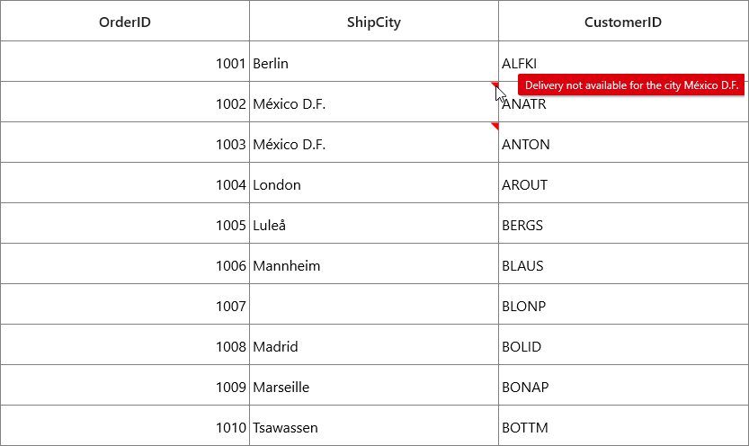
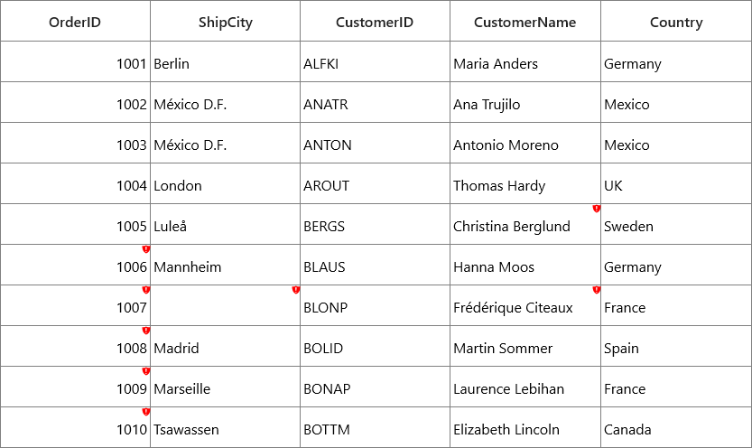
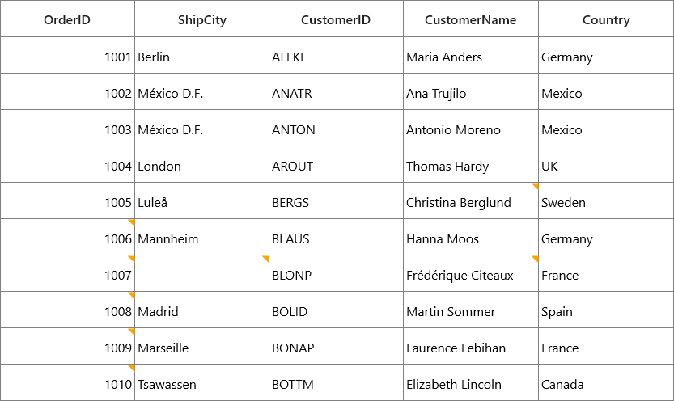
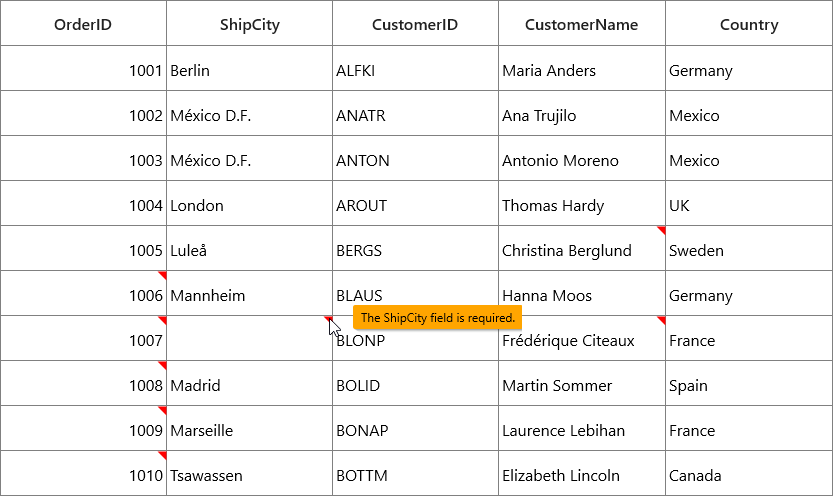
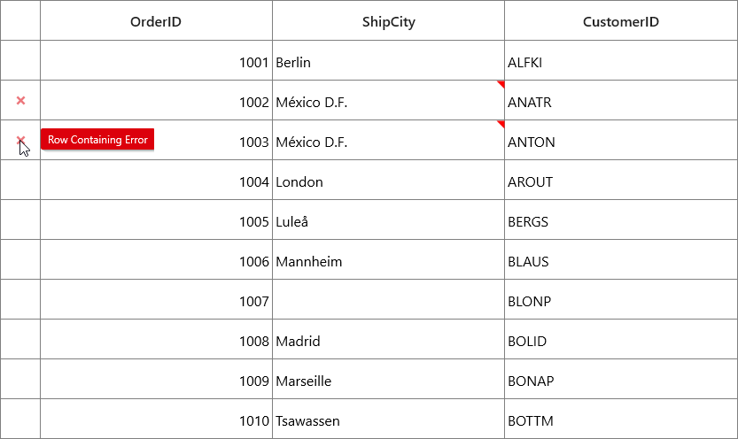
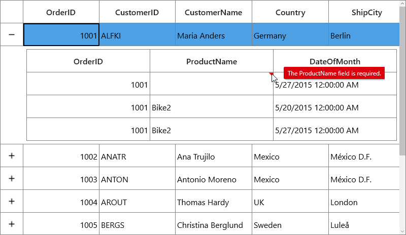
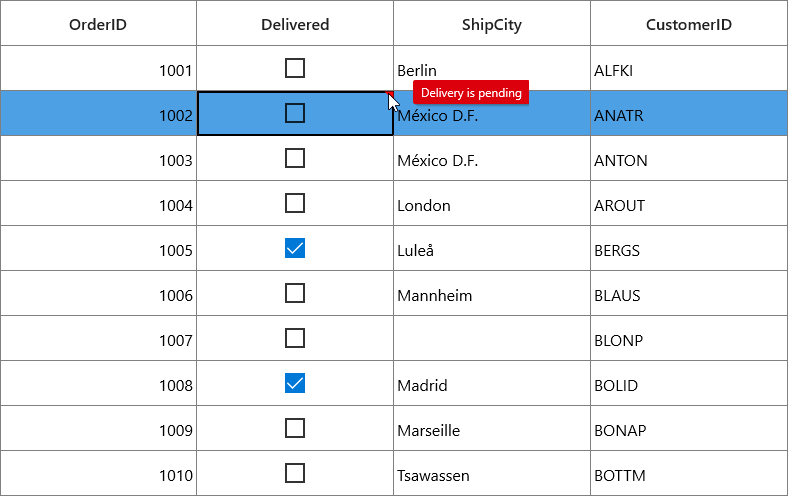

# Data Validation in UWP DataGrid (SfDataGrid)

SfDataGrid allows you to validate the data and display hints in case of validation is not passed. In case of invalid data, error icon is displayed at the top right corner of [GridCell](https://help.syncfusion.com/cr/uwp/Syncfusion.UI.Xaml.Grid.GridCell.html). When mouse over the error icon, error information will be displayed in tooltip. 

## Built-in validations

Built-in validations through INotifyDataErrorInfo and Data annotation attributes, can be enabled by setting [SfDataGrid.GridValidationMode](https://help.syncfusion.com/cr/uwp/Syncfusion.UI.Xaml.Grid.SfGridBase.html#Syncfusion_UI_Xaml_Grid_SfGridBase_GridValidationMode) or [GridColumn.GridValidationMode](https://help.syncfusion.com/cr/uwp/Syncfusion.UI.Xaml.Grid.GridColumnBase.html#Syncfusion_UI_Xaml_Grid_GridColumnBase_GridValidationMode) properties. `GridColumn.GridValidationMode` takes priority than `SfDataGrid.GridValidationMode`.

* `GridValidation.InView` - displays error icons and tips alone.
* `GridValidation.None` - disables built-in validation support

### Built-in validation using INotifyDataErrorInfo

You can validate the data by inheriting the [INotifyDataErrorInfo](https://msdn.microsoft.com/en-us/library/system.componentmodel.inotifydataerrorinfo.aspx) interface in model class.



public class OrderInfo : INotifyDataErrorInfo
{
    private List<string> errors = new List<string>();    
    private string shippingCity;

    public string ShipCity
    {
        get { return shippingCity; }
        set { shippingCity = value; }
    }

    public System.Collections.IEnumerable GetErrors(string propertyName)
    {

        if (!propertyName.Equals("ShipCity"))
            return null;

        if (this.ShipCity.Contains("Mexico D.F."))
            errors.Add("Delivery not available for the city " + this.ShipCity);
        return errors;
    }
    [Display(AutoGenerateField = false)]

    public bool HasErrors
    {
        get
        {

            if (this.ShipCity.Contains("Mexico D.F."))
                return true;
            return false;
        }
    }
    public event EventHandler<DataErrorsChangedEventArgs> ErrorsChanged;
}



Enable built-in validation support by setting [SfDataGrid.GridValidationMode](https://help.syncfusion.com/cr/uwp/Syncfusion.UI.Xaml.Grid.SfGridBase.html#Syncfusion_UI_Xaml_Grid_SfGridBase_GridValidationMode) or [GridColumn.GridValidationMode](https://help.syncfusion.com/cr/uwp/Syncfusion.UI.Xaml.Grid.GridColumnBase.html#Syncfusion_UI_Xaml_Grid_GridColumnBase_GridValidationMode) property `InView`.



<syncfusion:SfDataGrid x:Name="dataGrid"
                       ItemsSource="{Binding Orders}"                                                    
                       AllowEditing="True"                                                
                       GridValidationMode="InView"/>



### Built-in validation using Data Annotation

You can validate the data using data annotation attributes by setting [SfDataGrid.GridValidationMode](https://help.syncfusion.com/cr/uwp/Syncfusion.UI.Xaml.Grid.SfGridBase.html#Syncfusion_UI_Xaml_Grid_SfGridBase_GridValidationMode) or [GridColumn.GridValidationMode](https://help.syncfusion.com/cr/uwp/Syncfusion.UI.Xaml.Grid.GridColumnBase.html#Syncfusion_UI_Xaml_Grid_GridColumnBase_GridValidationMode) property to `InView`.

#### Using different annotations

The numeric type like int, double, decimal properties can be validated using [Range attributes](https://msdn.microsoft.com/en-us/library/system.componentmodel.dataannotations.rangeattribute.aspx).



private int orderID;
[Range(1001, 1005, ErrorMessage = "OrderID between 1001 and 1005 alone processed")]

public int OrderID
{
    get { return orderID; }
    set { orderID = value; }
}
private decimal price;
[Range(typeof(decimal),"12","20")]

public decimal Price
{
    get { return price; }
    set { price = value; }
}



The string type property can be validated using [Required](https://msdn.microsoft.com/en-us/library/system.componentmodel.dataannotations.requiredattribute.aspx), [String Length attributes](https://msdn.microsoft.com/en-us/library/system.componentmodel.dataannotations.stringlengthattribute.aspx)



private string shippingCity;
[Required]

public string ShipCity
{
    get { return shippingCity; }
    set { shippingCity = value; }
}
private string customerName;
[StringLength(17)]

public string CustomerName
{
    get { return customerName; }
    set { customerName = value; }
}



The data that has heterogeneous type (combination of number, special character) can be validated using [RegularExpressions](https://msdn.microsoft.com/en-us/library/system.componentmodel.dataannotations.regularexpressionattribute.aspx).



[RegularExpressionAttribute(@"^[a-zA-Z]{1,40}$", ErrorMessage="Numbers and special characters not allowed")]

public string CustomerID
{
    get { return customerId; }
    set { customerId = value; }
}



## Custom validation through events

You can validate the cells and rows using [CurrentCellValidating](https://help.syncfusion.com/cr/uwp/Syncfusion.UI.Xaml.Grid.SfDataGrid.html) and [RowValidating](https://help.syncfusion.com/cr/uwp/Syncfusion.UI.Xaml.Grid.SfDataGrid.html) events. SfDataGrid will not allow user to edit other cell / row if validation failed.

## Cell Validation

You can validate the cells using [CurrentCellValidating](https://help.syncfusion.com/cr/uwp/Syncfusion.UI.Xaml.Grid.SfDataGrid.html) event when the cell is edited. [CurrentCellValidating](https://help.syncfusion.com/cr/uwp/Syncfusion.UI.Xaml.Grid.SfDataGrid.html) event occurs when the edited cells tries to commit the data or lose the focus. 

[CurrentCellValidatingEventArgs](https://help.syncfusion.com/cr/uwp/Syncfusion.UI.Xaml.Grid.CurrentCellValidatingEventArgs.html) provides information to `CurrentCellValidating` event for validating the cell. `CurrentCellValidatingEventArgs.OriginalSender` returns the DataGrid fired this event for DetailsView. 
`CurrentCellValidatingEventArgs.NewValue` returns the edited value and you can set the validation status using `CurrentCellValidatingEventArgs.IsValid` property. 



this.dataGrid.CurrentCellValidating += dataGrid_CurrentCellValidating;

void dataGrid_CurrentCellValidating(object sender, CurrentCellValidatingEventArgs args)
{
 
    if (args.NewValue.ToString().Equals("1004"))
    {
        args.IsValid = false;
        args.ErrorMessage = "OrderID 1004 cannot be passed";
    }
}



[SfDataGrid.CurrentCellValidated](https://help.syncfusion.com/cr/uwp/Syncfusion.UI.Xaml.Grid.SfDataGrid.html) event triggered when the cell has finished validating with valid data.



this.dataGrid.CurrentCellValidated += dataGrid_CurrentCellValidated;

void dataGrid_CurrentCellValidated(object sender, CurrentCellValidatedEventArgs args)
{
}



## Row Validation

You can validate the row using [RowValidating](https://help.syncfusion.com/cr/uwp/Syncfusion.UI.Xaml.Grid.SfDataGrid.html) event when the cell is edited. The `RowValidating` event occurs when the edited cells tries to commit the row data or lose the focus. 

[RowValidatingEventArgs](https://help.syncfusion.com/cr/uwp/Syncfusion.UI.Xaml.Grid.RowValidatingEventArgs.html) provides information to `RowValidating` event for validating row. `RowValidatingEventArgs.OriginalSender` returns the DataGrid fired this event for DetailsView. `RowValidatingEventArgs.RowData` returns the edited value and you can set the validation status using `RowValidatingEventArgs.IsValid` property.



this.dataGrid.RowValidating += dataGrid_RowValidating;

void dataGrid_RowValidating(object sender, RowValidatingEventArgs args)
{
    var data = args.RowData.GetType().GetProperty("CustomerID").GetValue(args.RowData);

    if(data.ToString().Equals("AROUT"))
    {                
        args.IsValid = false;
        args.ErrorMessages.Add("CustomerID", "Customer AROUT cannot be passed");
    }
}



[SfDataGrid.RowValidated](https://help.syncfusion.com/cr/uwp/Syncfusion.UI.Xaml.Grid.SfDataGrid.html) event triggered when the row has finished validating with valid row data.



this.dataGrid.RowValidated += dataGrid_RowValidated;

void dataGrid_RowValidated(object sender, RowValidatedEventArgs args)
{
}



## Error icon and tip customization

### Customizing error icon

You can customize the error icon by editing `GridCell` style. 

#### Change the shape of error icon

You can change the validation error template shape of the GridCell by changing the `Data` property of the path in the PART_InValidCellBorder of GridCell.







#### Change the color of error icon

You can change the validation error template color of the GridCell by changing the `Fill` property of the path in the PART_InValidCellBorder of GridCell.







### Customizing error tip

You can customize the error tip by editing the style of `ValidationToolTipTemplate`. Get the style of `ValidationToolTipTemplate` by editing the GridCell style.

#### Change the background and foreground color of error tip

You can change the error tip background color by setting `Background` property of the border in `ValidationToolTipTemplate`. The error tip foreground color can be changed by setting `Foreground` property of the `TextBlock` in `ValidationToolTipTemplate`.



<ControlTemplate x:Key="ValidationToolTipTemplate">
    <Grid x:Name="PART_ToolTipPresenter" Margin="5,0" Opacity="0" RenderTransformOrigin="0,0">
        <Grid.RenderTransform>
            <TranslateTransform x:Name="Transform" X="-25" />
        </Grid.RenderTransform>
        <VisualStateManager.VisualStateGroups>
            <VisualStateGroup x:Name="OpenStates">
                <VisualStateGroup.Transitions>
                    <VisualTransition GeneratedDuration="0" />
                    <VisualTransition GeneratedDuration="0:0:0.2" To="Opened">
                        <Storyboard>
                            <DoubleAnimation Duration="0:0:0.2"
                                             Storyboard.TargetName="Transform"
                                             Storyboard.TargetProperty="X"
                                             To="0">
                                <DoubleAnimation.EasingFunction>
                                    <BackEase Amplitude=".3" EasingMode="EaseOut" />
                                </DoubleAnimation.EasingFunction>
                            </DoubleAnimation>
                            <DoubleAnimation Duration="0:0:0.2"
                                             Storyboard.TargetName="PART_ToolTipPresenter"
                                             Storyboard.TargetProperty="Opacity"
                                             To="1" />
                        </Storyboard>
                    </VisualTransition>
                </VisualStateGroup.Transitions>
                <VisualState x:Name="Closed">
                    <Storyboard>
                        <DoubleAnimation Duration="0"
                                         Storyboard.TargetName="PART_ToolTipPresenter"
                                         Storyboard.TargetProperty="Opacity"
                                         To="0" />
                    </Storyboard>
                </VisualState>
                <VisualState x:Name="Opened">
                    <Storyboard>
                        <DoubleAnimation Duration="0"
                                         Storyboard.TargetName="Transform"
                                         Storyboard.TargetProperty="X"
                                         To="0" />
                        <DoubleAnimation Duration="0"
                                         Storyboard.TargetName="PART_ToolTipPresenter"
                                         Storyboard.TargetProperty="Opacity"
                                         To="1" />
                    </Storyboard>
                </VisualState>
            </VisualStateGroup>
        </VisualStateManager.VisualStateGroups>
        <Border Margin="4,4,-4,-4"
                Background="#052A2E31"
                CornerRadius="5" />
        <Border Margin="3,3,-3,-3"
                Background="#152A2E31"
                CornerRadius="4" />
        <Border Margin="2,2,-2,-2"
                Background="#252A2E31"
                CornerRadius="3" />
        <Border Margin="1,1,-1,-1"
                Background="#352A2E31"
                CornerRadius="2" />   
        <Border Background="Orange" 
                CornerRadius="2" />
        <Border CornerRadius="2">
            <TextBlock MaxWidth="250"
                       Margin="8,4,8,4"
                       Foreground="Black"
                       Text="{TemplateBinding Tag}"
                       TextWrapping="Wrap"
                       UseLayoutRounding="false" />
        </Border>
    </Grid>
</ControlTemplate>



### Showing error details in RowHeader

SfDataGrid support to show the error information in row header by setting INotifyDataErrorInfo.HasErrors. By default error message “Row Containing Error” will be displayed.  You can change this by changing `RowErrorMessage` in the `resx` file. 



[Display(AutoGenerateField = false)]
public bool HasErrors
{
    get
    {
        if (this.ShipCity.Contains("Mexico D.F."))
            return true;
        return false;
    }
}



## Validation with Master-Details View

Master- details view allows you to [validate](https://help.syncfusion.com/uwp/sfdatagrid/data-validation#_Data_Validation) the bound data is valid or not. 
You can do both built-in and custom validation of data in `DetailsViewDataGrid`.

### Built-in validations

You can validate the bound data based on [INotifyDataErrorInfo](https://msdn.microsoft.com/en-us/library/system.componentmodel.inotifydataerrorinfo.aspx) or Data Annotation Attributes by setting [GridValidationMode](https://help.syncfusion.com/cr/uwp/Syncfusion.UI.Xaml.Grid.SfGridBase.html#Syncfusion_UI_Xaml_Grid_SfGridBase_GridValidationMode) property of `ViewDefinition.DataGrid`.



<syncfusion:SfDataGrid x:Name="dataGrid"
                       NavigationMode="Cell"
                       AutoGenerateColumns="True"                              
                       ItemsSource="{Binding Orders}">
    <syncfusion:SfDataGrid.DetailsViewDefinition>
        <syncfusion:GridViewDefinition RelationalColumn="ProductDetails">
            <syncfusion:GridViewDefinition.DataGrid>
    <syncfusion:SfDataGrid x:Name="FirstLevelNestedGrid" 
                           GridValidationMode="InView"                                                                                         
                           AutoGenerateColumns="True">
        </syncfusion:SfDataGrid>
            </syncfusion:GridViewDefinition.DataGrid>
        </syncfusion:GridViewDefinition>
    </syncfusion:SfDataGrid.DetailsViewDefinition>
</syncfusion:SfDataGrid>



When the relation is auto-generated, the data can be validated by setting `GridValidationMode` property to `AutoGeneratingRelations.GridViewDefinition.DataGrid` in [AutoGeneratingRelations](https://help.syncfusion.com/cr/uwp/Syncfusion.UI.Xaml.Grid.SfDataGrid.html) event handler.



dataGrid.AutoGenerateRelations = true;
dataGrid.AutoGeneratingRelations +=dataGrid_AutoGeneratingRelations;

private void DataGrid_AutoGeneratingRelations(object sender, AutoGeneratingRelationsArgs e)
{
}



### Custom validation through events

Master-details view support to validate the cells and rows using [CurrentCellValidating](https://help.syncfusion.com/cr/uwp/Syncfusion.UI.Xaml.Grid.SfDataGrid.html) and [RowValidating](https://help.syncfusion.com/cr/uwp/Syncfusion.UI.Xaml.Grid.SfDataGrid.html) events. 

#### Cell Validation

You can validate the cells using `CurrentCellValidating` event of [ViewDefinition.DataGrid](https://help.syncfusion.com/cr/uwp/Syncfusion.UI.Xaml.Grid.GridViewDefinition.html#Syncfusion_UI_Xaml_Grid_GridViewDefinition_DataGrid) when the cell is edited. `CurrentCellValidating` event occurs when the edited cells tries to commit the data or lose the focus. 



<syncfusion:SfDataGrid x:Name="dataGrid"
                       NavigationMode="Cell"                           
                       AutoGenerateColumns="True"                              
                       ItemsSource="{Binding Orders}">
    <syncfusion:SfDataGrid.DetailsViewDefinition>
        <syncfusion:GridViewDefinition RelationalColumn="ProductDetails">
            <syncfusion:GridViewDefinition.DataGrid>
                <syncfusion:SfDataGrid x:Name="FirstLevelNestedGrid"  
                                       AllowEditing="True"                                                                  CurrentCellValidating="FirstLevelNestedGrid_CurrentCellValidating"                                       
                                       AutoGenerateColumns="True">                                                                                                      
                </syncfusion:SfDataGrid>
            </syncfusion:GridViewDefinition.DataGrid>
        </syncfusion:GridViewDefinition>
    </syncfusion:SfDataGrid.DetailsViewDefinition>
</syncfusion:SfDataGrid>





this.FirstLevelNestedGrid.CurrentCellValidating +=FirstLevelNestedGrid_CurrentCellValidating;

private void FirstLevelNestedGrid_CurrentCellValidating(object sender, CurrentCellValidatingEventArgs args)
{

    if(args.NewValue.ToString().Equals("Bike2"))
    {
        args.IsValid = false;
        args.ErrorMessage = "Order ID 1002 not ordered Bike2";
    }
}



[CurrentCellValidated](https://help.syncfusion.com/cr/uwp/Syncfusion.UI.Xaml.Grid.SfDataGrid.html) event `ViewDefinition.DataGrid` triggered when the cell has finished validating with valid data.



<syncfusion:SfDataGrid x:Name="dataGrid"
                       NavigationMode="Cell"                                                 
                       AutoGenerateColumns="True"                              
                       ItemsSource="{Binding Orders}">
    <syncfusion:SfDataGrid.DetailsViewDefinition>
        <syncfusion:GridViewDefinition RelationalColumn="ProductDetails">
            <syncfusion:GridViewDefinition.DataGrid>
                <syncfusion:SfDataGrid x:Name="FirstLevelNestedGrid"  
                                       AllowEditing="True"                                                                              CurrentCellValidated="FirstLevelNestedGrid_CurrentCellValidated"                                       
                                       AutoGenerateColumns="True">                                                                                  
                </syncfusion:SfDataGrid>
            </syncfusion:GridViewDefinition.DataGrid>
        </syncfusion:GridViewDefinition>
    </syncfusion:SfDataGrid.DetailsViewDefinition>
</syncfusion:SfDataGrid>





this.FirstLevelNestedGrid.CurrentCellValidated +=FirstLevelNestedGrid_CurrentCellValidated;

private void FirstLevelNestedGrid_CurrentCellValidated(object sender, CurrentCellValidatedEventArgs args)
{
}



When the relation is auto-generated, you can wire the `CurrentCellValidating` and `CurrentCellValidated` events for `AutoGeneratingRelations.GridViewDefinition.DataGrid` in `AutoGeneratingRelations` event handler.



dataGrid.AutoGenerateRelations = true;
dataGrid.AutoGeneratingRelations +=dataGrid_AutoGeneratingRelations;

void dataGrid_AutoGeneratingRelations(object sender, Syncfusion.UI.Xaml.Grid.AutoGeneratingRelationsArgs e)
{
    e.GridViewDefinition.DataGrid.CurrentCellValidating += FirstLevelNestedGrid_CurrentCellValidating;
    e.GridViewDefinition.DataGrid.CurrentCellValidated += FirstLevelNestedGrid_CurrentCellValidated;
}



#### Row Validation 

You can validate the row using [RowValidating](https://help.syncfusion.com/cr/uwp/Syncfusion.UI.Xaml.Grid.SfDataGrid.html) event of [ViewDefinition.DataGrid](https://help.syncfusion.com/cr/uwp/Syncfusion.UI.Xaml.Grid.GridViewDefinition.html#Syncfusion_UI_Xaml_Grid_GridViewDefinition_DataGrid) when the cell is edited. The `RowValidating` event occurs when edited cells tries to commit the row data or lose the focus. 



<syncfusion:SfDataGrid x:Name="dataGrid"
                       NavigationMode="Cell"
                       AutoGenerateColumns="True"                              
                       ItemsSource="{Binding Orders}">
    <syncfusion:SfDataGrid.DetailsViewDefinition>
        <syncfusion:GridViewDefinition RelationalColumn="ProductDetails">
            <syncfusion:GridViewDefinition.DataGrid>
                <syncfusion:SfDataGrid x:Name="FirstLevelNestedGrid"  
                                       AllowEditing="True"                                                                              RowValidating="FirstLevelNestedGrid_RowValidating"
                                       AutoGenerateColumns="True">                                                                                  
                </syncfusion:SfDataGrid>
            </syncfusion:GridViewDefinition.DataGrid>
        </syncfusion:GridViewDefinition>
    </syncfusion:SfDataGrid.DetailsViewDefinition>
</syncfusion:SfDataGrid>





this.FirstLevelNestedGrid.RowValidating +=FirstLevelNestedGrid_RowValidating;

private void FirstLevelNestedGrid_RowValidating(object sender, RowValidatingEventArgs args)
{
    var data = args.RowData.GetType().GetProperty("ProductName").GetValue(args.RowData);

    if (data.ToString().Equals("Bike1"))
    {
        args.IsValid = false;
        args.ErrorMessages.Add("ProductName", "Product Bike 1 cannot be orderer for OrderID 1002");
    }
}



`RowValidated` of `ViewDefinition.DataGrid` event triggered when the row has finished validating with valid row data.



<syncfusion:SfDataGrid x:Name="dataGrid"
                       NavigationMode="Cell"
                       AutoGenerateColumns="True"                              
                       ItemsSource="{Binding Orders}">
    <syncfusion:SfDataGrid.DetailsViewDefinition>
        <syncfusion:GridViewDefinition RelationalColumn="ProductDetails">
            <syncfusion:GridViewDefinition.DataGrid>
                <syncfusion:SfDataGrid x:Name="FirstLevelNestedGrid"  
                                       AllowEditing="True"                                                                                                                    
                                       RowValidated="FirstLevelNestedGrid_RowValidated"
                                       AutoGenerateColumns="True">                                                                                                  </syncfusion:SfDataGrid>
            </syncfusion:GridViewDefinition.DataGrid>
        </syncfusion:GridViewDefinition>
    </syncfusion:SfDataGrid.DetailsViewDefinition>
</syncfusion:SfDataGrid>






this.FirstLevelNestedGrid.RowValidated +=FirstLevelNestedGrid_RowValidated;

private void FirstLevelNestedGrid_RowValidated(object sender, RowValidatedEventArgs args)
{
}



When the relation is auto-generated, you can wire the `RowValidating` and `RowValidated` events for `AutoGeneratingRelations.GridViewDefinition.DataGrid` in `AutoGeneratingRelations` event handler.



dataGrid.AutoGenerateRelations = true;
dataGrid.AutoGeneratingRelations +=dataGrid_AutoGeneratingRelations;

void dataGrid_AutoGeneratingRelations(object sender, Syncfusion.UI.Xaml.Grid.AutoGeneratingRelationsArgs e)
{
    e.GridViewDefinition.DataGrid.RowValidating += FirstLevelNestedGrid_RowValidating;
    e.GridViewDefinition.DataGrid.RowValidated += FirstLevelNestedGrid_RowValidated;
}



## Validation with Checkbox column

SfDataGrid doesn’t support to validate the [GridCheckBoxColumn](https://help.syncfusion.com/cr/uwp/Syncfusion.UI.Xaml.Grid.GridCheckBoxColumn.html) through validating events. You can validate the check box column value by setting `ValidationHelper.IsCurrentCellValidated` and `ValidationHelper.IsCurrentRowValidated` static properties by calling [SetCurrentRowValidated](https://help.syncfusion.com/cr/uwp/Syncfusion.UI.Xaml.Grid.ValidationHelper.html#Syncfusion_UI_Xaml_Grid_ValidationHelper_SetCurrentRowValidated_System_Boolean_) and [SetCurrentCellValidated](https://help.syncfusion.com/cr/uwp/Syncfusion.UI.Xaml.Grid.ValidationHelper.html#Syncfusion_UI_Xaml_Grid_ValidationHelper_SetCurrentCellValidated_System_Boolean_) methods from [ValidationHelper](https://help.syncfusion.com/cr/uwp/Syncfusion.UI.Xaml.Grid.ValidationHelper.html).



using Syncfusion.UI.Xaml.Grid.Helpers;

this.dataGrid.CurrentCellValueChanged += dataGrid_CurrentCellValueChanged;

void dataGrid_CurrentCellValueChanged(object sender, CurrentCellValueChangedEventArgs args)
{
    int columnIndex = this.dataGrid.ResolveToGridVisibleColumnIndex(args.RowColumnIndex.ColumnIndex);

    //We are enabling the RowValidating, CellValidating event if the changes happen in GridCheckBoxColumn

    if (this.dataGrid.Columns[columnIndex].CellType == "CheckBox")
    {
        this.dataGrid.GetValidationHelper().SetCurrentRowValidated(false);
        this.dataGrid.GetValidationHelper().SetCurrentCellValidated(false);
    }
}



## Limitations 

* Non editable columns will not support custom validation except [GridCheckBoxColumn](https://help.syncfusion.com/cr/uwp/Syncfusion.UI.Xaml.Grid.GridCheckBoxColumn.html).
* [CurrentCellValidating](https://help.syncfusion.com/cr/uwp/Syncfusion.UI.Xaml.Grid.SfDataGrid.html) event will not triggered for [GridTemplateColumn](https://help.syncfusion.com/cr/uwp/Syncfusion.UI.Xaml.Grid.GridTemplateColumn.html) and 
