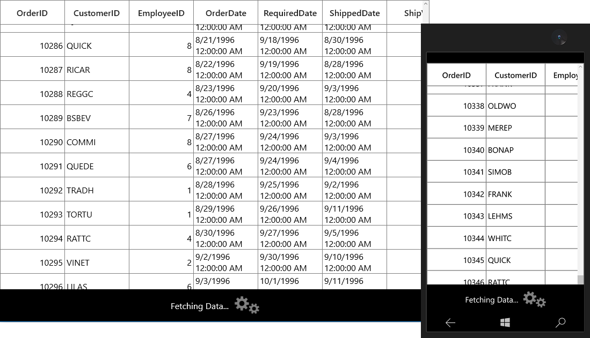

# Data Virtualization in UWP DataGrid (SfDataGrid)

SfDataGrid provides support to handle the large amount of data through built-in virtualization features. With Data virtualization, [SfDataGrid.View](https://help.syncfusion.com/cr/uwp/Syncfusion.UI.Xaml.Grid.SfDataGrid.html#Syncfusion_UI_Xaml_Grid_SfDataGrid_View) process the data in on-demand for better performance while loading large amount of data. Below are the different virtualization concepts available,

<table>
<tr>
<th>
Concept
</th>
<th>
Usage
</th>
</tr>
<tr>
<td>
VirtualizingCollectionView
</td>
<td>
Use to load large amount of data in less time.
</td>
</tr>
<tr>
<td>
Custom VirtualizingCollectionView
</td>
<td>
Use to load large amount of data in less time and also data can be loaded in on-demand.
</td>
</tr>
<tr>
<td>
Incremental Loading
</td>
<td>
Use to load subset of data from the services or servers in less time while loading and scrolling. On-demand request also supported.
</td>
</tr>
<tr>
<td>
Paging
</td>
<td>
Use to load large amount of data in less time with the help of <code>SfDataPager</code>.
</td>
</tr>
<tr>
<td>
On-demand paging
</td>
<td>
Use to load data in on-demand. You can load data only for current page from server. 
</td>
</tr>
</table>

## VirtualizingCollectionView
 
You can load the large amount of data in less time using [GridVirtualizingCollectionView](https://help.syncfusion.com/cr/uwp/Syncfusion.UI.Xaml.Grid.GridVirtualizingCollectionView.html) which is derived from [VirtualizingCollectionView](https://help.syncfusion.com/cr/uwp/Syncfusion.Data.VirtualizingCollectionView.html) to [SfDataGrid.ItemsSource](https://help.syncfusion.com/cr/uwp/Syncfusion.UI.Xaml.Grid.SfDataGrid.html#Syncfusion_UI_Xaml_Grid_SfDataGrid_ItemsSource).
 
In the below code, ViewModel defined with `GridVirtualizingCollectionView` by passing complete records collection and bound to SfDataGrid.



public class ViewModel
{
    private GridVirtualizingCollectionView _gridVirtualizingItemsSource;

    public GridVirtualizingCollectionView GridVirtualizingItemsSource
    {
        get { return _gridVirtualizingItemsSource; }
        set { _gridVirtualizingItemsSource = value; }
    }

    public ViewModel()
    {
        var _orders = this.GenerateOrders();                        
        GridVirtualizingItemsSource = new GridVirtualizingCollectionView(_orders);
    }
}


<syncfusion:SfDataGrid x:Name="dataGrid"                               
                       ItemsSource="{Binding GridVirtualizingItemsSource}" />



### Limitations
 
1. Data update using [LiveDataUpdateMode](https://help.syncfusion.com/cr/uwp/Syncfusion.UI.Xaml.Grid.SfDataGrid.html#Syncfusion_UI_Xaml_Grid_SfDataGrid_LiveDataUpdateMode) is not supported.

2. Details view is not supported.

3. [AllowFrozenGroupHeaders](https://help.syncfusion.com/cr/uwp/Syncfusion.UI.Xaml.Grid.SfDataGrid.html#Syncfusion_UI_Xaml_Grid_SfDataGrid_AllowFrozenGroupHeaders) is not supported.

## Creating Custom VirtualizingCollectionView

SfDataGrid supports to override [GridVirtualizingCollectionView](https://help.syncfusion.com/cr/uwp/Syncfusion.UI.Xaml.Grid.GridVirtualizingCollectionView.html) and retrieve the data in on-demand by inheriting `GridVirtualizingCollectionView` class. The `GridVirtualizingCollectionView` class provides set of virtual methods to load data and handle the operations like sorting, filtering, and grouping. 

You can load the data in on-demand by overriding below methods in `GridVirtualizingCollectionView`.

<table>
<tr>
<th>
Methods
</th>
<th>
Description
</th>
</tr>
<tr>
<td>
[GetInternalSource](https://help.syncfusion.com/cr/uwp/Syncfusion.Data.CollectionViewAdv.html)
</td>
<td>
Returns the source.
</td>
</tr>
<tr>
<td>
[GetItemAt](https://help.syncfusion.com/cr/uwp/Syncfusion.Data.CollectionViewAdv.html#Syncfusion_Data_CollectionViewAdv_GetItemAt_System_Int32_)
</td>
<td>
Returns the data object by specified index from the collection. If the collection is filtered then returns from filtered source.
</td>
</tr>
<tr>
<td>
[GetIndexOf](https://help.syncfusion.com/cr/uwp/Syncfusion.Data.VirtualizingCollectionView.html#Syncfusion_Data_VirtualizingCollectionView_GetIndexOf_System_Object_)
</td>
<td>
Returns the index by specified data object from the collection. If the collection is filtered then returns from filtered source.
</td>
</tr>
<tr>
<td>
[GetViewRecordCount](https://help.syncfusion.com/cr/uwp/Syncfusion.Data.VirtualizingCollectionView.html#Syncfusion_Data_VirtualizingCollectionView_GetViewRecordCount)
</td>
<td>
Returns the data object count from collection. If the collection is filtered then returns using filtered source count.
</td>
</tr>
</table>

Below code creates the `GridVirtualizingCollectionViewExt` to load the virtualized data collection.



public class GridVirtualizingCollectionViewExt: GridVirtualizingCollectionView
{
    IList<OrderInfo> sourceCollection;
    
    public GridVirtualizingCollectionViewExt()
        : base()
    {
        sourceCollection = new ViewModel().Orders;
    }
    
    /// 

    /// Gets the index of specified item.
    /// 

    /// <param name="item">Specifies the item to get the index</param>
    /// <returns>Returns the index  of specified item<returns>

    protected override int GetIndexOf(object item)
    {
        return sourceCollection.IndexOf(item as OrderInfo);
    }
    
    /// 

    /// Returns the specified index item from sourceCollection.
    /// 

    /// <param name="index"></param>
    /// <returns></returns>

    public override object GetItemAt(int index)
    {
        return sourceCollection[index];
    }

    /// 

    /// Gets the records count that are inView.
    /// 

    /// <returns>Returns the records count that are inView</returns>

    public override int GetViewRecordCount()
    {
        return sourceCollection.Count();
    }
    
    /// 

    /// Gets the list of records in view.
    /// 

    /// <returns>Returns the list of records in view</returns>

    public override System.Collections.IEnumerable GetInternalSource()
    {
        return sourceCollection;
    }
    
    /// 

    /// Process the sort on collection based on specified sort description. 
    /// 

    /// <param name="sortDescription">Specifies the sort description to sort the collection</param>

    protected override void ProcessSort(SortDescriptionCollection sortDescription)
    {
    }
}



Below code, sets the `GridVirtualizingCollectionViewExt` to `SfDataGrid.ItemsSource`.



public partial class MainWindow : Window
{

    public MainWindow()
    {
        InitializeComponent();
        this.dataGrid.ItemsSource = new GridVirtualizingCollectionViewExt();            
    }
}



### Handling Data Management with VirtualizingCollectionView

You can handle Sorting, Filtering and Grouping in custom virtualizing collection view by below methods.

<table>
<tr>
<th>
Methods
</th>
<th>
Description
</th>
</tr>
<tr>
<td>
[GetSourceListForFilteringItems](https://help.syncfusion.com/cr/uwp/Syncfusion.Data.VirtualizingCollectionView.html#Syncfusion_Data_VirtualizingCollectionView_GetSourceList)
</td>
<td>
Returns the whole source to apply filter. Used to populate the items for ExcelLikeFilter pop-up.
</td>
</tr>
<tr>
<td>
[ApplyFilter](https://help.syncfusion.com/cr/uwp/Syncfusion.Data.VirtualizingCollectionView.html#Syncfusion_Data_VirtualizingCollectionView_ApplyFilter_System_Predicate_System_Object__)
</td>
<td>
Apply filter on source collection based on filter predicates.
</td>
</tr>
<tr>
<td>
[ProcessSort](https://help.syncfusion.com/cr/uwp/Syncfusion.Data.VirtualizingCollectionView.html#Syncfusion_Data_VirtualizingCollectionView_ProcessSort_Syncfusion_Data_SortDescriptionCollection_)
</td>
<td>
Apply sorting on the source collection based on the sort descriptions. 
</td>
</tr>
<tr>
<td>
[GetGroupedSource](https://help.syncfusion.com/cr/uwp/Syncfusion.Data.VirtualizingCollectionView.html#Syncfusion_Data_VirtualizingCollectionView_GetGroupedSource_System_String___)
</td>
<td>
Apply grouping on source collection based on group descriptions and returns the grouped source.
</td>
</tr>
</table>

#### Sorting

You can apply sorting on collection based on custom logic by overriding `ProcessSort` method.



public class GridVirtualizingCollectionViewExt : GridVirtualizingCollectionView
{
    /// 

    /// Process the sort on collection based on specified sort description. 
    /// 

    /// <param name="sortDescription">Specifies the sort description to sort the   collection</param>

    protected override void ProcessSort(SortDescriptionCollection sortDescription)
    {
            this.sourceCollection = this.sourceCollection.OrderBy(item => item.Country).ToList();
    }
}



#### Filtering

You can filter the collection using `ApplyFilter` method. To load items source ExcelLikeFiltering pop-up, you can use `GetSourceListForFilteringItems`.

You need to use the filtered source if the collection has filtered in `GetElementAt`, `GetIndexOf` and `GetViewRecordCount` methods.



public class GridVirtualizingCollectionViewExt : GridVirtualizingCollectionView
{
    IList<OrderInfo> filteredSource;

    public GridVirtualizingCollectionViewExt()
            : base()
    {
          sourceCollection = new ViewModel().Orders;
          filteredSource = new ObservableCollection<OrderInfo>();
    }

    /// 

    /// Gets the SourceCollection to load items source in Filter Pop-up control.
    /// 

    /// <returns>Returns the SourceCollection</returns>

    public override System.Collections.IEnumerable GetSourceListForFilteringItems()
    {
        return sourceCollection;
    }

    /// 

    /// Applies filter on collection.
    /// 

    /// <param name="RowFilter">Specifies the Row Filter to apply filter on collection</param>

    protected override void ApplyFilter(Predicate<object> RowFilter)
    {

        foreach (var item in sourceCollection)
        {

            if (FilterRecord(item))
            {

                // The filtered data is stored in filteredSource. After filtering is applied- the GetItemAt method is called, you need to pass the Data from filteredSource to display the filtered data.
                this.filteredSource.Add(item);
            }
        }    
   }

    private void ClearFilter()
    {
        this.filteredSource.Clear();
    }

    /// 

    /// Refresh the view while apply and clear the filter
    /// 

    public override void RefreshFilter()
    {
        var filterPresent = this.FilterPredicates.Any(v => v.FilterPredicates != null && v.FilterPredicates.Count > 0);

        if (filterPresent)
        {
            var source = this.sourceCollection.OfQueryable().AsQueryable();
            ParameterExpression paramExpression;
            Expression predicate = this.GetPredicateExpression(source, out paramExpression);
            
            if (paramExpression != null && predicate != null)
            {
                var lambda = Expression.Lambda(predicate, paramExpression);
                var delegate = lambda.Compile();
                this.RowFilter = (o) =>
                {
                    var result = (bool)delegate.DynamicInvoke(o);
                    return result;
                };
            }         
        }

        else
            this.RowFilter = null;   

        if (this.RowFilter != null)
            ApplyFilter(null);
            
        else
            ClearFilter();
        Refresh();
    }
}



#### Grouping

You can apply grouping on collection based custom logic and returns the grouped source by overriding `GetGroupedSource` method.



public class GridVirtualizingCollectionViewExt : GridVirtualizingCollectionView
{
    /// 

    /// Gets the grouped result by specified group by array.
    /// 

    /// <param name="groupBy">Specifies the group by array to get the group result on collection</param>
    /// <returns></returns>

    protected override IEnumerable<GroupResult> GetGroupedSource(string[] groupBy)
    {
        IQueryable queryable = this.sourceCollection.OfQueryable().AsQueryable();
        var result = queryable.GroupByMany(this.SourceType, (property) => this.GetExpressionFunc(property), groupBy).ToList();
        return result;
    }
}



## Incremental Loading
 
SfDataGrid supports to load the data incrementally using `ISupportIncrementalLoading` interface.

`ISupportIncrementalLoading` interface has `LoadMoreItemsAsync` method which helps to load the data incrementally. [LoadMoreItemsAsync](https://help.syncfusion.com/cr/uwp/Syncfusion.UI.Xaml.Grid.IncrementalList-1.html#Syncfusion_UI_Xaml_Grid_IncrementalList_1_LoadMoreItemsAsync_System_UInt32_) called in on-demand while scrolling based on [HasMoreItems](https://help.syncfusion.com/cr/uwp/Syncfusion.UI.Xaml.Grid.IncrementalList-1.html#Syncfusion_UI_Xaml_Grid_IncrementalList_1_HasMoreItems) property.
If `HasMoreItems` is `false`, SfDataGrid stops calling `LoadMoreItemsAsync`.  

SfDataGrid have [IncrementalList](https://help.syncfusion.com/cr/uwp/Syncfusion.UI.Xaml.Grid.IncrementalList-1.html) which is derived from `ISupportIncrementalLoading`. You can use `IncrementalList` or create collection derived from `ISupportIncrementalLoading` and bind it `SfDataGrid.ItemsSource`.

In the below code, `IncrementalList` is initialized by passing Action to its constructor for loading items incrementally.



<Page.DataContext>
    <local:ViewModel />
</Page.DataContext>

<syncfusion:SfDataGrid x:Name="dataGrid" ItemsSource="{Binding IncrementalItemsSource}" />



public class ViewModel
{
    private IncrementalList<OrderInfo> _incrementalItemsSource;

    public IncrementalList<OrderInfo> IncrementalItemsSource
    {
        get { return _incrementalItemsSource; }
        set { _incrementalItemsSource = value; }
    }

    public ViewModel()
    {
        IncrementalItemsSource = new IncrementalList<OrderInfo>(LoadMoreItems) { MaxItemCount = 1000 };          
    }
    
    async Task<IList<OrderInfo>> LoadMoreItems(CancellationToken c, uint count, int baseIndex)
    {
        IList<OrderInfo> list = null;

        await Task.Run(new Action(() =>
        {
            this.GenerateOrders();
            list = _orders.Skip(baseIndex).Take(10).ToList();
        }));
        return list;
    }
}   



You can download the sample from [here](https://www.syncfusion.com/downloads/support/directtrac/general/ze/IncrementalLoading1101987252.zip).

### Displaying animation when fetching data from services

You can display animations when fetching data from service for [LoadMoreItemsAsync](https://help.syncfusion.com/cr/uwp/Syncfusion.UI.Xaml.Grid.IncrementalList-1.html#Syncfusion_UI_Xaml_Grid_IncrementalList_1_LoadMoreItemsAsync_System_UInt32_) method call, using [BackgroundWorker](https://msdn.microsoft.com/en-us/library/system.componentmodel.backgroundworker.aspx).
 
In the below code snippet data fetched from service using `BackgroundWorker` and `SfBusyIndicator` displayed over SfDataGrid based on `IsBusy` property in ViewModel, until `BackgroundWorker` completes its action.



<Page.DataContext>
    <local:ViewModel />
</Page.DataContext>
<Page.Resources>
    <local:BoolToVisibilityConverter x:Key="converter" />
</Page.Resources>
<syncfusion:SfDataGrid x:Name="dataGrid" ItemsSource="{Binding IncrementalItemsSource}" />
<Border Height="60"
        VerticalAlignment="Bottom"
        Background="Black"
        BorderBrush="Black"
        BorderThickness="1"
        Opacity="50"
        Visibility="{Binding IsBusy,
                                Mode=TwoWay,
                                Converter={StaticResource converter}}">
    <StackPanel HorizontalAlignment="Center"
                VerticalAlignment="Center"
                Orientation="Horizontal">
        <TextBlock Margin="5"
                    VerticalAlignment="Center"
                    FontSize="16"
                    Foreground="White"
                    Text="Fetching Data..." />
        <indicator:SfBusyIndicator Margin="5"
                                    VerticalAlignment="Center"
                                    AnimationType="Gear"
                                    Foreground="Gray" />
    </StackPanel>
</Border>
<Border Height="60"
        VerticalAlignment="Bottom"
        Background="White"
        BorderBrush="Black"
        BorderThickness="1"
        Opacity="50"
        Visibility="{Binding NoNetwork,
                                Mode=TwoWay,
                                Converter={StaticResource converter}}">
    <StackPanel HorizontalAlignment="Center"
                VerticalAlignment="Center"
                Orientation="Horizontal">
        <TextBlock Margin="5"
                    VerticalAlignment="Center"
                    FontSize="16"
                    Foreground="Red"
                    Text="Internet Connection Not found.." />
    </StackPanel>
</Border>





public class ViewModel : INotifyPropertyChanged
{
    #region Members
    NorthwindEntities northwindEntity;
    #endregion
    #region Properties
    private IncrementalList<Order> incrementalItemsSource;

    public IncrementalList<Order> IncrementalItemsSource
    {
        get { return incrementalItemsSource; }
        set { incrementalItemsSource = value; RaisePropertyChanged("IncrementalItemsSource"); }
    }
    private bool isBusy;

    public bool IsBusy
    {
        get { return isBusy; }
        set { isBusy = value; RaisePropertyChanged("IsBusy"); }
    }
    private bool noNetwork;

    public bool NoNetwork
    {
        get { return noNetwork; }
        set { noNetwork = value; RaisePropertyChanged("NoNetwork"); }
    }
    #endregion
    #region Constructor

    public ViewModel()
    {
        string url = "http://services.odata.org/Northwind/Northwind.svc/";

        if (IsConnectedToInternet())
        {
            incrementalItemsSource = new IncrementalList<Order>(LoadMoreItems) { MaxItemCount = 10000 };
            northwindEntity = new NorthwindEntities(new Uri(url));
        }

        else
        {
            NoNetwork = true;
            IsBusy = false;
        }
    }
    #endregion
    #region Methods

    async Task<IList<Order>> LoadMoreItems(CancellationToken c, uint count, int baseIndex)
    {
        IList<Order> list = null;
        IsBusy = true;

        await Task.Run(new Action(() =>
        {
            DataServiceQuery<Order> query = (northwindEntity.Orders as DataServiceQuery<Order>).Expand("Customer");
            query = query.Skip<Order>(baseIndex).Take<Order>(50) as DataServiceQuery<Order>;
            IAsyncResult ar = query.BeginExecute(null, null);
            var items = query.EndExecute(ar);
            list = items.ToList();
        }));

        IsBusy = false;
        return list;
    }

    public static bool IsConnectedToInternet()
    {
        ConnectionProfile connectionProfile = NetworkInformation.GetInternetConnectionProfile();
        return (connectionProfile != null && connectionProfile.GetNetworkConnectivityLevel() == NetworkConnectivityLevel.InternetAccess);
    }

    #endregion
    #region INotifyPropertyChanged Member

    public event PropertyChangedEventHandler PropertyChanged;

    void RaisePropertyChanged(string propertyName)
    {

        if (PropertyChanged != null)
        {
            PropertyChanged(this, new PropertyChangedEventArgs(propertyName));
        }
    }
    #endregion

    public void Dispose()
    {

        if (incrementalItemsSource != null)
            incrementalItemsSource.Clear();
    }
}



You can download the sample from [here](https://www.syncfusion.com/downloads/support/directtrac/general/ze/IncrementalLoading_Service-1432869387.zip).

### LoadMore using ISupportIncrementalLoading

You can fetch the data in some user action instead of scrolling using `IncrementalList.LoadItems` method.

In the below code, data fetched when you click the `Load Items` button.



<Page.DataContext>
    <local:ViewModel />
</Page.DataContext>

Grid x:Name="Root_Grid" Background="{ThemeResource ApplicationPageBackgroundThemeBrush}">
    <Grid.ColumnDefinitions>
        <ColumnDefinition Width="*" />
        <ColumnDefinition Width="50" />
    </Grid.ColumnDefinitions>
    <syncfusion:SfDataGrid x:Name="dataGrid"
                            Grid.Column="0"
                            DataFetchSize="5"
                            ItemsSource="{Binding IncrementalItemsSource}" />
    <Button x:Name="LoadItems"
            Grid.Column="1"
            Command="{Binding DataContext.LoadItems,
                                ElementName=dataGrid}"
            Content="Load Items" />

</Grid>


public class ViewModel : INotifyPropertyChanged
{
    #region Members
    NorthwindEntities northwindEntity;
    #endregion
    #region Properties
    private IncrementalList<Order> incrementalItemsSource;

    public IncrementalList<Order> IncrementalItemsSource
    {
        get { return incrementalItemsSource; }
        set { incrementalItemsSource = value; RaisePropertyChanged("IncrementalItemsSource"); }
    }
    private BaseCommand loadItems;

    public BaseCommand LoadItems
    {
        get
        {

            if (loadItems == null)

                loadItems = new BaseCommand(OnLoadItemsClicked, OnCanLoad);
            return loadItems;
        }
    }
    #endregion
    #region Constructor

    public ViewModel()
    {
        string url = "http://services.odata.org/Northwind/Northwind.svc/";
        incrementalItemsSource = new IncrementalList<Order>(LoadMoreItems) { MaxItemCount = 20};
        northwindEntity = new NorthwindEntities(new Uri(url));           
    }
    #endregion
    #region Methods

    async Task<IList<Order>> LoadMoreItems(CancellationToken c, uint count, int baseIndex)
    {
        IList<Order> list = null;

        await Task.Run(new Action(() =>
        {
            DataServiceQuery<Order> query = (northwindEntity.Orders as DataServiceQuery<Order>).Expand("Customer");
            query = query.Skip<Order>(baseIndex).Take<Order>((int)count) as DataServiceQuery<Order>;
            IAsyncResult ar = query.BeginExecute(null, null);
            var items = query.EndExecute(ar);
            list = items.ToList();
                
        }));
        return list;
    }

    private static bool OnCanLoad(object obj)
    {
        return true;
    }

    private  void OnLoadItemsClicked(object obj)
    {
        LoadMoreItems(CancellationToken.None, 10, incrementalItemsSource.Count);
        incrementalItemsSource.LoadMoreItemsAsync(10);
    }
    #endregion
    #region INotifyPropertyChanged Member
    public event PropertyChangedEventHandler PropertyChanged;

    void RaisePropertyChanged(string propertyName)
    {

        if (PropertyChanged != null)
        {
            PropertyChanged(this, new PropertyChangedEventArgs(propertyName));
        }
    }

    #endregion

    public void Dispose()
    {

        if (incrementalItemsSource != null)
            incrementalItemsSource.Clear();
    }
}



You can download the sample from [here](https://www.syncfusion.com/downloads/support/directtrac/general/ze/IncrementalLoading_LoadMoreItems-925087250.zip).

## Paging

SfDataGrid supports to load paged data source using `SfDataPager`. You can use the paging in SfDataGrid by go through the **Paging** section.
