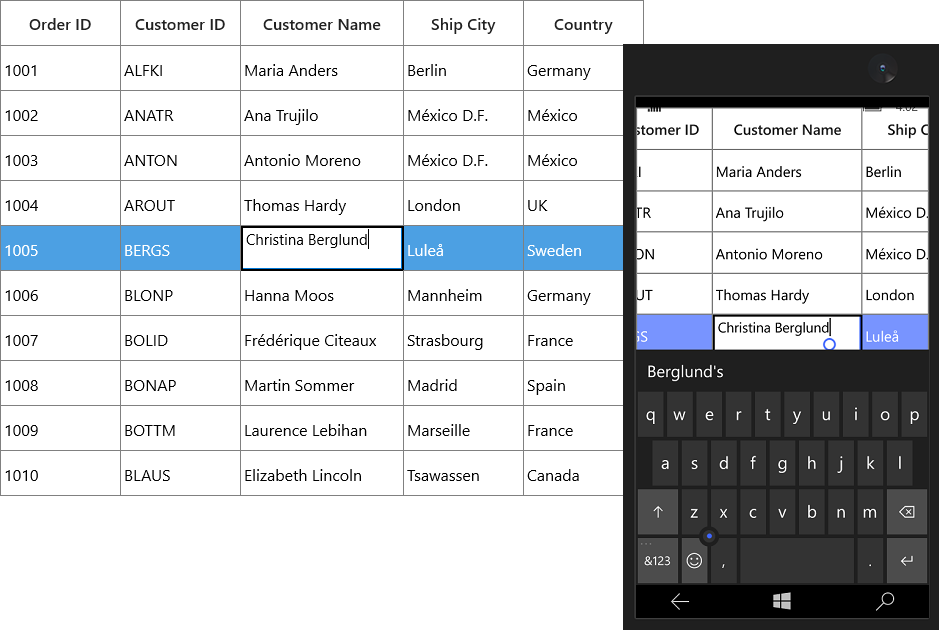
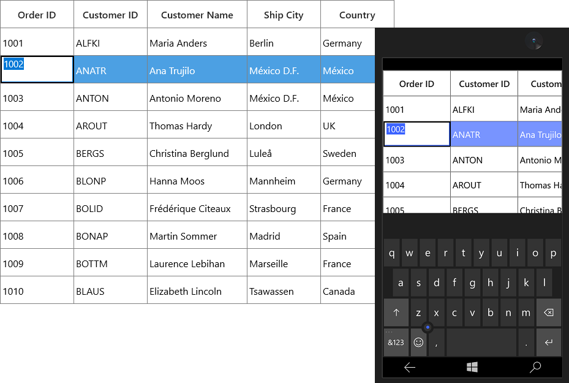
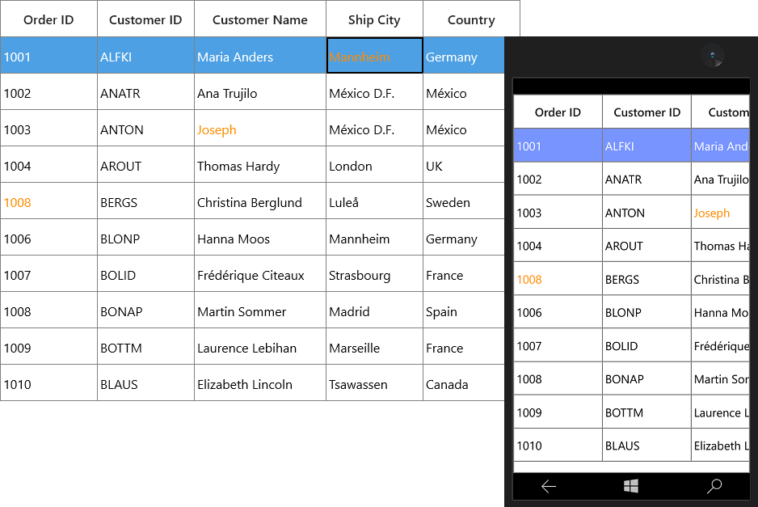

# Editing in UWP DataGrid (SfDataGrid)

SfDataGrid provides support for editing and it can be enabled or disabled by setting [SfDataGrid.AllowEditing](https://help.syncfusion.com/cr/uwp/Syncfusion.UI.Xaml.Grid.SfGridBase.html#Syncfusion_UI_Xaml_Grid_SfGridBase_AllowEditing) property.



<syncfusion:SfDataGrid x:Name="dataGrid"
                       AllowEditing="True"
                       ItemsSource="{Binding Orders}">


dataGrid.AllowEditing = true;



You can enable or disable editing for particular column by setting [GridColumn.AllowEditing](https://help.syncfusion.com/cr/uwp/Syncfusion.UI.Xaml.Grid.GridColumnBase.html#Syncfusion_UI_Xaml_Grid_GridColumnBase_AllowEditing) property.



<syncfusion:GridTextColumn AllowEditing="True"
                           HeaderText="Order ID"
                           MappingName="OrderID" />


dataGrid.Columns["OrderID"].AllowEditing = true;



N> [GridColumn.AllowEditing](https://help.syncfusion.com/cr/uwp/Syncfusion.UI.Xaml.Grid.GridColumnBase.html#Syncfusion_UI_Xaml_Grid_GridColumnBase_AllowEditing) takes higher priority than [SfDataGrid.AllowEditing](https://help.syncfusion.com/cr/uwp/Syncfusion.UI.Xaml.Grid.SfGridBase.html#Syncfusion_UI_Xaml_Grid_SfGridBase_AllowEditing).

N> It is mandatory to set the [NavigationMode](https://help.syncfusion.com/cr/uwp/Syncfusion.UI.Xaml.Grid.SfGridBase.html#Syncfusion_UI_Xaml_Grid_SfGridBase_NavigationMode) to Cell to enable [CurrentCell](https://help.syncfusion.com/cr/uwp/Syncfusion.UI.Xaml.Grid.GridCurrentCellManager.html#Syncfusion_UI_Xaml_Grid_GridCurrentCellManager_CurrentCell) navigation and editing.

### Entering into edit mode

You can enter into edit mode by pressing <kbd>F2</kbd> key or clicking (touch also supported) the cell. You can allow users to edit the cell in single click (OnTap) or double click (OnDoubleTab) by setting by [EditTrigger](https://help.syncfusion.com/cr/uwp/Syncfusion.UI.Xaml.Grid.SfGridBase.html#Syncfusion_UI_Xaml_Grid_SfGridBase_EditTrigger) property.



<syncfusion:SfDataGrid x:Name="dataGrid"
                        AllowEditing="True"                               
                        EditTrigger="OnDoubleTap"
                        ItemsSource="{Binding Orders}" />


dataGrid.EditTrigger = EditTrigger.OnTap;



### Cursor placement

When the cell enters into edit mode, cursor is placed based on [EditorSelectionBehavior](https://help.syncfusion.com/cr/uwp/Syncfusion.UI.Xaml.Grid.SfGridBase.html#Syncfusion_UI_Xaml_Grid_SfGridBase_EditorSelectionBehavior) property.
 
`SelectAll` – selects the text of edit element loaded inside cell.

`MoveLast` – places the cursor at the last of edit element loaded inside cell.



<syncfusion:SfDataGrid x:Name="dataGrid"
                       AllowEditing="True"
                       EditorSelectionBehavior="SelectAll"
                       ItemsSource="{Binding Orders}">


dataGrid.EditorSelectionBehavior = EditorSelectionBehavior.SelectAll;



## Retain editing on lost focus

The editing of current cell will be ended by default while the focus is moving from DataGrid to another control. You can set the [LostFocusBehavior](https://help.syncfusion.com/cr/uwp/Syncfusion.UI.Xaml.Grid.SfDataGrid.html#Syncfusion_UI_Xaml_Grid_SfDataGrid_LostFocusBehavior) property to `LostFocusBehavior.Default` if you want to retain the editing of the current cell even when focus is moved to another control.



<syncfusion:SfDataGrid x:Name="dataGrid"
                       AllowEditing="True"
                       LostFocusBehavior="Default"
                       ItemsSource="{Binding Orders}" />



dataGrid.LostFocusBehavior = LostFocusBehavior.Default;



## Support for IEditableObject

SfDataGrid supports to commit and roll back the changes in row level when underlying data object implements [IEditableObject](https://learn.microsoft.com/en-us/dotnet/api/system.componentmodel.ieditableobject?view=net-7.0&redirectedfrom=MSDN) interface.

The editing changes in a row will be committed only when user move to next row or pressing enter key in `EndEdit`. Also when user press <kbd> Esc </kbd>  key, then the changes made in a row will be reverted in `CancelEdit`.
 
`IEditableObject` has the following methods to capture editing,

[BeginEdit](https://learn.microsoft.com/en-us/dotnet/api/system.componentmodel.ieditableobject.beginedit?view=net-7.0&redirectedfrom=MSDN#System_ComponentModel_IEditableObject_BeginEdit) – Gets called to begin edit on underlying data object when cell in a row get into edit mode.
 
[CancelEdit](https://learn.microsoft.com/en-us/dotnet/api/system.componentmodel.ieditableobject.canceledit?view=net-7.0&redirectedfrom=MSDN#System_ComponentModel_IEditableObject_CancelEdit) – Gets called when user press the <kbd>Esc</kbd> key to discard the changes in a row since last `BeginEdit` call.
 
[EndEdit](https://learn.microsoft.com/en-us/dotnet/api/system.componentmodel.ieditableobject.endedit?view=net-7.0&redirectedfrom=MSDN#System_ComponentModel_IEditableObject_EndEdit) – Gets called when user move to the next row or press Enter key  to commit changes in underlying data object since last `BeginEdit` call.
 
In the below code snippet explains the simple implementation of `IEditableObject`.



public class OrderInfo : INotifyPropertyChanged, IEditableObject
{       
    int orderID;
    string customerId;
    string country;
    string customerName;
    string shippingCity;

    public int OrderID
    {
        get { return orderID; }
        set { orderID = value; RaisePropertyChanged("OrderID"); }
    }
    
    public string CustomerName
    {
        get { return customerName; }
        set { customerName = value; RaisePropertyChanged("CustomerName"); }
    }
    
    public string CustomerID
    {
        get { return customerId; }
        set { customerId = value; RaisePropertyChanged("CustomerID"); }
    }
    
    public string Country
    {
        get { return country; }
        set { country = value; RaisePropertyChanged("Country"); }
    }
    
    public string ShipCity
    {
        get { return shippingCity; }
        set { shippingCity = value; RaisePropertyChanged("ShipCity"); }
    }
    public event PropertyChangedEventHandler PropertyChanged;

    public void RaisePropertyChanged(string propName)
    {

        if (this.PropertyChanged != null)
            this.PropertyChanged(this, new PropertyChangedEventArgs(propName));
    }
    private Dictionary<string, object> storedValues;

    public void BeginEdit()
    {
        this.storedValues = this.BackUp();
    }

    public void CancelEdit()
    {

        if (this.storedValues == null)
            return;

        foreach (var item in this.storedValues)
        {
            var itemProperties = this.GetType().GetTypeInfo().DeclaredProperties;
            var pDesc = itemProperties.FirstOrDefault(p => p.Name == item.Key);

            if (pDesc != null)
                pDesc.SetValue(this, item.Value);
        }

    }

    public void EndEdit()
    {

        if (this.storedValues != null)
        {
            this.storedValues.Clear();
            this.storedValues = null;
        }

    }

    protected Dictionary<string, object> BackUp()
    {
        var dictionary = new Dictionary<string, object>();
        var itemProperties = this.GetType().GetTypeInfo().DeclaredProperties;

        foreach (var pDescriptor in itemProperties)
        {

            if (pDescriptor.CanWrite)
                dictionary.Add(pDescriptor.Name, pDescriptor.GetValue(this));
        }
        return dictionary;
    }
}



## Events

SfDataGrid triggers the following events during editing.
 
### CurrentCellBeginEdit Event

[CurrentCellBeginEdit](https://help.syncfusion.com/cr/uwp/Syncfusion.UI.Xaml.Grid.SfDataGrid.html) event occurs when the [CurrentCell](https://help.syncfusion.com/cr/uwp/Syncfusion.UI.Xaml.Grid.GridCurrentCellManager.html#Syncfusion_UI_Xaml_Grid_GridCurrentCellManager_CurrentCell) enter into edit mode. [CurrentCellBeginEditEventArgs](https://help.syncfusion.com/cr/uwp/Syncfusion.UI.Xaml.Grid.CurrentCellBeginEditEventArgs.html) has following members which provides information for `CurrentCellBeginEdit` event.

* [Cancel](https://learn.microsoft.com/en-us/dotnet/api/system.componentmodel.canceleventargs.cancel?view=net-7.0&f1url=%3FappId%3DDev10IDEF1%26l%3DEN-US%26k%3Dk(System.ComponentModel.CancelEventArgs.Cancel)%26rd%3Dtrue): When set to ‘true’, the event is canceled and the `CurrentCell` does not enter into the edit mode.

* [RowColumnIndex](https://help.syncfusion.com/cr/uwp/Syncfusion.UI.Xaml.Grid.CurrentCellBeginEditEventArgs.html#Syncfusion_UI_Xaml_Grid_CurrentCellBeginEditEventArgs_RowColumnIndex): Gets the current row column index of the DataGrid.

* [Column](https://help.syncfusion.com/cr/uwp/Syncfusion.UI.Xaml.Grid.CurrentCellBeginEditEventArgs.html#Syncfusion_UI_Xaml_Grid_CurrentCellBeginEditEventArgs_Column): Gets the Grid Column of the SfDataGrid.



this.dataGrid.CurrentCellBeginEdit += DataGrid_CurrentCellBeginEdit;

private void DataGrid_CurrentCellBeginEdit(object sender, CurrentCellBeginEditEventArgs args)
{
}



### CurrentCellEndEdit Event

[CurrentCellEndEdit](https://help.syncfusion.com/cr/uwp/Syncfusion.UI.Xaml.Grid.SfDataGrid.html) event occurs when the [CurrentCell](https://help.syncfusion.com/cr/uwp/Syncfusion.UI.Xaml.Grid.GridCurrentCellManager.html#Syncfusion_UI_Xaml_Grid_GridCurrentCellManager_CurrentCell) exits the edit mode. [CurrentCellEndEditEventArgs](https://help.syncfusion.com/cr/uwp/Syncfusion.UI.Xaml.Grid.CurrentCellEndEditEventArgs.html) has following members which provides information for `CurrentCellEndEdit` event.

* [RowColumnIndex](https://help.syncfusion.com/cr/uwp/Syncfusion.UI.Xaml.Grid.CurrentCellEndEditEventArgs.html#Syncfusion_UI_Xaml_Grid_CurrentCellEndEditEventArgs_RowColumnIndex): Gets the value for the current row column index.



this.dataGrid.CurrentCellEndEdit += DataGrid_CurrentCellEndEdit;

private void DataGrid_CurrentCellEndEdit(object sender, CurrentCellEndEditEventArgs args)
{
}



### CurrentCellValueChanged Event

[CurrentCellValueChanged](https://help.syncfusion.com/cr/uwp/Syncfusion.UI.Xaml.Grid.SfDataGrid.html) event occurs whenever a value changes in GridColumn’s that supports editing.

[CurrentCellValueChangedEventArgs](https://help.syncfusion.com/cr/uwp/Syncfusion.UI.Xaml.Grid.CurrentCellValueChangedEventArgs.html) has following members which provides information for `CurrentCellValueChanged` event.

* [Column](https://help.syncfusion.com/cr/uwp/Syncfusion.UI.Xaml.Grid.CurrentCellValueChangedEventArgs.html#Syncfusion_UI_Xaml_Grid_CurrentCellValueChangedEventArgs_Column): Gets the Grid Column of the SfDataGrid.

* [RowColumnIndex](https://help.syncfusion.com/cr/uwp/Syncfusion.UI.Xaml.Grid.CurrentCellValueChangedEventArgs.html#Syncfusion_UI_Xaml_Grid_CurrentCellValueChangedEventArgs_RowColumnIndex): Gets the value of the current RowColumnIndex.



this.dataGrid.CurrentCellValueChanged += DataGrid_CurrentCellValueChanged;

private void DataGrid_CurrentCellValueChanged(object sender, CurrentCellValueChangedEventArgs args)
{
}



N> GridComboBoxColumn and GridMultiColumnDropDownList, you have to use the CurrentCellDropDownSelectionChanged event.

### CurrentCellDropDownSelectionChanged Event

[CurrentCellDropDownSelectionChanged](https://help.syncfusion.com/cr/uwp/Syncfusion.UI.Xaml.Grid.SfDataGrid.html) event occurs whenever the `SelectedItem` of `GridMultiColumnDropDownList` and `GridComboBoxColumn` column changed.

[CurrentCellDropDownSelectionChangedEventArgs](https://help.syncfusion.com/cr/uwp/Syncfusion.UI.Xaml.Grid.CurrentCellDropDownSelectionChangedEventArgs.html) has following members which provides information for `CurrentCellDropDownSelectionChanged` event.

* [RowColumnIndex](https://help.syncfusion.com/cr/uwp/Syncfusion.UI.Xaml.Grid.CurrentCellDropDownSelectionChangedEventArgs.html#Syncfusion_UI_Xaml_Grid_CurrentCellDropDownSelectionChangedEventArgs_RowColumnIndex) –  Gets the RowColumnIndex of the corresponding item that were selected from the drop-down control.

* [SelectedIndex](https://help.syncfusion.com/cr/uwp/Syncfusion.UI.Xaml.Grid.CurrentCellDropDownSelectionChangedEventArgs.html#Syncfusion_UI_Xaml_Grid_CurrentCellDropDownSelectionChangedEventArgs_SelectedIndex) – Gets the index of the corresponding item that were selected from the drop-down control.

* [SelectedItem](https://help.syncfusion.com/cr/uwp/Syncfusion.UI.Xaml.Grid.CurrentCellDropDownSelectionChangedEventArgs.html#Syncfusion_UI_Xaml_Grid_CurrentCellDropDownSelectionChangedEventArgs_SelectedItem) – Gets the data item that were selected from the drop-down control.



this.dataGrid.CurrentCellDropDownSelectionChanged += DataGrid_CurrentCellDropDownSelectionChanged;

private void DataGrid_CurrentCellDropDownSelectionChanged(object sender, CurrentCellDropDownSelectionChangedEventArgs args)
{
}




### CellTapped Event

CellTapped event occurs when the user clicks or touches the `Cell` in SfDataGrid with [GridCellTappedEventArgs](https://help.syncfusion.com/cr/uwp/Syncfusion.UI.Xaml.Grid.GridCellTappedEventArgs.html). CellTapped event does not occur for the non-selectable cells. The GridCellTappedEventArgs has following members which provides information for `CellTapped` event.
* [Column](https://help.syncfusion.com/cr/uwp/Syncfusion.UI.Xaml.Grid.CellDoubleTappedEventArgs.html#Syncfusion_UI_Xaml_Grid_CellDoubleTappedEventArgs_Column) - Gets the GridColumn of the tapped cell.

* [Record](https://help.syncfusion.com/cr/uwp/Syncfusion.UI.Xaml.Grid.CellDoubleTappedEventArgs.html#Syncfusion_UI_Xaml_Grid_CellDoubleTappedEventArgs_Record) - Gets the data context of the tapped cell.

* [RowColumnIndex](https://help.syncfusion.com/cr/uwp/Syncfusion.UI.Xaml.Grid.CellDoubleTappedEventArgs.html#Syncfusion_UI_Xaml_Grid_CellDoubleTappedEventArgs_RowColumnIndex) - Gets the RowColumnIndex of the tapped cell.

* [PointerDeviceType](https://help.syncfusion.com/cr/uwp/Syncfusion.UI.Xaml.Grid.CellDoubleTappedEventArgs.html#Syncfusion_UI_Xaml_Grid_CellDoubleTappedEventArgs_PointerDeviceType) - Gets the device type that associated with the event.

* [OriginalSender](https://help.syncfusion.com/cr/uwp/Syncfusion.UI.Xaml.Grid.GridEventArgs.html#Syncfusion_UI_Xaml_Grid_GridEventArgs_OriginalSender) - Gets the original reporting source that raised the event.  



<Syncfusion:SfDataGrid x:Name="dataGrid" 
                       CellTapped="datagrid_CellTapped"                         
                       ItemsSource="{Binding OrderInfoCollection }">
</Syncfusion:SfDataGrid>


this.dataGrid.CellTapped += Datagrid_CellTapped;    

private void Datagrid_CellTapped(object sender, GridCellTappedEventArgs e)
{

    //You can do your own logic here.
}



### CellDoubleTapped Event
CellDoubleTapped event occurs when the user double clicks or double taps the `GridCell` in SfDataGrid with [GridCellDoubleTappedEventArgs](https://help.syncfusion.com/cr/uwp/Syncfusion.UI.Xaml.Grid.CellDoubleTappedEventArgs.html). CellDoubleTapped event does not occur for non-selectable cells. GridCellDoubleTappedEventArgs has following members which provides information for `CellDoubleTapped ` event.

* [Column](https://help.syncfusion.com/cr/uwp/Syncfusion.UI.Xaml.Grid.CellDoubleTappedEventArgs.html#Syncfusion_UI_Xaml_Grid_CellDoubleTappedEventArgs_Column) - Gets the GridColumn of the double tapped cell.

* [Record](https://help.syncfusion.com/cr/uwp/Syncfusion.UI.Xaml.Grid.CellDoubleTappedEventArgs.html#Syncfusion_UI_Xaml_Grid_CellDoubleTappedEventArgs_Record) - Gets the data context of the double tapped cell.

* [RowColumnIndex](https://help.syncfusion.com/cr/uwp/Syncfusion.UI.Xaml.Grid.CellDoubleTappedEventArgs.html#Syncfusion_UI_Xaml_Grid_CellDoubleTappedEventArgs_RowColumnIndex) - Gets the RowColumnIndex of the double tapped cell.

* [PointerDeviceType](https://help.syncfusion.com/cr/uwp/Syncfusion.UI.Xaml.Grid.CellDoubleTappedEventArgs.html#Syncfusion_UI_Xaml_Grid_CellDoubleTappedEventArgs_PointerDeviceType) - Gets the device type that associated with the event.

* [OriginalSender](https://help.syncfusion.com/cr/uwp/Syncfusion.UI.Xaml.Grid.GridEventArgs.html#Syncfusion_UI_Xaml_Grid_GridEventArgs_OriginalSender) - Gets the original reporting source that raised the event



<Syncfusion:SfDataGrid x:Name="dataGrid" 
                       CellDoubleTapped="datagrid_CellDoubleTapped"                     
                       ItemsSource="{Binding OrderInfoCollection }">
</Syncfusion:SfDataGrid>


this.dataGrid.CellDoubleTapped += Datagrid_CellDoubleTapped;  

private void Datagrid_CellDoubleTapped(object sender, GridCellDoubleTappedEventArgs e)
{

    //you can do your own logic here.
}



## Programmatically edit the cell

### BeginEdit

SfDataGrid allows you to edit the cell programmatically by calling the [BeginEdit](https://help.syncfusion.com/cr/uwp/Syncfusion.UI.Xaml.Grid.GridCurrentCellManager.html#Syncfusion_UI_Xaml_Grid_GridCurrentCellManager_BeginEdit) method. Initially the [CurrentCell](https://help.syncfusion.com/cr/uwp/Syncfusion.UI.Xaml.Grid.GridCurrentCellManager.html#Syncfusion_UI_Xaml_Grid_GridCurrentCellManager_CurrentCell) need to set before calling the `BeginEdit` method when the CurrentCell value is null.




//Add this namespace to access the RowColumnIndex structure type in SfDataGrid 
using Syncfusion.UI.Xaml.ScrollAxis;

this.dataGrid.Loaded += DataGrid_Loaded;

private void DataGrid_Loaded(object sender, RoutedEventArgs e)
{
    RowColumnIndex rowColumnIndex = new RowColumnIndex(3, 2);
    this.dataGrid.MoveCurrentCell(rowColumnIndex);
    this.dataGrid.SelectionController.CurrentCellManager.BeginEdit();
}



### EndEdit

You can call the [EndEdit](https://help.syncfusion.com/cr/uwp/Syncfusion.UI.Xaml.Grid.GridCurrentCellManager.html#Syncfusion_UI_Xaml_Grid_GridCurrentCellManager_EndEdit_System_Boolean_) method to programmatically end edit. 




//Add this namespace to access the RowColumnIndex structure type in SfDataGrid 
using Syncfusion.UI.Xaml.ScrollAxis;

this.dataGrid.Loaded += DataGrid_Loaded;

private void DataGrid_Loaded(object sender, RoutedEventArgs e)
{
    RowColumnIndex rowColumnIndex = new RowColumnIndex(3, 2);
    this.dataGrid.MoveCurrentCell(rowColumnIndex);
    this.dataGrid.SelectionController.CurrentCellManager.EndEdit();
}



### CancelEdit

You can use the [CurrentCellBeginEdit](https://help.syncfusion.com/cr/uwp/Syncfusion.UI.Xaml.Grid.SfDataGrid.html) event to cancel the editing operation for the corresponding cell.




//Add this namespace to access the RowColumnIndex structure type in SfDataGrid
using Syncfusion.UI.Xaml.ScrollAxis;

this.dataGrid.CurrentCellBeginEdit += DataGrid_CurrentCellBeginEdit;

private void DataGrid_CurrentCellBeginEdit(object sender, CurrentCellBeginEditEventArgs args)
{
    var recordIndex = this.dataGrid.ResolveToRecordIndex(args.RowColumnIndex.RowIndex);
    var columnIndex = this.dataGrid.ResolveToGridVisibleColumnIndex(args.RowColumnIndex.ColumnIndex);
    var mappingName = this.dataGrid.Columns[columnIndex].MappingName;
    var record = this.dataGrid.View.Records.GetItemAt(recordIndex);
    var cellValue = this.dataGrid.View.GetPropertyAccessProvider().GetValue(record, mappingName);

    if (args.RowColumnIndex == new RowColumnIndex(3, 2))
        args.Cancel = true;
}



## Mouse and Keyboard operations for UIElement inside Template

You can directly load edit element using `GridTemplateColumn.CellTemplate` property. In this case, you can provide focus and control (keyboard and mouse) to the UIElement inside CellTemplate in the below ways,

### Providing focus to the control inside the Template

You can focus to the particular UIElement loaded inside template when cell gets activated by setting [FocusedManager.FocusedElement](https://help.syncfusion.com/cr/uwp/Syncfusion.UI.Xaml.Grid.FocusManagerHelper.html#Syncfusion_UI_Xaml_Grid_FocusManagerHelper_FocusedElementProperty) attached property.
 


<syncfusion:GridTemplateColumn HeaderText="Customer ID" MappingName="CustomerID">
    <syncfusion:GridTemplateColumn.CellTemplate>
        <DataTemplate>
            <TextBlock FontStyle="Italic"
                       FontWeight="SemiBold"
                       Padding="2,0"
                       Text="{Binding CustomerID}" />
        </DataTemplate>
    </syncfusion:GridTemplateColumn.CellTemplate>
    <syncfusion:GridTemplateColumn.EditTemplate>
        <DataTemplate>
            <TextBox FontStyle="Italic"
                     FontWeight="SemiBold"
                     Padding="2,0"
                     Text="{Binding CustomerID}"
                     syncfusion:FocusManagerHelper.FocusedElement="True" />
        </DataTemplate>
    </syncfusion:GridTemplateColumn.EditTemplate>
</syncfusion:GridTemplateColumn>



### Providing keyboard control to UIElement inside CellTemplate

You can allow `UIElement` loaded inside `CellTemplate` to handle keyboard interaction by setting [FocusManagerHelper.WantsKeyInput](https://help.syncfusion.com/cr/uwp/Syncfusion.UI.Xaml.Grid.FocusManagerHelper.html#Syncfusion_UI_Xaml_Grid_FocusManagerHelper_WantsKeyInputProperty) attached property to `GridColumn`.
 


<syncfusion:GridTemplateColumn MappingName="CustomerID" syncfusion:FocusManagerHelper.WantsKeyInput="False">
    <syncfusion:GridTemplateColumn.CellTemplate>
        <DataTemplate>
            <Grid>
                <TextBox x:Name="text" Text="{Binding CustomerID}" />
            </Grid>
        </DataTemplate>
    </syncfusion:GridTemplateColumn.CellTemplate>
</syncfusion:GridTemplateColumn>



N> Enter and Tab keys are always handled by SfDataGrid only.

## How to

### Change the foreground of edited cells to keep track of changes

You can change the foreground color of edited cells through the `CellStyleSelector`.

Please follow the below steps to highlight the edited cells.

1.Add new property `EditedColumns` in data object to maintain edited column `MappingName`.

2.Add the MappingName of the column to ` EditedColumns`, in CurrentCellValueChanged to keep track of edited columns in data object.
 


this.dataGrid.CurrentCellValueChanged += DataGrid_CurrentCellValueChanged;

private void DataGrid_CurrentCellValueChanged(object sender, CurrentCellValueChangedEventArgs args)
{

    if (!(args.Record as OrderInfo).EditedColumns.Contains(args.Column.MappingName))
        (args.Record as OrderInfo).EditedColumns.Add(args.Column.MappingName);

    //updates the current row index
    this.dataGrid.UpdateDataRow(args.RowColumnIndex.RowIndex);
}




3.Create a style of TargetType `GridCell` and change the Foreground using CellStyleSelector based on ` EditedColumns` property in data object.



<Application.Resources>
    
</Application.Resources>

<Page.Resources>
    <local:CellStyleSelector x:Key="cellStyleSelector" />
</Page.Resources>

<syncfusion:SfDataGrid x:Name="dataGrid"
                       AllowEditing="True"
                       CellStyleSelector="{StaticResource cellStyleSelector}"                               
                       ItemsSource="{Binding Orders}" />





public class CellStyleSelector:StyleSelector
{

    protected override Style SelectStyleCore(object item, DependencyObject container)
    {

        var gridCell = container as GridCell;

        if (gridCell.ColumnBase == null || gridCell.ColumnBase.GridColumn == null)
            base.SelectStyle(item, container);
       var record = item as OrderInfo;

        if (record.EditedColumns.Contains(gridCell.ColumnBase.GridColumn.MappingName))
            return App.Current.Resources["cellStyle"] as Style;
        return base.SelectStyleCore(item, container);
    }
}



### Allow editing when pressing minus key

SfDataGrid does not allow the cell to get into the edit mode while pressing the <kbd>-</kbd> key or any special character. You can overcome this behavior by deriving a class from `GridCellNumericRenderer` and override the `ShouldGridTryToHandleKeyDown` method.



this.grid.CellRenderers.Remove("Numeric");
this.grid.CellRenderers.Add("Numeric", new GridCellNumericRendererExt());

public class GridCellNumericRendererExt : GridCellNumericRenderer
{
 
    //ShouldGridTryToHandleKeyDown() is responsible for all key navigation  associated with  GridNumericColumn.
 
    protected override bool ShouldGridTryToHandleKeyDown(Windows.UI.Xaml.Input.KeyRoutedEventArgs e)
    {
 
        //If the GridNumericColumn's cell is not already in Edit mode 
 
        if (!IsInEditing)
        {
 
            //Edit mode will be based on the ProcessPreviewTextInput method 
            ProcessPreviewTextInput(e);

            if (!(CurrentCellRendererElement is SfNumericTextBox))
                return true;
        }
       return base.ShouldGridTryToHandleKeyDown(e);
    }

    //ProcessPreviewTextInput() will be responsible for Edit mode behavior 

    private void ProcessPreviewTextInput(Windows.UI.Xaml.Input.KeyRoutedEventArgs e)
    {

        //Here you can customize the edit mode behavior whether it is based on letters or digits or any key 

        if ((!char.IsLetterOrDigit(e.Key.ToString(), 0) || !DataGrid.AllowEditing || DataGrid.NavigationMode != NavigationMode.Cell) || CheckControlKeyPressed() || (e.Key == VirtualKey.F2))
            return;

        //The Editing for current cell of GridNumericColumn is processed here.

        if (DataGrid.SelectionController.CurrentCellManager.BeginEdit())
            PreviewTextInput(e);
    }

    internal bool CheckControlKeyPressed()
    {
        return (Window.Current.CoreWindow.GetAsyncKeyState(VirtualKey.Control).HasFlag(CoreVirtualKeyStates.Down));
    }
}


