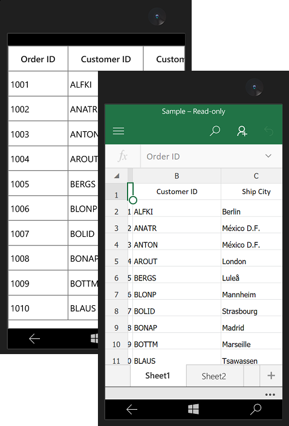
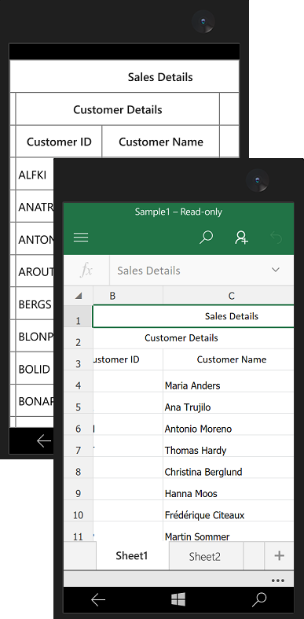
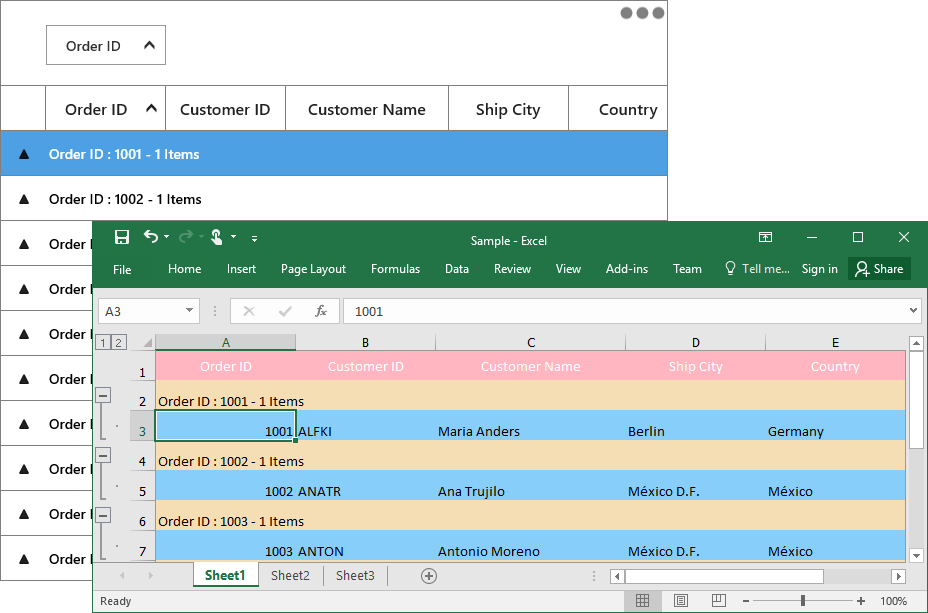
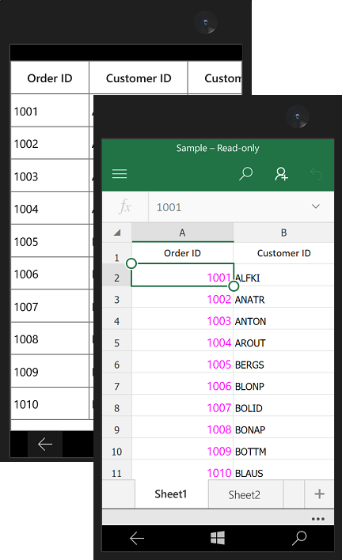

# Export To Excel in UWP DataGrid (SfDataGrid)

SfDataGrid provides support to export data to excel. It also provides support for grouping, filtering, sorting, paging, unbound rows, merged cells, stacked headers and Details View while exporting.

The following assemblies needs to be added for exporting to excel.

* Syncfusion.SfGridConverter.UWP
* Syncfusion.XlsIO.UWP

For NuGet package, install [Syncfusion.DataGridExcelExport.UWP](https://www.nuget.org/packages/Syncfusion.DataGridExcelExport.UWP) package. For more details refer this [UG link](https://help.syncfusion.com/uwp/control-dependencies#exporting-datagrid-to-excel-pdf-and-csv).

You can export SfDataGrid to excel by using the [ExportToExcel](https://help.syncfusion.com/cr/uwp/Syncfusion.UI.Xaml.Grid.Converter.GridExcelExportExtension.html) extension method present in the [Syncfusion.UI.Xaml.Grid.Converter](https://help.syncfusion.com/cr/uwp/Syncfusion.UI.Xaml.Grid.Converter.html) namespace.



using Syncfusion.UI.Xaml.Grid.Converter;
var options = new ExcelExportingOptions();
options.ExcelVersion = ExcelVersion.Excel2013;
var excelEngine = dataGrid.ExportToExcel(dataGrid.View, options);
var workBook = excelEngine.Excel.Workbooks[0];
StorageFile storageFile = await KnownFolders.PicturesLibrary.CreateFileAsync("Sample" + ".xlsx", CreationCollisionOption.ReplaceExisting);

if (storageFile != null)
    await workBook.SaveAsAsync(storageFile);




N> SfDataGrid exports data to excel by using XlsIO.

## Exporting options

Exporting operation can be customized by passing [ExcelExportingOptions](https://help.syncfusion.com/cr/uwp/Syncfusion.UI.Xaml.Grid.Converter.ExcelExportingOptions.html) instance as argument to `ExportToExcel` method.
 
### Export Mode

By default, actual value only will be exported to excel. If you want to export the display text, you need to set [ExportMode](https://help.syncfusion.com/cr/uwp/Syncfusion.UI.Xaml.Grid.Converter.ExcelExportingOptions.html#Syncfusion_UI_Xaml_Grid_Converter_ExcelExportingOptions_ExportMode) property as `Text`.
 


var options = new ExcelExportingOptions();
options.ExcelVersion = ExcelVersion.Excel2013;
options.ExportMode = ExportMode.Text;
var excelEngine = dataGrid.ExportToExcel(dataGrid.View, options);
var workBook = excelEngine.Excel.Workbooks[0];
StorageFile storageFile = await KnownFolders.PicturesLibrary.CreateFileAsync("Sample" + ".xlsx", CreationCollisionOption.ReplaceExisting);

if (storageFile != null)
    await workBook.SaveAsAsync(storageFile);



ExportMode as Text

ExportMode as Value

### Export groups with outlines

By default, all the groups in DataGrid will be exported in expanded state. You can enable outlines in excel based on groups by setting the [AllowOutlining](https://help.syncfusion.com/cr/uwp/Syncfusion.UI.Xaml.Grid.Converter.ExcelExportingOptions.html#Syncfusion_UI_Xaml_Grid_Converter_ExcelExportingOptions_AllowOutlining) property as `true` in [ExcelExportingOptions](https://help.syncfusion.com/cr/uwp/Syncfusion.UI.Xaml.Grid.Converter.ExcelExportingOptions.html). 



var options = new ExcelExportingOptions();
options.ExcelVersion = ExcelVersion.Excel2013;
options.ExportMode = ExportMode.Value;
options.AllowOutlining = true;
var excelEngine = dataGrid.ExportToExcel(dataGrid.View, options);
var workBook = excelEngine.Excel.Workbooks[0];
StorageFile storageFile = await KnownFolders.PicturesLibrary.CreateFileAsync("Sample" + ".xlsx", CreationCollisionOption.ReplaceExisting);

if (storageFile != null)
    await workBook.SaveAsAsync(storageFile);



### Exclude columns while exporting

By default, all the columns (including hidden columns) in SfDataGrid will be exported to Excel. If you want to exclude some columns while exporting to Excel, you can use [ExcludeColumns](https://help.syncfusion.com/cr/uwp/Syncfusion.UI.Xaml.Grid.Converter.ExcelExportingOptions.html#Syncfusion_UI_Xaml_Grid_Converter_ExcelExportingOptions_ExcludeColumns) field in `ExcelExportingOptions`.



var options = new ExcelExportingOptions();
options.ExcelVersion = ExcelVersion.Excel2013;
options.ExcludeColumns.Add("CustomerName");
options.ExcludeColumns.Add("Country");
var excelEngine = dataGrid.ExportToExcel(dataGrid.View, options);
var workBook = excelEngine.Excel.Workbooks[0];
StorageFile storageFile = await KnownFolders.PicturesLibrary.CreateFileAsync("Sample" + ".xlsx", CreationCollisionOption.ReplaceExisting);

if (storageFile != null)
    await workBook.SaveAsAsync(storageFile);



Here, the columns having CustomerName and Country as `MappingName` are excluded while exporting.

### Excel Version

While exporting to Excel, you can specify the excel version by using [ExcelVersion](https://help.syncfusion.com/cr/uwp/Syncfusion.UI.Xaml.Grid.Converter.ExcelExportingOptions.html#Syncfusion_UI_Xaml_Grid_Converter_ExcelExportingOptions__ctor_Syncfusion_XlsIO_ExcelVersion_System_Boolean_System_Boolean_Syncfusion_UI_Xaml_Grid_Converter_GridExcelExportingEventhandler_Syncfusion_UI_Xaml_Grid_Converter_GridCellExcelExportingEventHandler_) property.



var options = new ExcelExportingOptions();
options.ExcelVersion = ExcelVersion.Excel2013;           
var excelEngine = dataGrid.ExportToExcel(dataGrid.View, options);
var workBook = excelEngine.Excel.Workbooks[0];
StorageFile storageFile = await KnownFolders.PicturesLibrary.CreateFileAsync("Sample" + ".xlsx", CreationCollisionOption.ReplaceExisting);

if (storageFile != null)
    await workBook.SaveAsAsync(storageFile);



### Exporting stacked headers

You can export stacked headers to excel by setting [ExportStackedHeaders](https://help.syncfusion.com/cr/uwp/Syncfusion.UI.Xaml.Grid.Converter.ExcelExportingOptions.html#Syncfusion_UI_Xaml_Grid_Converter_ExcelExportingOptions_ExportStackedHeaders) property to `true`.



var options = new ExcelExportingOptions();
options.ExcelVersion = ExcelVersion.Excel2013;
options.ExportStackedHeaders = true;      
var excelEngine = dataGrid.ExportToExcel(dataGrid.View, options);
var workBook = excelEngine.Excel.Workbooks[0];
StorageFile storageFile = await KnownFolders.PicturesLibrary.CreateFileAsync("Sample" + ".xlsx", CreationCollisionOption.ReplaceExisting);

if (storageFile != null)
    await workBook.SaveAsAsync(storageFile);



### Exporting merged cells

You can export merged cells to excel by setting [ExportMergedCells](https://help.syncfusion.com/cr/uwp/Syncfusion.UI.Xaml.Grid.Converter.ExcelExportingOptions.html#Syncfusion_UI_Xaml_Grid_Converter_ExcelExportingOptions_ExportMergedCells) property as `true`.



var options = new ExcelExportingOptions();
options.ExcelVersion = ExcelVersion.Excel2013;
options.ExportMergedCells = true;
var excelEngine = dataGrid.ExportToExcel(dataGrid.View, options);
var workBook = excelEngine.Excel.Workbooks[0];
StorageFile storageFile = await KnownFolders.PicturesLibrary.CreateFileAsync("Sample" + ".xlsx", CreationCollisionOption.ReplaceExisting);

if (storageFile != null)
    await workBook.SaveAsAsync(storageFile);



### Exporting unbound rows

You can export unbound rows to excel by setting [ExportUnBoundRows](https://help.syncfusion.com/cr/uwp/Syncfusion.UI.Xaml.Grid.Converter.ExcelExportingOptions.html#Syncfusion_UI_Xaml_Grid_Converter_ExcelExportingOptions_ExportUnBoundRows) property as `true`.



var options = new ExcelExportingOptions();
options.ExcelVersion = ExcelVersion.Excel2013;
options.ExportUnBoundRows = true;
var excelEngine = dataGrid.ExportToExcel(dataGrid.View, options);
var workBook = excelEngine.Excel.Workbooks[0];
StorageFile storageFile = await KnownFolders.PicturesLibrary.CreateFileAsync("Sample" + ".xlsx", CreationCollisionOption.ReplaceExisting);

if (storageFile != null)
    await workBook.SaveAsAsync(storageFile);



### Changing start row and column index while exporting

You can export the data to specified row index and column index in worksheet, by setting [StartRowIndex](https://help.syncfusion.com/cr/uwp/Syncfusion.UI.Xaml.Grid.Converter.ExcelExportingOptions.html#Syncfusion_UI_Xaml_Grid_Converter_ExcelExportingOptions_StartRowIndex) and [StartColumnIndex](https://help.syncfusion.com/cr/uwp/Syncfusion.UI.Xaml.Grid.Converter.ExcelExportingOptions.html#Syncfusion_UI_Xaml_Grid_Converter_ExcelExportingOptions_StartColumnIndex) properties.
 


var options = new ExcelExportingOptions();
options.ExcelVersion = ExcelVersion.Excel2013;
options.StartColumnIndex = 3;
options.StartRowIndex = 3;
var excelEngine = dataGrid.ExportToExcel(dataGrid.View, options);
var workBook = excelEngine.Excel.Workbooks[0];
StorageFile storageFile = await KnownFolders.PicturesLibrary.CreateFileAsync("Sample" + ".xlsx", CreationCollisionOption.ReplaceExisting);

if (storageFile != null)
    await workBook.SaveAsAsync(storageFile);



## Saving options

### Save as stream

After exporting to excel, you can save exported workbook to stream by using [SaveAsAsync](https://help.syncfusion.com/cr/uwp/Syncfusion.XlsIO.IWorkbook.html#Syncfusion_XlsIO_IWorkbook_SaveAsAsync_System_IO_Stream_) method.
 


var options = new ExcelExportingOptions();
options.ExcelVersion = ExcelVersion.Excel2013;
var excelEngine = dataGrid.ExportToExcel(dataGrid.View, options);
IWorkbook workBook = excelEngine.Excel.Workbooks[0];
FileStream stream=null;
string directory = @"Pictures\output5.xlsx";
await Task.Run(() =>
{
    stream = new FileStream(directory, FileMode.Create);
});
await workBook.SaveAsAsync(stream);
workBook.Close();
excelEngine.Dispose();



### Save using FileSavePicker with MessageDialog

After exporting to excel, you can save exported workbook by opening [MessageDialog](https://docs.microsoft.com/en-us/uwp/api/windows.ui.popups.messagedialog). 



var options = new ExcelExportingOptions();
options.ExcelVersion = ExcelVersion.Excel2013;
var excelEngine = dataGrid.ExportToExcel(dataGrid.View, options);
IWorkbook workBook = excelEngine.Excel.Workbooks[0];
var savePicker = new FileSavePicker
{
    SuggestedStartLocation = PickerLocationId.Desktop,
    SuggestedFileName = "Sample"
};

if (workBook.Version == ExcelVersion.Excel97to2003)
    savePicker.FileTypeChoices.Add("Excel File (.xls)", new List<string>() { ".xls" });

else
    savePicker.FileTypeChoices.Add("Excel File (.xlsx)", new List<string>() { ".xlsx" });
var storageFile = await savePicker.PickSaveFileAsync();

if (storageFile != null)
    await workBook.SaveAsAsync(storageFile);
var messageDialog = new MessageDialog("Do you want to view the Document?", "File has been created successfully.");
var yesCmd = new UICommand("Yes");
var noCmd = new UICommand("No");
messageDialog.Commands.Add(yesCmd);
messageDialog.Commands.Add(noCmd);
var cmd = await messageDialog.ShowAsync();

if (cmd == yesCmd)
{

    // Launch the saved file
    bool success = await Windows.System.Launcher.LaunchFileAsync(storageFile);
}

workBook.Close();
excelEngine.Dispose();



## Opening the saved excel file

You can open the saved workbook using [FileOpenPicker](https://docs.microsoft.com/en-us/uwp/api/windows.storage.pickers.fileopenpicker).
 


var excelEngine = dataGrid.ExportCollectionToExcel(this.dataGrid.View);
IWorkbook workBook = excelEngine.Excel.Workbooks[0];            
StorageFile storageFile = await KnownFolders.PicturesLibrary.CreateFileAsync("Sample" + ".xlsx", CreationCollisionOption.ReplaceExisting);

if (storageFile != null)
    await workBook.SaveAsAsync(storageFile);
FileOpenPicker openPicker = new FileOpenPicker();
openPicker.FileTypeFilter.Add(".xlsx");
openPicker.SuggestedStartLocation = PickerLocationId.PicturesLibrary;
StorageFile file = await openPicker.PickSingleFileAsync();
await Windows.System.Launcher.LaunchFileAsync(storageFile);



## Export Paging

While exporting data to excel, if paging is used, current page only will be exported, by default. If you want to export all pages, you need to set [ExportAllPages](https://help.syncfusion.com/cr/uwp/Syncfusion.UI.Xaml.Grid.Converter.ExcelExportingOptions.html#Syncfusion_UI_Xaml_Grid_Converter_ExcelExportingOptions_ExportAllPages) property as `True`.



var options = new ExcelExportingOptions();
options.ExcelVersion = ExcelVersion.Excel2013;
options.ExportAllPages = true;
var excelEngine = dataGrid.ExportToExcel(dataGrid.View, options);
IWorkbook workBook = excelEngine.Excel.Workbooks[0];
StorageFile storageFile = await KnownFolders.PicturesLibrary.CreateFileAsync("Sample" + ".xlsx", CreationCollisionOption.ReplaceExisting);

if (storageFile != null)
    await workBook.SaveAsAsync(storageFile);



By default, all data will be exported to single sheet. If you want to export each page to different sheets, you need to use [ExportPageOptions](https://help.syncfusion.com/cr/uwp/Syncfusion.UI.Xaml.Grid.Converter.ExcelExportingOptions.html#Syncfusion_UI_Xaml_Grid_Converter_ExcelExportingOptions_ExportPageOptions) property.
 


var options = new ExcelExportingOptions();
options.ExcelVersion = ExcelVersion.Excel2013;
options.ExportAllPages = true;
options.ExportPageOptions = ExportPageOptions.ExportToDifferentSheets;
var excelEngine = dataGrid.ExportToExcel(dataGrid.View, options);
IWorkbook workBook = excelEngine.Excel.Workbooks[0];
StorageFile storageFile = await KnownFolders.PicturesLibrary.CreateFileAsync("Sample" + ".xlsx", CreationCollisionOption.ReplaceExisting);

if (storageFile != null)
    await workBook.SaveAsAsync(storageFile);



## Export SelectedItems to Excel

By default, entire grid will be exported to Excel. You can export selected items only by passing `SelectedItems` to [ExportToExcel](https://help.syncfusion.com/cr/uwp/Syncfusion.UI.Xaml.Grid.Converter.GridExcelExportExtension.html#Syncfusion_UI_Xaml_Grid_Converter_GridExcelExportExtension_ExportToExcel_Syncfusion_UI_Xaml_Grid_SfDataGrid_Syncfusion_Data_ICollectionViewAdv_Syncfusion_UI_Xaml_Grid_Converter_ExcelExportingOptions_) method.
 
 


var options = new ExcelExportingOptions();
ExcelEngine excelEngine = new ExcelEngine();
IWorkbook workBook = excelEngine.Excel.Workbooks.Create();
workBook.Worksheets.Create();
dataGrid.ExportToExcel(dataGrid.SelectedItems, options, workBook.Worksheets[0]);
StorageFile storageFile = await KnownFolders.PicturesLibrary.CreateFileAsync("Sample" + ".xlsx", CreationCollisionOption.ReplaceExisting);

if (storageFile != null)
    await workBook.SaveAsAsync(storageFile);



## Export to XML

You can save exported workbook as `Xml` file also by using [SaveAsXmlAsync](https://help.syncfusion.com/cr/uwp/Syncfusion.XlsIO.IWorkbook.html#Syncfusion_XlsIO_IWorkbook_SaveAsXmlAsync_System_IO_Stream_Syncfusion_XlsIO_ExcelXmlSaveType_) method.



var options = new ExcelExportingOptions();
options.ExcelVersion = ExcelVersion.Excel2013;
var excelEngine = dataGrid.ExportToExcel(dataGrid.View, options);
IWorkbook workBook = excelEngine.Excel.Workbooks[0];
           
if (storageFile != null)
    await workBook.SaveAsXmlAsync(storageFile,ExcelXmlSaveType.MSExcel);



## Export to CSV

You can save exported workbook as CSV by using [SaveAsAsync](https://help.syncfusion.com/cr/uwp/Syncfusion.XlsIO.IWorkbook.html#Syncfusion_XlsIO_IWorkbook_SaveAsAsync_System_IO_Stream_) method.



ExcelEngine excelEngine = null; 
ExcelExportingOptions options = new ExcelExportingOptions();
options.ExcelVersion = ExcelVersion.Excel2013;  
excelEngine = this.dataGrid.ExportToExcel(this.dataGrid.View, options);
var workBook = excelEngine.Excel.Workbooks[0];
var savePicker = new FileSavePicker
{
    SuggestedStartLocation = PickerLocationId.Desktop,
    SuggestedFileName = "Sample"
};
savePicker.FileTypeChoices.Add("Excel File (.csv)", new List<string>() { ".csv" }); 
var storageFile = await savePicker.PickSaveFileAsync();
await workBook.SaveAsAsync(storageFile, ",");
await Windows.System.Launcher.LaunchFileAsync(storageFile); 
excelEngine.Dispose();




## Row Height and Column Width customization 

After exporting data to excel, you can set different row height and column width for the columns based on your requirement.
 


var options = new ExcelExportingOptions();
options.ExcelVersion = ExcelVersion.Excel2013;
var excelEngine = dataGrid.ExportToExcel(dataGrid.View, options);
IWorkbook workBook = excelEngine.Excel.Workbooks[0];
workBook.Worksheets[0].SetRowHeight(2, 50);
workBook.Worksheets[0].SetColumnWidth(2, 50);
StorageFile storageFile = await KnownFolders.PicturesLibrary.CreateFileAsync("Sample" + ".xlsx", CreationCollisionOption.ReplaceExisting);

if (storageFile != null)
    await workBook.SaveAsAsync(storageFile);



## Styling cells based on CellType in Excel

You can customize the cell styles based on `CellType` by using [ExportingEventHandler](https://help.syncfusion.com/cr/uwp/Syncfusion.UI.Xaml.Grid.Converter.ExcelExportingOptions.html#Syncfusion_UI_Xaml_Grid_Converter_ExcelExportingOptions_ExportingEventHandler).



var options = new ExcelExportingOptions();
options.ExportingEventHandler = ExportingHandler;
options.AllowOutlining = true;
var excelEngine = dataGrid.ExportToExcel(dataGrid.View, options);
var workBook = excelEngine.Excel.Workbooks[0];
StorageFile storageFile = await KnownFolders.PicturesLibrary.CreateFileAsync("Sample" + ".xlsx", CreationCollisionOption.ReplaceExisting);

if (storageFile != null)
    await workBook.SaveAsAsync(storageFile);

private static void ExportingHandler(object sender, GridExcelExportingEventArgs e)
{

    if (e.CellType == ExportCellType.HeaderCell)
    {
        e.CellStyle.BackGroundBrush = new SolidColorBrush(Colors.LightPink);
        e.CellStyle.ForeGroundBrush = new SolidColorBrush(Colors.White);
        e.Handled = true;
    }

    else if (e.CellType == ExportCellType.RecordCell)
    {
        e.CellStyle.BackGroundBrush = new SolidColorBrush(Colors.LightSkyBlue);
        e.Handled = true;
    }

    else if (e.CellType == ExportCellType.GroupCaptionCell)
    {
        e.CellStyle.BackGroundBrush = new SolidColorBrush(Colors.Wheat);
        e.Handled = true;
    }
}



## Cell customization in Excel while exporting

You can customize the cells by setting [CellsExportingEventHandler](https://help.syncfusion.com/cr/uwp/Syncfusion.UI.Xaml.Grid.Converter.ExcelExportingOptions.html#Syncfusion_UI_Xaml_Grid_Converter_ExcelExportingOptions_CellsExportingEventHandler) in `ExcelExportingOptions`.

### Customize cell value while exporting

You can customize the call values while exporting to excel by using [CellsExportingEventHandler](https://help.syncfusion.com/cr/uwp/Syncfusion.UI.Xaml.Grid.Converter.ExcelExportingOptions.html#Syncfusion_UI_Xaml_Grid_Converter_ExcelExportingOptions_CellsExportingEventHandler) and `ExcelExportingOptions`.




var options = new ExcelExportingOptions();
options.ExcelVersion = ExcelVersion.Excel2013;
options.ExportingEventHandler = ExportingHandler;
var excelEngine = dataGrid.ExportToExcel(dataGrid.View, options);
IWorkbook workBook = excelEngine.Excel.Workbooks[0];
StorageFile storageFile = await KnownFolders.PicturesLibrary.CreateFileAsync("Sample" + ".xlsx", CreationCollisionOption.ReplaceExisting);

if (storageFile != null)
    await workBook.SaveAsAsync(storageFile);



Here, cell values are changed for IsDelivered column based on custom condition.

### Changing row style in excel based on data

You can customize the rows based on the record values by using [CellsExportingEventHandler](https://help.syncfusion.com/cr/uwp/Syncfusion.UI.Xaml.Grid.Converter.ExcelExportingOptions.html#Syncfusion_UI_Xaml_Grid_Converter_ExcelExportingOptions_CellsExportingEventHandler).



var options = new ExcelExportingOptions();
options.CellsExportingEventHandler = CellExportingHandler;
var excelEngine = dataGrid.ExportToExcel(dataGrid.View, options);
var workBook = excelEngine.Excel.Workbooks[0];
StorageFile storageFile = await KnownFolders.PicturesLibrary.CreateFileAsync("Sample" + ".xlsx", CreationCollisionOption.ReplaceExisting);

if (storageFile != null)
    await workBook.SaveAsAsync(storageFile);

private static void CellExportingHandler(object sender, GridCellExcelExportingEventArgs e)
{           

     if (!(e.NodeEntry is RecordEntry))
        return;
     var record = e.NodeEntry as RecordEntry;

     if ((record.Data as OrderInfo).Country == "Mexico")
     {
         e.Range.CellStyle.ColorIndex = ExcelKnownColors.Green;
         e.Range.CellStyle.Font.Color = ExcelKnownColors.White;
     }
}



Here, records having the Country name as `Mexico` are customized.

### Customize the cells based on Column Name

You can customize the cells based on [GridCellExcelExportingEventArgs.ColumnName](https://help.syncfusion.com/cr/uwp/Syncfusion.UI.Xaml.Grid.Converter.GridCellExcelExportingEventArgs.html#Syncfusion_UI_Xaml_Grid_Converter_GridCellExcelExportingEventArgs_ColumnName) property in the [CellsExportingEventHandler](https://help.syncfusion.com/cr/uwp/Syncfusion.UI.Xaml.Grid.Converter.ExcelExportingOptions.html#Syncfusion_UI_Xaml_Grid_Converter_ExcelExportingOptions_CellsExportingEventHandler).



var options = new ExcelExportingOptions();
options.CellsExportingEventHandler = CellExportingHandler;
var excelEngine = dataGrid.ExportToExcel(dataGrid.View, options);
var workBook = excelEngine.Excel.Workbooks[0];
StorageFile storageFile = await KnownFolders.PicturesLibrary.CreateFileAsync("Sample" + ".xlsx", CreationCollisionOption.ReplaceExisting);

if (storageFile != null)
    await workBook.SaveAsAsync(storageFile);

private static void CellExportingHandler(object sender, GridCellExcelExportingEventArgs e)
{

    if (e.ColumnName != "OrderID")
        return;

    e.Range.CellStyle.Font.Size = 12;
    e.Range.CellStyle.Font.Color = ExcelKnownColors.Pink;
    e.Range.CellStyle.Font.FontName = "Segoe UI";
}



Here, OrderID column cells are customized while exporting.

## Customize exported workbook and worksheet

SfDataGrid exports to excel by using [XlsIO](https://help.syncfusion.com/file-formats/xlsio/overview).
 
### Workbook

SfDataGrid provides option to return [ExcelEngine](https://help.syncfusion.com/cr/uwp/Syncfusion.XlsIO.ExcelEngine.html) from that you can get exported workbook. This allows you to protect, encrypt and add worksheet before saving.
 


var options = new ExcelExportingOptions();
options.ExcelVersion = ExcelVersion.Excel2013;
options.CellsExportingEventHandler = ExportingHandler;
var excelEngine = dataGrid.ExportToExcel(dataGrid.View, options);
var workBook = excelEngine.Excel.Workbooks[0];
StorageFile storageFile = await KnownFolders.PicturesLibrary.CreateFileAsync("Sample" + ".xlsx", CreationCollisionOption.ReplaceExisting);

if (storageFile != null)
    await workBook.SaveAsAsync(storageFile);



### Worksheet customization

SfDataGrid provides support to export to already existing file or worksheet.
 
In the below code snippet, worksheet is created and passed to `ExportToExcel` method. In the same way, you can open already existing excel also using `XlsIO`.
 


var options = new ExcelExportingOptions();
ExcelEngine excelEngine = new ExcelEngine();
IWorkbook workBook = excelEngine.Excel.Workbooks.Create();
dataGrid.ExportToExcel(dataGrid.View, options, workBook.Worksheets[0]);
workBook.Version = ExcelVersion.Excel2013;




Before saving workbook, you need to set the specific excel version by using [IWorkbook.Version](https://help.syncfusion.com/cr/uwp/Syncfusion.XlsIO.IWorkbook.html#Syncfusion_XlsIO_IWorkbook_Version) property. Here, you can directly manipulate the data in the worksheet.
 
#### Setting borders

You can set borders to excel cells by directly accessing worksheet after exporting data.



var options = new ExcelExportingOptions();
options.ExcelVersion = ExcelVersion.Excel2013;
var excelEngine = dataGrid.ExportToExcel(dataGrid.View, options);
var workBook = excelEngine.Excel.Workbooks[0];
workBook.Worksheets[0].UsedRange.BorderInside(ExcelLineStyle.Dash_dot, ExcelKnownColors.Black);
workBook.Worksheets[0].UsedRange.BorderAround(ExcelLineStyle.Dash_dot, ExcelKnownColors.Black);
StorageFile storageFile = await KnownFolders.PicturesLibrary.CreateFileAsync("Sample" + ".xlsx", CreationCollisionOption.ReplaceExisting);

if (storageFile != null)
    await workBook.SaveAsAsync(storageFile);



#### Enabling Filters

You can show filters in exported worksheet by enabling filter for the exported range in the worksheet.



var options = new ExcelExportingOptions();
options.ExcelVersion = ExcelVersion.Excel2013;
var excelEngine = dataGrid.ExportToExcel(dataGrid.View, options);
var workBook = excelEngine.Excel.Workbooks[0];
workBook.Worksheets[0].AutoFilters.FilterRange = workBook.Worksheets[0].UsedRange;
StorageFile storageFile = await KnownFolders.PicturesLibrary.CreateFileAsync("Sample" + ".xlsx", CreationCollisionOption.ReplaceExisting);

if (storageFile != null)
    await workBook.SaveAsAsync(storageFile);



While using stacked headers, you can specify the range based on Stacked headers count.



var options = new ExcelExportingOptions();
options.ExcelVersion = ExcelVersion.Excel2013;
options.ExportStackedHeaders = true;
var excelEngine = dataGrid.ExportToExcel(dataGrid.View, options);
var workBook = excelEngine.Excel.Workbooks[0];
var range = "A" + (dataGrid.StackedHeaderRows.Count + 1).ToString() + ":" + workBook.Worksheets[0].UsedRange.End.AddressLocal;
excelEngine.Excel.Workbooks[0].Worksheets[0].AutoFilters.FilterRange = workBook.Worksheets[0].Range[range];
StorageFile storageFile = await KnownFolders.PicturesLibrary.CreateFileAsync("Sample" + ".xlsx", CreationCollisionOption.ReplaceExisting);

if (storageFile != null)
    await workBook.SaveAsAsync(storageFile);



#### Customize the range of cells

You can customize the range of cells after exporting to excel by directly manipulating worksheet.



var options = new ExcelExportingOptions();
options.ExcelVersion = ExcelVersion.Excel2013;
var excelEngine = dataGrid.ExportToExcel(dataGrid.View, options);
var workBook = excelEngine.Excel.Workbooks[0];
workBook.Worksheets[0].Range["A2:A6"].CellStyle.Color = System.Drawing.Color.LightSlateGray;
workBook.Worksheets[0].Range["A2:A6"].CellStyle.Font.Color = ExcelKnownColors.White;
StorageFile storageFile = await KnownFolders.PicturesLibrary.CreateFileAsync("Sample" + ".xlsx", CreationCollisionOption.ReplaceExisting);

if (storageFile != null)
    await workBook.SaveAsAsync(storageFile);



## Exporting DetailsView

By default, `DetailsViewDataGrid` will be exported to Excel. You can customize its exporting operation by using [ChildExportingEventHandler](https://help.syncfusion.com/cr/uwp/Syncfusion.UI.Xaml.Grid.Converter.ExcelExportingOptions.html#Syncfusion_UI_Xaml_Grid_Converter_ExcelExportingOptions_ChildExportingEventHandler).

### Excluding DetailsViewDataGrid while exporting

You can exclude particular `DetailsViewDataGrid` while exporting, by using the [ChildExportingEventHandler](https://help.syncfusion.com/cr/uwp/Syncfusion.UI.Xaml.Grid.Converter.ExcelExportingOptions.html#Syncfusion_UI_Xaml_Grid_Converter_ExcelExportingOptions_ChildExportingEventHandler) and [GridChildExportingEventArgs.Cancel](https://docs.microsoft.com/en-us/dotnet/api/system.componentmodel.canceleventargs.cancel).



var options = new ExcelExportingOptions();

options.ChildExportingEventHandler = ChildExportingHandler;

var excelEngine = dataGrid.ExportToExcel(dataGrid.View, options);

var workBook = excelEngine.Excel.Workbooks[0];

StorageFile storageFile = await KnownFolders.PicturesLibrary.CreateFileAsync("Sample" + ".xlsx", CreationCollisionOption.ReplaceExisting);

if (storageFile != null)
    await workBook.SaveAsAsync(storageFile);

private static void ChildExportingHandler(object sender, GridChildExportingEventArgs e)
{
    var recordEntry = e.NodeEntry as RecordEntry;
       
    if ((recordEntry.Data as OrderInfo).OrderID == 1002)
        e.Cancel = true;
}




Here, `DetailsViewDataGrid` is not exported for the parent record having OrderID as 1002.

### Excluding DetailsViewDataGrid columns from exporting

You can exclude `DetailsViewDataGrid` columns while exporting, by using [ChildExportingEventHandler](https://help.syncfusion.com/cr/uwp/Syncfusion.UI.Xaml.Grid.Converter.ExcelExportingOptions.html#Syncfusion_UI_Xaml_Grid_Converter_ExcelExportingOptions_ChildExportingEventHandler) and [GridChildExportingEventArgs.ExcludeColumns](https://help.syncfusion.com/cr/uwp/Syncfusion.UI.Xaml.Grid.Converter.GridChildExportingEventArgs.html#Syncfusion_UI_Xaml_Grid_Converter_GridChildExportingEventArgs_ExcludeColumns).



var options = new ExcelExportingOptions();
options.ExcelVersion = ExcelVersion.Excel2013;
options.ChildExportingEventHandler = ChildExportingHandler;
var excelEngine = dataGrid.ExportToExcel(dataGrid.View, options);
var workBook = excelEngine.Excel.Workbooks[0];
StorageFile storageFile = await KnownFolders.PicturesLibrary.CreateFileAsync("Sample" + ".xlsx", CreationCollisionOption.ReplaceExisting);

if (storageFile != null)
    await workBook.SaveAsAsync(storageFile);
    
private static void ChildExportingHandler(object sender, GridChildExportingEventArgs e)
{            
      e.ExcludeColumns.Add("OrderID");
}




Here, OrderID column is displayed in `DetailsViewDataGrid` and it is excluded while exporting to excel.

### Customizing DetailsViewDataGrid cells

Like parent DataGrid, you can customize the `DetailsViewDataGrid` cells also by using [CellsExportingEventHandler](https://help.syncfusion.com/cr/uwp/Syncfusion.UI.Xaml.Grid.Converter.ExcelExportingOptions.html#Syncfusion_UI_Xaml_Grid_Converter_ExcelExportingOptions_CellsExportingEventHandler). Based on [GridCellExcelExportingEventArgs.GridViewDefinition](https://help.syncfusion.com/cr/uwp/Syncfusion.UI.Xaml.Grid.Converter.GridCellExcelExportingEventArgs.html#Syncfusion_UI_Xaml_Grid_Converter_GridCellExcelExportingEventArgs_GridViewDefinition) property, you can identify the particular `DetailsViewDataGrid` and customize it.



var options = new ExcelExportingOptions();
options.ExcelVersion = ExcelVersion.Excel2013;
var options = new ExcelExportingOptions();
options.ExcelVersion = ExcelVersion.Excel2013;
options.CellsExportingEventHandler = ChildExportingHandler;
var excelEngine = dataGrid.ExportToExcel(dataGrid.View, options);
var workBook = excelEngine.Excel.Workbooks[0];
StorageFile storageFile = await KnownFolders.PicturesLibrary.CreateFileAsync("Sample" + ".xlsx", CreationCollisionOption.ReplaceExisting);

if (storageFile != null)
    await workBook.SaveAsAsync(storageFile);

private static void ChildExportingHandler(object sender, GridCellExcelExportingEventArgs e)
{

    if (e.GridViewDefinition == null || e.GridViewDefinition.RelationalColumn !="ProductDetails")
        return;

    if (e.ColumnName == "OrderID")
    {
        e.Range.CellStyle.Font.Size = 12;
        e.Range.CellStyle.Font.Color = ExcelKnownColors.Blue;
        e.Range.CellStyle.Font.FontName = "Segoe UI";
    }
}



## Performance

Using [ExcelExportingOptions.CellsExportingEventHandler](https://help.syncfusion.com/cr/uwp/Syncfusion.UI.Xaml.Grid.Converter.ExcelExportingOptions.html#Syncfusion_UI_Xaml_Grid_Converter_ExcelExportingOptions_CellsExportingEventHandler) and changing settings for each cell will consume more memory and time consumption. So, avoid using [CellsExportingEventHandler](https://help.syncfusion.com/cr/uwp/Syncfusion.UI.Xaml.Grid.Converter.ExcelExportingOptions.html#Syncfusion_UI_Xaml_Grid_Converter_ExcelExportingOptions_CellsExportingEventHandler) and instead of you can do the required settings in the exported sheet.
 
### Formatting column without using CellsExportingEventHandler

You can perform cell level customization such as row-level styling, formatting particular column in the exported worksheet.
 
In the below code snippet, NumberFormat for `Unit Price` column is changed in the exported sheet after exporting without using CellsExportingEventHandler.
 


var options = new ExcelExportingOptions();                   
options.ExportMode = ExportMode.Value;                 
options.ExcelVersion = ExcelVersion.Excel2013;           
var excelEngine = dataGrid.ExportToExcel(dataGrid.View, options);
IWorkbook workBook = excelEngine.Excel.Workbooks[0];
workBook.ActiveSheet.Columns[4].NumberFormat = "0.0";



### Alternate row styling without using CellsExportingEventHandler

In the below code snippet, the background color of rows in excel is changed based on row index using conditional formatting for better performance.



var options = new ExcelExportingOptions();                   
options.ExportMode = ExportMode.Value;                 
options.ExcelVersion = ExcelVersion.Excel2013;           
var excelEngine = dataGrid.ExportToExcel(dataGrid.View, options);
IWorkbook workBook = excelEngine.Excel.Workbooks[0];
IConditionalFormats condition = workBook.ActiveSheet.Range[2,1,this.dataGrid.View.Records.Count+1,this.dataGrid.Columns.Count].ConditionalFormats;
IConditionalFormat condition1 = condition.AddCondition();
condition1.FormatType = ExcelCFType.Formula;
condition1.FirstFormula = "MOD(ROW(),2)=0";
condition1.BackColorRGB = System.Drawing.Color.Pink;
IConditionalFormat condition2 = condition.AddCondition();
condition2.FormatType = ExcelCFType.Formula;
condition2.FirstFormula = "MOD(ROW(),2)=1";
condition2.BackColorRGB = System.Drawing.Color.LightGray;



