# Export To PDF in UWP DataGrid (SfDataGrid)

SfDataGrid provides support to export data to PDF file. It also provides support for grouping, filtering, sorting, paging, unbound rows, merged cells, stacked headers and details View while exporting.

The following assemblies needs to be added for exporting to PDF file.
 
* Syncfusion.SfGridConverter.UWP

* Syncfusion.Pdf.UWP

For NuGet package, install [Syncfusion.DataGridExcelExport.UWP](https://www.nuget.org/packages/Syncfusion.DataGridExcelExport.UWP) package. For more details refer this [UG link](https://help.syncfusion.com/uwp/control-dependencies#exporting-datagrid-to-excel-pdf-and-csv).

You can export SfDataGrid to PDF by using the following extension methods present in the [Syncfusion.UI.Xaml.Grid.Converter](https://help.syncfusion.com/cr/uwp/Syncfusion.UI.Xaml.Grid.Converter.html) namespace.

* ExportToPdf

* ExportToPdfGrid



using Syncfusion.UI.Xaml.Grid.Converter;
var document = dataGrid.ExportToPdf();
StorageFile storageFile = await KnownFolders.PicturesLibrary.CreateFileAsync("Sample" + ".pdf", CreationCollisionOption.ReplaceExisting);

if (storageFile != null)
    await document.SaveAsync(storageFile);



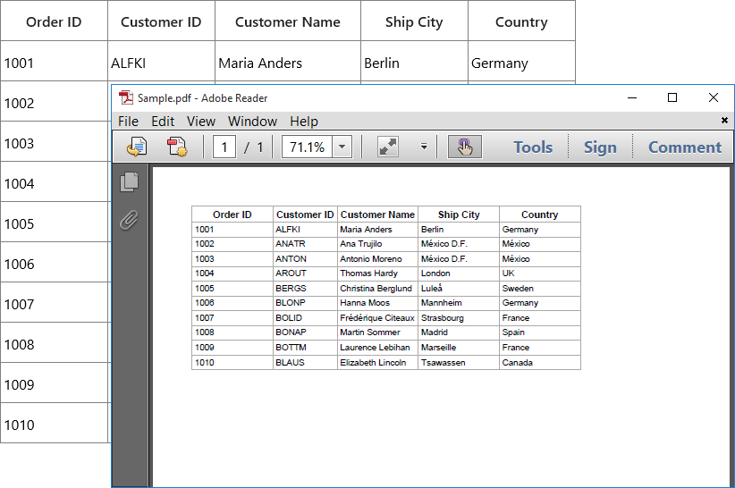

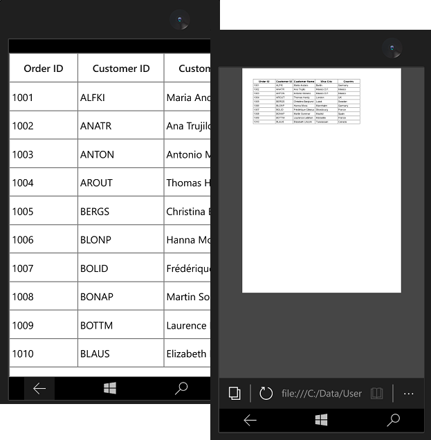

## Exporting Options

Exporting operation can be customized by passing [PdfExportingOptions](https://help.syncfusion.com/cr/uwp/Syncfusion.UI.Xaml.Grid.Converter.PdfExportingOptions.html) instance as argument to [ExportToPdf](https://help.syncfusion.com/cr/uwp/Syncfusion.UI.Xaml.Grid.Converter.GridPdfExportExtension.html#Syncfusion_UI_Xaml_Grid_Converter_GridPdfExportExtension_ExportToPdf_Syncfusion_UI_Xaml_Grid_SfDataGrid_) and [ExportToPdfGrid](https://help.syncfusion.com/cr/uwp/Syncfusion.UI.Xaml.Grid.Converter.GridPdfExportExtension.html#Syncfusion_UI_Xaml_Grid_Converter_GridPdfExportExtension_ExportToPdfGrid_Syncfusion_UI_Xaml_Grid_SfDataGrid_Syncfusion_Data_ICollectionViewAdv_Syncfusion_UI_Xaml_Grid_Converter_PdfExportingOptions_) method.
 
### Exporting with Auto column width

You can export SfDataGrid to PDF by fitting column widths based on its content by setting [AutoColumnWidth](https://help.syncfusion.com/cr/uwp/Syncfusion.UI.Xaml.Grid.Converter.PdfExportingOptions.html#Syncfusion_UI_Xaml_Grid_Converter_PdfExportingOptions_AutoColumnWidth) property as `true`.
 


PdfExportingOptions options = new PdfExportingOptions();
options.AutoColumnWidth = true;
var document = this.dataGrid.ExportToPdf(options);
StorageFile storageFile = await KnownFolders.PicturesLibrary.CreateFileAsync("Sample" + ".pdf", CreationCollisionOption.ReplaceExisting);

if (storageFile != null)
    await document.SaveAsync(storageFile);



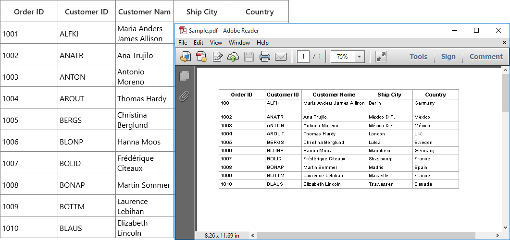

### Exporting with Auto Row height

You can export SfDataGrid to PDF by fitting row heights based on its content by setting [AutoRowHeight](https://help.syncfusion.com/cr/uwp/Syncfusion.UI.Xaml.Grid.Converter.PdfExportingOptions.html#Syncfusion_UI_Xaml_Grid_Converter_PdfExportingOptions_AutoRowHeight) property as `true`.
 


PdfExportingOptions options = new PdfExportingOptions();
options.AutoRowHeight = true;
var document = this.dataGrid.ExportToPdf(options);
StorageFile storageFile = await KnownFolders.PicturesLibrary.CreateFileAsync("Sample" + ".pdf", CreationCollisionOption.ReplaceExisting);

if (storageFile != null)
    await document.SaveAsync(storageFile);



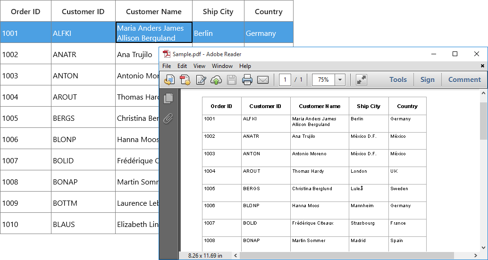

### Exclude columns while exporting

By default, all the columns (including hidden columns) in SfDataGrid will be exported to PDF. If you want to exclude some columns while exporting to PDF, you can use [ExcludeColumns](https://help.syncfusion.com/cr/uwp/Syncfusion.UI.Xaml.Grid.Converter.PdfExportingOptions.html#Syncfusion_UI_Xaml_Grid_Converter_PdfExportingOptions_ExcludeColumns) property in `PdfExportingOptions`.



PdfExportingOptions options = new PdfExportingOptions();
options.ExcludeColumns.Add("CustomerName");
options.ExcludeColumns.Add("Country");
var document = dataGrid.ExportToPdf(options);
StorageFile storageFile = await KnownFolders.PicturesLibrary.CreateFileAsync("Sample" + ".pdf", CreationCollisionOption.ReplaceExisting);

if (storageFile != null)
    await document.SaveAsync(storageFile);



Here, the columns having `CustomerName` and `Country` as MappingName are excluded while exporting.

### Export Format

By default, display text only will be exported to PDF. If you want to export the actual value, you need to set [ExportFormat](https://help.syncfusion.com/cr/uwp/Syncfusion.UI.Xaml.Grid.Converter.PdfExportingOptions.html#Syncfusion_UI_Xaml_Grid_Converter_PdfExportingOptions_ExportFormat) property as `false`.
 


PdfExportingOptions options = new PdfExportingOptions();
options.ExportFormat = false;
var document = this.dataGrid.ExportToPdf(options);
StorageFile storageFile = await KnownFolders.PicturesLibrary.CreateFileAsync("Sample" + ".pdf", CreationCollisionOption.ReplaceExisting);

if (storageFile != null)
    await document.SaveAsync(storageFile);



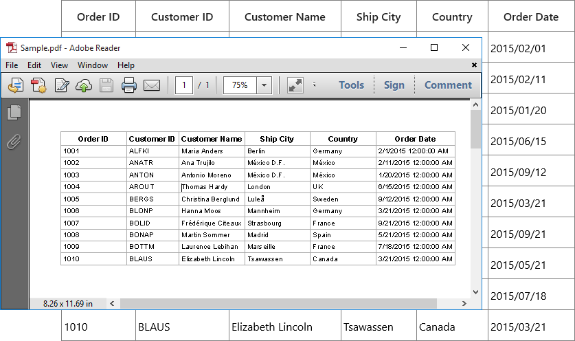

### Column header on each page

Column headers can be exported on each page by setting [RepeatHeaders](https://help.syncfusion.com/cr/uwp/Syncfusion.UI.Xaml.Grid.Converter.PdfExportingOptions.html#Syncfusion_UI_Xaml_Grid_Converter_PdfExportingOptions_RepeatHeaders) property.



PdfExportingOptions options = new PdfExportingOptions();
options.RepeatHeaders = true;
var document = dataGrid.ExportToPdf(options);            
StorageFile storageFile = await KnownFolders.PicturesLibrary.CreateFileAsync("Sample" + ".pdf", CreationCollisionOption.ReplaceExisting);

if (storageFile != null)
    await document.SaveAsync(storageFile);



### Export all column in one page

While exporting to PDF, you can fit all columns on one page by setting [FitAllColumnsInOnePage](https://help.syncfusion.com/cr/uwp/Syncfusion.UI.Xaml.Grid.Converter.PdfExportingOptions.html#Syncfusion_UI_Xaml_Grid_Converter_PdfExportingOptions_FitAllColumnsInOnePage) property as `true`.



PdfExportingOptions options = new PdfExportingOptions();
options.FitAllColumnsInOnePage = true;
var document = this.dataGrid.ExportToPdf(options);
StorageFile storageFile = await KnownFolders.PicturesLibrary.CreateFileAsync("Sample" + ".pdf", CreationCollisionOption.ReplaceExisting);

if (storageFile != null)
    await document.SaveAsync(storageFile);



### Export paging

While exporting data to PDF, if paging is used, current page only will be exported, by default. If you want to export all pages, you need to set [ExportAllPages](https://help.syncfusion.com/cr/uwp/Syncfusion.UI.Xaml.Grid.Converter.PdfExportingOptions.html#Syncfusion_UI_Xaml_Grid_Converter_PdfExportingOptions_ExportAllPages) property as `true`.



PdfExportingOptions options = new PdfExportingOptions();
options.ExportAllPages = true;      
var document = dataGrid.ExportToPdf(options);
StorageFile storageFile = await KnownFolders.PicturesLibrary.CreateFileAsync("Sample" + ".pdf", CreationCollisionOption.ReplaceExisting);

if (storageFile != null)
    await document.SaveAsync(storageFile);



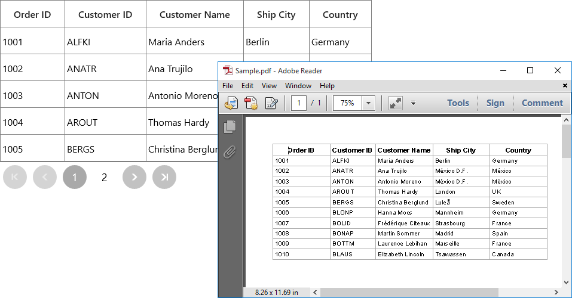

### Exclude groups while exporting

By default, all the groups in SfDataGrid will be exported to PDF. If you want to export without Groups, you need to set [ExportGroups](https://help.syncfusion.com/cr/uwp/Syncfusion.UI.Xaml.Grid.Converter.PdfExportingOptions.html#Syncfusion_UI_Xaml_Grid_Converter_PdfExportingOptions_ExportGroups) property as `false`.



PdfExportingOptions options = new PdfExportingOptions();
options.ExportGroups = false;
var document = dataGrid.ExportToPdf(options);     
StorageFile storageFile = await KnownFolders.PicturesLibrary.CreateFileAsync("Sample" + ".pdf", CreationCollisionOption.ReplaceExisting);

if (storageFile != null)
    await document.SaveAsync(storageFile);



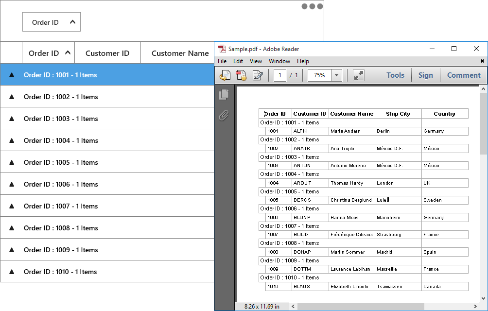

### Exclude group Summaries while exporting

By default, group summaries in SfDataGrid will be exported to PDF. If you want to export without group summaries, you need to set [ExportGroupSummary](https://help.syncfusion.com/cr/uwp/Syncfusion.UI.Xaml.Grid.Converter.PdfExportingOptions.html#Syncfusion_UI_Xaml_Grid_Converter_PdfExportingOptions_ExportGroupSummary) property as `false`.



PdfExportingOptions options = new PdfExportingOptions();
options.ExportGroupSummary = true;
var document = this.dataGrid.ExportToPdf(options);
StorageFile storageFile = await KnownFolders.PicturesLibrary.CreateFileAsync("Sample" + ".pdf", CreationCollisionOption.ReplaceExisting);

if (storageFile != null)
    await document.SaveAsync(storageFile);



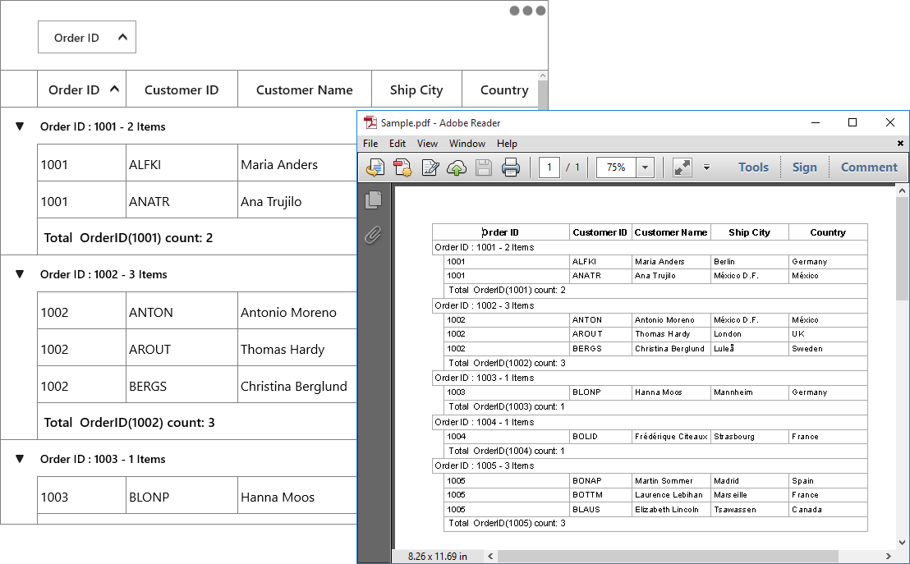

### Exclude table Summaries while exporting

By default, table summaries in SfDataGrid will be exported to PDF. If you want to export without table summaries, you need to set [ExportTableSummary](https://help.syncfusion.com/cr/uwp/Syncfusion.UI.Xaml.Grid.Converter.PdfExportingOptions.html#Syncfusion_UI_Xaml_Grid_Converter_PdfExportingOptions_ExportTableSummary) property as `false`.



PdfExportingOptions options = new PdfExportingOptions();
options.ExportTableSummary = true;
var document = this.dataGrid.ExportToPdf(options);
StorageFile storageFile = await KnownFolders.PicturesLibrary.CreateFileAsync("Sample" + ".pdf", CreationCollisionOption.ReplaceExisting);

if (storageFile != null)
    await document.SaveAsync(storageFile);



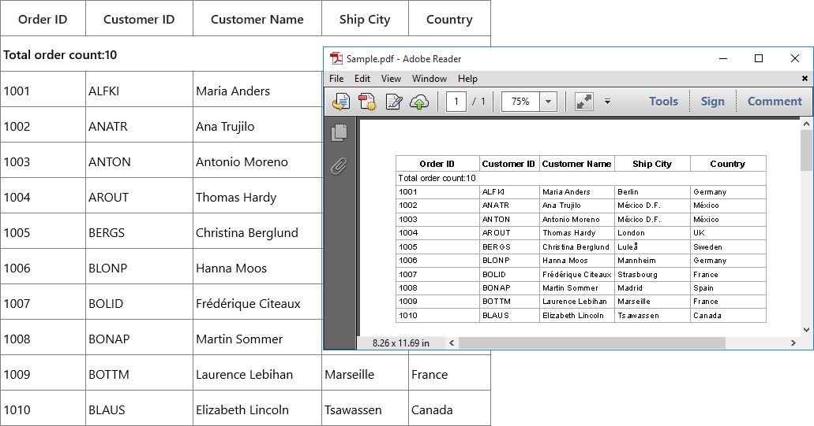

### Exporting unbound rows

You can export unbound rows to PDF by setting [ExportUnBoundRows](https://help.syncfusion.com/cr/uwp/Syncfusion.UI.Xaml.Grid.Converter.PdfExportingOptions.html#Syncfusion_UI_Xaml_Grid_Converter_PdfExportingOptions_ExportUnBoundRows) property as `true`.



PdfExportingOptions options = new PdfExportingOptions();
options.ExportUnBoundRows = true;
var document = this.dataGrid.ExportToPdf(options);
StorageFile storageFile = await KnownFolders.PicturesLibrary.CreateFileAsync("Sample" + ".pdf", CreationCollisionOption.ReplaceExisting);

if (storageFile != null)
    await document.SaveAsync(storageFile);



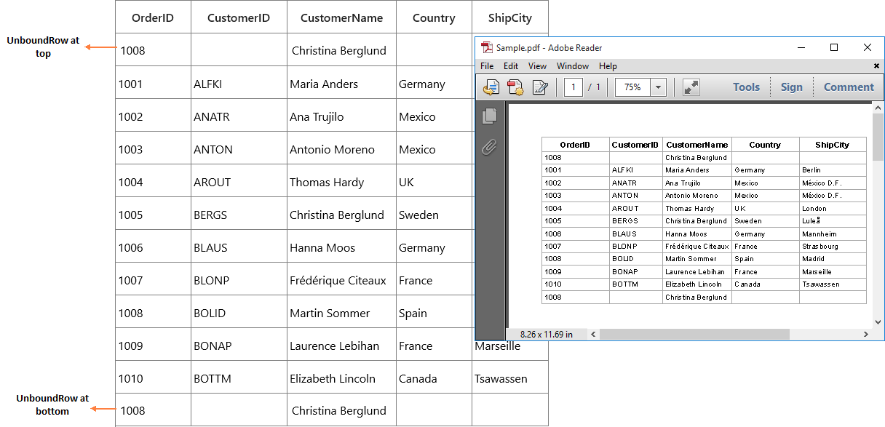

### Exporting stacked headers

You can export stacked headers to PDF by setting [ExportStackedHeaders](https://help.syncfusion.com/cr/uwp/Syncfusion.UI.Xaml.Grid.Converter.PdfExportingOptions.html#Syncfusion_UI_Xaml_Grid_Converter_PdfExportingOptions_ExportStackedHeaders) property to `true`.



PdfExportingOptions options = new PdfExportingOptions();
options.ExportStackedHeaders = true;
var document = this.dataGrid.ExportToPdf(options);
StorageFile storageFile = await KnownFolders.PicturesLibrary.CreateFileAsync("Sample" + ".pdf", CreationCollisionOption.ReplaceExisting);

if (storageFile != null)
    await document.SaveAsync(storageFile);



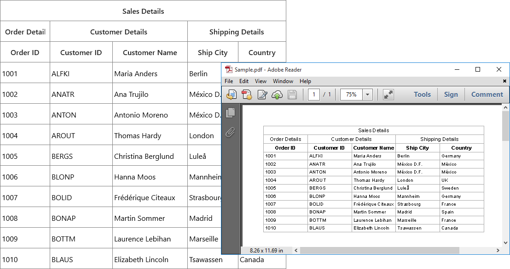

### Exporting merged cells

You can export merged cells to PDF by setting [ExportMergedCells](https://help.syncfusion.com/cr/uwp/Syncfusion.UI.Xaml.Grid.Converter.PdfExportingOptions.html#Syncfusion_UI_Xaml_Grid_Converter_PdfExportingOptions_ExportMergedCells) property as `true`.



PdfExportingOptions options = new PdfExportingOptions();
options.ExportMergedCells = true;
var document = this.dataGrid.ExportToPdf(options);
StorageFile storageFile = await KnownFolders.PicturesLibrary.CreateFileAsync("Sample" + ".pdf", CreationCollisionOption.ReplaceExisting);

if (storageFile != null)
    await document.SaveAsync(storageFile);



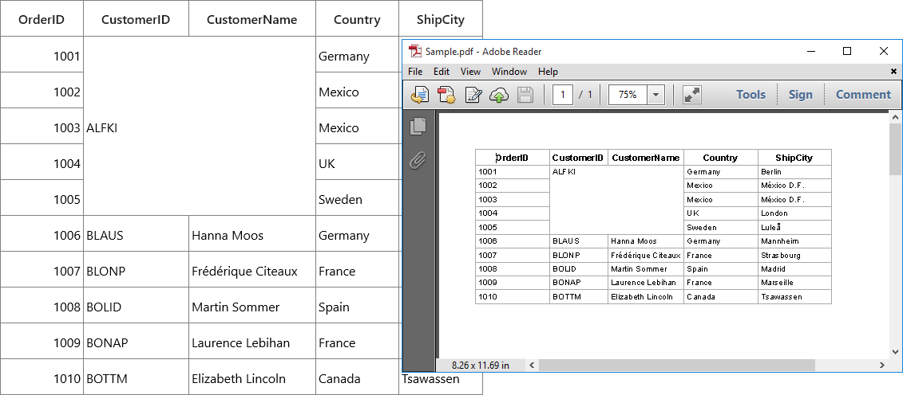

## Setting Header and Footer

SfDataGrid provides a way to display additional content at the top (Header) or bottom (Footer) of the page while exporting to PDF. This can be achieved by setting [PageHeaderFooterEventHandler](https://help.syncfusion.com/cr/uwp/Syncfusion.UI.Xaml.Grid.Converter.PdfExportingOptions.html#Syncfusion_UI_Xaml_Grid_Converter_PdfExportingOptions_PageHeaderFooterEventHandler) in `PdfExportingOptions`.

You can insert string, image or any drawing in header and footer in [PdfHeaderFooterEventHandler](https://help.syncfusion.com/cr/uwp/Syncfusion.UI.Xaml.Grid.Converter.PdfExportingOptions.html#Syncfusion_UI_Xaml_Grid_Converter_PdfExportingOptions_PageHeaderFooterEventHandler). Setting [PdfPageTemplateElement](https://help.syncfusion.com/cr/uwp/Syncfusion.Pdf.PdfPageTemplateElement.html) to [PdfHeaderFooterEventArgs.PdfDocumentTemplate.Top](https://help.syncfusion.com/cr/uwp/Syncfusion.Pdf.PdfDocumentTemplate.html#Syncfusion_Pdf_PdfDocumentTemplate_Top) loads the content at top of the page and setting the [PdfPageTemplateElement](https://help.syncfusion.com/cr/uwp/Syncfusion.Pdf.PdfPageTemplateElement.html) to [PdfHeaderFooterEventArgs.PdfDocumentTemplate.Bottom](https://help.syncfusion.com/cr/uwp/Syncfusion.Pdf.PdfDocumentTemplate.html#Syncfusion_Pdf_PdfDocumentTemplate_Bottom) loads the content at bottom of the page.



PdfExportingOptions options = new PdfExportingOptions();
options.PageHeaderFooterEventHandler = PdfHeaderFooterEventHandler;
var document = this.dataGrid.ExportToPdf(options);
StorageFile storageFile = await KnownFolders.PicturesLibrary.CreateFileAsync("Sample" + ".pdf", CreationCollisionOption.ReplaceExisting);

if (storageFile != null)
    await document.SaveAsync(storageFile);

static void PdfHeaderFooterEventHandler(object sender, PdfHeaderFooterEventArgs e)
{
    PdfFont font = new PdfStandardFont(PdfFontFamily.TimesRoman, 20f,  PdfFontStyle.Bold);
    var width = e.PdfPage.GetClientSize().Width;
    PdfPageTemplateElement header = new PdfPageTemplateElement(width, 38);
    header.Graphics.DrawString("Order Details", font, PdfPens.Black, 70, 3);
    e.PdfDocumentTemplate.Top = header;
}



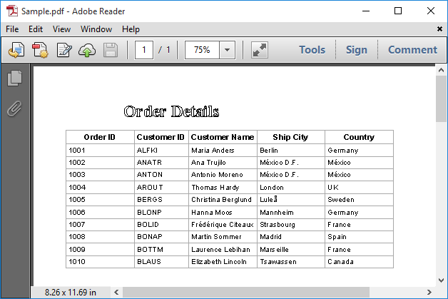

Here, `string` is inserted in the header of exported PDF file using [DrawString](https://help.syncfusion.com/cr/uwp/Syncfusion.Pdf.Graphics.PdfGraphics.html#Syncfusion_Pdf_Graphics_PdfGraphics_DrawString_System_String_Syncfusion_Pdf_Graphics_PdfFont_Syncfusion_Pdf_Graphics_PdfBrush_System_Drawing_PointF_) method. Similarly, you can insert image, line,etc. using [DrawImage](https://help.syncfusion.com/cr/uwp/Syncfusion.Pdf.Graphics.PdfGraphics.html#Syncfusion_Pdf_Graphics_PdfGraphics_DrawImage_Syncfusion_Pdf_Graphics_PdfImage_System_Drawing_PointF_), [DrawLine](https://help.syncfusion.com/cr/uwp/Syncfusion.Pdf.Graphics.PdfGraphics.html#Syncfusion_Pdf_Graphics_PdfGraphics_DrawLine_Syncfusion_Pdf_Graphics_PdfPen_System_Drawing_PointF_System_Drawing_PointF_) methods respectively.

## Change PDF page orientation

You can change the page orientation of PDF while exporting. The default page orientation is Portrait.

To change the page orientation, you need to get the exported [PdfGrid](https://help.syncfusion.com/cr/uwp/Syncfusion.Pdf.Grid.PdfGrid.html) by using [ExportToPdfGrid](https://help.syncfusion.com/cr/uwp/Syncfusion.UI.Xaml.Grid.Converter.GridPdfExportExtension.html#Syncfusion_UI_Xaml_Grid_Converter_GridPdfExportExtension_ExportToPdf_Syncfusion_UI_Xaml_Grid_SfDataGrid_) method and then draw that `PdfGrid` into a [PdfDocument](https://help.syncfusion.com/cr/uwp/Syncfusion.Pdf.PdfDocument.html) by changing the [PageSettings.Orientation](https://help.syncfusion.com/cr/uwp/Syncfusion.Pdf.PdfPageSettings.html#Syncfusion_Pdf_PdfPageSettings_Orientation) property of `PdfDocument`.



var options = new PdfExportingOptions();
var document = new PdfDocument();
document.PageSettings.Orientation = PdfPageOrientation.Landscape;
var page = document.Pages.Add();
var PDFGrid = dataGrid.ExportToPdfGrid(dataGrid.View, options);
var format = new PdfGridLayoutFormat()
{
    Layout = PdfLayoutType.Paginate,
    Break = PdfLayoutBreakType.FitPage
};
PDFGrid.Draw(page, new PointF(), format);
StorageFile storageFile = await KnownFolders.PicturesLibrary.CreateFileAsync("Sample" + ".pdf", CreationCollisionOption.ReplaceExisting);

if (storageFile != null)
    await document.SaveAsync(storageFile);




## Export SelectedItems to PDF

By default, entire grid will be exported to PDF. You can export selected items only by passing `SelectedItems` to `ExportToPdf` and `ExportToPdfGrid` methods.
 


var options = new PdfExportingOptions();
options.AutoColumnWidth = true;
var document = this.dataGrid.ExportToPdf(this.dataGrid.SelectedItems, options);
StorageFile storageFile = await KnownFolders.PicturesLibrary.CreateFileAsync("Sample" + ".pdf", CreationCollisionOption.ReplaceExisting);

if (storageFile != null)
    await document.SaveAsync(storageFile);



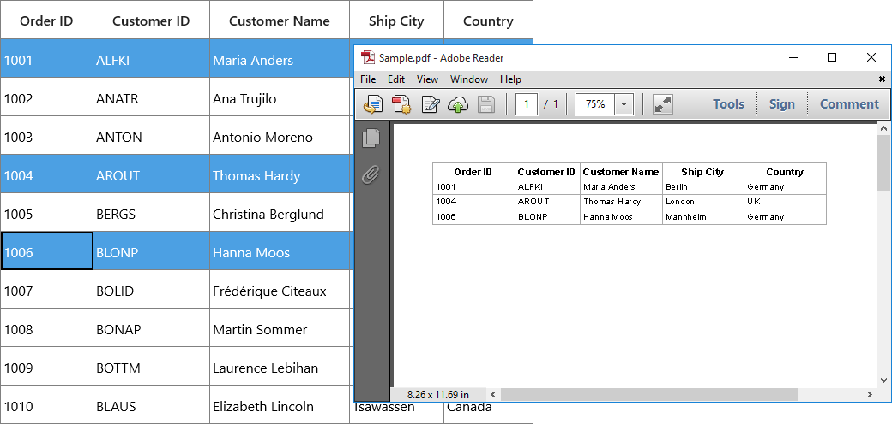

## Saving options

### Save as stream

After exporting to PDF, you can save exported PDF file to stream by using [Save](https://help.syncfusion.com/cr/uwp/Syncfusion.Pdf.PdfDocumentBase.html#Syncfusion_Pdf_PdfDocumentBase_Save_System_IO_Stream_) method.
 


var options = new PdfExportingOptions();
var document = dataGrid.ExportToPdf();
FileStream stream = null;
string directory = @"C:\Users\administrator\Documents\output.pdf";
await Task.Run(() =>
{
    stream = new FileStream(directory, FileMode.Create);
});          
document.Save(stream);
document.Close();



### Save using FileSavePicker

After exporting to PDF, you can save exported PDF file by opening `FileSavePicker`.
 


var options = new PdfExportingOptions();
var document = dataGrid.ExportToPdf();
var savePicker = new FileSavePicker
{
    SuggestedStartLocation = PickerLocationId.Desktop,
    SuggestedFileName = "Sample"
};
savePicker.FileTypeChoices.Add("PDF File (.pdf)", new List<string>() { ".pdf" });
var storageFile = await savePicker.PickSaveFileAsync();

if (storageFile != null)
    await document.SaveAsync(storageFile);
var messageDialog = new MessageDialog("Do you want to view the Document?", "File has been created successfully.");
var yesCmd = new UICommand("Yes");
var noCmd = new UICommand("No");
messageDialog.Commands.Add(yesCmd);
messageDialog.Commands.Add(noCmd);
var cmd = await messageDialog.ShowAsync();

if (cmd == yesCmd)
{

    // Launch the saved file
    bool success = await Windows.System.Launcher.LaunchFileAsync(storageFile);
}
document.Close();



### Open using FileOpenPicker

You can open the saved PDF file using `FileOpenPicker`.
 


var options = new PdfExportingOptions();
var document = dataGrid.ExportToPdf();
StorageFile storageFile = await KnownFolders.PicturesLibrary.CreateFileAsync("Sample" + ".pdf", CreationCollisionOption.ReplaceExisting);

if (storageFile != null)
    await document.SaveAsync(storageFile);
FileOpenPicker openPicker = new FileOpenPicker();
openPicker.FileTypeFilter.Add(".pdf");
openPicker.SuggestedStartLocation = PickerLocationId.PicturesLibrary;
StorageFile file = await openPicker.PickSingleFileAsync();



## Exporting Customization

### Styling cells based on CellType in PDF

You can customize the cell styles based on `CellType` by using [ExportingEventHandler](https://help.syncfusion.com/cr/uwp/Syncfusion.UI.Xaml.Grid.Converter.PdfExportingOptions.html#Syncfusion_UI_Xaml_Grid_Converter_PdfExportingOptions_ExportingEventHandler).



var options = new PdfExportingOptions();
options.ExportingEventHandler = GridPdfExportingEventHandler;
var document = dataGrid.ExportToPdf(options);
StorageFile storageFile = await KnownFolders.PicturesLibrary.CreateFileAsync("Sample" + ".pdf", CreationCollisionOption.ReplaceExisting);

if (storageFile != null)
    await document.SaveAsync(storageFile);

void GridPdfExportingEventHandler(object sender, GridPdfExportingEventArgs e)
{

    if (e.CellType == ExportCellType.HeaderCell)
        e.CellStyle.BackgroundBrush = PdfBrushes.LightSteelBlue;

    else if (e.CellType == ExportCellType.GroupCaptionCell)
        e.CellStyle.BackgroundBrush = PdfBrushes.LightGray;

    else if (e.CellType == ExportCellType.RecordCell)
        e.CellStyle.BackgroundBrush = PdfBrushes.Wheat;
}



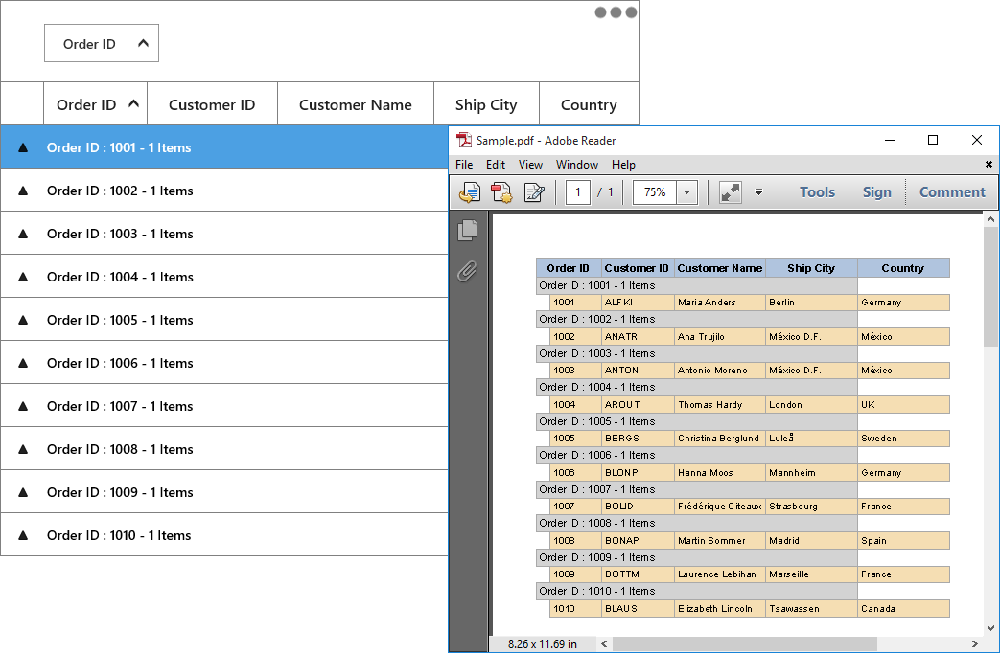

### Embedding fonts in PDF file

By default, some fonts (such as Unicode font) are not supported in PDF. In this case, it is possible to embed the font in PDF document with the help of [PdfTrueTypeFont](https://help.syncfusion.com/cr/uwp/Syncfusion.Pdf.Graphics.PdfTrueTypeFont.html).
 


var options = new PdfExportingOptions();
options.ExportingEventHandler = GridPdfExportingEventHandler;
var document = dataGrid.ExportToPdf(options);
StorageFile storageFile = await KnownFolders.PicturesLibrary.CreateFileAsync("Sample" + ".pdf", CreationCollisionOption.ReplaceExisting);

if (storageFile != null)
    await document.SaveAsync(storageFile);

void GridPdfExportingEventHandler(object sender, GridPdfExportingEventArgs e)
{

    if (e.CellType != ExportCellType.RecordCell)
        return;
    Stream stream = typeof(MainPage).GetTypeInfo().Assembly.GetManifestResourceStream("Localization.Assets.segoeui.ttf") as Stream;
    var font = new PdfTrueTypeFont(stream, 9);
    e.CellStyle.Font = font;
}



Here, new font is created from font file and it is assigned to the `Font` of `PdfGridCell`.

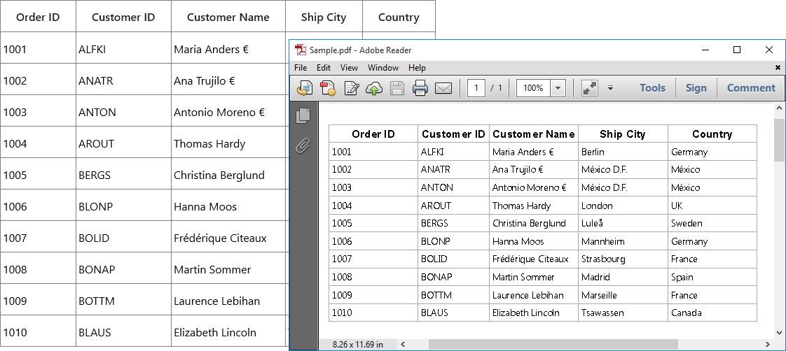

## Cell customization in PDF while exporting

You can customize the cells in the PDF document by setting [CellsExportingEventHandler](https://help.syncfusion.com/cr/uwp/Syncfusion.UI.Xaml.Grid.Converter.PdfExportingOptions.html#Syncfusion_UI_Xaml_Grid_Converter_PdfExportingOptions_CellsExportingEventHandler) in `PdfExportingOptions`.

### Customize cell values while exporting

You can customize the call values while exporting to PDF by using [CellsExportingEventHandler](https://help.syncfusion.com/cr/uwp/Syncfusion.UI.Xaml.Grid.Converter.PdfExportingOptions.html#Syncfusion_UI_Xaml_Grid_Converter_PdfExportingOptions_CellsExportingEventHandler) and `PdfExportingOptions`.



var options = new PdfExportingOptions();
options.CellsExportingEventHandler = CellsExportingEventHandler;
var document = dataGrid.ExportToPdf(options);
StorageFile storageFile = await KnownFolders.PicturesLibrary.CreateFileAsync("Sample" + ".pdf", CreationCollisionOption.ReplaceExisting);

if (storageFile != null)
    await document.SaveAsync(storageFile);

private void CellsExportingEventHandler(object sender, GridCellPdfExportingEventArgs e)
{

    // Based on the column mapping name and the cell type, you can change the cell values while exporting to PDF.

    if (e.CellType == ExportCellType.RecordCell && e.ColumnName == "IsClosed")
    {

        //if the cell value is True, "Y" will be displayed else "N" will be displayed.

        if (e.CellValue.Equals("True"))
            e.CellValue = "Y";

        else
            e.CellValue = "N";
    }
}



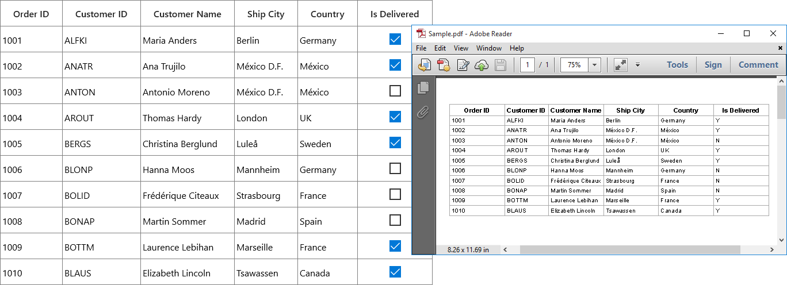

Here, cell values are changed for IsClosed column based on custom condition.

### Changing row style in PDF based on data

You can customize the rows based on the record values by using [CellsExportingEventHandler](https://help.syncfusion.com/cr/uwp/Syncfusion.UI.Xaml.Grid.Converter.PdfExportingOptions.html#Syncfusion_UI_Xaml_Grid_Converter_PdfExportingOptions_CellsExportingEventHandler).



var options = new PdfExportingOptions();
options.CellsExportingEventHandler = CellsExportingEventHandler;
var document = dataGrid.ExportToPdf(options);
StorageFile storageFile = await KnownFolders.PicturesLibrary.CreateFileAsync("Sample" + ".pdf", CreationCollisionOption.ReplaceExisting);

if (storageFile != null)
    await document.SaveAsync(storageFile);
    
private void CellsExportingEventHandler(object sender, GridCellPdfExportingEventArgs e)
{

    if (!(e.NodeEntry is OrderInfo))
        return;
        
    if ((e.NodeEntry as OrderInfo).Country == "Mexico")
    {
        var cellStyle = new PdfGridCellStyle();
        cellStyle.BackgroundBrush = PdfBrushes.LightPink;
        cellStyle.Borders.All = new PdfPen(PdfBrushes.DarkGray, 0.2f);
        e.PdfGridCell.Style = cellStyle;
    }
}



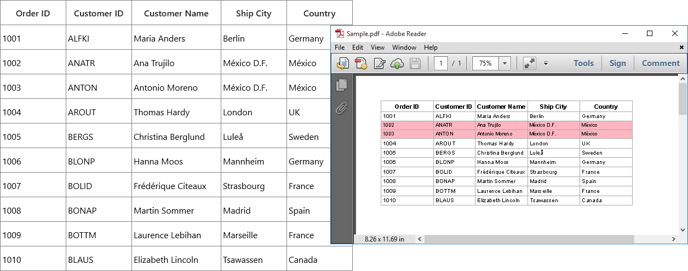

### Exporting images to PDF document

By default, images which is loaded in the GridTemplateColumn will not be exported to PDF. You can export it by using `CellsExportingEventHandler` in `PdfExportingOptions`. In `CellsExportingEventHandler`, image is loaded in `PdfGridCell`.



var options = new PdfExportingOptions();
options.CellsExportingEventHandler = CellsExportingEventHandler;        
var document = dataGrid.ExportToPdf(options);
StorageFile storageFile = await KnownFolders.PicturesLibrary.CreateFileAsync("Sample" + ".pdf", CreationCollisionOption.ReplaceExisting);

if (storageFile != null)
    await document.SaveAsync(storageFile);

private void CellsExportingEventHandler(object sender, GridCellPdfExportingEventArgs e)
{

    if (e.CellType == ExportCellType.RecordCell && e.ColumnName == "IsClosed")
    {
        var style = new PdfGridCellStyle();
        PdfPen normalBorder = new PdfPen(PdfBrushes.DarkGray, 0.2f);

        //Images are exported based on the CellValue 

        if (e.CellValue.Equals("True"))
        {

            //Access the image from the specified path 
            style.BackgroundImage = PDFImage.FromStream(typeof(MainPage).GetTypeInfo().Assembly.GetManifestResourceStream("Localization.Images.True.png") as Stream);
        }

        else
        {
            style.BackgroundImage = PDFImage.FromStream(typeof(MainPage).GetTypeInfo().Assembly.GetManifestResourceStream("Localization.Images.False.png") as Stream);
        }
        e.PdfGridCell.ImagePosition = PdfGridImagePosition.Fit;
        e.PdfGridCell.Style = style;

        //customize the Border color of PdfGridCell
        e.PdfGridCell.Style.Borders.All = normalBorder;
        e.CellValue = null;
    }
}




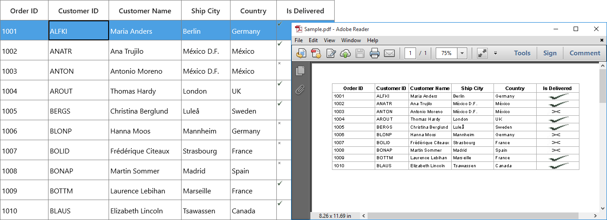

## Exporting DetailsView

By default, `DetailsViewDataGrid` will not be exported to PDF. You can export `DetailsViewDataGrid` by setting [ExportDetailsView](https://help.syncfusion.com/cr/uwp/Syncfusion.UI.Xaml.Grid.Converter.PdfExportingOptions.html#Syncfusion_UI_Xaml_Grid_Converter_PdfExportingOptions_ExportDetailsView) property as `true`.



PdfExportingOptions options = new PdfExportingOptions();
options.ExportDetailsView = true;
var document = dataGrid.ExportToPdf(options);
StorageFile storageFile = await KnownFolders.PicturesLibrary.CreateFileAsync("Sample" + ".pdf", CreationCollisionOption.ReplaceExisting);

if (storageFile != null)
    await document.SaveAsync(storageFile);



By default, only expanded DetailsViewDataGrid’s only will be exported to PDF document. If you want to export all the DetailsViewDataGrid, you need to set `ExportAllDetails` as `true`.



var options = new PdfExportingOptions();
options.ExportDetailsView = true;
options.ExportAllDetails = true;
var document = dataGrid.ExportToPdf(options);
StorageFile storageFile = await KnownFolders.PicturesLibrary.CreateFileAsync("Sample" + ".pdf", CreationCollisionOption.ReplaceExisting);

if (storageFile != null)
    await document.SaveAsync(storageFile);



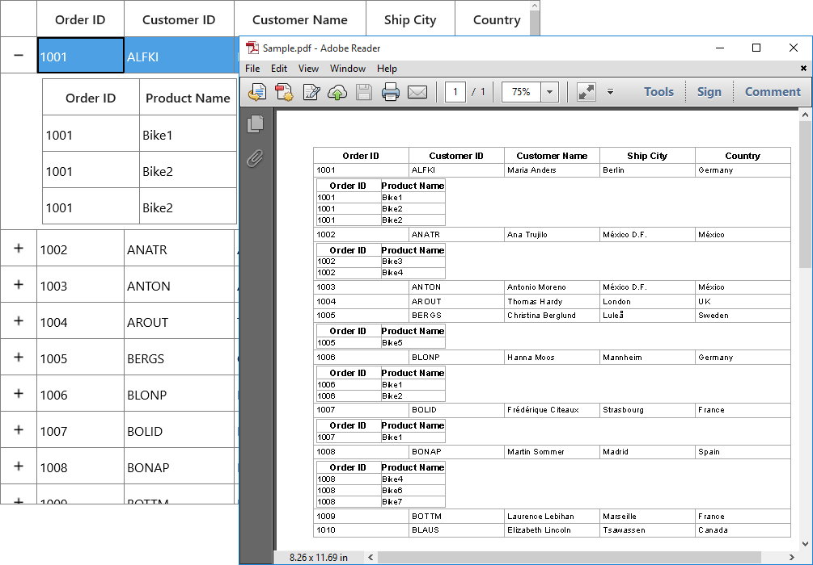

Here, first record only expanded in SfDataGrid. But all the DetailsViewDataGrid’s are shown in exported PDF document.

You can customize its exporting operation by using [ChildGridExportingEventHandler](https://help.syncfusion.com/cr/uwp/Syncfusion.UI.Xaml.Grid.Converter.PdfExportingOptions.html#Syncfusion_UI_Xaml_Grid_Converter_PdfExportingOptions_ChildGridExportingEventHandler).

N> While exporting `DetailsViewDataGrid`, [FitAllColumnsInOnePage](https://help.syncfusion.com/cr/uwp/Syncfusion.UI.Xaml.Grid.Converter.PdfExportingOptions.html#Syncfusion_UI_Xaml_Grid_Converter_PdfExportingOptions_FitAllColumnsInOnePage) is set to ‘true’ internally as horizontal pagination is not supported for `DetailsViewDataGrid`.

### Excluding DetailsViewDataGrid while exporting

You can exclude particular `DetailsViewDataGrid` while exporting, by using the [ChildGridExportingEventHandler](https://help.syncfusion.com/cr/uwp/Syncfusion.UI.Xaml.Grid.Converter.PdfExportingOptions.html#Syncfusion_UI_Xaml_Grid_Converter_PdfExportingOptions_ChildGridExportingEventHandler) and [ChildGridPdfExportingEventArgs.Cancel](https://learn.microsoft.com/en-us/dotnet/api/system.componentmodel.canceleventargs.cancel?view=net-7.0).



var options = new PdfExportingOptions();
options.ExportDetailsView = true;
options.ExportAllDetails = true;
options.ChildGridExportingEventHandler = ChildGridExportingEventHandler;
var document = dataGrid.ExportToPdf(options);
StorageFile storageFile = await KnownFolders.PicturesLibrary.CreateFileAsync("Sample" + ".pdf", CreationCollisionOption.ReplaceExisting);

if (storageFile != null)
    await document.SaveAsync(storageFile);

void ChildGridExportingEventHandler(object sender, ChildGridPdfExportingEventArgs e)
{
    var recordEntry = e.NodeEntry as RecordEntry;

    if ((recordEntry.Data as OrderInfo).OrderID == 1002)
        e.Cancel = true;
}



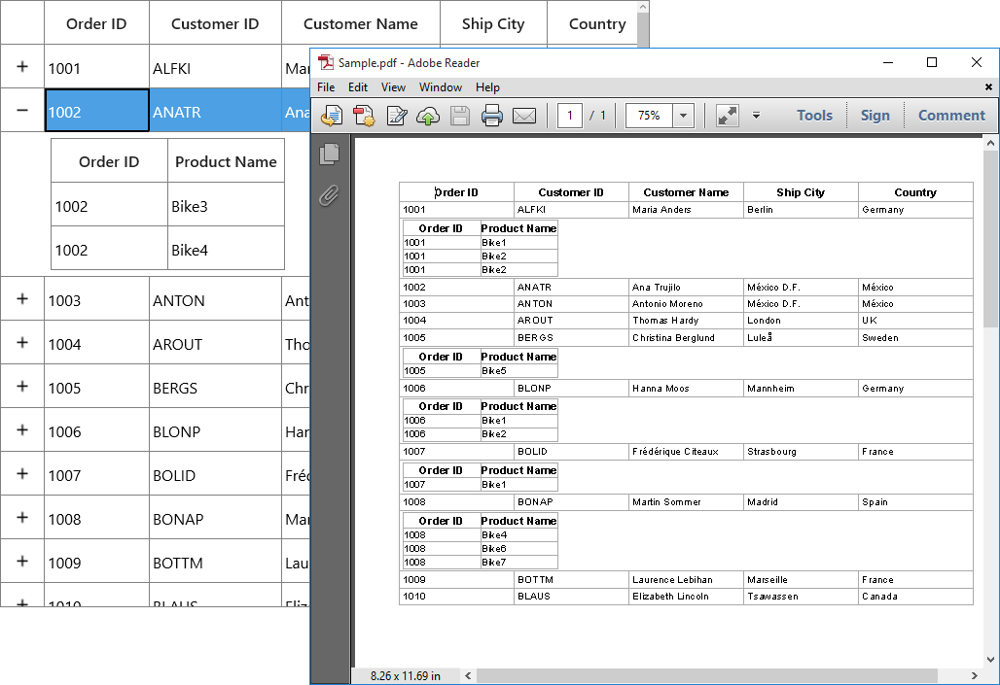

Here, `DetailsViewDataGrid` is not exported for the parent record having `OrderID` as 1002.

### Excluding DetailsViewDataGrid columns from exporting

You can exclude `DetailsViewDataGrid` columns while exporting, by using `ChildGridExportingEventHandler` and [ChildGridPdfExportingEventArgs.PdfExportingOptions.ExcludeColumns](https://help.syncfusion.com/cr/uwp/Syncfusion.UI.Xaml.Grid.Converter.PdfExportingOptions.html#Syncfusion_UI_Xaml_Grid_Converter_PdfExportingOptions_ExcludeColumns).



var options = new PdfExportingOptions();
options.ExportDetailsView = true;
options.ChildGridExportingEventHandler = ChildGridExportingEventHandler;
var document = dataGrid.ExportToPdf(options);
StorageFile storageFile = await KnownFolders.PicturesLibrary.CreateFileAsync("Sample" + ".pdf", CreationCollisionOption.ReplaceExisting);

if (storageFile != null)
    await document.SaveAsync(storageFile);
    
void ChildGridExportingEventHandler(object sender, ChildGridPdfExportingEventArgs e)
{ 
    e.PdfExportingOptions.ExcludeColumns = new List<string>() { "OrderID" };
}



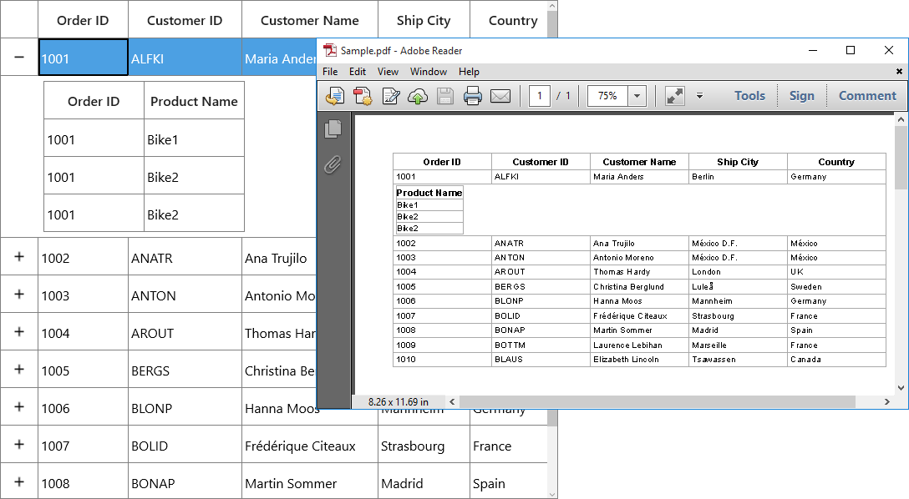

Here, OrderID column is displayed in `DetailsViewDataGrid` and it is excluded while exporting to PDF.

### Customizing DetailsViewDataGrid cells

Like parent DataGrid, you can customize the `DetailsViewDataGrid` cells also by using `CellsExportingEventHandler`. Based on [GridCellPdfExportingEventArgs.GridViewDefinition](https://help.syncfusion.com/cr/uwp/Syncfusion.UI.Xaml.Grid.Converter.GridCellPdfExportingEventArgs.html#Syncfusion_UI_Xaml_Grid_Converter_GridCellPdfExportingEventArgs_GridViewDefinition) property, you can identify the particular `DetailsViewDataGrid` and customize it.



var options = new PdfExportingOptions();
options.ExportDetailsView = true;
options.CellsExportingEventHandler = CellsExportingEventHandler;
var document = dataGrid.ExportToPdf(options);
StorageFile storageFile = await KnownFolders.PicturesLibrary.CreateFileAsync("Sample" + ".pdf", CreationCollisionOption.ReplaceExisting);

if (storageFile != null)
    await document.SaveAsync(storageFile);

private void CellsExportingEventHandler(object sender, GridCellPdfExportingEventArgs e)
{

    if (e.GridViewDefinition == null || e.GridViewDefinition.RelationalColumn != "ProductDetails")                                     
        return;
        
    if (e.ColumnName == "OrderID")
    {
        var cellStyle = new PdfGridCellStyle();
        cellStyle.BackgroundBrush = PdfBrushes.Wheat;
        cellStyle.Borders.All = new PdfPen(PdfBrushes.DarkGray, 0.2f);
        e.PdfGridCell.Style = cellStyle;
    }
}



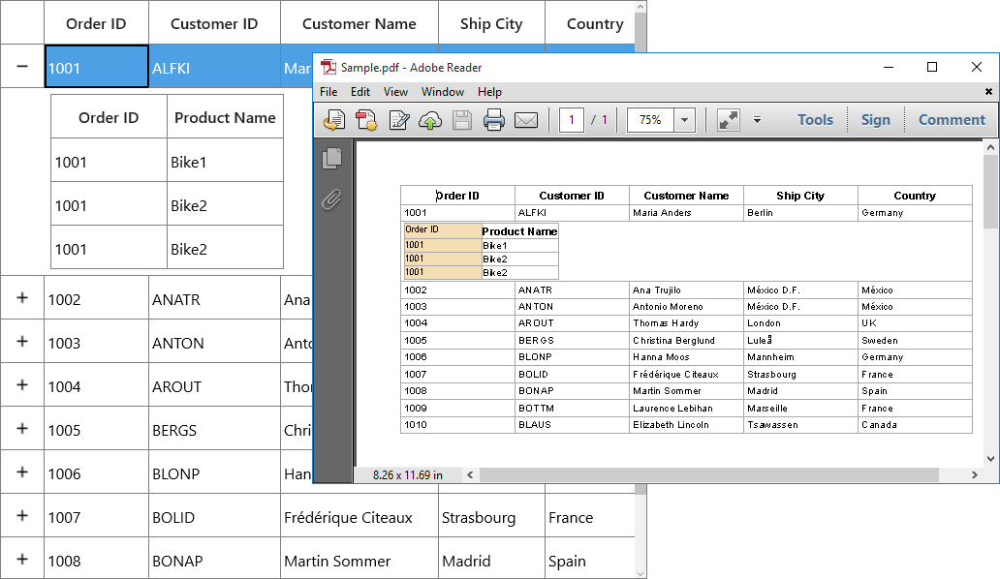

