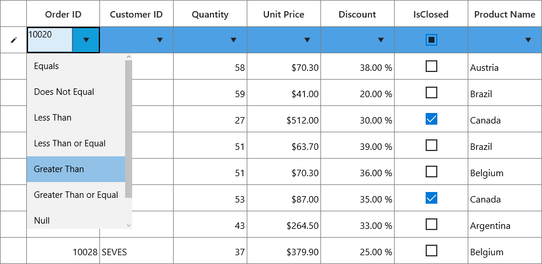

# FilterRow in UWP DataGrid (SfDataGrid)

SfDataGrid allows you to filter the data by typing the value in FilterRow which is placed either in top or bottom of the DataGrid. You can enable the FilterRow by specifying the position in [SfDataGrid.FilterRowPosition](https://help.syncfusion.com/cr/uwp/Syncfusion.UI.Xaml.Grid.SfDataGrid.html#Syncfusion_UI_Xaml_Grid_SfDataGrid_FilterRowPosition) property.

The FilterRowPosition property contains the below positions to load the FilterRow in SfDataGrid.

1. FixedTop – Placed in top of the SfDataGrid in frozen state
2. Top – Placed in top of the SfDataGrid.
3. Bottom – Placed in bottom of the SfDataGrid.



<syncfusion:SfDataGrid x:Name="dataGrid"
                       FilterRowPosition="FixedTop"
                       AllowEditing="True"
                       AutoGenerateColumns="True"
                       ItemsSource="{Binding OrderList}"/>





this.dataGrid.FilterRowPosition = FilterRowPosition.FixedTop;




The each GridFilterRowCell which loads TextBox, DoubleTextBox and DateTimeEdit will contains the filter options button in right corner. You can change the FilterRowCondition at runtime. The below FilterRowConditions will be loaded based on editors.

<table>
<tr>
<th>
Editors
</th>
<th>
FilterRowConditions
</th>
</tr>
<tr>
<td>
TextBox
</td>
<td>
Equals, NotEquals, Empty, NotEmpty, Contains, NotContains, BeginsWith, NotBeginsWith, EndsWith, NotEndsWith, Null, NotNull
</td>
</tr>
<tr>
<td>
SfNumericTextBox
</td>
<td>
Equals, NotEquals, GreaterThan, GreaterThanOrEqual, LessThan, LessThanOrEqual, Null, NotNull
</td>
</tr>
</table>
You can remove the filter options button by using [GridColumn.FilterRowOptionsVisibility](https://help.syncfusion.com/cr/uwp/Syncfusion.UI.Xaml.Grid.GridColumn.html#Syncfusion_UI_Xaml_Grid_GridColumn_FilterRowOptionsVisibility) property and also you can change the default FilterRowCondition of particular column using [GridColumn.FilterRowCondition](https://help.syncfusion.com/cr/uwp/Syncfusion.UI.Xaml.Grid.GridColumn.html#Syncfusion_UI_Xaml_Grid_GridColumn_FilterRowCondition) property.



<syncfusion:GridTextColumn MappingName="CustomerID"
                           FilterRowCondition="Contains"
                           FilterRowOptionsVisibility="Collapsed"
                           HeaderText="Customer ID"/>





this.dataGrid.Columns[0].FilterRowCondition = FilterRowCondition.Contains;
this.dataGrid.Columns[0].FilterRowOptionsVisibility = Visibility.Collapsed;




You have to set true to [GridColumn.ImmediateUpdateColumnFilter](https://help.syncfusion.com/cr/uwp/Syncfusion.UI.Xaml.Grid.GridColumn.html#Syncfusion_UI_Xaml_Grid_GridColumn_ImmediateUpdateColumnFilter) property for immediate filtering while typing the value. 



<syncfusion:GridTextColumn MappingName="CustomerID"
                           ImmediateUpdateColumnFilter="True"
                           HeaderText="Customer ID"/>





this.dataGrid.Columns[0].ImmediateUpdateColumnFilter = true;




## Built-In Editors

The FilterRow will loads with different editors based on underlying type of each column. You can change this default editors by using [GridColumn.FilterRowEditorType](https://help.syncfusion.com/cr/uwp/Syncfusion.UI.Xaml.Grid.GridColumn.html#Syncfusion_UI_Xaml_Grid_GridColumn_FilterRowEditorType) property. The FilterRow contains the below editors type.

<table>
<tr>
<th>
{{'**EditorType**'| markdownify }}
</th>
<th>
{{'**Editor**'| markdownify }}
</th>
<th>
{{'**Renderer**'| markdownify }}
</th>
</tr>
<tr>
<td>
TextBox
</td>
<td>
TextBox
</td>
<td>
{{'[GridFilterRowTextBoxRenderer](https://help.syncfusion.com/cr/uwp/Syncfusion.UI.Xaml.Grid.RowFilter.GridFilterRowTextBoxRenderer.html)'| markdownify }}
</td>
</tr>
<tr>
<td>
Numeric
</td>
<td>
DoubleTextBox
</td>
<td>
{{'[GridFilterRowNumericRenderer](https://help.syncfusion.com/cr/uwp/Syncfusion.UI.Xaml.Grid.RowFilter.GridFilterRowNumericRenderer.html)'| markdownify }}
</td>
</tr>
<tr>
<td>
CheckBox
</td>
<td>
CheckBox
</td>
<td>
{{'[GridFilterRowCheckBoxRenderer](https://help.syncfusion.com/cr/uwp/Syncfusion.UI.Xaml.Grid.RowFilter.GridFilterRowCheckBoxRenderer.html)'| markdownify }}
</td>
</tr>
</table>
