# Interactive Features in UWP DataGrid (SfDataGrid)

## RowHeader

RowHeader is a special type of column used to indicate the currently focused row, editing status, and validation status. You can enable the RowHeader by setting [SfDataGrid.ShowRowHeader](https://help.syncfusion.com/cr/uwp/Syncfusion.UI.Xaml.Grid.SfGridBase.html#Syncfusion_UI_Xaml_Grid_SfGridBase_ShowRowHeader) property to true. 




<syncfusion:SfDataGrid x:Name="dataGrid"
                       ShowRowHeader="True"
                       ItemsSource="{Binding Orders}"  />





dataGrid.ShowRowHeader = true;




You can change the default width of the RowHeader by using [SfDataGrid.RowHeaderWidth](https://help.syncfusion.com/cr/uwp/Syncfusion.UI.Xaml.Grid.SfGridBase.html#Syncfusion_UI_Xaml_Grid_SfGridBase_RowHeaderWidth) property.




<syncfusion:SfDataGrid x:Name="dataGrid"
                       ShowRowHeader="True"
                       RowHeaderWidth="50"
                       ItemsSource="{Binding Orders}"  />




dataGrid.RowHeaderWidth = 50;




### Customizing RowHeader 

#### Display the RowIndex to the RowHeaderCell

You can display the corresponding row index in each RowHeader, by customizing the ControlTemplate of GridRowHeaderCell. You have to bind the RowIndex property to TextBlock.Text like the below code example.







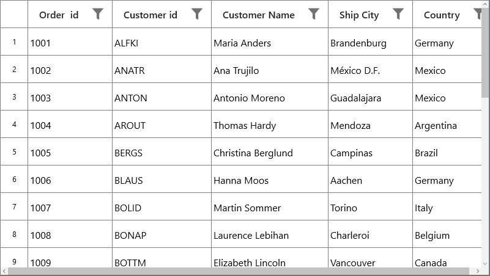

You can get the sample from [here](https://www.syncfusion.com/downloads/support/directtrac/general/ze/DisplayRowIndex1237508699.zip).

#### Change the CurrentRow Indicator

You can change the CurrentRowIndicator in the RowHeader by customizing the control template of GridRowHeaderCell.







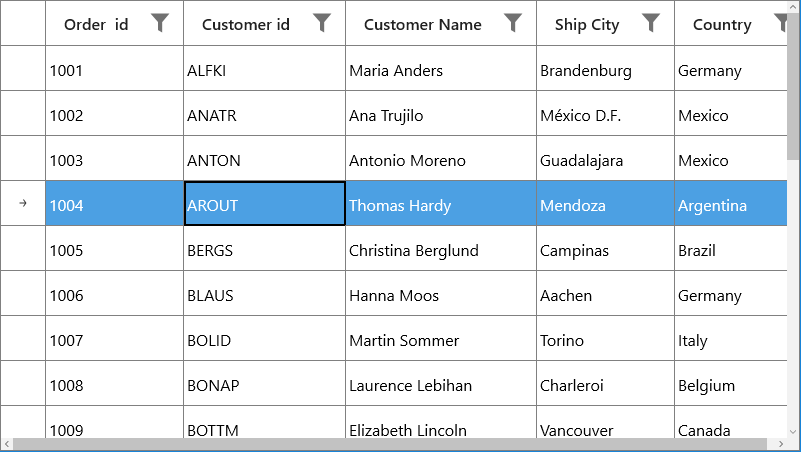

You can get the sample from [here](https://www.syncfusion.com/downloads/support/directtrac/general/ze/ChangingCurrentRowIndicator(1)970786330.zip).

## Touch Support

### ColumnResizing with the Touch

SfDataGrid allows you to re-size the columns in touch by press and hold the column header. You can enable resizing in SfDataGrid by setting AllowResizingColumns as True.




<syncfusion:SfDataGrid   x:Name="dataGrid" 
                         AllowResizingColumns="True" 
                         ShowGroupDropArea="True"
                         AllowGrouping="True"
                         AutoGenerateColumns="True"
                         ItemsSource="{Binding Orders}" >





this.dataGrid.AllowResizingColumns = true;




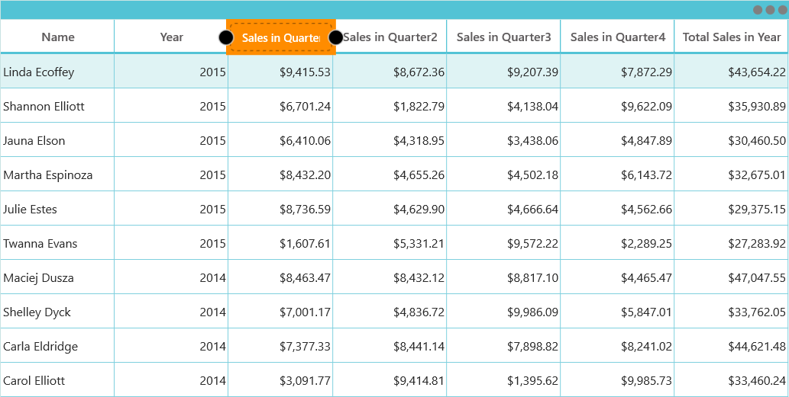

You can also resize the hidden column through the touch by setting the AllowResizingHiddenColumns by True. You have to press and hold the hidden line to resize the hidden column in touch.




<syncfusion:SfDataGrid  x:Name="dataGrid" 
                        AllowResizingHiddenColumns="True"
                        ShowGroupDropArea="True"
                        AllowGrouping="True" 
                        AutoGenerateColumns="True"
                        ItemsSource="{Binding Orders}" >





this.dataGrid.AllowResizingHiddenColumns = true;




N> you can resize the column by dragging the bubbles on the Tool-Tip

### Drag and Drop with the Touch Support

You can also drag and drop the columns through the touch by setting the AllowDraggingColumns as true. You have to press and drag the column header to move the column in touch.



<syncfusion:SfDataGrid x:Name="dataGrid" 
                       AllowDraggingColumns="True"
                       ShowGroupDropArea="True"
                       AllowGrouping="True" 
                       AutoGenerateColumns="True"
                       ItemsSource="{Binding Orders}" >





this.dataGrid.AllowDraggingColumns = true;




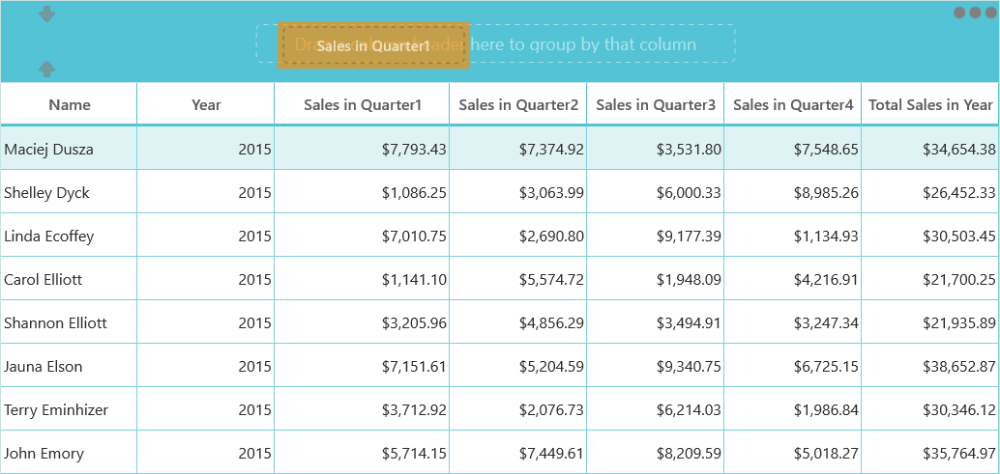

## Drag and Drop Rows

SfDataGrid allows you to row drag and drop by setting the [SfDataGrid.AllowDraggingRows](https://help.syncfusion.com/cr/uwp/Syncfusion.UI.Xaml.Grid.SfDataGrid.html#Syncfusion_UI_Xaml_Grid_SfDataGrid_AllowDraggingRows) and [AllowDrop](https://msdn.microsoft.com/en-us/library/system.windows.uielement.allowdrop(v=vs.110).aspx) property. Also, you can do row drag-and-drop operations between SfDataGrid and other controls like ListView, TreeView.



<Syncfusion:SfDataGrid x:Name="datagrid" 
                               AllowDraggingRows="True"
                               AllowDrop="True"
                               ItemsSource="{Binding Source}"/>





this.datagrid.AllowDraggingRows = true;
this.datagrid.AllowDrop = true;




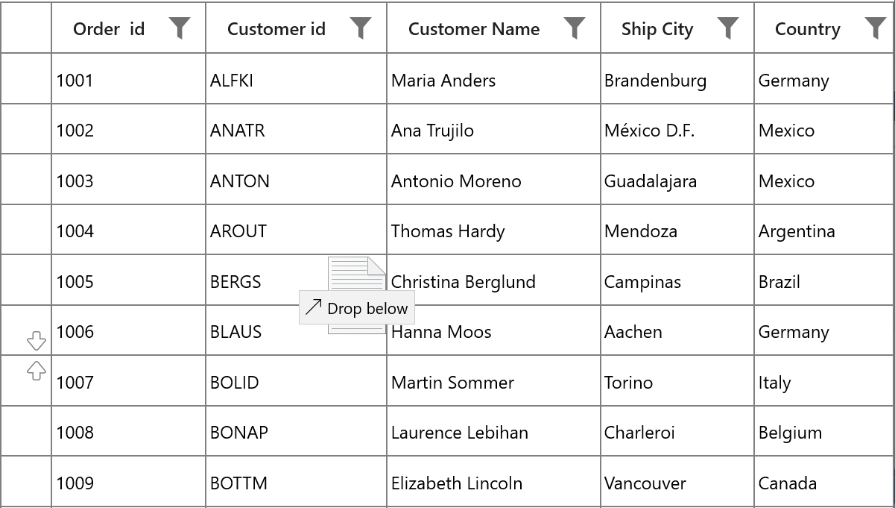

### Dragging multiple rows

The SfDataGrid allows to drag multiple selected rows. To enable multiple selection, set the [SfDataGrid.SelectionMode](https://help.syncfusion.com/cr/uwp/Syncfusion.UI.Xaml.Grid.SfGridBase.html#Syncfusion_UI_Xaml_Grid_SfGridBase_SelectionMode) as Multiple or Extended. 

N> The drag selection cannot be performed while the [AllowDraggingRows](https://help.syncfusion.com/cr/uwp/Syncfusion.UI.Xaml.Grid.SfDataGrid.html#Syncfusion_UI_Xaml_Grid_SfDataGrid_AllowDraggingRows) enabled as true in the SfDataGrid.

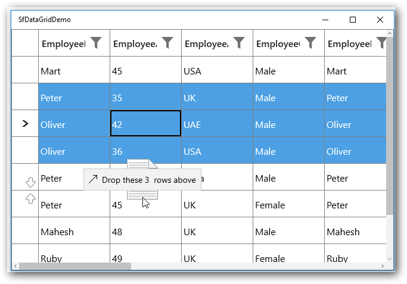

### Customizing row drag and drop

#### Disable dragging of certain rows

To restrict dragging of certain rows, override the [ProcessOnDragStarting](https://help.syncfusion.com/cr/uwp/Syncfusion.UI.Xaml.Grid.GridRowDragDropController.html#Syncfusion_UI_Xaml_Grid_GridRowDragDropController_ProcessOnDragStarting_Windows_UI_Xaml_DragStartingEventArgs_Syncfusion_UI_Xaml_ScrollAxis_RowColumnIndex_) method in the [GridRowDragDropController](https://help.syncfusion.com/cr/uwp/Syncfusion.UI.Xaml.Grid.GridRowDragDropController.html) class.




this.datagrid.RowDragDropController = new GridRowDragDropControllerExt();

public class GridRowDragDropControllerExt : GridRowDragDropController
{
    protected override void ProcessOnDragStarting(DragStartingEventArgs args, RowColumnIndex rowColumnIndex)
    {
        // Skip dragging of the rows less than 5.
        var rowIndex = rowColumnIndex.RowIndex;
        if (rowIndex < 0)
            return;
        var recordIndex = this.DataGrid.ResolveToRecordIndex(rowIndex);

        if (recordIndex < 5)
            return;
        base.ProcessOnDragStarting(args, rowColumnIndex);
    }
}




#### Disable drag over of certain rows

To restrict drop over specific node, override the [GetDropPosition](https://help.syncfusion.com/cr/uwp/Syncfusion.UI.Xaml.Grid.GridRowDragDropController.html#Syncfusion_UI_Xaml_Grid_GridRowDragDropController_GetDropPosition_Windows_UI_Xaml_DragEventArgs_Syncfusion_UI_Xaml_ScrollAxis_RowColumnIndex_System_Collections_ObjectModel_ObservableCollection_System_Object__) method in the [GridRowDragDropController](https://help.syncfusion.com/cr/uwp/Syncfusion.UI.Xaml.Grid.GridRowDragDropController.html) class.  




this.datagrid.RowDragDropController = new GridRowDragDropControllerExt();

public class GridRowDragDropControllerExt : GridRowDragDropController
{
    protected override DropPosition GetDropPosition(DragEventArgs args, RowColumnIndex rowColumnIndex, ObservableCollection<object> draggingRecords)
{
    var recordIndex = this.DataGrid.ResolveToRecordIndex(rowColumnIndex.RowIndex);

    if (recordIndex < 6)
    {
        return DropPosition.None;
    }

    return base.GetDropPosition(args, rowColumnIndex, draggingRecords);
}     
}




#### Customizing drag UI Text 

Drag UI text can be customized by overriding the [ProcessOnDragOver](https://help.syncfusion.com/cr/uwp/Syncfusion.UI.Xaml.Grid.GridRowDragDropController.html#Syncfusion_UI_Xaml_Grid_GridRowDragDropController_ProcessOnDragOver_Windows_UI_Xaml_DragEventArgs_Syncfusion_UI_Xaml_ScrollAxis_RowColumnIndex_) method in the [GridRowDragDropController](https://help.syncfusion.com/cr/uwp/Syncfusion.UI.Xaml.Grid.GridRowDragDropController.html) Class.




this.datagrid.RowDragDropController = new GridRowDragDropControllerExt();

protected override void ProcessOnDragOver(DragEventArgs args, RowColumnIndex rowColumnIndex)
{
    base.ProcessOnDragOver(args, rowColumnIndex);
    var draggingRecords = args.DataView.Properties["Records"] as ObservableCollection<object>;
    var dropPosition = GetDropPosition(args, rowColumnIndex, draggingRecords);
    if (dropPosition == DropPosition.DropAbove)
        args.DragUIOverride.Caption = "Drop above the row";
}




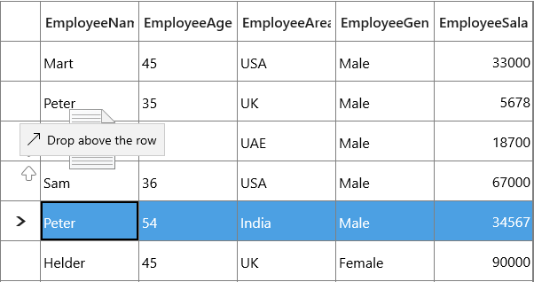

#### Customizing dragging records

While dragging, all selected records will be added to dragging records collection. To customize the dragging records collection, override the [ProcessOnDragStarting](https://help.syncfusion.com/cr/uwp/Syncfusion.UI.Xaml.Grid.GridRowDragDropController.html#Syncfusion_UI_Xaml_Grid_GridRowDragDropController_ProcessOnDragStarting_Windows_UI_Xaml_DragStartingEventArgs_Syncfusion_UI_Xaml_ScrollAxis_RowColumnIndex_) method in the [GridRowDragDropController](https://help.syncfusion.com/cr/uwp/Syncfusion.UI.Xaml.Grid.GridRowDragDropController.html) class.




this.datagrid.RowDragDropController = new GridRowDragDropControllerExt();

public class GridRowDragDropControllerExt : GridRowDragDropController
    {
        public GridRowDragDropControllerExt()
        {

        }
        ObservableCollection<object> draggingRecords = new ObservableCollection<object>();

        protected override void ProcessOnDragStarting(DragStartingEventArgs args, RowColumnIndex rowColumnIndex)
        {
            var rowIndex = rowColumnIndex.RowIndex;
            if (rowIndex < 0)
                return;

            var recordIndex = this.DataGrid.ResolveToRecordIndex(rowIndex);

            // ResolveToRecordIndex returns -1 for AddNewRow, TableSummary, Filter, Unbound rows.
            if (recordIndex < 0)
                return;

            object record = null;
            
            var records = new ObservableCollection<object>();

            record = (this.DataGrid.View.Records[recordIndex]).Data;
            if (record == null)
                return;
            records.Add(record);

            args.Data.Properties.Add("Records", records);
            args.Data.Properties.Add("SourceDataGrid", DataGrid);
            args.Data.SetText(StandardDataFormats.Text);
            args.DragUI.SetContentFromDataPackage();        
   }
}




### Row drag and drop between DataGrid and ListView

To perform dragging between the ListView and SfDataGrid, override the [ProcessOnDragOver](https://help.syncfusion.com/cr/uwp/Syncfusion.UI.Xaml.Grid.GridRowDragDropController.html#Syncfusion_UI_Xaml_Grid_GridRowDragDropController_ProcessOnDragOver_Windows_UI_Xaml_DragEventArgs_Syncfusion_UI_Xaml_ScrollAxis_RowColumnIndex_) and [ProcessOnDrop](https://help.syncfusion.com/cr/uwp/Syncfusion.UI.Xaml.Grid.GridRowDragDropController.html#Syncfusion_UI_Xaml_Grid_GridRowDragDropController_ProcessOnDrop_Windows_UI_Xaml_DragEventArgs_Syncfusion_UI_Xaml_ScrollAxis_RowColumnIndex_) methods in the [GridRowDragDropController](https://help.syncfusion.com/cr/uwp/Syncfusion.UI.Xaml.Grid.GridRowDragDropController.html) class.




this.datagrid.RowDragDropController = new GridRowDragDropControllerExt();

public class GridRowDragDropControllerExt : GridRowDragDropController
{
    ObservableCollection<object> draggingRecords = new ObservableCollection<object>();

    protected override void ProcessOnDragOver(DragEventArgs args, RowColumnIndex rowColumnIndex)
    {
        if (args.DataView.Properties.ContainsKey("DraggedItem"))
            draggingRecords = args.DataView.Properties["DraggedItem"] as ObservableCollection<object>;

        else

            draggingRecords = args.DataView.Properties["Records"] as ObservableCollection<object>;

        if (draggingRecords == null)
            return;

        var dropPosition = GetDropPosition(args, rowColumnIndex, draggingRecords);

        if (dropPosition == DropPosition.None)
        {
            CloseDragIndicators();
            args.AcceptedOperation = DataPackageOperation.None;
            args.DragUIOverride.Caption = "Can't drop here";
            return;
        }

        else if (dropPosition == DropPosition.DropAbove)
        {
            if (draggingRecords != null && draggingRecords.Count > 1)
                args.DragUIOverride.Caption = "Drop these " + draggingRecords.Count + "  rows above";
            else
            {
                args.AcceptedOperation = DataPackageOperation.Copy;

                args.DragUIOverride.IsCaptionVisible = true;
                args.DragUIOverride.IsContentVisible = true;
                args.DragUIOverride.IsGlyphVisible = true;
                args.DragUIOverride.Caption = "Drop above";
            }
        }
          
        else
        {
            if (draggingRecords != null && draggingRecords.Count > 1)
                args.DragUIOverride.Caption = "Drop these " + draggingRecords.Count + "  rows below";
            else
                args.DragUIOverride.Caption = "Drop below";
        }
        args.AcceptedOperation = DataPackageOperation.Move;

        ShowDragIndicators(dropPosition, rowColumnIndex, args);
        args.Handled = true;
    }

    ListView listview;
    protected override void ProcessOnDrop(DragEventArgs args, RowColumnIndex rowColumnIndex)
    {
        listview = null;
            
        if (args.DataView.Properties.ContainsKey("ListView"))
            listview=args.DataView.Properties["ListView"] as ListView;

        if (!DataGrid.SelectionController.CurrentCellManager.CheckValidationAndEndEdit())
            return;

        var dropPosition = GetDropPosition(args, rowColumnIndex, draggingRecords);
        if (dropPosition == DropPosition.None)
            return;

        var droppingRecordIndex = this.DataGrid.ResolveToRecordIndex(rowColumnIndex.RowIndex);

        if (droppingRecordIndex < 0)
            return;

        foreach (var record in draggingRecords)
        {
            if (listview != null)
            {
                (listview.ItemsSource as ObservableCollection<BusinessObjects>).Remove(record as BusinessObjects);
                var sourceCollection = this.DataGrid.View.SourceCollection as IList;

                if (dropPosition == DropPosition.DropBelow)
                    sourceCollection.Insert(droppingRecordIndex + 1, record);
                else
                    sourceCollection.Insert(droppingRecordIndex, record);
            }
            else
            {
                var draggingIndex = this.DataGrid.ResolveToRowIndex(draggingRecords[0]);

                if (draggingIndex < 0)
                {
                    return;
                }

                var recordIndex = this.DataGrid.ResolveToRecordIndex(draggingIndex);
                var recordEntry = this.DataGrid.View.Records[recordIndex];
                this.DataGrid.View.Records.Remove(recordEntry);

                if (draggingIndex < rowColumnIndex.RowIndex && dropPosition == DropPosition.DropAbove)
                    this.DataGrid.View.Records.Insert(droppingRecordIndex - 1, this.DataGrid.View.Records.CreateRecord(record));
                else if (draggingIndex > rowColumnIndex.RowIndex && dropPosition == DropPosition.DropBelow)
                    this.DataGrid.View.Records.Insert(droppingRecordIndex + 1, this.DataGrid.View.Records.CreateRecord(record));
                else
                    this.DataGrid.View.Records.Insert(droppingRecordIndex, this.DataGrid.View.Records.CreateRecord(record));
            }
        }

        CloseDragIndicators();
    }
}




For ListView, you can wire the DragEnter, DragItemStarting, DragOver and Drop events.




private void ListView_DragEnter(object sender, DragEventArgs e)
{
    e.AcceptedOperation = Windows.ApplicationModel.DataTransfer.DataPackageOperation.Copy;
}

private void ListView_Drop(object sender, DragEventArgs e)
{
    foreach (var item in records1)
    {
        this.datagrid.View.Remove(item as BusinessObjects);

        (this.DataContext as ViewModel).GDCSource1.Add(item as BusinessObjects);
    }
}

ObservableCollection<object> records1 = new ObservableCollection<object>();
private void ListView_DragOver(object sender, DragEventArgs e)
{
    if (e.DataView.Properties.ContainsKey("Records"))
        records1 = e.DataView.Properties["Records"] as ObservableCollection<object>;
}

private void ListView_DragItemsStarting(object sender, DragItemsStartingEventArgs e)
{
    var records = new ObservableCollection<object>();
    records.Add(listView.SelectedItem);
    e.Data.Properties.Add("DraggedItem", records);
    e.Data.Properties.Add("ListView", listView);
    e.Data.SetText(StandardDataFormats.Text);
}




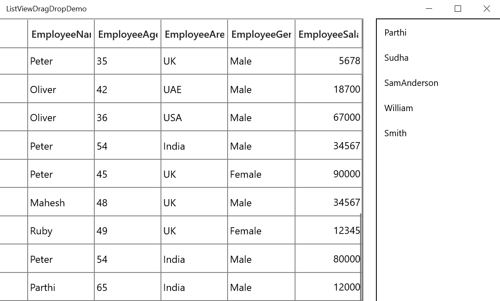

N> [View Sample in GitHub](https://github.com/SyncfusionExamples/how-to-drag-and-drop-rows-between-datagrid-and-listview-in-wpf-and-uwp/tree/master/UWP)

### Row Drag and Drop between two SfDataGrids

You should enable [AllowDraggingRows](https://help.syncfusion.com/cr/uwp/Syncfusion.UI.Xaml.Grid.SfDataGrid.html#Syncfusion_UI_Xaml_Grid_SfDataGrid_AllowDraggingRows) and [AllowDrop](https://learn.microsoft.com/en-us/uwp/api/windows.ui.xaml.uielement.allowdrop?view=winrt-22621) property for the SfDataGrid’ s which are involved in row drag and drop operations.

N> [View Sample in GitHub](https://github.com/SyncfusionExamples/how-to-drag-and-drop-rows-between-two-datagrids-in-wpf-and-uwp/tree/master/UWP)

## Context Menu

DataGrid provides an entirely customizable context menu to expose the functionality on user interface. You can create context menu for different rows in an efficient manner. 

The below code example shows the context menu with command bindings.




<MenuFlyout>
    <MenuFlyoutItem Text="Copy" Command="{Binding Path=DataGrid.DataContext.GridCopyCommand}"
                    CommandParameter="{Binding}">
    </MenuFlyoutItem>
</MenuFlyout>






public class DelegateCommand : ICommand
{

    #region Fields
    Func<object, bool> canExecute;
    Action<object> executeAction;
    #endregion

    #region Constructors
    /// 

    /// Creates a new command that can always execute.
    /// 

    /// <param name="execute">The execution logic.</param>

    public DelegateCommand(Action<object> executeAction)
        : this(executeAction, null)
    {

    }     

    /// 

    /// Creates a new command.
    /// 

    /// <param name="execute">The execution logic.</param>
    /// <param name="canExecute">The execution status logic.</param>

    public DelegateCommand(Action<object> executeAction, Func<object, bool> canExecute)
    {
        if (executeAction == null)            
            throw new ArgumentNullException("executeAction");
    
        this.executeAction = executeAction;        
        this.canExecute = canExecute;
    }        
    #endregion
    
    #region ICommand Members

    public bool CanExecute(object parameter)
    {
        bool result = true;
        Func<object, bool> canExecuteHandler = this.canExecute;

        if (canExecuteHandler != null)
        {
            result = canExecuteHandler(parameter);
            return result;
        }
        return result;
    }
    
    public event EventHandler CanExecuteChanged;

    public void RaiseCanExecuteChanged()
    {
        EventHandler handler = this.CanExecuteChanged;
        if (handler != null)
        {
           handler(this, new EventArgs());
        }
    }

    public void Execute(object parameter)
    {		
        if (this.executeAction != null)
        {
            this.executeAction(parameter);
            return;
        }           
    }
    
    #endregion
}

public class ContextMenuViewModel : MenuFlyoutItem, INotifyPropertyChanged
{

    public ContextMenuViewModel()
    {
        copyCommand = new DelegateCommand(Copy);
    }
    
    private DelegateCommand copyCommand

    public DelegateCommand CopyCommand
    {
        get
        {
            return copyCommand;
        }
        set
        {
            copyCommand = value;
        }
    }
    
    public void Copy(object param)
    {
        if (param is GridRecordContextMenuInfo)
        {
            var grid = (param as GridRecordContextMenuInfo).DataGrid;
            grid.GridCopyPaste.Copy();
        }
    }
}




### Context menu for record rows

You can set the context menu for the data rows by using [SfDataGrid.RecordContextMenu](https://help.syncfusion.com/cr/uwp/Syncfusion.UI.Xaml.Grid.SfGridBase.html#Syncfusion_UI_Xaml_Grid_SfGridBase_RecordContextMenu) property. 




<syncfusion:SfDataGrid.RecordContextMenu>
    <MenuFlyout>
        <MenuFlyoutItem x:Name="Cut" Text="Cut" />
        <MenuFlyoutItem x:Name="Copy" Text="Copy"  />
        <MenuFlyoutItem x:Name="Paste" Text="Paste" />
        <MenuFlyoutItem x:Name="Delete" Text="Delete" />
    </MenuFlyout>
</syncfusion:SfDataGrid.RecordContextMenu>





this.dataGrid.RecordContextMenu = new MenuFlyout();
this.dataGrid.RecordContextMenu.Items.Add(new MenuFlyoutItem() { Text = "Cut" });
this.dataGrid.RecordContextMenu.Items.Add(new MenuFlyoutItem() { Text = "Copy" });
this.dataGrid.RecordContextMenu.Items.Add(new MenuFlyoutItem() { Text = "Paste" });
this.dataGrid.RecordContextMenu.Items.Add(new MenuFlyoutItem() { Text = "Delete" });




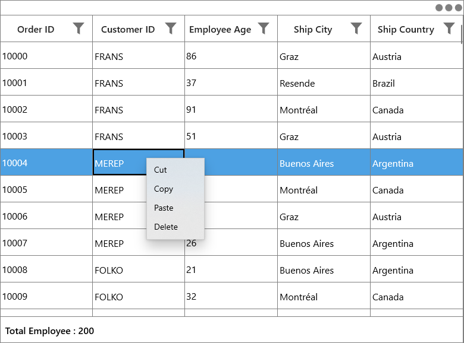

While binding the menu item using CommandBinding you can get the command parameter as [GridRecordContextMenuInfo](https://help.syncfusion.com/cr/uwp/Syncfusion.UI.Xaml.Grid.GridRecordContextMenuInfo.html) which contains the record of the corresponding row.




<syncfusion:SfDataGrid.RecordContextMenu>
	<MenuFlyout>
		<MenuFlyoutItem Text="Copy"
                        Command="{Binding Path=DataGrid.DataContext.GridCopyCommand}"
                        CommandParameter="{Binding}">
		</MenuFlyoutItem>
	<MenuFlyout>
</syncfusion:SfDataGrid.RecordContextMenu>





private void Copy(object param)
{
    if (param is GridRecordContextMenuInfo)
    {
        var grid = (param as GridRecordContextMenuInfo).DataGrid;
		var record = (param as GridRecordContextMenuInfo).Record;
        grid.GridCopyPaste.Copy();
    }
}




### Context menu for column header

You can set the context menu for the header by using [SfDataGrid.HeaderContextMenu](https://help.syncfusion.com/cr/uwp/Syncfusion.UI.Xaml.Grid.SfGridBase.html#Syncfusion_UI_Xaml_Grid_SfGridBase_HeaderContextMenu) property. 



<syncfusion:SfDataGrid.HeaderContextMenu>
    <MenuFlyout>
        <MenuFlyoutItem x:Name=" SortAscending " Text="SortAscending" />
        <MenuFlyoutItem x:Name=" SortDescending " Text="SortDescending" />
        <MenuFlyoutItem x:Name=" ClearSorting " Text="ClearSorting" />
        <MenuFlyoutItem x:Name=" ClearFiltering " Text="ClearFiltering" />
        <MenuFlyoutItem x:Name=" Group by this column " Text="Group by this column" />
        <MenuFlyoutItem x:Name=" Expand/Collapse Group Drop Area " Text="Expand/Collapse Group Drop Area" />
        <MenuFlyoutItem x:Name=" BestFit " Text="BestFit" />
    </MenuFlyout>
</syncfusion:SfDataGrid.HeaderContextMenu>





this.dataGrid.HeaderContextMenu = new MenuFlyout();
this.dataGrid.HeaderContextMenu.Items.Add(new MenuFlyoutItem() { Text = "SortAscending" });
this.dataGrid.HeaderContextMenu.Items.Add(new MenuFlyoutItem() { Text = "SortDescending" });
this.dataGrid.HeaderContextMenu.Items.Add(new MenuFlyoutItem() { Text = "ClearSorting" });
this.dataGrid.HeaderContextMenu.Items.Add(new MenuFlyoutItem() { Text = " ClearFiltering " });
this.dataGrid.HeaderContextMenu.Items.Add(new MenuFlyoutItem() { Text = "Group by this column" });
this.dataGrid.HeaderContextMenu.Items.Add(new MenuFlyoutItem() { Text = "Expand/Collapse Group Drop Area" });
this.dataGrid.HeaderContextMenu.Items.Add(new MenuFlyoutItem() { Text = "BestFit" });




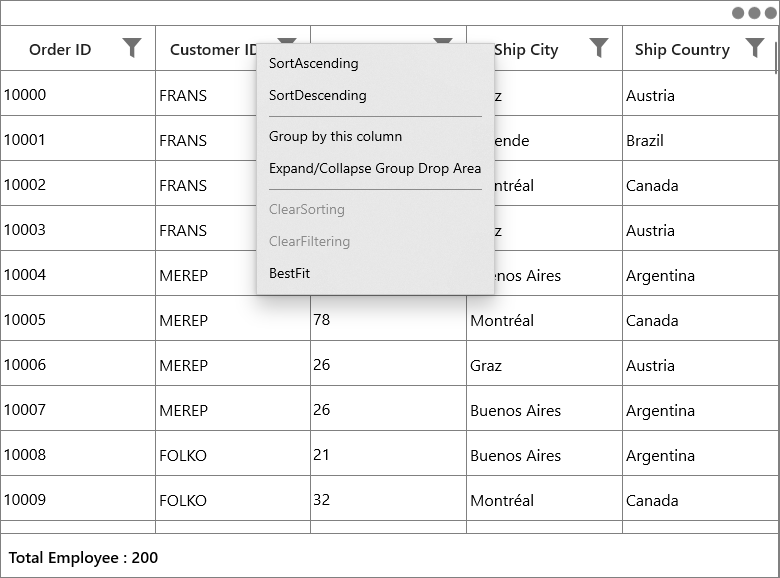

While binding the menu item using CommandBinding you can get the parameter as [GridColumnContextMenuInfo](https://help.syncfusion.com/cr/uwp/Syncfusion.UI.Xaml.Grid.GridColumnContextMenuInfo.html) which contains the particular GridColumn.




<syncfusion:SfDataGrid.HeaderContextMenu>
	<MenuFlyout>
        <MenuFlyoutItem Text="SortAscending"
                        Command="{Binding Path=DataGrid.DataContext.SortAscendingCommand}"                                    
                        CommandParameter="{Binding}" >
		</MenuFlyoutItem>
	<MenuFlyout>
</syncfusion:SfDataGrid.HeaderContextMenu>





private void SortAscending(object param)                
{
    if (param is GridColumnContextMenuInfo)
    {
        var grid = (param as GridContextMenuInfo).DataGrid;
        var column = (param as GridColumnContextMenuInfo).Column;
        grid.SortColumnDescriptions.Clear();
        grid.SortColumnDescriptions.Add(new SortColumnDescription() { ColumnName = column.MappingName, SortDirection = ListSortDirection.Ascending });
    }
}




### Context menu for group drop area

You can set the context menu for the GroupDropArea by using [SfDataGrid.GroupDropAreaContextMenu](https://help.syncfusion.com/cr/uwp/Syncfusion.UI.Xaml.Grid.SfDataGrid.html#Syncfusion_UI_Xaml_Grid_SfDataGrid_GroupDropAreaContextMenu) property. 




<syncfusion:SfDataGrid.GroupDropAreaContextMenu>
    <MenuFlyout>
        <MenuFlyoutItem x:Name=" ExpandAll " Text="ExpandAll" />
        <MenuFlyoutItem x:Name=" CollapseAll " Text="CollapseAll" />
        <MenuFlyoutItem x:Name=" ClearGroups " Text="ClearGroups" />
    </MenuFlyout>
</syncfusion:SfDataGrid.GroupDropAreaContextMenu>





this.dataGrid.GroupDropAreaContextMenu = new MenuFlyout();
this.dataGrid.GroupDropAreaContextMenu.Items.Add(new MenuFlyoutItem() { Text = "ExpandAll" });
this.dataGrid.GroupDropAreaContextMenu.Items.Add(new MenuFlyoutItem() { Text = "CollapseAll" });
this.dataGrid.GroupDropAreaContextMenu.Items.Add(new MenuFlyoutItem() { Text = "ClearGroups" });




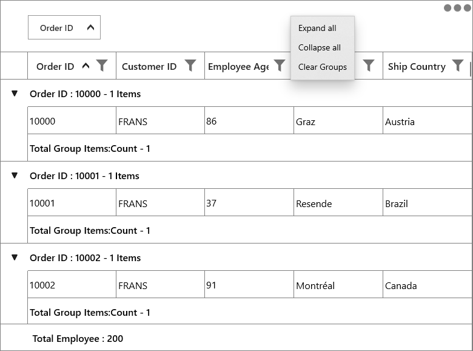

While binding the menu item using CommandBinding you can get the parameter as [GridGroupDropAreaContextMenuInfo](https://help.syncfusion.com/cr/uwp/Syncfusion.UI.Xaml.Grid.GridGroupDropAreaContextMenuInfo.html). 




<syncfusion:SfDataGrid.GroupDropAreaContextMenu>
	<MenuFlyout>
        <MenuFlyoutItem Text="Expand all"
                        Command="{Binding Path=DataGrid.DataContext.ExpandAllCommand}"        
                        CommandParameter="{Binding}" >
		</MenuFlyoutItem>
	</MenuFlyout>
</syncfusion:SfDataGrid.GroupDropAreaContextMenu>





private void ExpandAll(object param)
{
    if (param is Syncfusion.UI.Xaml.Grid.GridContextMenuInfo)
    {
        var grid = (param as Syncfusion.UI.Xaml.Grid.GridContextMenuInfo).DataGrid;
        grid.ExpandAllGroup();
    }
}




### Context menu for group item

You can set the context menu for the group drop item by using [SfDataGrid.GroupDropItemContextMenu](https://help.syncfusion.com/cr/uwp/Syncfusion.UI.Xaml.Grid.SfDataGrid.html#Syncfusion_UI_Xaml_Grid_SfDataGrid_GroupDropItemContextMenu) property. 




<syncfusion:SfDataGrid.GroupDropItemContextMenu>
    <MenuFlyout>
        <MenuFlyoutItem x:Name=" ExpandAll " Text="ExpandAll" />
        <MenuFlyoutItem x:Name=" CollapseAll " Text="CollapseAll" />
        <MenuFlyoutItem x:Name=" SortAscending " Text="SortAscending" />
        <MenuFlyoutItem x:Name=" SortDescending " Text="SortDescending" />
        <MenuFlyoutItem x:Name=" ClearGroup " Text="ClearGroup" />
        <MenuFlyoutItem x:Name=" ClearSorting " Text="ClearSorting" />
    </MenuFlyout>
</syncfusion:SfDataGrid.GroupDropItemContextMenu>





this.dataGrid.GroupDropItemContextMenu = new MenuFlyout();
this.dataGrid.GroupDropItemContextMenu.Items.Add(new MenuFlyoutItem() { Text = "ExpandAll" });
this.dataGrid.GroupDropItemContextMenu.Items.Add(new MenuFlyoutItem() { Text = "CollapseAll" });
this.dataGrid.GroupDropItemContextMenu.Items.Add(new MenuFlyoutItem() { Text = "SortAscending" });
this.dataGrid.GroupDropItemContextMenu.Items.Add(new MenuFlyoutItem() { Text = "SortDescending" });
this.dataGrid.GroupDropItemContextMenu.Items.Add(new MenuFlyoutItem() { Text = "ClearGroup" });
this.dataGrid.GroupDropItemContextMenu.Items.Add(new MenuFlyoutItem() { Text = "ClearSorting" });




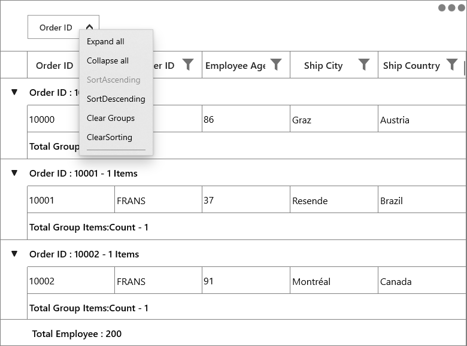

While binding the menu item using CommandBinding you can get the parameter as [GridColumnContextMenuInfo](https://help.syncfusion.com/cr/uwp/Syncfusion.UI.Xaml.Grid.GridColumnContextMenuInfo.html) which contains the particular GridColumn.




<syncfusion:SfDataGrid.GroupDropItemContextMenu>
	<MenuFlyout>
		<MenuFlyoutItem Text="Collapse all"
                    Command="{Binding Path=DataGrid.DataContext.CollapseAllCommand}"
                    CommandParameter="{Binding}" >					
		</MenuFlyoutItem>
	</MenuFlyout>
</syncfusion:SfDataGrid.GroupDropItemContextMenu>





private void CollapseAll(object param)
{
    if (param is GridContextMenuInfo)
    {
        var grid = (param as GridContextMenuInfo).DataGrid;
        grid.CollapseAllGroup();
    }
}




### Context menu for caption summary wow

You can set the context menu for the group caption by using [SfDataGrid.GroupCaptionContextMenu](https://help.syncfusion.com/cr/uwp/Syncfusion.UI.Xaml.Grid.SfDataGrid.html#Syncfusion_UI_Xaml_Grid_SfDataGrid_GroupCaptionContextMenu) property. 




<syncfusion:SfDataGrid.GroupCaptionContextMenu>
    <MenuFlyout>
        <MenuFlyoutItem x:Name=" Expand " Text="Expand" />
        <MenuFlyoutItem x:Name=" Collapse " Text="Collapse" />
    </MenuFlyout>
</syncfusion:SfDataGrid.GroupCaptionContextMenu>





this.dataGrid.GroupCaptionContextMenu = new MenuFlyout();
this.dataGrid.GroupCaptionContextMenu.Items.Add(new MenuFlyoutItem() { Text = "Expand" });
this.dataGrid.GroupCaptionContextMenu.Items.Add(new MenuFlyoutItem() { Text = "Collapse" });




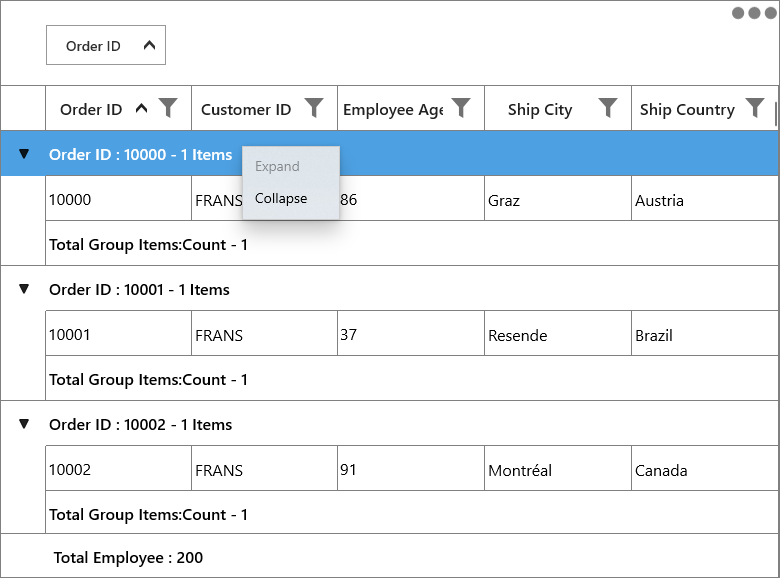

While binding the menu item using CommandBinding you can get the command parameter as [GridRecordContextMenuInfo](https://help.syncfusion.com/cr/uwp/Syncfusion.UI.Xaml.Grid.GridRecordContextMenuInfo.html) which contains the record of the corresponding row.




<syncfusion:SfDataGrid.GroupCaptionContextMenu>
	<MenuFlyout>
        <MenuFlyoutItem Text="Expand" 
						Command="{Binding Path=DataGrid.DataContext.ExpandCommand}"
						CommandParameter="{Binding}"/>				
		</MenuFlyoutItem>
	<MenuFlyout>
</syncfusion:SfDataGrid.GroupCaptionContextMenu>





private void Expand(object param)
{
    if (param is GridRecordContextMenuInfo)
    {
        var grid = (param as GridRecordContextMenuInfo).DataGrid;
        var group = (param as GridRecordContextMenuInfo).Record as Group;
        grid.ExpandGroup(group);
    }
}




### Context menu for group summary row

You can set the context menu for the group summary by using [SfDataGrid.GroupSummaryContextMenu](https://help.syncfusion.com/cr/uwp/Syncfusion.UI.Xaml.Grid.SfDataGrid.html#Syncfusion_UI_Xaml_Grid_SfDataGrid_GroupSummaryContextMenu) property. 




<syncfusion:SfDataGrid.GroupSummaryContextMenu>
    <MenuFlyout>
        <MenuFlyoutItem x:Name="ClearSummary" Text="ClearSummary" />
    </MenuFlyout>
</syncfusion:SfDataGrid.GroupSummaryContextMenu>





this.dataGrid.GroupSummaryContextMenu = new MenuFlyout();
this.dataGrid.GroupSummaryContextMenu.Items.Add(new MenuFlyoutItem() { Text = "ClearSummary" });




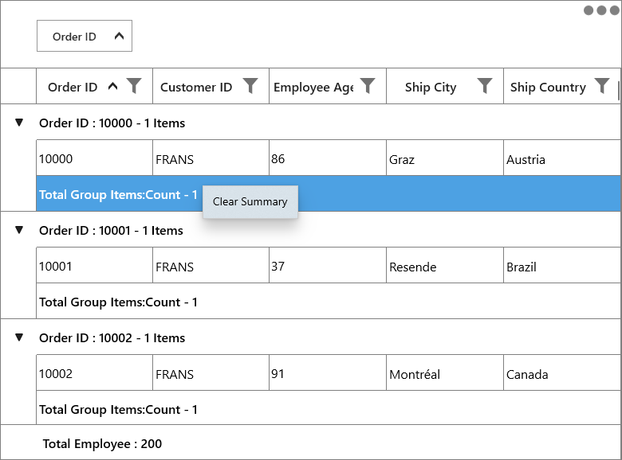

While binding the menu item using CommandBinding you can get the command parameter as [GridRecordContextMenuInfo](https://help.syncfusion.com/cr/uwp/Syncfusion.UI.Xaml.Grid.GridRecordContextMenuInfo.html) which contains the record of the corresponding row.




<syncfusion:SfDataGrid.GroupSummaryContextMenu>
	<MenuFlyout>
        <MenuFlyoutItem Text="Clear Summary"
                        Command="{Binding Path=DataGrid.DataContext.ClearSummaryCommand}"
                        CommandParameter="{Binding}">
		</MenuFlyoutItem>
	</MenuFlyout>
</syncfusion:SfDataGrid.GroupSummaryContextMenu>





private void ClearSummary(object param)
{
    if (param is GridRecordContextMenuInfo)
    {
        var grid = (param as GridRecordContextMenuInfo).DataGrid;

        if (grid.GroupSummaryRows.Any())
            grid.GroupSummaryRows.Clear();
    }
}




### Context menu for table summary row

You can set the context menu for the table summary by using [SfDataGrid.TableSummaryContextMenu](https://help.syncfusion.com/cr/uwp/Syncfusion.UI.Xaml.Grid.SfDataGrid.html#Syncfusion_UI_Xaml_Grid_SfDataGrid_TableSummaryContextMenu) property. 




<syncfusion:SfDataGrid.TableSummaryContextMenu>
    <MenuFlyout>
        <MenuFlyoutItem x:Name="TableSummaryCount" Text="Count" />
        <MenuFlyoutItem x:Name="TableSummaryMax" Text="Max" />
        <MenuFlyoutItem x:Name="TableSummaryMin" Text="Min" />
        <MenuFlyoutItem x:Name="TableSummaryMin" Text="Average" />
        <MenuFlyoutItem x:Name="TableSummaryMin" Text="Sum" />
    </MenuFlyout>
</syncfusion:SfDataGrid.TableSummaryContextMenu>





this.dataGrid.TableSummaryContextMenu = new MenuFlyout();
this.dataGrid.TableSummaryContextMenu.Items.Add(new MenuFlyoutItem() { Text = "Count" });
this.dataGrid.TableSummaryContextMenu.Items.Add(new MenuFlyoutItem() { Text = "Max" });
this.dataGrid.TableSummaryContextMenu.Items.Add(new MenuFlyoutItem() { Text = "Min" });
this.dataGrid.TableSummaryContextMenu.Items.Add(new MenuFlyoutItem() { Text = "Average" });
this.dataGrid.TableSummaryContextMenu.Items.Add(new MenuFlyoutItem() { Text = "Sum" });




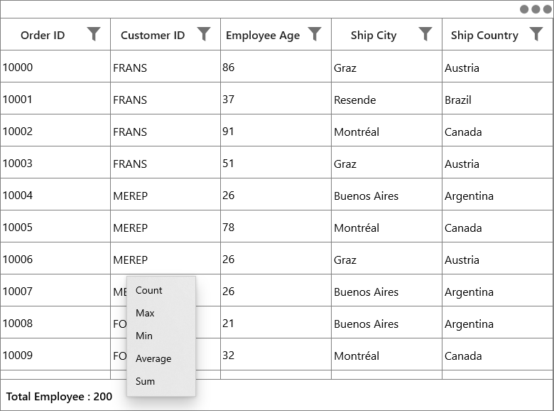

While binding the menu item using CommandBinding you can get the command parameter as [GridRecordContextMenuInfo](https://help.syncfusion.com/cr/uwp/Syncfusion.UI.Xaml.Grid.GridRecordContextMenuInfo.html) which contains the record of the corresponding row.




<syncfusion:SfDataGrid.TableSummaryContextMenu>
	<MenuFlyout>
        <MenuFlyoutItem Command="{Binding Path=DataGrid.DataContext.TotalSummaryCountCommand}" 
						CommandParameter="{Binding}" 
						Text="Count" >
		</MenuFlyoutItem>
	</MenuFlyout>
</syncfusion:SfDataGrid.TableSummaryContextMenu>





private void TotalSummaryCount(object param)
{
    if (param is GridRecordContextMenuInfo)
    {
        var grid = (param as GridRecordContextMenuInfo).DataGrid;
        var record = (param as GridRecordContextMenuInfo).Record as SummaryRecordEntry;
        if (record != null)
        {
            var summaryrow = new GridSummaryRow() { Name = "totalgroupsummaryrow", Title = "{totalSummary}", ShowSummaryInRow = true };
            summaryrow.SummaryColumns.Add(new GridSummaryColumn() { Name = "totalSummary", MappingName = "OrderID", SummaryType = SummaryType.CountAggregate, Format = "Total Employee Count : {Count}" });
            grid.TableSummaryRows.Clear();
            grid.TableSummaryRows.Add(summaryrow);
        }
    }
}




### Events

#### GridContextMenuOpening

[GridContextMenuOpening](https://help.syncfusion.com/cr/uwp/Syncfusion.UI.Xaml.Grid.SfDataGrid.html) event occurs while opening the context menu in SfDataGrid. 

[GridContextMenuEventArgs](https://help.syncfusion.com/cr/uwp/Syncfusion.UI.Xaml.Grid.GridContextMenuEventArgs.html) has the following members which provides the information about `GridContextMenuOpening` event.

* [ContextMenu](https://help.syncfusion.com/cr/uwp/Syncfusion.UI.Xaml.Grid.GridContextMenuEventArgs.html#Syncfusion_UI_Xaml_Grid_GridContextMenuEventArgs_ContextMenu) – Gets the corresponding context menu.

* [ContextMenuInfo](https://help.syncfusion.com/cr/uwp/Syncfusion.UI.Xaml.Grid.GridContextMenuEventArgs.html#Syncfusion_UI_Xaml_Grid_GridContextMenuEventArgs_ContextMenuInfo) – Returns the context menu info based on the row which opens the context menu.

* [ContextMenuType](https://help.syncfusion.com/cr/uwp/Syncfusion.UI.Xaml.Grid.GridContextMenuEventArgs.html#Syncfusion_UI_Xaml_Grid_GridContextMenuEventArgs__ctor_Windows_UI_Xaml_Controls_MenuFlyout_System_Object_Syncfusion_UI_Xaml_ScrollAxis_RowColumnIndex_Syncfusion_UI_Xaml_Grid_ContextMenuType_System_Object_) – Returns the type of context menu.

* [RowColumnIndex](https://help.syncfusion.com/cr/uwp/Syncfusion.UI.Xaml.Grid.GridContextMenuEventArgs.html#Syncfusion_UI_Xaml_Grid_GridContextMenuEventArgs__ctor_Windows_UI_Xaml_Controls_MenuFlyout_System_Object_Syncfusion_UI_Xaml_ScrollAxis_RowColumnIndex_Syncfusion_UI_Xaml_Grid_ContextMenuType_System_Object_) – `RowColumnIndex` of the context menu which is currently going to open. `RowColumnIndex` is updated only for the `RecordContextMenu` and remains left empty.

* [Handled](https://help.syncfusion.com/cr/uwp/Syncfusion.UI.Xaml.Grid.GridHandledEventArgs.html#Syncfusion_UI_Xaml_Grid_GridHandledEventArgs_Handled) – Indicates whether the `GridContextMenuOpening` event is handled or not.

### Customization of context menu

#### Change the menu item when the context menu opening.

You can use the `GridContextMenuOpening` event to change the menu item when the context menu opening.




<syncfusion:SfDataGrid.RecordContextMenu>
    <MenuFlyout>
        <MenuFlyoutItem Text="Cut"
                                Command="{Binding Path=DataGrid.DataContext.GridCutCommand}"
                                CommandParameter="{Binding}"/>
        <MenuFlyoutItem Text="Copy"
                                Command="{Binding Path=DataGrid.DataContext.GridCopyCommand}"
                                CommandParameter="{Binding}"/>
        <MenuFlyoutItem Text="Paste"
                                Command="{Binding Path=DataGrid.DataContext.GridPasteCommand}"
                                CommandParameter="{Binding}"/>
    </MenuFlyout>
</syncfusion:SfDataGrid.RecordContextMenu>





this.dataGrid.GridContextMenuOpening += DataGrid_GridContextMenuOpening;

private void DataGrid_GridContextMenuOpening(object sender, GridContextMenuEventArgs e)
{
    e.ContextMenu.Items.Clear();

    if (e.ContextMenuType == ContextMenuType.RecordCell)
    {
        e.ContextMenu.Items.Add(new MenuFlyoutItem() { Text = "Record" });
        e.ContextMenu.Items.Add(new MenuFlyoutItem() { Text = "Data" });
    }
}



       
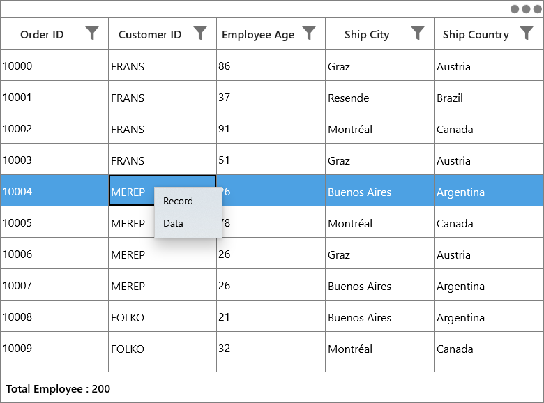

#### Customizing appearance of context menu

You can change the appearance of the context menu by customizing the style with TargetType as MenuFlyoutPresenter.




<MenuFlyout MenuFlyoutPresenterStyle="{StaticResource MenuFlyoutPresenterStyle}">
    <MenuFlyoutItem x:Name="Cut" Text="Cut" />
    <MenuFlyoutItem x:Name="Copy" Text="Copy"  />
    <MenuFlyoutItem x:Name="Paste" Text="Paste" />
    <MenuFlyoutItem x:Name="Delete" Text="Delete" />
</MenuFlyout>




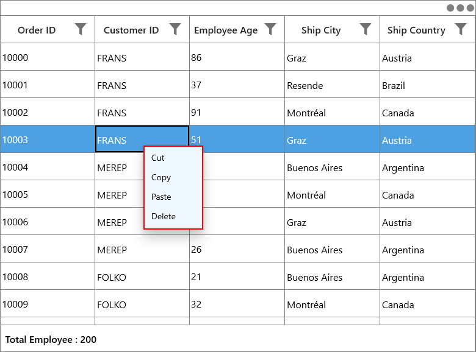
