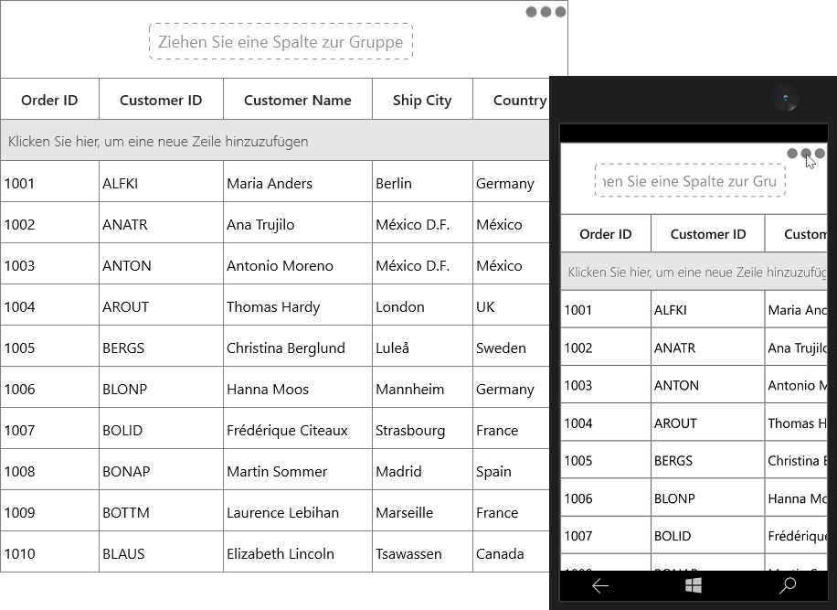
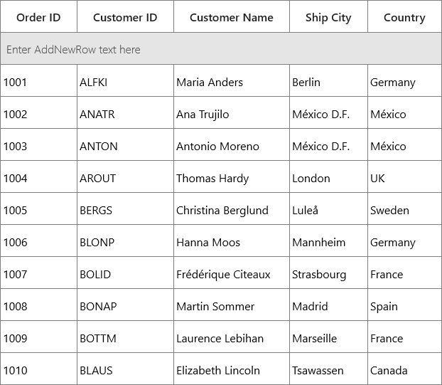

# Localization 

Localization is the process of translating the application resources into different language for the specific cultures. You can localize the SfDataGrid by adding resource file. Application culture can be changed by setting [CurrentUICulture](https://msdn.microsoft.com/en-us/library/system.globalization.cultureinfo.currentuiculture.aspx) before `InitializeComponent()` method.
 
Below application culture changed to German.



public MainPage()
{
    System.Globalization.CultureInfo.CurrentUICulture = new System.Globalization.CultureInfo("de");
    this.InitializeComponent();
} 



To localize the SfDataGrid based on [CurrentUICulture](https://msdn.microsoft.com/en-us/library/system.globalization.cultureinfo.currentuiculture.aspx)  using .resw files, follow the below steps.
 
1. Right-click on the project, select **Add** and then **NewItem**.

2. In Add New Item wizard, select the **Resource File** option and name the filename as **Syncfusion.SfGrid.UWP.Resources.<culture name>.resw** .
 

For example, you have to give name as **Syncfusion.SfGrid.UWP.Resources.de.resw** for German culture.
 
3. The culture name that indicates the name of language and country.
 
4. Now the resource file is added.

5.Add the Name/Value pair in Resource Designer of **Syncfusion.SfGrid.UWP.Resources.de.resw** file and change its corresponding value to corresponding culture.
 

You can get the SfDataGrid’s key from default resource  [Syncfusion.SfGrid.UWP.Resources.resw](https://www.syncfusion.com/downloads/support/directtrac/general/ze/Syncfusion.SfGrid.UWP.Resources-145129753.zip).

## Editing default culture resource

You can edit default resource file by adding it to your application where SfDataGrid reads the static texts from here. You can download the default resource file from [here](https://www.syncfusion.com/downloads/support/directtrac/general/ze/Syncfusion.SfGrid.UWP.Resources-145129753.zip).

Now, change the Name/Value pair in Resource Designer of **Syncfusion.SfGrid.UWP.Resources.resw** file.

