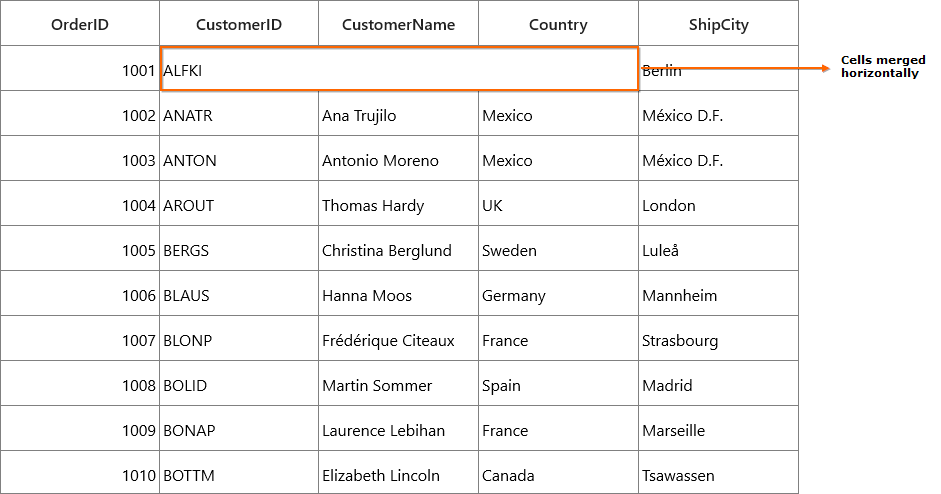
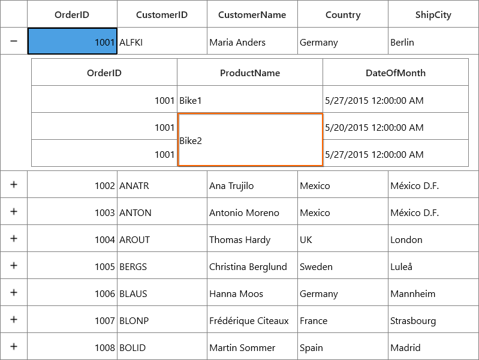

# Merge cells 	

SfDataGrid allows you to merge the range of adjacent cells using [QueryCoveredRange](https://help.syncfusion.com/cr/uwp/Syncfusion.UI.Xaml.Grid.SfDataGrid.html) event. Merged cells can be exported and printed.

`QueryCoveredRange` event occurs when each cell gets arranged and the custom range will be stored for visible rows and columns in [SfDataGrid.CoveredCells](https://help.syncfusion.com/cr/uwp/Syncfusion.UI.Xaml.Grid.SfDataGrid.html#Syncfusion_UI_Xaml_Grid_SfDataGrid_CoveredCells). This event is not fired for the cells that are not visible and also for the cells that are already in SfDataGrid.CoveredCells. When scrolling the merged range will be added for newly added rows & columns through this event and also removed for the rows &columns which are out of view.

[GridQueryCoveredRangeEventArgs](https://help.syncfusion.com/cr/uwp/Syncfusion.UI.Xaml.Grid.GridQueryCoveredRangeEventArgs.html) of the `QueryCoveredRange` event provides information about the cell triggered this event. [GridQueryCoveredRangeEventArgs.OriginalSender](https://help.syncfusion.com/cr/uwp/Syncfusion.UI.Xaml.Grid.GridEventArgs.html#Syncfusion_UI_Xaml_Grid_GridEventArgs_OriginalSender) returns the DataGrid fired this event for DetailsView. By [GridQueryCoveredRangeEventArgs.Range](https://help.syncfusion.com/cr/uwp/Syncfusion.UI.Xaml.Grid.GridQueryCoveredRangeEventArgs.html#Syncfusion_UI_Xaml_Grid_GridQueryCoveredRangeEventArgs_Range) property, the adjacent cells can be merged.



<syncfusion:SfDataGrid x:Name="dataGrid" 
                       ItemsSource="{Binding Orders}" 
                       SelectionUnit="Cell"
                       NavigationMode="Cell"
                       QueryCoveredRange="dataGrid_QueryCoveredRange"/>


dataGrid.QueryCoveredRange += dataGrid_QueryCoveredRange;
dataGrid.SelectionUnit = GridSelectionUnit.Cell;
dataGrid.NavigationMode = Syncfusion.UI.Xaml.Grid.NavigationMode.Cell;

void dataGrid_QueryCoveredRange(object sender, GridQueryCoveredRangeEventArgs e)
{
    
}



## Merging cells

You can merge the range of cells by setting [CoveredCellInfo](https://help.syncfusion.com/cr/uwp/Syncfusion.UI.Xaml.Grid.SfDataGrid.html#Syncfusion_UI_Xaml_Grid_SfDataGrid_CurrentCellInfo) (by defining Left, Right, Top & Bottom) to [GridQueryCoveredRangeEventArgs.Range](https://help.syncfusion.com/cr/uwp/Syncfusion.UI.Xaml.Grid.GridQueryCoveredRangeEventArgs.html#Syncfusion_UI_Xaml_Grid_GridQueryCoveredRangeEventArgs_Range) and handling the event. 

### Merging cells horizontally by fixed range

You can merge the columns in a row by setting the column range using Left and Right properties of [CoveredCellInfo](https://help.syncfusion.com/cr/uwp/Syncfusion.UI.Xaml.Grid.SfDataGrid.html#Syncfusion_UI_Xaml_Grid_SfDataGrid_CurrentCellInfo).   



void dataGrid_QueryCoveredRange(object sender, GridQueryCoveredRangeEventArgs e)
{

    if (e.RowColumnIndex.RowIndex == 1)
    {

        if (e.RowColumnIndex.ColumnIndex >= 1 && e.RowColumnIndex.ColumnIndex <= 3)
        {
            e.Range = new CoveredCellInfo(1, 3, 1, 1);
            e.Handled = true;
        }
    }
}



### Merging cells vertically by fixed range

You can merge the range of rows for a particular column by setting the row range using Top and Bottom properties of [CoveredCellInfo](https://help.syncfusion.com/cr/uwp/Syncfusion.UI.Xaml.Grid.SfDataGrid.html#Syncfusion_UI_Xaml_Grid_SfDataGrid_CurrentCellInfo).



void dataGrid_QueryCoveredRange(object sender, GridQueryCoveredRangeEventArgs e)
{

    if (e.RowColumnIndex.ColumnIndex == 1)
    {

        if (e.RowColumnIndex.RowIndex >= 1 && e.RowColumnIndex.RowIndex <= 5)
        {
            e.Range = new CoveredCellInfo(1, 1, 1, 5);
            e.Handled = true;
        }
    }
}



### Merging range of cells

You can merge the range of rows and columns by setting the range using Left, Right, Top and Bottom properties of [CoveredCellInfo](https://help.syncfusion.com/cr/uwp/Syncfusion.UI.Xaml.Grid.SfDataGrid.html#Syncfusion_UI_Xaml_Grid_SfDataGrid_CurrentCellInfo).



private void dataGrid_QueryCoveredRange(object sender, GridQueryCoveredRangeEventArgs e)
{    

    //Merge range

    if (e.RowColumnIndex.ColumnIndex == 1 && e.RowColumnIndex.RowIndex == 1)
    {                             
        e.Range = new CoveredCellInfo(1, 2, 1, 5);
        e.Handled = true;                
    }    
}



## Merging cells based on the content

You can merge the redundant data in adjacent cells in a row or columns using [QueryCoveredRange](https://help.syncfusion.com/cr/uwp/Syncfusion.UI.Xaml.Grid.SfDataGrid.html) event. 

In the below code, GetRange method returns range for a cell based on adjacent cells content. From range from GetRange method `QueryCoveredRange` handler sets the range if the calculated range is already not exist in the  [SfDataGrid.CoveredCells](https://help.syncfusion.com/cr/uwp/Syncfusion.UI.Xaml.Grid.SfDataGrid.html#Syncfusion_UI_Xaml_Grid_SfDataGrid_CoveredCells) using [CoveredCells.IsInRange](https://help.syncfusion.com/cr/uwp/Syncfusion.UI.Xaml.Grid.CoveredCellInfoCollection.html#Syncfusion_UI_Xaml_Grid_CoveredCellInfoCollection_IsInRange_Syncfusion_UI_Xaml_Grid_CoveredCellInfo_) method.



dataGrid.ItemsSourceChanged += dataGrid_ItemsSourceChanged;
dataGrid.QueryCoveredRange += dataGrid_QueryCoveredRange;

/// 

/// Reflector for SfDataGrid’s data.
/// 

IPropertyAccessProvider reflector = null;

/// 

/// ItemsSourceChanged event handler.
/// 

void dataGrid_ItemsSourceChanged(object sender, GridItemsSourceChangedEventArgs e)
{

    if (dataGrid.View != null)
        reflector = dataGrid.View.GetPropertyAccessProvider();

    else
        reflector = null;
}

/// 

/// QueryCoveredRange event handler
/// 

void dataGrid_QueryCoveredRange(object sender, GridQueryCoveredRangeEventArgs e)
{    
    var range = GetRange(e.GridColumn, e.RowColumnIndex.RowIndex, e.RowColumnIndex.ColumnIndex, e.Record);

    if (range == null)
        return;

  // You can know that the range is already exist in Covered Cells by IsInRange method.

  if (!dataGrid.CoveredCells.IsInRange(range))
  {  
       e.Range = range;
       e.Handled = true;
  }

  //If the calculated range is already exist in CoveredCells, you can get the range using SfDataGrid.GetConflictRange (CoveredCellInfo coveredCellInfo) extension method.
}

/// 

/// Method to get the covered range based on cell value.
/// 

/// <param name="column"></param>
/// <param name="rowIndex"></param>
/// <param name="columnIndex"></param>
/// <param name="rowData"></param>
/// <returns> Compares the adjacent cell value and returns the range </returns>
/// <remark> If the method find that the adjacent values are equal by horizontal then it will merge vertically. And vice versa</remarks>

private CoveredCellInfo GetRange(GridColumn column, int rowIndex, int columnIndex, object rowData)
{
    var range = new CoveredCellInfo(columnIndex, columnIndex, rowIndex, rowIndex);
    object data = reflector.GetFormattedValue(rowData, column.MappingName);

    GridColumn leftColumn = null;
    GridColumn rightColumn = null;

    // total rows count.
    int recordsCount = this.dataGrid.GroupColumnDescriptions.Count != 0 ? (this.dataGrid.View.TopLevelGroup.DisplayElements.Count + this.dataGrid.TableSummaryRows.Count + this.dataGrid.UnBoundRows.Count + (this.dataGrid.AddNewRowPosition == AddNewRowPosition.Top ? +1 : 0)) : (this.dataGrid.View.Records.Count + this.dataGrid.TableSummaryRows.Count + this.dataGrid.UnBoundRows.Count + (this.dataGrid.AddNewRowPosition == AddNewRowPosition.Top ? +1 : 0));

    // Merge Horizontally

    // compare right column               

    for (int i = dataGrid.Columns.IndexOf(column); i < this.dataGrid.Columns.Count - 1; i++)
    {
        var compareData = reflector.GetFormattedValue(rowData, dataGrid.Columns[i + 1].MappingName);

        if (compareData == null)
            break;

        if (!compareData.Equals(data))
            break;
        rightColumn = dataGrid.Columns[i + 1];
    }

    // compare left column.
 
    for (int i = dataGrid.Columns.IndexOf(column); i > 0; i--)
    {
        var compareData = reflector.GetFormattedValue(rowData, dataGrid.Columns[i - 1].MappingName);

        if (compareData == null)
            break;

        if (!compareData.Equals(data))
            break;
        leftColumn = dataGrid.Columns[i - 1];
    }

    if (leftColumn != null || rightColumn != null)
    {

        // set left index

        if (leftColumn != null)
        {
            var leftColumnIndex = this.dataGrid.ResolveToScrollColumnIndex(this.dataGrid.Columns.IndexOf(leftColumn));
            range = new CoveredCellInfo(leftColumnIndex, range.Right, range.Top, range.Bottom);
        }

        // set right index

        if (rightColumn != null)
        {
            var rightColumnIndex = this.dataGrid.ResolveToScrollColumnIndex(this.dataGrid.Columns.IndexOf(rightColumn));
            range = new CoveredCellInfo(range.Left, rightColumnIndex, range.Top, range.Bottom);
        }
        return range;
    }

    // Merge Vertically from the row index.

    int previousRowIndex = -1;
    int nextRowIndex = -1;

    // Get previous row data.                
    var startIndex = dataGrid.ResolveStartIndexBasedOnPosition();

    for (int i = rowIndex - 1; i >= startIndex; i--)
    {
        var previousData = this.dataGrid.GetRecordEntryAtRowIndex(i);

        if (previousData == null || !previousData.IsRecords)
            break;
        var compareData = reflector.GetFormattedValue((previousData as RecordEntry).Data, column.MappingName);

        if (compareData == null)
            break;

        if (!compareData.Equals(data))
            break;
        previousRowIndex = i;
    }

    // get next row data.

    for (int i = rowIndex + 1; i < recordsCount + 1; i++)
    {
        var nextData = this.dataGrid.GetRecordEntryAtRowIndex(i);

        if (nextData == null || !nextData.IsRecords)
            break;
        var compareData = reflector.GetFormattedValue((nextData as RecordEntry).Data, column.MappingName);

        if (compareData == null)
            break;

        if (!compareData.Equals(data))
            break;
        nextRowIndex = i;
    }

    if (previousRowIndex != -1 || nextRowIndex != -1)
    {

        if (previousRowIndex != -1)
            range = new CoveredCellInfo(range.Left, range.Right, previousRowIndex, range.Bottom);

        if (nextRowIndex != -1)
            range = new CoveredCellInfo(range.Left, range.Right, range.Top, nextRowIndex);
        return range;
    }
    return null;
}



## Merge cells in Master-details view

Master- details view allows you to merge the range of cells using the [QueryCoveredRange](https://help.syncfusion.com/cr/uwp/Syncfusion.UI.Xaml.Grid.SfDataGrid.html) event of [ViewDefinition.DataGrid](https://help.syncfusion.com/cr/uwp/Syncfusion.UI.Xaml.Grid.GridViewDefinition.html#Syncfusion_UI_Xaml_Grid_GridViewDefinition_DataGrid). You can get the `DetailsViewDataGrid` which triggered the event from [GridQueryCoveredRangeEventArgs.OriginalSender](https://help.syncfusion.com/cr/uwp/Syncfusion.UI.Xaml.Grid.GridEventArgs.html#Syncfusion_UI_Xaml_Grid_GridEventArgs_OriginalSender) of the QueryCoveredRange event.



<syncfusion:SfDataGrid x:Name="dataGrid" 
                       SelectionUnit="Cell" 
                       NavigationMode="Cell"
                       AutoGenerateColumns="True"   ColumnSizer="Star"
                       ItemsSource="{Binding Orders}">
    <syncfusion:SfDataGrid.DetailsViewDefinition>
        <syncfusion:GridViewDefinition RelationalColumn="ProductDetails">
            <syncfusion:GridViewDefinition.DataGrid>
                <syncfusion:SfDataGrid x:Name="FirstLevelNestedGrid"                                                                                                                                             
                                       AutoGenerateColumns="True"                                             
                                       QueryCoveredRange="FirstLevelNestedGrid_QueryCoveredRange"
                                        />
            </syncfusion:GridViewDefinition.DataGrid>
        </syncfusion:GridViewDefinition>
    </syncfusion:SfDataGrid.DetailsViewDefinition>
</syncfusion:SfDataGrid>


dataGrid.SelectionUnit = GridSelectionUnit.Cell;
dataGrid.NavigationMode = Syncfusion.UI.Xaml.Grid.NavigationMode.Cell;
FirstLevelNestedGrid.QueryCoveredRange +=FirstLevelNestedGrid_QueryCoveredRange;

private void FirstLevelNestedGrid_QueryCoveredRange(object sender, GridQueryCoveredRangeEventArgs e)
{

    if(e.RowColumnIndex.ColumnIndex == 1)
    {

        if(e.RowColumnIndex.RowIndex >= 2 && e.RowColumnIndex.RowIndex <= 3)
        {
            e.Range = new CoveredCellInfo(1, 1, 2, 3);
            e.Handled = true;
        }
    }
}



### Merging range of parent cells 

You can’t vertically merge the cells of row when it has details view. You can check whether the row have details view or not using [CanMergeNextRows](https://help.syncfusion.com/cr/uwp/Syncfusion.UI.Xaml.Grid.MergedCellHelper.html#Syncfusion_UI_Xaml_Grid_MergedCellHelper_CanMergeNextRows_Syncfusion_UI_Xaml_Grid_SfDataGrid_System_Object_) extension method of [MergedCellHelper](https://help.syncfusion.com/cr/uwp/Syncfusion.UI.Xaml.Grid.MergedCellHelper.html). 



void dataGrid_QueryCoveredRange(object sender, GridQueryCoveredRangeEventArgs e)
{     

   if (!dataGrid.CanMergeNextRows(rowData))
        return null;  
}



## Refreshing the merged cells at runtime

### Add Covered Range 

You can add the range to [SfDataGrid.CoveredCells](https://help.syncfusion.com/cr/uwp/Syncfusion.UI.Xaml.Grid.SfDataGrid.html#Syncfusion_UI_Xaml_Grid_SfDataGrid_CoveredCells) at run time using [AddRange](https://help.syncfusion.com/cr/uwp/Syncfusion.UI.Xaml.Grid.MergedCellHelper.html#Syncfusion_UI_Xaml_Grid_MergedCellHelper_AddRange_Syncfusion_UI_Xaml_Grid_SfDataGrid_Syncfusion_UI_Xaml_Grid_CoveredCellInfo_) extension method in [MergedCellHelper](https://help.syncfusion.com/cr/uwp/Syncfusion.UI.Xaml.Grid.MergedCellHelper.html). You have to invalidate the [VisualContainer](https://help.syncfusion.com/cr/uwp/Syncfusion.UI.Xaml.Grid.VisualContainer.html) by calling [InvalidateMeasureInfo](https://help.syncfusion.com/cr/uwp/Syncfusion.UI.Xaml.Grid.VisualContainer.html#Syncfusion_UI_Xaml_Grid_VisualContainer_InvalidateMeasureInfo) method which reflects the changes in UI.




sfDataGrid.AddRange(new Syncfusion.UI.Xaml.Grid.CoveredCellInfo(2, 3, 3, 3));
sfDataGrid.GetVisualContainer().InvalidateMeasureInfo();




### Remove Covered Range

You can remove the range from [SfDataGrid.CoveredCells](https://help.syncfusion.com/cr/uwp/Syncfusion.UI.Xaml.Grid.SfDataGrid.html#Syncfusion_UI_Xaml_Grid_SfDataGrid_CoveredCells) at run time by [RemoveRange](https://help.syncfusion.com/cr/uwp/Syncfusion.UI.Xaml.Grid.MergedCellHelper.html#Syncfusion_UI_Xaml_Grid_MergedCellHelper_RemoveRange_Syncfusion_UI_Xaml_Grid_SfDataGrid_Syncfusion_UI_Xaml_Grid_CoveredCellInfo_) extension method of [MergedCellHelper](https://help.syncfusion.com/cr/uwp/Syncfusion.UI.Xaml.Grid.MergedCellHelper.html). You have to invalidate the [VisualContainer](https://help.syncfusion.com/cr/uwp/Syncfusion.UI.Xaml.Grid.VisualContainer.html) by calling [InvalidateMeasureInfo](https://help.syncfusion.com/cr/uwp/Syncfusion.UI.Xaml.Grid.VisualContainer.html#Syncfusion_UI_Xaml_Grid_VisualContainer_InvalidateMeasureInfo) method which reflects the changes in UI.




sfDataGrid.RemoveRange(new CoveredCellInfo(2, 4, 1, 1));    
sfDataGrid.GetVisualContainer().InvalidateMeasureInfo();




### Trigger QueryCoveredRange event programmatically

You can trigger [SfDataGrid.QueryCoveredRange](https://help.syncfusion.com/cr/uwp/Syncfusion.UI.Xaml.Grid.SfDataGrid.html) event for particular cell by removing its range from [SfDataGrid.CoveredCells](https://help.syncfusion.com/cr/uwp/Syncfusion.UI.Xaml.Grid.SfDataGrid.html#Syncfusion_UI_Xaml_Grid_SfDataGrid_CoveredCells) and invalidating the [VisualContainer](https://help.syncfusion.com/cr/uwp/Syncfusion.UI.Xaml.Grid.VisualContainer.html) by calling [InvalidateMeasureInfo](https://help.syncfusion.com/cr/uwp/Syncfusion.UI.Xaml.Grid.VisualContainer.html#Syncfusion_UI_Xaml_Grid_VisualContainer_InvalidateMeasureInfo) method. You can get range for particular cell in CoveredCells by passing row and column index to [SfDataGrid.CoveredCells.GetCoveredCellInfo](https://help.syncfusion.com/cr/uwp/Syncfusion.UI.Xaml.Grid.CoveredCellInfoCollection.html#Syncfusion_UI_Xaml_Grid_CoveredCellInfoCollection_GetCoveredCellInfo_System_Int32_System_Int32_) method.

For example, if you want to merge the adjacent cells with same content while editing then you can remove the range and refresh the container in [SfDataGrid.CurrentCellEndEdit](https://help.syncfusion.com/cr/uwp/Syncfusion.UI.Xaml.Grid.SfDataGrid.html) event. 



void dataGrid_CurrentCellEndEdit(object sender, CurrentCellEndEditEventArgs args)
{    
    var rowIndex = args.RowColumnIndex.RowIndex;
    var columnIndex = args.RowColumnIndex.ColumnIndex;
    var range = dataGrid.CoveredCells.GetCoveredCellInfo(rowIndex, columnIndex);
    dataGrid.RemoveRange(range);
    dataGrid.GetVisualContainer().InvalidateMeasure();
}



## Exporting merged cells

### Export merged cells to Excel

You can export the merged cells to excel by setting the `ExcelExportingOptions.ExportMergedCells` property.




ExcelExportingOptions excelExportingOption = new ExcelExportingOptions();
excelExportingOption.ExportMergedCells = true;




### Export merged cells to PDF

You can export the merged cells to PDF by setting the `PdfExportingOptions.ExportMergedCells**`** property.




PdfExportingOptions pdfExportingOption = new PdfExportingOptions();
pdfExportingOption.ExportMergedCells = true;




## Limitations

Below are the limitation when using Cell Merging in SfDataGrid.

1. Row selection is not supported.
2. Heterogeneous rows can’t be merged.
3. Cell loaded with Template Selector can’t be merged.
4. [AllowFrozenGroupHeaders](https://help.syncfusion.com/cr/uwp/Syncfusion.UI.Xaml.Grid.SfDataGrid.html#Syncfusion_UI_Xaml_Grid_SfDataGrid_AllowFrozenGroupHeaders) is not supported.
5. With DetailsViewDefinition, Cell merging is not supported if [HideEmptyGridViewDefinition](https://help.syncfusion.com/cr/uwp/Syncfusion.UI.Xaml.Grid.SfDataGrid.html#Syncfusion_UI_Xaml_Grid_SfDataGrid_HideEmptyGridViewDefinition) is false or record has DetailsViewDataGrid.

## Handle external exception when merging the cells

[SfDataGrid](http://help.syncfusion.com/cr/uwp/Syncfusion.UI.Xaml.Grid.SfDataGrid.html) does not allow cell merging when [SelectionUnit](https://help.syncfusion.com/cr/uwp/Syncfusion.UI.Xaml.Grid.SfDataGrid.html#Syncfusion_UI_Xaml_Grid_SfDataGrid_SelectionUnit) is `Row` or [NavigationMode](https://help.syncfusion.com/cr/uwp/Syncfusion.UI.Xaml.Grid.SfGridBase.html#Syncfusion_UI_Xaml_Grid_SfGridBase_NavigationMode) is `Row` or [AllowFrozenGroupHeaders](https://help.syncfusion.com/cr/uwp/Syncfusion.UI.Xaml.Grid.SfDataGrid.html#Syncfusion_UI_Xaml_Grid_SfDataGrid_AllowFrozenGroupHeaders) is `true`. You can overcome this behavior by setting [ExternalExceptionThrownEventArgs.Handled](https://help.syncfusion.com/cr/uwp/Syncfusion.UI.Xaml.Grid.ExternalExceptionThrownEventArgs.html#Syncfusion_UI_Xaml_Grid_ExternalExceptionThrownEventArgs_Handled) to true using [ExternalExceptionThrown](https://help.syncfusion.com/cr/uwp/Syncfusion.UI.Xaml.Grid.SfDataGrid.html) event.



dataGrid.ExternalExceptionThrown += dataGrid_ExternalExceptionThrown; 
 
private void dataGrid_ExternalExceptionThrown(ExternalExceptionThrownEventArgs args) 
{ 
    if (args.Exception is NotSupportedException && args.Exception.Message == "Merged Cell will not support when SfDataGrid.SelectionUnit is Row or Any, or SfDataGrid.NavigationMode is Row or SfDataGrid.AllowFrozenGroupedHeaders is true") 
    { 
        args.Handled = true; 
    } 
} 


