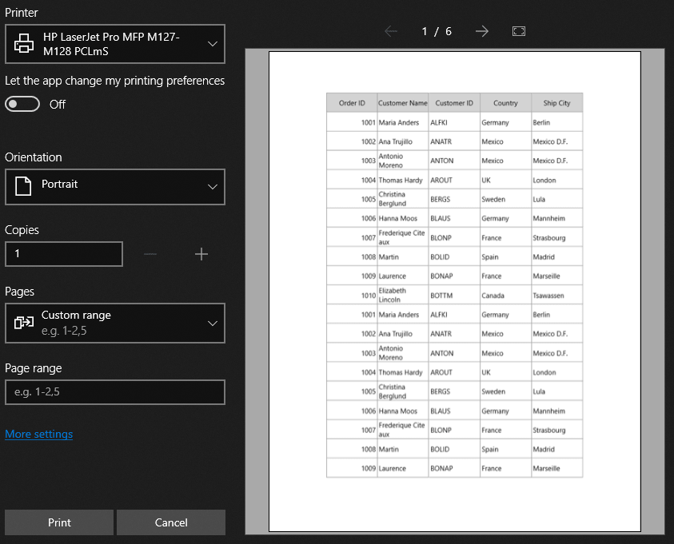

# Printing in UWP DataGrid (SfDataGrid)

SfDataGrid provides support to print the data displayed in the DataGrid using [SfDataGrid.Print](https://help.syncfusion.com/cr/cref_files/uwp/Syncfusion.SfGrid.UWP~Syncfusion.UI.Xaml.Grid.SfDataGrid~Print.html) method.
 


dataGrid.Print();



## Print Settings

SfDataGrid provides various options to customize print preview settings using [SfDataGrid.PrintSettings](https://help.syncfusion.com/cr/cref_files/uwp/Syncfusion.SfGrid.UWP~Syncfusion.UI.Xaml.Grid.SfDataGrid~PrintSettings.html) property of type [PrintSettings](https://help.syncfusion.com/cr/cref_files/uwp/Syncfusion.SfGrid.UWP~Syncfusion.UI.Xaml.Grid.PrintSettings.html).



dataGrid.PrintSettings = new PrintSettings();
dataGrid.PrintSettings.AllowRepeatHeaders = false;            
dataGrid.Print();



### Print

Print method opens the System print dialog where user can select the printer and set the number of copies to be printed.

### Scaling

SfDataGrid provides support to scale rows or columns or both while printing to fit on one page. Scaling options can be changed by setting [PrintSettings.PrintScaleOption](https://help.syncfusion.com/cr/cref_files/uwp/Syncfusion.SfGrid.UWP~Syncfusion.UI.Xaml.Grid.PrintSettings~PrintScaleOption.html) property.



dataGrid.PrintSettings = new PrintSettings();
dataGrid.PrintSettings.AllowColumnWidthFitToPrintPage = false;
dataGrid.PrintSettings.PrintScaleOption = PrintScaleOptions.FitAllColumnsonOnePage;
dataGrid.ShowPrintPreview();



### Column Header on each page

Column headers can be printed on each page by enabling [PrintSettings.AllowRepeatHeaders](https://help.syncfusion.com/cr/cref_files/uwp/Syncfusion.SfGrid.UWP~Syncfusion.UI.Xaml.Grid.PrintSettings~AllowRepeatHeaders.html) property while printing.



dataGrid.PrintSettings = new PrintSettings();
dataGrid.PrintSettings.AllowRepeatHeaders = true;
dataGrid.Print();



### Changing Flow Direction while printing

You can change the text direction in print page by using [PrintSettings.PrintFlowDirection](https://help.syncfusion.com/cr/cref_files/uwp/Syncfusion.SfGrid.UWP~Syncfusion.UI.Xaml.Grid.PrintSettings~PrintFlowDirection.html) property.



dataGrid.PrintSettings = new PrintSettings();
dataGrid.PrintSettings.PrintFlowDirection = FlowDirection.RightToLeft;
dataGrid.Print();



### Print with StackedHeaders

SfDataGrid provides support to print the StackedHeaders by setting the [PrintSettings.CanPrintStackedHeaders](https://help.syncfusion.com/cr/cref_files/uwp/Syncfusion.SfGrid.UWP~Syncfusion.UI.Xaml.Grid.PrintSettings~CanPrintStackedHeaders.html) as ‘true’.


this.sfDataGrid.PrintSettings.CanPrintStackedHeaders = true;



## Page Settings

SfDataGrid provides various options to customize page settings using [SfDataGrid.PrintSettings](https://help.syncfusion.com/cr/cref_files/uwp/Syncfusion.SfGrid.UWP~Syncfusion.UI.Xaml.Grid.SfDataGrid~PrintSettings.html) property of type [PrintSettings](https://help.syncfusion.com/cr/cref_files/uwp/Syncfusion.SfGrid.UWP~Syncfusion.UI.Xaml.Grid.PrintSettings.html).

### Orientation

SfDataGrid provides support to switch between Portrait (more rows but fewer columns) and Landscape (more columns but fewer rows) orientation while printing. Orientation can be changed by setting [PrintSettings.PrintPageOrientation](https://help.syncfusion.com/cr/cref_files/uwp/Syncfusion.SfGrid.UWP~Syncfusion.UI.Xaml.Grid.PrintSettings~PrintPageOrientation.html) Property.



dataGrid.PrintSettings = new PrintSettings();
dataGrid.PrintSettings.PrintPageOrientation = PrintOrientation.Landscape;
dataGrid.ShowPrintPreview();



### Page size

SfDataGrid provides support to change the page size. Page size can be changed by setting [PrintSettings.PrintPageWidth](https://help.syncfusion.com/cr/cref_files/uwp/Syncfusion.SfGrid.UWP~Syncfusion.UI.Xaml.Grid.PrintSettings~PrintPageWidth.html) and [PrintSettings.PrintPageHeight](https://help.syncfusion.com/cr/cref_files/uwp/Syncfusion.SfGrid.UWP~Syncfusion.UI.Xaml.Grid.PrintSettings~PrintPageHeight.html) properties.



dataGrid.PrintSettings = new PrintSettings();
dataGrid.PrintSettings.PrintPageHeight = 800;            
dataGrid.PrintSettings.PrintPageWidth = 800;
dataGrid.Print();



### Page margin

SfDataGrid provides support to change the page margins to adjust content in printed page. Page margin can be changed by setting [PrintSettings.PrintPageMargin](https://help.syncfusion.com/cr/cref_files/uwp/Syncfusion.SfGrid.UWP~Syncfusion.UI.Xaml.Grid.PrintSettings~PrintPageMargin.html) property. 



dataGrid.PrintSettings = new PrintSettings();
dataGrid.PrintSettings.PrintPageMargin = new Thickness(5);
dataGrid.Print();



## Setting Header and Footer

SfDataGrid provides a way to display additional content at the top (Header) or bottom (Footer) of the page while printing. This can be achieved by setting [PrintPageHeaderHeight](https://help.syncfusion.com/cr/cref_files/uwp/Syncfusion.SfGrid.UWP~Syncfusion.UI.Xaml.Grid.PrintSettings~PrintPageHeaderHeight.html), [PrintPageHeaderTemplate](https://help.syncfusion.com/cr/cref_files/uwp/Syncfusion.SfGrid.UWP~Syncfusion.UI.Xaml.Grid.PrintSettings~PrintPageHeaderTemplate.html), [PrintPageFooterHeight](https://help.syncfusion.com/cr/cref_files/uwp/Syncfusion.SfGrid.UWP~Syncfusion.UI.Xaml.Grid.PrintSettings~PrintPageFooterHeight.html), [PrintPageFooterTemplate](https://help.syncfusion.com/cr/cref_files/uwp/Syncfusion.SfGrid.UWP~Syncfusion.UI.Xaml.Grid.PrintSettings~PrintPageFooterTemplate.html) properties in [PrintSettings](https://help.syncfusion.com/cr/cref_files/uwp/Syncfusion.SfGrid.UWP~Syncfusion.UI.Xaml.Grid.PrintSettings.html).
Steps to add page header while printing,

1. Create DataTemplate in Application.Resources.



<Application.Resources>
    <DataTemplate x:Key="PageHeaderTempalte">
        <Grid Background="Gray">
            <TextBlock Text="Syncfusion" FontSize="18" FontWeight="Bold" 
                       Foreground="White" HorizontalAlignment="Center"/>
        </Grid>
    </DataTemplate>
</Application.Resources>



2. Set the above defined DataTemplate to [PrintSettings.PrintPageHeaderTemplate](https://help.syncfusion.com/cr/cref_files/uwp/Syncfusion.SfGrid.UWP~Syncfusion.UI.Xaml.Grid.PrintSettings~PrintPageHeaderTemplate.html) and assign value for [PrintSettings.PrintPageHeaderHeight](https://help.syncfusion.com/cr/cref_files/uwp/Syncfusion.SfGrid.UWP~Syncfusion.UI.Xaml.Grid.PrintSettings~PrintPageHeaderHeight.html) property also.



dataGrid.PrintSettings = new PrintSettings();
dataGrid.PrintSettings.PrintPageHeaderHeight = 30;
dataGrid.PrintSettings.PrintPageHeaderTemplate = Application.Current.Resources["PageHeaderTempalte"] as DataTemplate;
dataGrid.Print();



3.Now run the application and you can see page header in all the pages. In the same way, you can set [PrintSettings.PrintPageFooterTemplate](https://help.syncfusion.com/cr/cref_files/uwp/Syncfusion.SfGrid.UWP~Syncfusion.UI.Xaml.Grid.PrintSettings~PrintPageFooterTemplate.html) also.

N> [PrintManagerBase](https://help.syncfusion.com/cr/cref_files/uwp/Syncfusion.SfGrid.UWP~Syncfusion.UI.Xaml.Grid.PrintManagerBase.html) is the DataContext for [PrintPageControl](https://help.syncfusion.com/cr/cref_files/uwp/Syncfusion.SfGrid.UWP~Syncfusion.UI.Xaml.Grid.PrintPageControl.html), where the header and footer templates are loaded.

### Printing Current Date time

You can print current Date and Time at each page by setting the  [PrintPageFooterHeight](https://help.syncfusion.com/cr/cref_files/uwp/Syncfusion.SfGrid.UWP~Syncfusion.UI.Xaml.Grid.PrintSettings~PrintPageFooterHeight.html),  [PrintPageFooterTemplate](https://help.syncfusion.com/cr/cref_files/uwp/Syncfusion.SfGrid.UWP~Syncfusion.UI.Xaml.Grid.PrintSettings~PrintPageFooterTemplate.html) properties in [PrintSettings](https://help.syncfusion.com/cr/cref_files/uwp/Syncfusion.SfGrid.UWP~Syncfusion.UI.Xaml.Grid.PrintSettings.html). 



<Page.Resources>        
    <local:ViewModel x:Key="viewModel"/>        
    <DataTemplate x:Key="PageFooterTempalte">
        <Grid>
            <TextBlock HorizontalAlignment="Center" FontSize="20" VerticalAlignment="Center"  
                    Text="{Binding Path=Date, Source={StaticResource viewModel}}"/>
        </Grid>
    </DataTemplate>
</Page.Resources>


dataGrid.PrintSettings = new PrintSettings();
dataGrid.PrintSettings.PrintPageFooterHeight = 30;
dataGrid.PrintSettings.PrintPageFooterTemplate = Resources["PageFooterTempalte"] as DataTemplate;
dataGrid.Print();



## Printing using UIElement Rendering

When you want to print the SfDataGrid with same appearance settings as in the display (Background and Foreground) or with custom appearance by writing styles.
You can print SfDataGrid as it displayed in View by setting [PrintSettings.AllowPrintStyles](https://help.syncfusion.com/cr/cref_files/uwp/Syncfusion.SfGrid.UWP~Syncfusion.UI.Xaml.Grid.PrintSettings~AllowPrintStyles.html) to true.



dataGrid.PrintSettings = new PrintSettings();
dataGrid.PrintSettings.AllowPrintStyles = true;
dataGrid.Print();



[GridHeaderCellControl](https://help.syncfusion.com/cr/cref_files/uwp/Syncfusion.SfGrid.UWP~Syncfusion.UI.Xaml.Grid.GridHeaderCellControl.html) style customized and the same style will be exported while printing by setting [PrintSettings.AllowPrintStyles](https://help.syncfusion.com/cr/cref_files/uwp/Syncfusion.SfGrid.UWP~Syncfusion.UI.Xaml.Grid.PrintSettings~AllowPrintStyles.html) to true.



<Application.Resources>
     
</Application.Resources>



### Applying custom style

Custom styles can be applied while printing by setting [PrintSettings.AllowPrintStyles](https://help.syncfusion.com/cr/cref_files/uwp/Syncfusion.SfGrid.UWP~Syncfusion.UI.Xaml.Grid.PrintSettings~AllowPrintStyles.html) to false and writing style for below controls based on your requirement.

<table>
<tr>
<th>
Appearance to be customized
</th>
<th>
TargetType of Style
</th>
</tr>
<tr>
<td>
Header Cell
</td>
<td>
{{'[PrintHeaderCell](https://help.syncfusion.com/cr/cref_files/uwp/Syncfusion.SfGrid.UWP~Syncfusion.UI.Xaml.Grid.PrintHeaderCell.html)'| markdownify }}
</td>
</tr>
<tr>
<td>
Normal Cells
</td>
<td>
{{'[PrintGridCell](https://help.syncfusion.com/cr/cref_files/uwp/Syncfusion.SfGrid.UWP~Syncfusion.UI.Xaml.Grid.PrintGridCell.html)'| markdownify }}
</td>
</tr>
<tr>
<td>
Caption summary cells
</td>
<td>
{{'[PrintCaptionSummaryCell](https://help.syncfusion.com/cr/cref_files/uwp/Syncfusion.SfGrid.UWP~Syncfusion.UI.Xaml.Grid.PrintCaptionSummaryCell.html)"| markdownify }}
</td>
</tr>
<tr>
<td>
Group summary cells
</td>
<td>
{{'[PrintGroupSummaryCell](https://help.syncfusion.com/cr/cref_files/uwp/Syncfusion.SfGrid.UWP~Syncfusion.UI.Xaml.Grid.PrintGroupSummaryCell.html)'| markdownify }}
</td>
</tr>
<tr>
<td>
Table summary cells
</td>
<td>
{{'[PrintTableSummaryCell](https://help.syncfusion.com/cr/cref_files/uwp/Syncfusion.SfGrid.UWP~Syncfusion.UI.Xaml.Grid.PrintTableSummaryCell.html)'| markdownify }}
</td>
</tr>
<tr>
<td>
Unbound row cells
</td>
<td>
{{'[PrintUnboundRowCell](https://help.syncfusion.com/cr/cref_files/uwp/Syncfusion.SfGrid.UWP~Syncfusion.UI.Xaml.Grid.PrintUnboundRowCell.html)'| markdownify }}
</td>
</tr>
</table>

To provide custom appearance for Header cells while printing, [PrintHeaderCell](https://help.syncfusion.com/cr/cref_files/uwp/Syncfusion.SfGrid.UWP~Syncfusion.UI.Xaml.Grid.PrintHeaderCell.html) style is customized.



<Application.Resources>
    
</Application.Resources>



To print SfDataGrid with custom styles, [PrintSettings.AllowPrintStyles](https://help.syncfusion.com/cr/cref_files/uwp/Syncfusion.SfGrid.UWP~Syncfusion.UI.Xaml.Grid.PrintSettings~AllowPrintStyles.html) property to false.



dataGrid.PrintSettings = new PrintSettings();
dataGrid.PrintSettings.AllowPrintStyles = false;
dataGrid.Print();



## Printing Customization 

Printing operations can be customized by overriding [GridPrintManager](https://help.syncfusion.com/cr/cref_files/uwp/Syncfusion.SfGrid.UWP~Syncfusion.UI.Xaml.Grid.GridPrintManager.html) and its available methods.

### Setting different Row Height 

SfDataGrid allows you to set different Row height for specific rows while printing. You can achieve this by overriding the [GetRowHeight](https://help.syncfusion.com/cr/cref_files/uwp/Syncfusion.SfGrid.UWP~Syncfusion.UI.Xaml.Grid.PrintManagerBase~GetRowHeight.html) method in [PrintManagerBase](https://help.syncfusion.com/cr/cref_files/uwp/Syncfusion.SfGrid.UWP~Syncfusion.UI.Xaml.Grid.PrintManagerBase.html) class.



public class CustomPrintManager : GridPrintManager
{

    public CustomPrintManager(SfDataGrid grid)
        : base(grid)
    {
    }

    protected override double GetRowHeight(object record, int rowIndex, RowType type)
    {

        if (rowIndex != -1 && !(record is Group))

            if (rowIndex % 2 != 0)
                return 80.0;
        return base.GetRowHeight(record, rowIndex, type);
    }       
}





dataGrid.PrintSettings.PrintManagerBase = new CustomPrintManager(this.dataGrid);
dataGrid.PrintSettings.PrintManagerBase.Print();



### Hiding rows while printing
     
You can hide specific row by using [GetRowHeight](https://help.syncfusion.com/cr/cref_files/uwp/Syncfusion.SfGrid.UWP~Syncfusion.UI.Xaml.Grid.PrintManagerBase~GetRowHeight.html) method in [PrintManagerBase](https://help.syncfusion.com/cr/cref_files/uwp/Syncfusion.SfGrid.UWP~Syncfusion.UI.Xaml.Grid.PrintManagerBase.html) class and setting height as 0.
Here, unbound row is excluded while printing. Likewise, you can hide any row based on record and row index.



public class CustomPrintManager : GridPrintManager
{

    public CustomPrintManager(SfDataGrid grid)
        : base(grid)
    {
    }
 
    protected override double GetRowHeight(object record, int rowIndex, RowType type)
    {
 
            if (record is GridUnBoundRow)
                return 0;
            return base.GetRowHeight(record, rowIndex, type);
    }       
}





dataGrid.PrintSettings.PrintManagerBase = new CustomPrintManager(this.dataGrid);
dataGrid.PrintSettings.PrintManagerBase.Print();



### Setup columns to be printed

SfDataGrid allows you to the exclude the columns while printing the grid. You can change the column list by overriding the [GetColumnNames](https://help.syncfusion.com/cr/cref_files/uwp/Syncfusion.SfGrid.UWP~Syncfusion.UI.Xaml.Grid.GridPrintManager~GetColumnNames.html) method in [PrintManagerBase](https://help.syncfusion.com/cr/cref_files/uwp/Syncfusion.SfGrid.UWP~Syncfusion.UI.Xaml.Grid.PrintManagerBase.html) class.



public class CustomPrintManager : GridPrintManager
{

    public CustomPrintManager(SfDataGrid grid)
        : base(grid)
    {
    }

    protected override List<string> GetColumnNames()
    {
        List<string> columnList = this.dataGrid.Columns.
                                Select(x => x.MappingName).ToList();
        columnList.Remove("CustomerName");
        return columnList;
    }
}





dataGrid.PrintSettings.PrintManagerBase = new CustomPrintManager(this.dataGrid);
dataGrid.PrintSettings.PrintManagerBase.Print();



### Customize the header text while printing

SfDataGrid allows you to change column header text while printing the grid. You can change the Column header text by overriding the [GetColumnHeaderText](https://help.syncfusion.com/cr/cref_files/uwp/Syncfusion.SfGrid.UWP~Syncfusion.UI.Xaml.Grid.GridPrintManager~GetColumnHeaderText.html) method in [GridPrintManager](https://help.syncfusion.com/cr/cref_files/uwp/Syncfusion.SfGrid.UWP~Syncfusion.UI.Xaml.Grid.GridPrintManager.html).



public class CustomPrintManager : GridPrintManager
{

    public CustomPrintManager(SfDataGrid grid)
        : base(grid)
    {
    }    

    protected override string GetColumnHeaderText(string mappingName)
    {

        if (mappingName == "OrderID")
            return "Order ID";
        return base.GetColumnHeaderText(mappingName);
    }
}





dataGrid.PrintSettings.PrintManagerBase = new CustomPrintManager(this.dataGrid);
dataGrid.PrintSettings.PrintManagerBase.Print();



### Styling Rows

You can apply row styles based on custom logic by overriding [GetPrintGridCell](https://help.syncfusion.com/cr/cref_files/uwp/Syncfusion.SfGrid.UWP~Syncfusion.UI.Xaml.Grid.GridPrintManager~GetPrintGridCell.html) method in [GridPrintManager](https://help.syncfusion.com/cr/cref_files/uwp/Syncfusion.SfGrid.UWP~Syncfusion.UI.Xaml.Grid.GridPrintManager.html).



public class CustomPrintManager : GridPrintManager
{

    public CustomPrintManager(SfDataGrid grid)
        : base(grid)
    {
    }

    public override ContentControl GetPrintGridCell(object record, string mappingName)
    {

        if (!(record is OrderInfo))
            return base.GetPrintGridCell(record, mappingName);

        if ((record as OrderInfo).Country == "Germany")
            return new PrintGridCell() { Background = new SolidColorBrush(Colors.Bisque) };

        else if ((record as OrderInfo).Country == "Mexico")
            return new PrintGridCell() { Background = new SolidColorBrush(Colors.LightSkyBlue) };
        return base.GetPrintGridCell(record, mappingName);
    }
}





dataGrid.PrintSettings.PrintManagerBase = new CustomPrintManager(this.dataGrid);
dataGrid.PrintSettings.PrintManagerBase.Print();



N> 
<table>
<tr>
<th>
Appearance to be customized
</th>
<th>
Method
</th>
</tr>
<tr>
<td>
Header Cell
</td>
<td>
{{'[GetPrintHeaderCell](https://help.syncfusion.com/cr/cref_files/uwp/Syncfusion.SfGrid.UWP~Syncfusion.UI.Xaml.Grid.GridPrintManager~GetPrintHeaderCell.html)'| markdownify }}
</td>
</tr>
<tr>
<td>
Normal Cells
</td>
<td>
{{'[GetPrintGridCell](https://help.syncfusion.com/cr/cref_files/uwp/Syncfusion.SfGrid.UWP~Syncfusion.UI.Xaml.Grid.GridPrintManager~GetPrintGridCell.html)'| markdownify }}
</td>
</tr>
<tr>
<td>
Caption summary cells
</td>
<td>
{{'[GetPrintCaptionSummaryCell](https://help.syncfusion.com/cr/cref_files/uwp/Syncfusion.SfGrid.UWP~Syncfusion.UI.Xaml.Grid.GridPrintManager~GetPrintCaptionSummaryCell.html)'| markdownify }}
</td>
</tr>
<tr>
<td>
Group summary cells
</td>
<td>
{{'[GetPrintGroupSummaryCell](https://help.syncfusion.com/cr/cref_files/uwp/Syncfusion.SfGrid.UWP~Syncfusion.UI.Xaml.Grid.GridPrintManager~GetPrintGroupSummaryCell.html)'| markdownify }}
</td>
</tr>
<tr>
<td>
Table summary cells
</td>
<td>
{{'[GetPrintTableSummaryCell](https://help.syncfusion.com/cr/cref_files/uwp/Syncfusion.SfGrid.UWP~Syncfusion.UI.Xaml.Grid.GridPrintManager~GetPrintTableSummaryCell.html)'| markdownify }}
</td>
</tr>
<tr>
<td>
Unbound row cells
</td>
<td>
{{'[GetPrintUnboundRowCell](https://help.syncfusion.com/cr/cref_files/uwp/Syncfusion.SfGrid.UWP~Syncfusion.UI.Xaml.Grid.GridPrintManager~GetPrintUnboundRowCell.html)'| markdownify }}
</td>
</tr>
</table>

### Setup alternate row style

SfDataGrid allows you to apply alternative row style by overriding [GetPrintGridCell](https://help.syncfusion.com/cr/cref_files/uwp/Syncfusion.SfGrid.UWP~Syncfusion.UI.Xaml.Grid.GridPrintManager~GetPrintGridCell.html) method in `GridPrintManager`.



public class CustomPrintManager : GridPrintManager
{

    public CustomPrintManager(SfDataGrid grid)
        : base(grid)
    {
    }

    public override ContentControl GetPrintGridCell(object record, string mappingName)
    {
       var index = dataGrid.View.Records.IndexOfRecord(record);

       if (index % 2 == 0)
          return new PrintGridCell() { Background = new SolidColorBrush(Colors.Bisque) };
       return base.GetPrintGridCell(record, mappingName);
    }
}





dataGrid.PrintSettings.PrintManagerBase = new CustomPrintManager(this.dataGrid);
dataGrid.PrintSettings.PrintManagerBase.Print();



### Styling Columns

You can apply column styles based on custom logic by overriding [GetPrintGridCell](https://help.syncfusion.com/cr/cref_files/uwp/Syncfusion.SfGrid.UWP~Syncfusion.UI.Xaml.Grid.GridPrintManager~GetPrintGridCell.html) method in `GridPrintManager`.



public class CustomPrintManager : GridPrintManager
{

    public CustomPrintManager(SfDataGrid grid)
        : base(grid)
    {
    }

    public override ContentControl GetPrintGridCell(object record, string mappingName)
    {
 
    if (mappingName == "OrderID")
        return new PrintGridCell() { Background = new SolidColorBrush(Colors.LightGreen), FontStyle = Windows.UI.Text.FontStyle.Italic };
    return base.GetPrintGridCell(record, mappingName);
    }
}





dataGrid.PrintSettings.PrintManagerBase = new CustomPrintManager(this.dataGrid);
dataGrid.PrintSettings.PrintManagerBase.Print();



N> [GetColumnWidth](https://help.syncfusion.com/cr/cref_files/uwp/Syncfusion.SfGrid.UWP~Syncfusion.UI.Xaml.Grid.PrintManagerBase~GetColumnWidth.html), [GetColumnTextWrapping](https://help.syncfusion.com/cr/cref_files/uwp/Syncfusion.SfGrid.UWP~Syncfusion.UI.Xaml.Grid.PrintManagerBase~GetColumnTextWrapping.html), [GetColumnTextAlignment](https://help.syncfusion.com/cr/cref_files/uwp/Syncfusion.SfGrid.UWP~Syncfusion.UI.Xaml.Grid.PrintManagerBase~GetColumnTextAlignment.html) and [GetColumnPadding](https://help.syncfusion.com/cr/cref_files/uwp/Syncfusion.SfGrid.UWP~Syncfusion.UI.Xaml.Grid.PrintManagerBase~GetColumnPadding.html) methods are also used for column customization while printing.

### Printing Selected rows

Selected rows can be printed by overriding [GetSourceListForPrinting](https://help.syncfusion.com/cr/cref_files/uwp/Syncfusion.SfGrid.UWP~Syncfusion.UI.Xaml.Grid.PrintManagerBase~GetSourceListForPrinting.html) method in `PrintManagerClass` class.



public class CustomPrintManager : GridPrintManager
{

    public CustomPrintManager(SfDataGrid grid)
        : base(grid)
    {
    }
    
    protected override IList GetSourceListForPrinting()
    {
        List<object> selectedRecords = new List<object>();
        var selectedRows = dataGrid.SelectionController.SelectedRows.ToList();

        foreach (var row in selectedRows)
        {

            if (row.IsAddNewRow || (row.NodeEntry != null && (!row.NodeEntry.IsRecords)))
                continue;

            if (row.IsUnBoundRow)
            {
                var _row = dataGrid.UnBoundRows.FirstOrDefault(r => r.Position == row.GridUnboundRowInfo.Position && r.ShowBelowSummary == row.GridUnboundRowInfo.ShowBelowSummary && r.RowIndex == row.GridUnboundRowInfo.RowIndex);
                selectedRecords.Add(_row);
            }

            else
                selectedRecords.Add(row.NodeEntry);
        }
        return selectedRecords;
    }
}





dataGrid.PrintSettings.PrintManagerBase = new CustomPrintManager(this.dataGrid);
dataGrid.PrintSettings.PrintManagerBase.Print();



### Printing Specific pages

You can customize the display options of the [PrintTask](https://docs.microsoft.com/en-us/uwp/api/windows.graphics.printing.printtask?view=winrt-19041), SfDataGrid provides built-in support to print the range of pages by adding the [CustomPageRanges](https://docs.microsoft.com/en-us/uwp/api/windows.graphics.printing.standardprinttaskoptions.custompageranges?view=winrt-19041) option to the [PrintTaskOptions.DisplayedOptions](https://docs.microsoft.com/en-us/uwp/api/windows.graphics.printing.printtaskoptions.displayedoptions?view=winrt-19041) property and also add all other available options in the [StandardPrintTaskOptions](https://docs.microsoft.com/en-us/uwp/api/windows.graphics.printing.standardprinttaskoptions?view=winrt-19041) and do the customization to support all other options in SfDataGrid.PrintTaskRequested event.
You have to call the CreatePrintTask method using DataGridPrintTaskRequested.Request property. While performing the custom operation in this event, you have to set the DataGridPrintTaskRequestedEventArgs.PrintDocumentSource property in [PrintTaskSourceRequestedArgs.SetSource](https://docs.microsoft.com/en-us/uwp/api/windows.graphics.printing.printtasksourcerequestedargs.setsource?view=winrt-19041) which is the event args for event handler available in [PrintTaskRequest.CreatePrintTask](https://docs.microsoft.com/en-us/uwp/api/windows.graphics.printing.printtaskrequest.createprinttask?view=winrt-19041) method.

In the below code, to add the page range options in print dialog.



this.dataGrid.PrintTaskRequested += DataGrid_PrintTaskRequested;

private void DataGrid_PrintTaskRequested(object sender, DataGridPrintTaskRequestedEventArgs e)
{
    e.PrintTask = e.Request.CreatePrintTask("Printing", sourceRequested =>
    {

        PrintTaskOptionDetails printDetailedOptions = PrintTaskOptionDetails.GetFromPrintTaskOptions(e.PrintTask.Options);
        IList<string> displayedOptions = printDetailedOptions.DisplayedOptions;
        displayedOptions.Add(Windows.Graphics.Printing.StandardPrintTaskOptions.CustomPageRanges);
        e.PrintTask.Options.PageRangeOptions.AllowCurrentPage = true;
        e.PrintTask.Options.PageRangeOptions.AllowAllPages = true;
        e.PrintTask.Options.PageRangeOptions.AllowCustomSetOfPages = true;

        sourceRequested.SetSource(e.PrintDocumentSource);

    });    
}   
           



You can disable the print preview in print dialog by setting [PrintTask.IsPreviewEnabled](https://docs.microsoft.com/en-us/uwp/api/windows.graphics.printing.printtask.ispreviewenabled?view=winrt-19041) property to false.




this.dataGrid.PrintTaskRequested += DataGrid_PrintTaskRequested;

private void DataGrid_PrintTaskRequested(object sender, DataGridPrintTaskRequestedEventArgs e)
{
    e.PrintTask = e.Request.CreatePrintTask("Printing", sourceRequested =>
    {       
        sourceRequested.SetSource(e.PrintDocumentSource);
    }); 
	e.PrintTask.IsPreviewEnabled = false;
}   
           



Specific pages can be printed by overriding OnAddPrintPages method in `PrintManagerClass` class.



public class CustomPrintManager : GridPrintManager
{
    
    public CustomPrintManager(SfDataGrid grid)
        : base(grid)
    {

    }

    protected override void OnAddPrintPages(AddPagesEventArgs e)
    {
        IList<Windows.Graphics.Printing.PrintPageRange> customPageRanges = e.PrintTaskOptions.CustomPageRanges;           
        
		int pageCount = this.PageDictionary.Count;
        
        // An empty CustomPageRanges means "All Pages"
        if (customPageRanges.Count == 0)
        {
            // Loop over all of the preview pages and add each one to be printed
            for (var i = 1; i <= pageCount; i++)
            {
                var printpageControl = CreatePage(i);
                printDocument.AddPage(printpageControl);
            }
        }
        else
        {
            // Print only the pages chosen by the user.
            // 
            // The "Current page" option is a special case of "Custom set of pages".
            // In case the user selects the "Current page" option, the PrintDialog
            // will turn that into a CustomPageRanges containing the page that the user was looking at.
            // If the user typed in an indefinite range such as "6-", the LastPageNumber value
            // will be whatever this sample app last passed into the PrintDocument.SetPreviewPageCount API.
            foreach (PrintPageRange pageRange in customPageRanges)
            {
                // The user may type in a page number that is not present in the document.
                // In this case, we just ignore those pages, hence the checks
                // (pageRange.FirstPageNumber <= printPreviewPages.Count) and (i <= printPreviewPages.Count).
                //
                // If the user types the same page multiple times, it will be printed multiple times
                // (e.g 3-4;1;1 will print pages 3 and 4 followed by two copies of page 1)
                if (pageRange.FirstPageNumber <= pageCount)
                {
                    for (int i = pageRange.FirstPageNumber; (i <= pageRange.LastPageNumber) && (i <= pageCount); i++)
                    {
                        // Subtract 1 because page numbers are 1-based, but our list is 0-based.
                        var printpageControl = CreatePage(i);
                        printDocument.AddPage(printpageControl);
                    }
                }
            }
        }
        // Indicate that all of the print pages have been provided.
        printDocument.AddPagesComplete();
    }
}






dataGrid.PrintSettings.PrintManagerBase = new CustomPrintManager(this.dataGrid);
dataGrid.PrintSettings.PrintManagerBase.Print();



