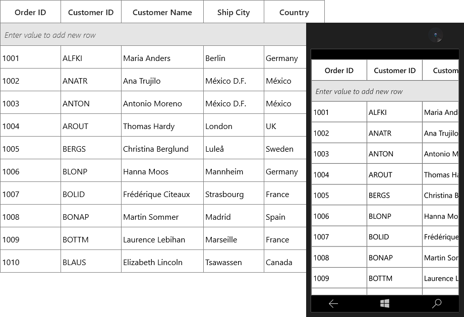

# Styles and Templates in UWP DataGrid (SfDataGrid)

The appearance of SfDataGrid and its inner elements (example: Cell, Row, Header, Summary and etc.) can be customized using various properties exposed and editing its Style.
 
## Control Structure of SfDataGrid

### Customizing Default Containers
SfDataGrid arrange the cell and row content using cell and row container’s. Below screenshot shows the VisualTree of SfDataGrid where HeaderCell loaded into the HeaderCellControl and data cells loaded into the VirtualizingCellsControl container. VirtualizingCellsControl container consist of GridCell to load the cell content.

[RowGenerator](https://help.syncfusion.com/cr/wpf/Syncfusion.UI.Xaml.Grid.RowGenerator.html) class processes the creation and re-using of containers for SfDataGrid. You create your own containers by overriding RowGenerator class and set it [SfDataGrid.RowGenerator](https://help.syncfusion.com/cr/uwp/Syncfusion.UI.Xaml.Grid.SfDataGrid.html#Syncfusion_UI_Xaml_Grid_SfDataGrid_RowGenerator). Thus, it is possible to customize the row and cell containers by customizing the RowGeneration which cannot be done with styling and conditional styling customization options.

### Row containers
Below table shows the different types of grid rows and its container.
<table>
<tr>
<th>
RowType
</th>
<th>
Container
</th>
</tr>
<tr>
<td>
DataRow
</td>
<td>
VirtualizingCellsControl
</td>
</tr>
<tr>
<td>
UnboundRow
</td>
<td>
UnBoundRowControl
</td>
</tr>
<tr>
<td>
FilterRow
</td>
<td>
FilterRowControl
</td>
</tr>
<tr>
<td>
DetailsViewDataRow
</td>
<td>
DetailsViewRowControl
</td>
</tr>
<tr>
<td>
TableSummaryRow
</td>
<td>
TableSummaryRowControl
</td>
</tr>
<tr>
<td>
HeaderRow
</td>
<td>
HeaderRowControl
</td>
</tr>
<tr>
<td>
AddNewRow
</td>
<td>
AddNewRowControl
</td>
</tr>
<tr>
<td>
CaptionSummaryRow
</td>
<td>
CaptionSummaryRowControl
</td>
</tr>
<tr>
<td>
GroupSummaryRow
</td>
<td>
GroupSummaryRowControl
</td>
</tr>
<tr>
<td>
StackedHeaderRow
</td>
<td>
GridStackedHeaderCellControl
</td>
</tr>
</table>

### Animating the data row when property changes

You can customize the [DataRow](https://help.syncfusion.com/cr/uwp/Syncfusion.UI.Xaml.Grid.DataRow.html) operations by overriding the `DataRow` class. You have to override the [GetData](https://help.syncfusion.com/cr/uwp/Syncfusion.UI.Xaml.Grid.DataRowBase.html#Syncfusion_UI_Xaml_Grid_DataRowBase_GetDataRow)Row method in [RowGenerator](https://help.syncfusion.com/cr/uwp/Syncfusion.UI.Xaml.Grid.RowGenerator.html)  to load the customized `DataRow`.
Similarly, you can able to customize:
1. [GridUnboundRow](https://help.syncfusion.com/cr/uwp/Syncfusion.UI.Xaml.Grid.GridUnBoundRow.html)
2. [FilterRow](https://help.syncfusion.com/cr/uwp/Syncfusion.UI.Xaml.Grid.RowFilter.FilterRow.html)
3. [SpannedDataRow](https://help.syncfusion.com/cr/uwp/Syncfusion.UI.Xaml.Grid.SpannedDataRow.html)

The below code example shows how to animate the `DataRow` when the row data is changed.



this.datagrid.RowGenerator = new CustomRowGenerator(this.datagrid);

public class CustomDataRow : DataRow
{
    
    public CustomDataRow()
        : base()
    {                  
    }
     
    protected Storyboard storyboard = null;
    
    protected override void OnRowDataChanged()
    {
        base.OnRowDataChanged();
    
        if (this.WholeRowElement != null)
        {
            DoubleAnimation animation = new DoubleAnimation
            {
                From = 0,
                To = 1,
                Duration = new Duration(TimeSpan.FromMilliseconds(2000)),
                AutoReverse = true,
                FillBehavior = FillBehavior.Stop
            };
            Storyboard.SetTarget(animation, this.WholeRowElement);
            Storyboard.SetTargetProperty(animation, "Path.Opacity");
            storyboard = new Storyboard();
            storyboard.Children.Add(animation);
            storyboard.Begin();
        }        
    }             
}

public class CustomRowGenerator : RowGenerator
{
  
    public CustomRowGenerator(SfDataGrid dataGrid)
        : base(dataGrid)
    { }

    protected override GridDataRow GetDataRow<T>(RowType type)
    {
  
        //Set the customized DataRow.
  
        if (typeof(T) == typeof(DataRow))
            return new CustomDataRow();
        return base.GetDataRow<T>(type);
    }
}



You can download a working demo for the above customization from [here](https://www.syncfusion.com/downloads/support/directtrac/general/ze/DataRowUWP-1254907182.zip).

The below code example shows how to change the background color of the `VirtualizingCellsControl` when the value has been changed for a particular cell. This can be done by hooking the `DataContextChanged` and `PropertyChanged` event.


this.datagrid.RowGenerator = new CustomRowGenerator(this.datagrid);

public class CustomVirtualizingCellsControl : VirtualizingCellsControl
{
 
    public CustomVirtualizingCellsControl()
        : base()
    {
        this.DataContextChanged += CustomVirtualizingCellsControl_DataContextChanged;
    }

    private void CustomVirtualizingCellsControl_DataContextChanged(object sender, DependencyPropertyChangedEventArgs e)
    {
        var newValue = e.NewValue as INotifyPropertyChanged;
        newValue.PropertyChanged += NewValue_PropertyChanged;
    }      
 
    private void NewValue_PropertyChanged(object sender, PropertyChangedEventArgs e)
    {
 
        if (e.PropertyName == "CustomerID")
            this.Background = new SolidColorBrush(Colors.Pink);
    }
}

public class CustomRowGenerator : RowGenerator
{
   
    public CustomRowGenerator(SfDataGrid dataGrid)
        : base(dataGrid)
    { }

    protected override VirtualizingCellsControl GetVirtualizingCellsControl<T>()
    {
   
        //Set the customized VirtualizingCellsControl
   
        if (typeof(T) == typeof(VirtualizingCellsControl))
            return new CustomVirtualizingCellsControl();
        return base.GetVirtualizingCellsControl<T>();
    }
}



You can download a working demo for the above customization from [here](https://www.syncfusion.com/downloads/support/directtrac/general/ze/VirtualizingControlUWp810114614).

### Cell containers
Below table shows the different types of cells and its container.
<table>
<tr>
<th>
CellType
</th>
<th>
Container
</th>
</tr>
<tr>
<td>
GridCell
</td>
<td>
OrientedCellsPanel
</td>
</tr>
<tr>
<td>
GridUnBoundRowCell
</td>
<td>
OrientedCellsPanel
</td>
</tr>
<tr>
<td>
GridFilterRowCell
</td>
<td>
OrientedCellsPanel
</td>
</tr>
</table>

### Animating the data cell when property changes

You can customize the [GridCell](https://help.syncfusion.com/cr/uwp/Syncfusion.UI.Xaml.Grid.GridCell.html) behavior by overriding the `GridCell` class. You have to override the [GetGridCell](https://help.syncfusion.com/cr/uwp/Syncfusion.UI.Xaml.Grid.RowGenerator.html#Syncfusion_UI_Xaml_Grid_RowGenerator_GetGridCell__1) method in [RowGenerator](https://help.syncfusion.com/cr/uwp/Syncfusion.UI.Xaml.Grid.RowGenerator.html) to load the customized `GridCell`.
Similarly, you can able to customize:
1. [GridUnBoundRowCell](https://help.syncfusion.com/cr/uwp/Syncfusion.UI.Xaml.Grid.GridUnBoundRowCell.html)
2. [GridFilterRowCell](https://help.syncfusion.com/cr/uwp/Syncfusion.UI.Xaml.Grid.RowFilter.GridFilterRowCell.html)

The below code example shows how to animate the cell based on the changes occur in another cell using the `DataContextChanged` and `PropertyChanged` events.



this.datagrid.RowGenerator = new CustomRowGenerator(this.datagrid);

public class CustomGridCell : GridCell
{       
   
    public CustomGridCell() : base()
    {
        this.DataContextChanged += CustomGridCell_DataContextChanged;            
    }
     
    private void CustomGridCell_DataContextChanged(object sender, DependencyPropertyChangedEventArgs e)
    {
        var newData = e.NewValue as INotifyPropertyChanged;
        newData.PropertyChanged += Data_PropertyChanged;
    }
    protected Storyboard storyboard = null;
   
    private void Data_PropertyChanged(object sender, PropertyChangedEventArgs e)
    {
   
        if (e.PropertyName == "CustomerID")
        {
            DoubleAnimation animation = new DoubleAnimation
            {
                From = 0,
                To = 1,
                Duration = new Duration(TimeSpan.FromMilliseconds(2000)),
                AutoReverse = false,
                FillBehavior = FillBehavior.HoldEnd
            };
            Storyboard.SetTarget(animation, this);
            Storyboard.SetTargetProperty(animation, "Path.Opacity");
            storyboard = new Storyboard();
            storyboard.Children.Add(animation);
            storyboard.Begin();
        }
    }

    protected override void Dispose(bool isDisposing)
    {
        this.DataContextChanged -= CustomGridCell_DataContextChanged;
        base.Dispose(isDisposing);
    }
}

public class CustomRowGenerator : RowGenerator
{
  
    public CustomRowGenerator(SfDataGrid dataGrid)
        : base(dataGrid)
    {
    }

    protected override GridCell GetGridCell<T>()
    {
        return new CustomGridCell();
    }
}


You can download a working demo for the above customization from [here](https://www.syncfusion.com/downloads/support/directtrac/general/ze/GridcellUwp1283030332).

## Editing DataGrid Elements Style in Visual Studio Designer

You can edit the SfDataGrid elements style in Visual Studio Designer by right clicking it in designer view and click **Edit Additional Templates**.

You can edit or create new style for the following SfDataGrid elements through **Edit Additional Templates** option,

1. HeaderTemplate

2. FilterPopupTemplate

## Writing Style by TargetType

The appearance of SfDataGrid and its inner elements can be customized by writing style of TargetType to those control. If the key is not specified, then the style will be applied to all the SfDataGrid in its scope. You can apply style specific to SfDataGrid or column or cell using various
properties exposed.
 
## Styling Record cell

The record cells can be customized by writing style of TargetType [GridCell](https://help.syncfusion.com/cr/uwp/Syncfusion.UI.Xaml.Grid.GridCell.html). You can set to particular SfDataGrid by setting [SfDataGrid.CellStyle](https://help.syncfusion.com/cr/uwp/Syncfusion.UI.Xaml.Grid.SfDataGrid.html#Syncfusion_UI_Xaml_Grid_SfDataGrid_CellStyle) property and the particular column can be styled by setting [GridColumn.CellStyle](https://help.syncfusion.com/cr/uwp/Syncfusion.UI.Xaml.Grid.GridColumnBase.html#Syncfusion_UI_Xaml_Grid_GridColumnBase_CellStyle) property. Underlying record will be the DataContext for `GridCell`.



<Page.Resources>
    
</Page.Resources>

<syncfusion:SfDataGrid x:Name="dataGrid"
                       CellStyle="{StaticResource customCellStyle}"
                       ItemsSource="{Binding Orders}"/>



You can also set the `CellStyle` to particular column in below way.



<syncfusion:GridTextColumn HeaderText="Order ID" MappingName="OrderID">
    <syncfusion:GridTextColumn.CellStyle>
        
    </syncfusion:GridTextColumn.CellStyle>
</syncfusion:GridTextColumn>



N> `GridColumn.CellStyle` takes higher priority than `SfDataGrid.CellStyle` property.

### Changing Grid line color

You can also change the gridline color by setting [GridCell.BorderBrush](https://msdn.microsoft.com/query/dev10.query?appId=Dev10IDEF1&l=EN-US&k=k(System.Windows.Controls.Control.BorderBrush)&rd=true) property.



<Page.Resources>
    
</Page.Resources>



## Styling Record row

The record rows can be customized by writing style of TargetType [VirtualizingCellsControl](https://help.syncfusion.com/cr/uwp/Syncfusion.UI.Xaml.Grid.VirtualizingCellsControl.html). You can set to particular SfDataGrid by setting [SfDataGrid.RowStyle](https://help.syncfusion.com/cr/uwp/Syncfusion.UI.Xaml.Grid.SfDataGrid.html#Syncfusion_UI_Xaml_Grid_SfDataGrid_RowStyle) property.



<Page.Resources>
    
</Page.Resources>

<syncfusion:SfDataGrid x:Name="dataGrid"
                       ItemsSource="{Binding Orders}" 
                       RowStyle="{StaticResource customRowStyle}"/>



## Alternating Row Style

You can style the alternate rows by setting [SfDataGrid.AlternatingRowStyle](https://help.syncfusion.com/cr/uwp/Syncfusion.UI.Xaml.Grid.SfDataGrid.html#Syncfusion_UI_Xaml_Grid_SfDataGrid_AlternatingRowStyle) and [SfDataGrid.RowStyle](https://help.syncfusion.com/cr/uwp/Syncfusion.UI.Xaml.Grid.SfDataGrid.html#Syncfusion_UI_Xaml_Grid_SfDataGrid_RowStyle) property. `AlternateRowStyle` will be applied based on [SfDataGrid.AlternationCount](https://help.syncfusion.com/cr/uwp/Syncfusion.UI.Xaml.Grid.SfDataGrid.html#Syncfusion_UI_Xaml_Grid_SfDataGrid_AlternationCount) property.
 


<Page.Resources>
    
    
    
</Page.Resources>
<syncfusion:SfDataGrid x:Name="dataGrid"
                       AlternatingRowStyle="{StaticResource alternatingRowStyle}"
                       AlternationCount="3"
                       AutoGenerateColumns="False"
                       ItemsSource="{Binding Orders}"
                       RowStyle="{StaticResource customRowStyle}">



## Selection

The foreground and background for the selected row, cell can be customized by setting [SfDataGrid.RowSelectionBrush](https://help.syncfusion.com/cr/uwp/Syncfusion.UI.Xaml.Grid.SfDataGrid.html#Syncfusion_UI_Xaml_Grid_SfDataGrid_RowSelectionBrush) and [SfDataGrid.SelectionForegroundBrush](https://help.syncfusion.com/cr/uwp/Syncfusion.UI.Xaml.Grid.SfDataGrid.html#Syncfusion_UI_Xaml_Grid_SfDataGrid_SelectionForegroundBrush) property.



<syncfusion:SfDataGrid x:Name="dataGrid"
                       ItemsSource="{Binding Orders}"
                       RowSelectionBrush="Bisque"
                       SelectionForegroundBrush="Magenta"/>



## Styling Column Header

### Styling Header cell

The header cell can be customized by writing style of TargetType [GridHeaderCellControl](https://help.syncfusion.com/cr/uwp/Syncfusion.UI.Xaml.Grid.GridHeaderCellControl.html). You can set to particular SfDataGrid by setting [SfDataGrid.HeaderStyle](https://help.syncfusion.com/cr/uwp/Syncfusion.UI.Xaml.Grid.SfDataGrid.html#Syncfusion_UI_Xaml_Grid_SfDataGrid_HeaderStyle) property and the particular column can be styled by setting [GridColumn.HeaderStyle](https://help.syncfusion.com/cr/uwp/Syncfusion.UI.Xaml.Grid.GridColumnBase.html#Syncfusion_UI_Xaml_Grid_GridColumnBase_HeaderStyle) property.

N> `GridColumn.HeaderStyle` takes higher priority than `SfDataGrid.HeaderStyle` property.



<Page.Resources>
    
</Page.Resources>

<syncfusion:SfDataGrid x:Name="dataGrid"                        
                       HeaderStyle="{StaticResource headerStyle}"
                       ItemsSource="{Binding Orders}"/>



### Styling DetailsViewDataGrid header

The header style can be applied to [DetailsViewDataGrid](https://help.syncfusion.com/cr/uwp/Syncfusion.UI.Xaml.Grid.DetailsViewDataGrid.html) alone by setting [HeaderStyle](https://help.syncfusion.com/cr/uwp/Syncfusion.UI.Xaml.Grid.SfDataGrid.html#Syncfusion_UI_Xaml_Grid_SfDataGrid_HeaderStyle) property to `DetailsViewDataGrid` in both XAML and code behind.



<Page.Resources>
    
</Page.Resources>

<syncfusion:SfDataGrid x:Name="dataGrid" ItemsSource="{Binding Orders}">
    <syncfusion:SfDataGrid.DetailsViewDefinition>
        <syncfusion:GridViewDefinition RelationalColumn="ProductDetails">
            <syncfusion:GridViewDefinition.DataGrid>
                <syncfusion:SfDataGrid x:Name="FirstLevelNestedGrid"             HeaderStyle="{StaticResource headerStyle}"/>
            </syncfusion:GridViewDefinition.DataGrid>
        </syncfusion:GridViewDefinition>
    </syncfusion:SfDataGrid.DetailsViewDefinition>
</syncfusion:SfDataGrid>



If `SfDataGrid.AutoGenerateRelations` is `true`, you can set the header style to `DetailsViewDataGrid` in `SfDataGrid.AutoGenerateRelations` event.



<syncfusion:SfDataGrid x:Name="dataGrid" 
                       AutoGenerateRelations="True"                                
                       ItemsSource="{Binding Orders}">


this.dataGrid.AutoGeneratingRelations += DataGrid_AutoGeneratingRelations;

private void DataGrid_AutoGeneratingRelations(object sender, AutoGeneratingRelationsArgs e)
{
    e.GridViewDefinition.DataGrid.HeaderStyle = this.Resources["headerStyle"] as Style;
}



### Styling Stacked Headers

The appearance of stacked header can be customized by writing style of TargetType [GridStackedHeaderCellControl](https://help.syncfusion.com/cr/uwp/Syncfusion.UI.Xaml.Grid.GridStackedHeaderCellControl.html).



<Page.Resources>
    
</Page.Resources>



### Setting different styles to StackedHeader

You can apply the different style to stacked header by overriding the [default renderer](https://help.syncfusion.com/cr/uwp/Syncfusion.UI.Xaml.Grid.SfDataGrid.html#Syncfusion_UI_Xaml_Grid_SfDataGrid_CellRenderers) of StackedHeader.



<Application.Resources>
        
    
        
    
        
</Application.Resources>


this.dataGrid.CellRenderers.Remove("StackedHeader");
this.dataGrid.CellRenderers.Add("StackedHeader", new GridStackedHeaderCellRendererExt());

public class GridStackedHeaderCellRendererExt: GridStackedHeaderCellRenderer
{
    public GridStackedHeaderCellRendererExt()
    {
    }
    
    public override void OnInitializeEditElement(DataColumnBase dataColumn, GridStackedHeaderCellControl uiElement, object dataContext)
    {
        if (dataColumn.ColumnIndex == 0)
            uiElement.Style = App.Current.Resources["style1"] as Style;

        else if (dataColumn.ColumnIndex == 3)
            uiElement.Style = App.Current.Resources["style2"] as Style;            

        base.OnInitializeEditElement(dataColumn, uiElement, dataContext);
    }
}



## Setting Default Style for one column

You can also skip the cell styling for particular column from other setting like [SfDataGrid.CellStyle](https://help.syncfusion.com/cr/uwp/Syncfusion.UI.Xaml.Grid.SfDataGrid.html#Syncfusion_UI_Xaml_Grid_SfDataGrid_CellStyle) by setting [GridColumn.CellStyle](https://help.syncfusion.com/cr/uwp/Syncfusion.UI.Xaml.Grid.GridColumnBase.html#Syncfusion_UI_Xaml_Grid_GridColumnBase_HeaderStyle) to `null`. Likewise, you can skip all the style properties in particular column (example: `HeaderStyle`).
 


<Page.Resources>
    
</Page.Resources>

<syncfusion:SfDataGrid x:Name="dataGrid"
                       AutoGenerateColumns="False"
                       CellStyle="{StaticResource customCellStyle}"
                       ItemsSource="{Binding Orders}">
    <syncfusion:SfDataGrid.Columns>
        <syncfusion:GridTextColumn CellStyle="{x:Null}"
                                   HeaderText="Customer ID"
                                   MappingName="CustomerID" />
    </syncfusion:SfDataGrid.Columns>

</syncfusion:SfDataGrid>


this.dataGrid.Columns["CustomerID"].CellStyle = null;



## Styling CaptionSummary 

### Styling CaptionSummary cells

The caption summary cells can be customized by writing style of TargetType [GridCaptionSummaryCell](https://help.syncfusion.com/cr/uwp/Syncfusion.UI.Xaml.Grid.GridCaptionSummaryCell.html). You can set to particular SfDataGrid by setting [SfDataGrid.CaptionSummaryCellStyle](https://help.syncfusion.com/cr/uwp/Syncfusion.UI.Xaml.Grid.SfDataGrid.html#Syncfusion_UI_Xaml_Grid_SfDataGrid_CaptionSummaryCellStyle) property.



<Page.Resources>
    
</Page.Resources>
<syncfusion:SfDataGrid x:Name="dataGrid"
                       CaptionSummaryCellStyle="{StaticResource customCaptionSummaryStyle}"
                       ItemsSource="{Binding Orders}"/>



### Styling CaptionSummary rows

The caption summary rows can be customized by writing style of TargetType [GridCaptionSummaryRowControl](https://help.syncfusion.com/cr/uwp/Syncfusion.UI.Xaml.Grid.CaptionSummaryRowControl.html). You can set to particular SfDataGrid by setting [SfDataGrid.CaptionSummaryRowStyle](https://help.syncfusion.com/cr/uwp/Syncfusion.UI.Xaml.Grid.SfDataGrid.html#Syncfusion_UI_Xaml_Grid_SfDataGrid_CaptionSummaryRowStyle) property.



<Page.Resources>
    
</Page.Resources> 
<syncfusion:SfDataGrid x:Name="dataGrid"
                       AutoGenerateColumns="False"
                       CaptionSummaryRowStyle="{StaticResource captionSummaryRowStyle}"
                       ItemsSource="{Binding Orders}" />



## Styling GroupSummary

### Styling GroupSummary cells

The group summary cells can be customized by writing style of TargetType [GridGroupSummaryCell](https://help.syncfusion.com/cr/uwp/Syncfusion.UI.Xaml.Grid.GridGroupSummaryCell.html). You can set to particular SfDataGrid by setting [SfDataGrid.GroupSummaryCellStyle](https://help.syncfusion.com/cr/uwp/Syncfusion.UI.Xaml.Grid.SfDataGrid.html#Syncfusion_UI_Xaml_Grid_SfDataGrid_GroupSummaryCellStyle) property.



<Page.Resources>
    

</Page.Resources>

<syncfusion:SfDataGrid x:Name="dataGrid"
                       GroupSummaryCellStyle="{StaticResource groupSummaryCellStyle}"
                       ItemsSource="{Binding Orders}" />



### Styling GroupSummary rows

The group summary rows can be customized by writing style of TargetType [GridGroupSummaryRowControl](https://help.syncfusion.com/cr/uwp/Syncfusion.UI.Xaml.Grid.GridSummaryRow.html). You can set to particular SfDataGrid by setting [SfDataGrid.GroupSummaryRowStyle](https://help.syncfusion.com/cr/uwp/Syncfusion.UI.Xaml.Grid.SfDataGrid.html#Syncfusion_UI_Xaml_Grid_SfDataGrid_GroupSummaryRowStyle) property.



<Page.Resources>
    

</Page.Resources>

<syncfusion:SfDataGrid x:Name="dataGrid"
                       GroupSummaryRowStyle="{StaticResource groupSummaryRowStyle}"
                       ItemsSource="{Binding Orders}" />



## Styling TableSummary

### Styling TableSummary cells

The table summary cells can be customized by writing style of TargetType [GridTableSummaryCell](https://help.syncfusion.com/cr/uwp/Syncfusion.UI.Xaml.Grid.GridTableSummaryCell.html). You can set to particular SfDataGrid by setting [SfDataGrid.TableSummaryCellStyle](https://help.syncfusion.com/cr/uwp/Syncfusion.UI.Xaml.Grid.SfDataGrid.html#Syncfusion_UI_Xaml_Grid_SfDataGrid_TableSummaryCellStyle) property.



<Page.Resources>
    
</Page.Resources>

<syncfusion:SfDataGrid x:Name="dataGrid"                        
                       ItemsSource="{Binding Orders}"
                       TableSummaryCellStyle="{StaticResource tableSummaryCellStyle}" />



### Styling TableSummary rows

The table summary rows can be customized by writing style of TargetType [GridTableSummaryRowControl](https://help.syncfusion.com/cr/uwp/Syncfusion.UI.Xaml.Grid.GridTableSummaryRow.html). You can set to particular SfDataGrid by setting [SfDataGrid.TableSummaryRowStyle](https://help.syncfusion.com/cr/uwp/Syncfusion.UI.Xaml.Grid.SfDataGrid.html#Syncfusion_UI_Xaml_Grid_SfDataGrid_TableSummaryRowStyle) property.




<Page.Resources>
    
</Page.Resources>

<syncfusion:SfDataGrid x:Name="dataGrid"                        
                       ItemsSource="{Binding Orders}"
                       TableSummaryRowStyle="{StaticResource tableSummaryRowStyle}" />



## Styling UnboundRows

### Styling unbound row cells

The unbound row cells can be customized by writing style of TargetType [GridUnBoundRowCell](https://help.syncfusion.com/cr/uwp/Syncfusion.UI.Xaml.Grid.GridUnBoundRowCell.html). You can set to particular SfDataGrid by setting [SfDataGrid.UnBoundRowCellStyle](https://help.syncfusion.com/cr/uwp/Syncfusion.UI.Xaml.Grid.SfDataGrid.html#Syncfusion_UI_Xaml_Grid_SfDataGrid_UnBoundRowCellStyle) property.




<Page.Resources>
    
</Page.Resources>

<syncfusion:SfDataGrid x:Name="dataGrid"                               
                       ItemsSource="{Binding Orders}"                               
                       UnBoundRowCellStyle="{StaticResource unboundRowCellStyle}"> 



### Styling unbound row 

The unbound rows can be customized by writing style of TargetType [UnBoundRowControl](https://help.syncfusion.com/cr/uwp/Syncfusion.UI.Xaml.Grid.UnBoundRowControl.html). You can set to particular SfDataGrid by setting [SfDataGrid.UnBoundRowStyle](https://help.syncfusion.com/cr/uwp/Syncfusion.UI.Xaml.Grid.SfDataGrid.html#Syncfusion_UI_Xaml_Grid_SfDataGrid_UnBoundRowStyle) property.



<Page.Resources>
    
</Page.Resources>

<syncfusion:SfDataGrid x:Name="dataGrid"
                       ItemsSource="{Binding Orders}"                               
                       UnBoundRowStyle="{StaticResource unboundRowStyle}"> 



## Styling AddNewRow

The appearance of AddNewRow can customized by writing style of TargetType [AddNewRowControl](https://help.syncfusion.com/cr/uwp/Syncfusion.UI.Xaml.Grid.AddNewRowControl.html).




<Page.Resources>
       
    

</Page.Resources>

<syncfusion:SfDataGrid x:Name="dataGrid" 
                       AddNewRowPosition="Top"
                       ItemsSource="{Binding Orders}">



## Styling RowHeader

The appearance of header row can be customized by writing style of TargetType [HeaderRowControl](https://help.syncfusion.com/cr/uwp/Syncfusion.UI.Xaml.Grid.HeaderRowControl.html).



<Page.Resources>
    
</Page.Resources>



### Displaying row index in row header cell

The appearance of row header can be customized by writing style of TargetType [RowHeaderCell](https://help.syncfusion.com/cr/uwp/Syncfusion.UI.Xaml.Grid.GridRowHeaderCell.html).

You can also display the row index value in the row header cell by customizing its style.







## Template Selectors

The [DataTemplateSelector](https://msdn.microsoft.com/en-us/library/windows/apps/windows.ui.xaml.controls.datatemplateselector.aspx) can be used to set the custom templates to the cell or rows based on the data. You can set to particular SfDataGrid by setting [SfDataGrid.CellTemplateSelector](https://help.syncfusion.com/cr/uwp/Syncfusion.UI.Xaml.Grid.SfGridBase.html#Syncfusion_UI_Xaml_Grid_SfGridBase_CellTemplateSelector) and the template can be set to particular column by setting [GridColumn.CellTemplateSelector](https://help.syncfusion.com/cr/uwp/Syncfusion.UI.Xaml.Grid.GridColumnBase.html#Syncfusion_UI_Xaml_Grid_GridColumnBase_CellTemplateSelector).

Here, custom template applied to CustomerID column based on OrderID.



<Application.Resources>
    <DataTemplate x:Key="CellTemplate1">
        <TextBlock Foreground="DarkBlue" Text="{Binding Path=Value}" />
    </DataTemplate>
    <DataTemplate x:Key="CellTemplate2">
        <TextBlock Foreground="DarkRed" Text="{Binding Path=Value}" />
    </DataTemplate>

</Application.Resources> 

<Page.Resources>
    <local:CellTemplateSelector x:Key="cellTemplateSelector" />
</Page.Resources> 

<syncfusion:SfDataGrid x:Name="dataGrid"
                       AutoGenerateColumns="False"
                       ItemsSource="{Binding Orders}">
                       
    <syncfusion:SfDataGrid.Columns>
    
        <syncfusion:GridTextColumn CellTemplateSelector="{StaticResource cellTemplateSelector}"
                                   HeaderText="Customer ID"
                                   MappingName="CustomerID"
                                   SetCellBoundValue="True" />
                                   
    </syncfusion:SfDataGrid.Columns>
    
</syncfusion:SfDataGrid>



public class CellTemplateSelector:DataTemplateSelector
{
    
    protected override DataTemplate SelectTemplateCore(object item, DependencyObject container)
    {
    
        if (item != null)
        {
            var data = (item as DataContextHelper).Record as OrderInfo;

            if (data.OrderID < 1005)
                return Application.Current.Resources["CellTemplate1"] as DataTemplate;

            else
                return Application.Current.Resources["CellTemplate2"] as DataTemplate;
        }

        return base.SelectTemplateCore(item, container);
    }        
}



### Changing HeaderTemplates

You can customize the appearance of particular SfDataGrid column header by setting [SfDataGrid.HeaderTemplate](https://help.syncfusion.com/cr/uwp/Syncfusion.UI.Xaml.Grid.SfDataGrid.html#Syncfusion_UI_Xaml_Grid_SfDataGrid_HeaderTemplate) and the particular column header can be customized by setting [GridColumn.HeaderTemplate](https://help.syncfusion.com/cr/uwp/Syncfusion.UI.Xaml.Grid.GridColumnBase.html#Syncfusion_UI_Xaml_Grid_GridColumnBase_HeaderTemplate).



<Page.Resources>
       
    <DataTemplate x:Key="headerTemplate">
        <Grid>
        
            <Grid.ColumnDefinitions>
                <ColumnDefinition Width="Auto" />
                <ColumnDefinition Width="*" />
            </Grid.ColumnDefinitions>
            
            <TextBlock Grid.Column="0"
                        VerticalAlignment="Center"
                        Foreground="Black"
                        Text="{Binding}" />
                        
            <Image Grid.Column="1" Source="ms-appx:///Images/S3.png" />
        </Grid>

    </DataTemplate>

</Page.Resources>

<syncfusion:SfDataGrid x:Name="dataGrid"
                        AutoGenerateColumns="False"                        
                        ItemsSource="{Binding Orders}">
                        
    <syncfusion:SfDataGrid.Columns>
        <syncfusion:GridTextColumn HeaderTemplate="{StaticResource headerTemplate}"
                                   HeaderText="Order ID"
                                   MappingName="OrderID" />
                                   
    </syncfusion:SfDataGrid.Columns>
    
</syncfusion:SfDataGrid>




### Loading different editor elements in a same column

The different editor elements can be loaded in a same template column conditionally based on data by setting [GridTemplateColumn.EditTemplateSelector](https://help.syncfusion.com/cr/uwp/Syncfusion.UI.Xaml.Grid.GridTemplateColumn.html#Syncfusion_UI_Xaml_Grid_GridTemplateColumn_EditTemplateSelector).
 


<Application.Resources>
    <DataTemplate x:Key="EditTemplate1">
        <TextBox Foreground="DarkBlue" Text="{Binding Path=Value}" />
    </DataTemplate>

    <DataTemplate x:Key="EditTemplate2">
        <TextBox Foreground="DarkRed" Text="{Binding Path=Value}" />
    </DataTemplate>

</Application.Resources>

<Page.Resources>
    <local:EditTemplateSelector x:Key="editTemplateSelector" />
</Page.Resources>

<syncfusion:SfDataGrid x:Name="dataGrid"
                        AllowEditing="True"
                        AutoGenerateColumns="False"
                        ItemsSource="{Binding Orders}">
    <syncfusion:SfDataGrid.Columns>
    
        <syncfusion:GridTemplateColumn CellTemplateSelector="{StaticResource cellTemplateSelector}"
                                       EditTemplateSelector="{StaticResource editTemplateSelector}"
                                       HeaderText="Customer ID"
                                       MappingName="CustomerID"
                                       SetCellBoundValue="True" />    
                                       
    </syncfusion:SfDataGrid.Columns>
    
</syncfusion:SfDataGrid>



For example, in the below code example `TextBox` will be loaded based on OrderID property of Underlying data.



public class EditTemplateSelector:DataTemplateSelector
{
 
    protected override DataTemplate SelectTemplateCore(object item, DependencyObject container)
    {
 
        if (item != null)
        {
            var data = (item as DataContextHelper).Record as OrderInfo;

            if (data.OrderID < 1005)
                return Application.Current.Resources["EditTemplate1"] as DataTemplate;

            else
                return Application.Current.Resources["EditTemplate2"] as DataTemplate;
        }

        return base.SelectTemplateCore(item, container);
    }        
}



## Styling DetailsViewDataGrid

The appearance of `DetailsViewDataGrid` can be customized by writing style of TargetType `DetailsViewDataGrid`. You can set to particular SfDataGrid by setting [SfDataGrid.DetailsViewDataGridStyle](https://help.syncfusion.com/cr/uwp/Syncfusion.UI.Xaml.Grid.SfDataGrid.html#Syncfusion_UI_Xaml_Grid_SfDataGrid_DetailsViewDataGridStyle) property.



<Page.Resources>
    
</Page.Resources>

<syncfusion:SfDataGrid x:Name="dataGrid"
                       DetailsViewDataGridStyle="{StaticResource detailsViewStyle}"
                       ItemsSource="{Binding Orders}" />




## Styling Filter popup

[Refer here for filter popup styling](https://help.syncfusion.com/uwp/datagrid/filtering#appearance-customization)
 
## Styling Sort icon

The appearance of sort indicator can be customized by editing the style of [GridHeaderCellControl](https://help.syncfusion.com/cr/uwp/Syncfusion.UI.Xaml.Grid.GridHeaderCellControl.html). Once the `GridHeaderCellControl` style is edited, go to PART_SortButtonPresenter.

**Default GridHeaderCellControl style**



<syncfusion:SortDirectionToVisibilityConverter x:Key="sortDirectionToVisibilityConverter" />
<syncfusion:SortDirectionToWidthConverter x:Key="sortDirectionToWidthConverter" />




Totally two paths will be present under the PART_SortButtonPresenter. You can change the appearance of Ascending sort indicator by customizing first path present in this.
 
Here, height and color of the indicator is customized in the below code example.

**Customizing Ascending Sort Indicator**



<Path Width="12"
      Height="15"
      HorizontalAlignment="Center"
      VerticalAlignment="Center"
      Data="F1M753.644,-13.0589L753.736,-12.9639 753.557,-12.7816 732.137,8.63641 732.137,29.7119 756.445,5.40851 764.094,-2.24384 764.275,-2.42352 771.834,5.1286 796.137,29.4372 796.137,8.36163 774.722,-13.0589 764.181,-23.5967 753.644,-13.0589z"
      Fill="LightGreen"
      Stretch="Fill"
      Visibility="{Binding Path=SortDirection,
                           RelativeSource={RelativeSource TemplatedParent},
                           ConverterParameter=Ascending,
                           Converter={StaticResource sortDirectionToVisibilityConverter}}">
    <Path.RenderTransform>
        <TransformGroup>
            <TransformGroup.Children>
                <RotateTransform Angle="0" />
                <ScaleTransform ScaleX="1" ScaleY="1" />
            </TransformGroup.Children>
        </TransformGroup>
    </Path.RenderTransform>
</Path>



And also, you can change the appearance of Descending sort indicator by customizing second path present in PART_SortButtonPresenter. For example, in the below code example height and color of the indicator is changed.

**Customizing Descending Sort Indicator**



<Path Width="12"
      Height="15"
      HorizontalAlignment="Center"
      VerticalAlignment="Center"
      Data="F1M181.297,177.841L181.205,177.746 181.385,177.563 202.804,156.146 202.804,135.07 178.497,159.373 170.847,167.026 170.666,167.205 163.107,159.653 138.804,135.345 138.804,156.42 160.219,177.841 170.76,188.379 181.297,177.841z"
      Fill="Purple"
      Stretch="Fill"
      Visibility="{Binding Path=SortDirection,
                           RelativeSource={RelativeSource TemplatedParent},
                           ConverterParameter=Decending,
                           Converter={StaticResource sortDirectionToVisibilityConverter}}">
    <Path.RenderTransform>
        <TransformGroup>
            <TransformGroup.Children>
                <RotateTransform Angle="0" />
                <ScaleTransform ScaleX="1" ScaleY="1" />
            </TransformGroup.Children>
        </TransformGroup>
    </Path.RenderTransform>
</Path>



## Styling GroupDropArea

The appearance of [GroupDropArea](https://help.syncfusion.com/cr/uwp/Syncfusion.UI.Xaml.Grid.GroupDropArea.html) can be customized by writing style of TargetType `GroupDropArea`. You can disable the water mark displayed in GroupDropArea by setting [WaterMarkTextVisibility](https://help.syncfusion.com/cr/uwp/Syncfusion.UI.Xaml.Grid.GroupDropArea.html#Syncfusion_UI_Xaml_Grid_GroupDropArea_WatermarkTextVisibility) as `Collapsed`.



<Page.Resources>
    

</Page.Resources>

<syncfusion:SfDataGrid x:Name="dataGrid"
                       AutoGenerateColumns="False"
                       ItemsSource="{Binding Orders}"
                       ShowGroupDropArea="True" />




## Showing busy indicator before loading records

You can show the indication of data loading with the help of `BusyIndicator` by setting BusyIndicator.IsBusy as True and you can stop it by setting `BusyIndicator.IsBusy` as `false` in the `ItemsSourceChanged` event.



xmlns:notification="using:Syncfusion.UI.Xaml.Controls.Notification"

<notification:SfBusyIndicator Name="sfBusyIndicator"
                              Margin="5"
                              VerticalAlignment="Center"
                              AnimationType="Gear"
                              IsBusy="True" />





this.dataGrid.Loaded += DataGrid_Loaded;
this.dataGrid.ItemsSourceChanged += DataGrid_ItemsSourceChanged;     

private async void DataGrid_Loaded(object sender, RoutedEventArgs e)
{
    this.sfDataGrid.ItemsSource = await (this.DataContext as ViewModel).GetRecords();
} 

private void DataGrid_ItemsSourceChanged(object sender, GridItemsSourceChangedEventArgs e)
{
    sfBusyIndicator.IsBusy = false;
}



