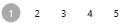

# Appearance in UWP DataPager (SfDataPager)

## Display Modes

The [SfDataPager](https://help.syncfusion.com/cr/uwp/Syncfusion.UI.Xaml.Controls.DataPager.SfDataPager.html) control allows you to customize the visual parts to be displayed using [DisplayMode](https://help.syncfusion.com/cr/uwp/Syncfusion.UI.Xaml.Controls.DataPager.SfDataPager.html#Syncfusion_UI_Xaml_Controls_DataPager_SfDataPager_DisplayMode) property. The following table shows different `PageDisplayMode` options available.

<table>
<tr>
<th>
Enum Values</th><th>
Description</th></tr>
<tr>
<td>
FirstLastPreviousNextNumeric</td><td>
Displays all the navigation buttons and numeric page buttons.{{''| markdownify }}
</td></tr>
<tr>
<td>
FirstLastNumeric</td><td>
Displays the first page, last page navigation button and numeric page buttons.{{''| markdownify }}
</td></tr>
<tr>
<td>
PreviousNextNumeric</td><td>
Displays the previous, next page navigation buttons and numeric page buttons.{{''| markdownify }}
</td></tr>
<tr>
<td>
FirstLastPreviousNext</td><td>
Displays only the page navigation buttons. Numeric page buttons are not displayed.{{''| markdownify }}
</td></tr>
<tr>
<td>
FirstLast</td><td>
Displays only the first and last page navigation buttons.{{''| markdownify }}
</td></tr>
<tr>
<td>
PreviousNext</td><td>
Displays only the previous and next page navigation buttons.{{''| markdownify }}
</td></tr>
<tr>
<td>
Numeric</td><td>
Displays only the numeric page buttons.{{''| markdownify }}
</td></tr>
<tr>
<td>
First</td><td>
Displays only the first page navigation button.{{''| markdownify }}
</td></tr>
<tr>
<td>
Last</td><td>
Displays only the last page navigation button.{{''| markdownify }}
</td></tr>
<tr>
<td>
Previous</td><td>
Displays only the previous page navigation button.{{''| markdownify }}
</td></tr>
<tr>
<td>
Next</td><td>
Displays only the next page navigation button.{{''| markdownify }}
</td></tr>
<tr>
<td>
None</td><td>
It does not display anything</td></tr>
</table>

## Numeric Buttons count

SfDataPager allows you to display the number of page buttons to be displayed in view by setting [NumericButtonCount](https://help.syncfusion.com/cr/uwp/Syncfusion.UI.Xaml.Controls.DataPager.SfDataPager.html#Syncfusion_UI_Xaml_Controls_DataPager_SfDataPager_NumericButtonCount) property. 



<datapager:SfDataPager x:Name="sfDataPager" 
                         PageSize="5" 
                         UseOnDemandPaging="True"
                         NumericButtonCount="10"
                         PageCount="10" /> 



Now after changing `NumberButtonCount` as 5, only 5-page button will be displayed in view and remaining page buttons can be viewed by clicking the navigation buttons.



<datapager:SfDataPager x:Name="sfDataPager" 
                         PageSize="5" 
                         UseOnDemandPaging="True"
                         NumericButtonCount="5"
                         PageCount="10" />



## Orientation

SfDataPager allows you to change the orientation on the control through [Orientation](https://help.syncfusion.com/cr/uwp/Syncfusion.UI.Xaml.Controls.DataPager.SfDataPager.html#Syncfusion_UI_Xaml_Controls_DataPager_SfDataPager_Orientation) property. 

<table>
<tr>
<th>
Enum Value</th><th>
Description</th></tr>
<tr>
<td>
Horizontal</td><td>
This is the default enum value for Orientation. Arranges all the Navigation Buttons and Numeric Buttons Horizontally.{{''|markdownify}}
</td></tr>
<tr>
<td>
Vertical</td><td>
Arranges all the Navigation Buttons and Numeric Buttons Vertically.{{''|markdownify}}
</td></tr>
</table>

## AutoEllipsisMode

The AutoEllipsis button is displayed when the page count is greater than numeric button count. The [SfDataPager](https://help.syncfusion.com/cr/uwp/Syncfusion.UI.Xaml.Controls.DataPager.SfDataPager.html#) control allows you enable this by using [AutoEllipsisMode](https://help.syncfusion.com/cr/uwp/Syncfusion.UI.Xaml.Controls.DataPager.SfDataPager.html#Syncfusion_UI_Xaml_Controls_DataPager_SfDataPager_AutoEllipsisMode) property which is the Enum type.

* [AutoEllipsisMode](https://help.syncfusion.com/cr/uwp/Syncfusion.UI.Xaml.Controls.DataPager.SfDataPager.html#Syncfusion_UI_Xaml_Controls_DataPager_SfDataPager_AutoEllipsisMode) – This Property is used to set the `AutoEllipsisMode`. By default, it is set to None.
* [AutoEllipsisText](https://help.syncfusion.com/cr/uwp/Syncfusion.UI.Xaml.Controls.DataPager.SfDataPager.html#Syncfusion_UI_Xaml_Controls_DataPager_SfDataPager_AutoEllipsisText)– This property is used to change the `AutoEllipsisButton` Text.

The following table explains the different `AutoEllipsisModes`.

<table>
<tr>
<th>
Enum Value</th><th>
Description</th></tr>
<tr>
<td>
After</td><td>
You can display the ellipsis button after numeric buttons.{{''|markdownify}}</td></tr>
<tr>
<td>
Before</td><td>
You can display the ellipsis button before numeric buttons.{{''|markdownify}}</td></tr>
<tr>
<td>
Both</td><td>
You can display the ellipsis button before and after the numeric buttons.{{''|markdownify}}</td></tr>
<tr>
<td>
None</td><td>
It does not display the AutoEllipsisButton.{{''|markdownify}}
</td></tr>
</table>
The following code example explains how to change the `AutoEllipsisText`.



<datapager:SfDataPager x:Name="sfDataPager" 
                         PageSize="2"
                         AutoEllipsisMode="After"
                         NumericButtonCount="4" PageCount="10"
                         AutoEllipsisText="…etc" 
                         UseOnDemandPaging="True"/>



The following screenshot displays the output for `AutoEllipsisText` changed as `…etc`.

## AccentBrush

AccentBrush properties are used to decorate the SfDataPager control with a solid color. There are two AccentBrush properties in the `SfDataPager` control:

* [AccentBackground](https://help.syncfusion.com/cr/uwp/Syncfusion.UI.Xaml.Controls.DataPager.SfDataPager.html#Syncfusion_UI_Xaml_Controls_DataPager_SfDataPager_AccentBackground) – Property that is applied to the background color for `NavigationButtons` and current selected numeric page button. By default, it set to DarkGray.
* [AccentForeground](https://help.syncfusion.com/cr/uwp/Syncfusion.UI.Xaml.Controls.DataPager.SfDataPager.html#Syncfusion_UI_Xaml_Controls_DataPager_SfDataPager_AccentForeground) – Property that is applied to the foreground color for the current selected numeric page button. By default, it set to White.
* [NumericButtonStyle](https://help.syncfusion.com/cr/uwp/Syncfusion.UI.Xaml.Controls.DataPager.SfDataPager.html#Syncfusion_UI_Xaml_Controls_DataPager_SfDataPager_NumericButtonStyleProperty) – Property that is applied to the Style of Numeric Button. This is the Style type property. By default, it set to Null.

The following code example explains how to apply the `AccentBackground` and `AccentForeground` properties for the `SfDataPager` control.



<datapager:SfDataPager x:Name="sfDataPager" 
                         PageCount="2"
                         AccentBackground="#FF8CBF26"
                         AccentForeground="White"
                         UseOnDemandPaging="True" />



The following screenshot displays the output for `AccentBackground` and `AccentForeGround` applied to the `SfDataPager`.

The following code example explains how to use `NumericButtonStyle` in SfDataPager.



<Page.Resources>
    
</Page.Resources>
<datapager:SfDataPager x:Name="sfDataPager" 
                         PageCount="2"
                         AccentBackground="DodgerBlue"
                         UseOnDemandPaging="True" />



The following screenshot displays the output of `NumericButtonStyle`.

