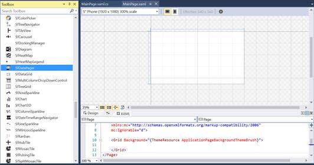
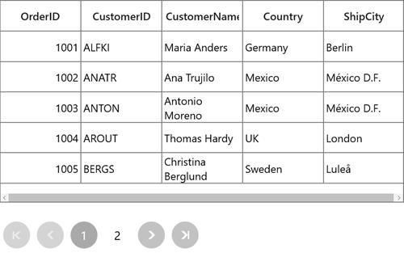

# Getting Started with UWP DataPager (SfDataPager)

The [SfDataPager](https://help.syncfusion.com/cr/uwp/Syncfusion.UI.Xaml.Controls.DataPager.SfDataPager.html#) control provides a configurable user interface for paging. You can specify the page count or you can bind the `SfDataPager` to any [IEnumerable](https://msdn.microsoft.com/en-us/library/system.collections.ienumerable.aspx#) . When you bind collection, the `SfDataPager` control process the collection internally and provides the data for the current page using [PagedSource](https://help.syncfusion.com/cr/uwp/Syncfusion.UI.Xaml.Controls.DataPager.SfDataPager.html#Syncfusion_UI_Xaml_Controls_DataPager_SfDataPager_PagedSource) property. 

## Assembly deployment

The following list of assemblies needs to be added as reference to use [SfDataPager](https://help.syncfusion.com/cr/uwp/Syncfusion.UI.Xaml.Controls.DataPager.SfDataPager.html#) control in any application,

<table>
<tr>
<th>
Required Assemblies</th><th>
Description</th></tr>
<tr>
<td>
Syncfusion.SfGrid.UWP</td><td>
Covers the SfDataPager and other elements.</td></tr>
<tr>
<td>
Syncfusion.Data.UWP</td><td>
Handles data operations and paging.</td></tr>
</table>

When you use [SfDataPager](https://help.syncfusion.com/cr/uwp/Syncfusion.UI.Xaml.Controls.DataPager.SfDataPager.html#) with [SfDataGrid](https://help.syncfusion.com/cr/uwp/Syncfusion.UI.Xaml.Grid.SfDataGrid.html#), need to add the following assemblies along with above assemblies.

<table>
<tr>
<th>
Required Assemblies</th>
<th>
Description</th>
</tr>
<tr>
<td>
Syncfusion.SfInput.UWP</td><td>
Covers various editor controls (such as SfNumericTextBox, SfDateTimeEdit and etc) which are used in SfDataGrid.</td></tr>
<tr>
<td>
Syncfusion.SfShared.UWP</td><td>
`Syncfusion.SfShared.UWP` is dependent assembly for Syncfusion.SfInput.UWP.</td></tr>
</table>

## Creating simple application with SfDataPager

The following steps help you to use the [SfDataPager](https://help.syncfusion.com/cr/uwp/Syncfusion.UI.Xaml.Controls.DataPager.SfDataPager.html#) in an application,

### Creating the Project

Create new Universal Windows Platform project in Visual Studio.

### Adding control via Designer

[SfDataPager](https://help.syncfusion.com/cr/uwp/Syncfusion.UI.Xaml.Controls.DataPager.SfDataPager.html#) control can be added to the application by dragging it from Toolbox and dropping it in Designer view. The required assembly references will be added automatically.

### Adding Control Manually in XAML

In order to add control manually in XAML, do the below steps

1. Add the below required assembly references to the project,
* Syncfusion.Data.UWP
* Syncfusion.SfGrid.UWP
* Syncfusion.SfInput.UWP
* Syncfusion.SfShared.UWP

2. Import [SfDataPager](https://help.syncfusion.com/cr/uwp/Syncfusion.UI.Xaml.Controls.DataPager.SfDataPager.html#)  control namespace `Syncfusion.UI.Xaml.Controls.DataPager` in XAML page.

3. Declare `SfDataPager` control in XAML page.



<Page
    x:Class="GettingStarted.MainPage"
    xmlns="http://schemas.microsoft.com/winfx/2006/xaml/presentation"
    xmlns:x="http://schemas.microsoft.com/winfx/2006/xaml"
    xmlns:local="using:GettingStarted"
    xmlns:d="http://schemas.microsoft.com/expression/blend/2008"
    xmlns:mc="http://schemas.openxmlformats.org/markup-compatibility/2006"
    xmlns:datapager="using:Syncfusion.UI.Xaml.Controls.DataPager"
    mc:Ignorable="d">
    <Grid>
        <datapager:SfDataPager x:Name="sfDataPager"/>
    </Grid>
</Page>



### Adding Control Manually in C\#

In order to add control manually in C#, do the below steps,

1. Add the below required assembly references to the project,
* Syncfusion.Data.UWP
* Syncfusion.SfGrid.UWP
* Syncfusion.SfInput.UWP
* Syncfusion.SfShared.UWP

2. Import [SfDataPager](https://help.syncfusion.com/cr/uwp/Syncfusion.UI.Xaml.Controls.DataPager.SfDataPager.html#)  control namespace `Syncfusion.UI.Xaml.Controls.DataPager`.

3. Create `SfDataPager` control instance and add it to the Page.



using Syncfusion.UI.Xaml.Controls.DataPager;
namespace GettingStarted
{
    /// 

    /// An empty page that can be used on its own or navigated to within a Frame.
    /// 

    public sealed partial class MainPage : Page
    {

        public MainPage()
        {
            this.InitializeComponent();
            SfDataPager dataPager = new SfDataPager();
            Root_Grid.Children.Add(dataPager);
        }
    }
}



## Populating control by binding with data

1.Create data object class named `OrderInfo` and declare properties as shown below,



public class OrderInfo
{
	int orderID;
	string customerId;
	string country;
	string customerName;
	string shippingCity;

	public int OrderID
	{	
		get {   return orderID;  }
		set {   orderID = value; }
	}

	public string <CustomerID></CustomerID>
	{
		get {  return customerId; }
		set {  customerId = value; }
	}

	public string CustomerName
	{
		get {  return customerName; }
		set {  customerName = value;}
	}

	public string Country
	{
		get { return country; }
		set  {  country = value; }
	}

	public string ShipCity
	{
		get {  return shippingCity; }
		set {  shippingCity = value; }
	}

	public OrderInfo(int orderId, string customerName, string country, string customerId,string shipCity)
	{
		this.OrderID = orderId;
		this.CustomerName = customerName;
		this.Country = country;
		this.CustomerID = customerId;
		this.ShipCity = shipCity;
	}
}



2.Create a `ViewModel` class with Orders property and Orders property is initialized with several data objects in constructor.



public class ViewModel
{
	private ObservableCollection<OrderInfo> _orders;

	public ObservableCollection<OrderInfo> Orders
	{
		get { return _orders; }
		set { _orders = value; }
	}

	public ViewModel()
	{
		_orders = new ObservableCollection<OrderInfo>();
		this.GenerateOrders();
	}

	private void GenerateOrders()
	{
		_orders.Add(new OrderInfo(1001, "Maria Anders", "Germany", "ALFKI", "Berlin"));
		_orders.Add(new OrderInfo(1002, "Ana Trujillo", "Mexico", "ANATR", "Mexico D.F."));
		_orders.Add(new OrderInfo(1003, "Antonio Moreno", "Mexico", "ANTON", "Mexico D.F."));
		_orders.Add(new OrderInfo(1004, "Thomas Hardy", "UK", "AROUT", "London"));
		_orders.Add(new OrderInfo(1005, "Christina Berglund", "Sweden", "BERGS", "Lula"));
		_orders.Add(new OrderInfo(1006, "Hanna Moos", "Germany", "BLAUS", "Mannheim"));
		_orders.Add(new OrderInfo(1007, "Frederique Cite", "France", "BLONP", "Strasbourg"));
		_orders.Add(new OrderInfo(1008, "Martin", "Spain", "BOLID", "Madrid"));
		_orders.Add(new OrderInfo(1009, "Laurence", "France", "BONAP", "Marseille"));
		_orders.Add(new OrderInfo(1010, "Elizabeth Lincoln", "Canada", "BOTTM", "Tsawassen"));
	}
}



3.Bind the collection created in previous step to [SfDataPager.Source](https://help.syncfusion.com/cr/uwp/Syncfusion.UI.Xaml.Controls.DataPager.SfDataPager.html#Syncfusion_UI_Xaml_Controls_DataPager_SfDataPager_Source) property in XAML by setting `ViewModel` as `DataContext`. 



<Page
	<Page.DataContext>
		<local:ViewModel />
	</Page.DataContext>
<Grid>
<datapager:SfDataPager x:Name="sfDataPager" 
						PageSize="5"
						Source="{Binding Orders}" />
</Grid>
</Page>



`Orders` collection has 10 items and [PageSize](https://help.syncfusion.com/cr/uwp/Syncfusion.UI.Xaml.Controls.DataPager.SfDataPager.html#Syncfusion_UI_Xaml_Controls_DataPager_SfDataPager_PageSize) is 5. Therefore, SfDataPager loaded with two page buttons and [PageCount](https://help.syncfusion.com/cr/uwp/Syncfusion.UI.Xaml.Controls.DataPager.SfDataPager.html#Syncfusion_UI_Xaml_Controls_DataPager_SfDataPager_PageCount) is two. Here `PageSize` denotes number of records per page. 

### Using with SfDataGrid

Then bind the [PagedSource](https://help.syncfusion.com/cr/uwp/Syncfusion.UI.Xaml.Controls.DataPager.SfDataPager.html#Syncfusion_UI_Xaml_Controls_DataPager_SfDataPager_PagedSource) property of the [SfDataPager](https://help.syncfusion.com/cr/uwp/Syncfusion.UI.Xaml.Controls.DataPager.SfDataPager.html#) control to [SfDataGrid.ItemsSource](https://help.syncfusion.com/cr/uwp/Syncfusion.UI.Xaml.Grid.SfDataGrid.html#Syncfusion_UI_Xaml_Grid_SfDataGrid_ItemsSource) property. You can define the number of records per page by setting [PageSize](https://help.syncfusion.com/cr/uwp/Syncfusion.UI.Xaml.Controls.DataPager.SfDataPager.html#Syncfusion_UI_Xaml_Controls_DataPager_SfDataPager_PageSize) property. 



<Page xmlns:syncfusion="using:Syncfusion.UI.Xaml.Grid">
    <Page.DataContext>
    <local:ViewModel />
    </Page.DataContext>
    <Grid>
    <Grid.RowDefinitions>
        <RowDefinition Height="300"/>
        <RowDefinition Height="*"/>
    </Grid.RowDefinitions>
    <syncfusion:SfDataGrid x:Name="sfGrid"
                            Grid.Row="0" 
                            ItemsSource="{Binding
                            ElementName=sfDataPager,Path=PagedSource}"/>

                            <datapager:SfDataPager x:Name="sfDataPager" 
                                                    Grid.Row="1" 
                                                    PageSize="5" 
                                                    NumericButtonCount="5"
                                                    Source="{Binding Orders}" />
    </Grid>
</Page>



## Populating control in Unbound Mode

You can define the number of pages by setting [UseOnDemandPaging](https://help.syncfusion.com/cr/uwp/Syncfusion.UI.Xaml.Controls.DataPager.SfDataPager.html#Syncfusion_UI_Xaml_Controls_DataPager_SfDataPager_UseOnDemandPagingProperty) to `true` and [PageCount](https://help.syncfusion.com/cr/uwp/Syncfusion.UI.Xaml.Controls.DataPager.SfDataPager.html#Syncfusion_UI_Xaml_Controls_DataPager_SfDataPager_PageCount) property, where you don’t have to bind `SfDataPager` to any collection.



<Grid>
<datapager:SfDataPager x:Name="sfDataPager"                            
                         PageCount="2"
                         UseOnDemandPaging="True"/>
</Grid>



### Using with SfDataGrid

If you want to load the data for any control, you can load using [OnDemandLoading](https://help.syncfusion.com/cr/uwp/Syncfusion.UI.Xaml.Controls.DataPager.OnDemandLoadingEventArgs.html#) event and [LoadDynamicItems](https://help.syncfusion.com/cr/uwp/Syncfusion.UI.Xaml.Controls.DataPager.SfDataPager.html#Syncfusion_UI_Xaml_Controls_DataPager_SfDataPager_LoadDynamicItems_System_Int32_System_Collections_IEnumerable_) method. In this case, you have to specify the `PageSize` property to denote the number of records per page.

The `OnDemandLoading` event is triggered when the user moves to the corresponding page. The `OnDemandLoading` event contains the following event arguments,

* StartIndex: Corresponding page start index.
* PageSize: Number of items to be load for that page.

In an [OnDemandLoading](https://help.syncfusion.com/cr/uwp/Syncfusion.UI.Xaml.Controls.DataPager.OnDemandLoadingEventArgs.html#) event, you can use the `LoadDynamicItems` method to load the data for the corresponding page.



<Page>
<Page.DataContext>
    <local:ViewModel />
</Page.DataContext>
    <Grid>
    <Grid.RowDefinitions>
        <RowDefinition Height="300"/>
        <RowDefinition Height="*"/>
    </Grid.RowDefinitions>
    <syncfusion:SfDataGrid x:Name="sfGrid"
                             Grid.Row="0" 
                             ItemsSource="{Binding
                             ElementName=sfDataPager,Path=PagedSource}"/>    

    <datapager:SfDataPager x:Name="sfDataPager"  
                             Grid.Row ="1"                      
                             PageSize="5" 
                             OnDemandLoading="SfDataPager_OnDemandLoading"
                             NumericButtonCount="5"
                             PageCount="2"
                             UseOnDemandPaging="True"/>
    </Grid>
</Page>


this.sfDataPager.OnDemandLoading += SfDataPager_OnDemandLoading;

private void SfDataPager_OnDemandLoading(object sender, OnDemandLoadingEventArgs args)
{
    sfDataPager.LoadDynamicItems(args.StartIndex, (this.DataContext as ViewModel).Orders.Skip(args.StartIndex).Take(args.PageSize));
}



