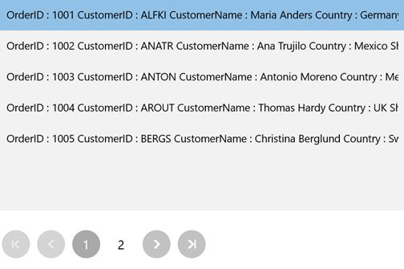

# Using Listview with SfDataPager in UWP DataPager (SfDataPager)

[SfDataPager](https://help.syncfusion.com/cr/uwp/Syncfusion.UI.Xaml.Controls.DataPager.SfDataPager.html#) automatically wraps the collection in [PagedCollectionView](https://help.syncfusion.com/cr/uwp/Syncfusion.Data.PagedCollectionView.html) and exposes to the [PagedSource](https://help.syncfusion.com/cr/uwp/Syncfusion.UI.Xaml.Controls.DataPager.SfDataPager.html#Syncfusion_UI_Xaml_Controls_DataPager_SfDataPager_PagedSource) property. You can pass the `PagedSource` property to bind with any ItemsControl’s ItemsSource property. Here, the `PagesSource` property is bound to the ListBox.

The following code explains how to use Source and `PagedSource` property in ListBox.



<Page>
    <Page.DataContext>
        <local:ViewModel />
    </Page.DataContext>
    <Grid>
        <Grid.RowDefinitions>
            <RowDefinition Height="300"/>
            <RowDefinition Height="*"/>
        </Grid.RowDefinitions>
        <ListBox ItemsSource="{Binding ElementName=sfDataPager, Path=PagedSource}"/>
        
        <datapager:SfDataPager x:Name="sfDataPager" 
                                Grid.Row="1" 
                                PageSize="5" 
                                NumericButtonCount="5"
                                Source="{Binding Orders}" />
    </Grid>
</Page>



The following screenshot displays the output for `ListView` bound with `PagedCollection`.

