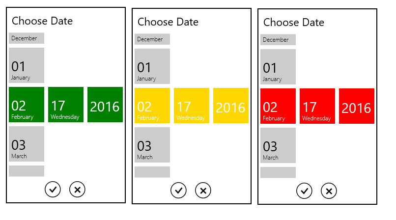
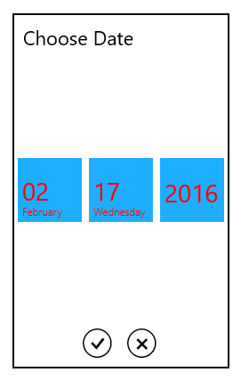

# Appearance and Styling in UWP DatePicker (SfDatePicker)

## Accent Brush

The AccentBrush property is used to decorate the hot spots of a control with a solid color.



<Page
   ...
   xmlns:input="using:Syncfusion.UI.Xaml.Controls.Input">

    <Grid Background="{StaticResource ApplicationPageBackgroundThemeBrush}">

            <syncfusion:SfDatePicker  VerticalAlignment="Center"

                                    HorizontalAlignment="Center"

                                    Width="200"

                                    AccentBrush="Green"/>

    </Grid>

</Page>



The following image shows the control with various accent brushes:

## Selected Foreground

The SelectedForeground property is used to change the foreground color of the selected date.



<Page
   ...
   xmlns:input="using:Syncfusion.UI.Xaml.Controls.Input">

    <Grid Background="{StaticResource ApplicationPageBackgroundThemeBrush}">

            <syncfusion:SfDatePicker VerticalAlignment="Center"

                             HorizontalAlignment="Center"

                             Width="200">

                <syncfusion:SfDatePicker.SelectorStyle>

                    

                </syncfusion:SfDatePicker.SelectorStyle>

            </syncfusion:SfDatePicker>

    </Grid>

</Page>



