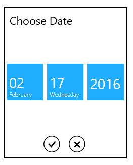

# Customizing DropDown in UWP DatePicker (SfDatePicker)

## DropDown height

The height of drop down can be changed using DropDownHeight property.





  <syncfusion:SfDatePicker x:Name="sfdatePicker" VerticalAlignment="Center"  Width="200" Margin="15" DropDownHeight="300" />









sfdatePicker.DropDownHeight = 200;





sfdatePicker.DropDownHeight = 200





## IsDropDownOpen

Drop down can be programmatically opened or closed using the property IsDropDownOpen.

## ShowDropDownButton

DropDownButton visibility can be changed by using the ShowDropDownButton property





   <syncfusion:SfDatePicker x:Name="sfdatePicker" VerticalAlignment="Center"  Width="200" Margin="15" ShowDropDownButton="true"/>









 sfdatePicker.ShowDropDownButton = true;





 sfdatePicker.ShowDropDownButton = True





