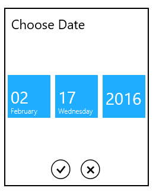

# Customizing DropDown in UWP DatePicker (SfDatePicker)

## DropDown height

The height of the drop-down can be changed using the DropDownHeight property.





<Page
   ...
   xmlns:input="using:Syncfusion.UI.Xaml.Controls.Input">

    <syncfusion:SfDatePicker x:Name="sfdatePicker" VerticalAlignment="Center"  Width="200" Margin="15" DropDownHeight="300" />

</Page>









using Syncfusion.UI.Xaml.Controls.Input;

sfdatePicker.DropDownHeight = 300;





Imports Syncfusion.UI.Xaml.Controls.Input;

sfdatePicker.DropDownHeight = 300





## IsDropDownOpen

The drop-down can be programmatically opened or closed using the IsDropDownOpen property.

## ShowDropDownButton

The drop-down button visibility can be changed by using the ShowDropDownButton property.





<Page
   ...
   xmlns:input="using:Syncfusion.UI.Xaml.Controls.Input">

    <syncfusion:SfDatePicker x:Name="sfdatePicker" VerticalAlignment="Center"  Width="200" Margin="15" ShowDropDownButton="true"/>

</Page>









using Syncfusion.UI.Xaml.Controls.Input;

 sfdatePicker.ShowDropDownButton = true;





Imports Syncfusion.UI.Xaml.Controls.Input;

 sfdatePicker.ShowDropDownButton = True





