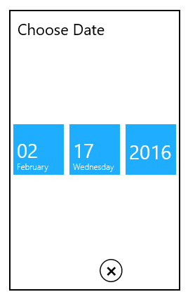
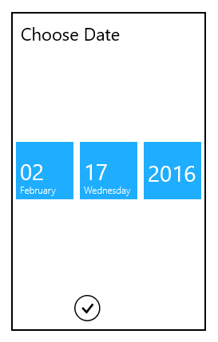

# Footer in UWP DatePicker

## Done and Cancel Buttons

The Done and Cancel buttons can be shown or hidden using the following properties.

## ShowDoneButton

The ShowDoneButton property is used to show or hide the done button. The default value is true.

The following code sample shows how to hide the done button:



<Page
   ...
   xmlns:input="using:Syncfusion.UI.Xaml.Controls.Input">

    <syncfusion:SfDatePicker VerticalAlignment="Center"

                               HorizontalAlignment="Center"

                               Width="200">

            <syncfusion:SfDatePicker.SelectorStyle>

                

            </syncfusion:SfDatePicker.SelectorStyle>  

        </syncfusion:SfDatePicker>

</Page>



## ShowCancelButton

The ShowCancelButton property is used to show or hide the cancel button. The default value is true.

The following code sample shows how to hide the cancel button:



<Page
   ...
   xmlns:input="using:Syncfusion.UI.Xaml.Controls.Input">

    <syncfusion:SfDatePicker VerticalAlignment="Center"

                               HorizontalAlignment="Center"

                               Width="200">

            <syncfusion:SfDatePicker.SelectorStyle>

                

            </syncfusion:SfDatePicker.SelectorStyle>        </syncfusion:SfDatePicker>

</Page>

			
			

