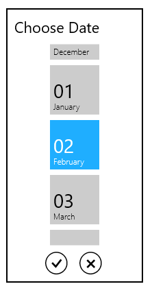

# Formatting in UWP DatePicker (SfDatePicker)

The SfDatePicker control allows the user to format the display text in various ways.

## Using the FormatString

The FormatString property determines the format specifier by which the display text has to be formatted.

The following code sample shows how to create a date picker with a [month day pattern](https://learn.microsoft.com/en-us/dotnet/api/system.globalization.datetimeformatinfo.monthdaypattern?view=net-9.0&redirectedfrom=MSDN#System_Globalization_DateTimeFormatInfo_MonthDayPattern): 





<Grid Background="{StaticResource ApplicationPageBackgroundThemeBrush}">

            <syncfusion:SfDatePicker VerticalAlignment="Center" x:Name="sfdatePicker"

                                   Width="200" Margin="15"

                                   FormatString="M"/>

</Grid>









 sfdatePicker.FormatString = "M";





 sfdatePicker.FormatString = "M"





## Specifying format for the DateSelector

The SelectorFormatString property used to specify format for the DateSelector





<Grid Background="{StaticResource ApplicationPageBackgroundThemeBrush}">

    <syncfusion:SfDatePicker SelectorFormatString="M"   x:Name="sfdatePicker" VerticalAlignment="Center"  Width="200" Margin="15" />

</Grid>









sfdatePicker.SelectorFormatString = "M";





sfdatePicker.SelectorFormatString = "M"





N> A detailed explanation of standard date time formatting is available [here](https://learn.microsoft.com/en-us/previous-versions/dotnet/netframework-1.1/az4se3k1(v=vs.71)). The result string produced by these format specifiers are influenced by the settings in the Regional Options control panel. Computers with different cultures or different date and time settings will generate different result strings.
