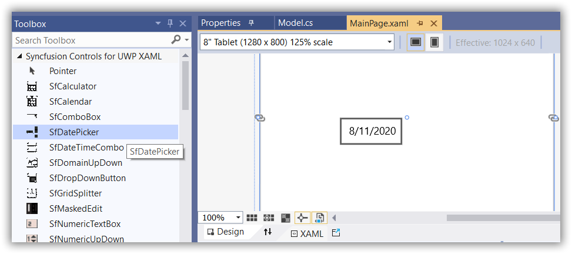
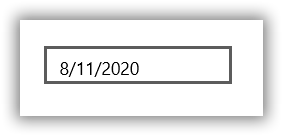
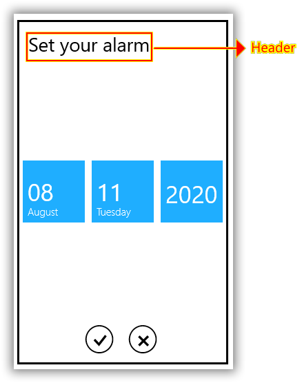

# Getting Started with UWP DatePicker (SfDatePicker)

This section provides a quick overview of working with the [SfDatePicker](https://help.syncfusion.com/cr/uwp/Syncfusion.UI.Xaml.Controls.Input.SfDatePicker.html) control.

## Assembly deployment
Refer to the [control dependencies](https://help.syncfusion.com/uwp/control-dependencies#sfdatepicker) section to get the list of assemblies or NuGet packages that need to be added as a reference to use the [SfDatePicker](https://help.syncfusion.com/cr/uwp/Syncfusion.UI.Xaml.Controls.Input.SfDatePicker.html) control in any application.

You can refer to this [documentation](https://help.syncfusion.com/uwp/visual-studio-integration/nuget-packages) to find more details about installing the NuGet package in a UWP application.

## Creating Application with SfDatePicker control
In this walkthrough, you will create a UWP application that contains the [SfDatePicker](https://help.syncfusion.com/cr/uwp/Syncfusion.UI.Xaml.Controls.Input.SfDatePicker.html) control.
1. [Creating project](#Creating-the-project)
2. [Adding control via designer](#Adding-control-via-designer)
3. [Adding control manually in XAML](#Adding-control-manually-in-XAML)
4. [Adding control manually in C#](#Adding-control-manually-in-C#)

## Creating project 
The following section provides detailed information to create a new project in Visual Studio to display the [SfDatePicker](https://help.syncfusion.com/cr/uwp/Syncfusion.UI.Xaml.Controls.Input.SfDatePicker.html) control.

## Adding control via designer
The [SfDatePicker](https://help.syncfusion.com/cr/uwp/Syncfusion.UI.Xaml.Controls.Input.SfDatePicker.html) control can be added to the application by dragging it from the Toolbox and dropping it in the designer. The required assemblies will be added automatically.

## Adding control manually in XAML

To add the [SfDatePicker](https://help.syncfusion.com/cr/uwp/Syncfusion.UI.Xaml.Controls.Input.SfDatePicker.html) control manually in XAML, follow the below steps:

1. Add the below required assembly references to the project:

    * Syncfusion.SfInput.UWP
    * Syncfusion.SfShared.UWP

2. Include the namespace for the Syncfusion.SfInput.UWP assembly in MainPage.XAML.





<Page xmlns="http://schemas.microsoft.com/winfx/2006/xaml/presentation"

xmlns:x="http://schemas.microsoft.com/winfx/2006/xaml"

xmlns:syncfusion="using:Syncfusion.UI.Xaml.Controls.Input">





3. Now add the [SfDatePicker](https://help.syncfusion.com/cr/uwp/Syncfusion.UI.Xaml.Controls.Input.SfDatePicker.html) control in MainPage.XAML.





<Page
   ...
   xmlns:input="using:Syncfusion.UI.Xaml.Controls.Input">

    <syncfusion:SfDatePicker Name="datePicker1" HorizontalAlignment="Center"  Height="30" Width="150" />

</Page>





## Adding control manually in C#

To add the [SfDatePicker](https://help.syncfusion.com/cr/uwp/Syncfusion.UI.Xaml.Controls.Input.SfDatePicker.html) control manually in C#, follow the below steps:

1. Add the below required assembly references to the project:

    * Syncfusion.SfInput.UWP
    * Syncfusion.SfShared.UWP

2. Import the SfDatePicker namespace **Syncfusion.UI.Xaml.Controls.Input**.

3. Create an SfDatePicker control instance and add it to the page.





using Syncfusion.UI.Xaml.Controls.Input;
using Windows.UI.Xaml;

SfDatePicker datePicker1 = new SfDatePicker()
{
    Height = 30,
    Width = 150,
    HorizontalAlignment = HorizontalAlignment.Center
};





Imports Syncfusion.UI.Xaml.Controls.Input
Imports Windows.UI.Xaml

Dim datePicker1 As SfDatePicker = New SfDatePicker() With {
    .Height = 30,
    .Width = 150,
    .HorizontalAlignment = HorizontalAlignment.Center
}





## Customizing the date format

The format of the date in [SfDatePicker](https://help.syncfusion.com/cr/uwp/Syncfusion.UI.Xaml.Controls.Input.SfDatePicker.html) can be customized by using the [FormatString](https://help.syncfusion.com/cr/uwp/Syncfusion.UI.Xaml.Controls.Input.SfDatePicker.html#Syncfusion_UI_Xaml_Controls_Input_SfDatePicker_FormatString) property. For example, the format of the date can be changed to the *yyyy-dd-MM* format.





<Page
   ...
   xmlns:input="using:Syncfusion.UI.Xaml.Controls.Input">

    <syncfusion:SfDatePicker HorizontalAlignment="Center" VerticalAlignment="Center" FormatString="yyyy-dd-MM"  Width="125" />

</Page>




datePicker1.FormatString = "yyyy-dd-MM";





Imports Syncfusion.UI.Xaml.Controls.Input;

datePicker1.FormatString = "yyyy-dd-MM"





## Customize SfDateSelector Header

You can customize the [SfDateSelector](https://help.syncfusion.com/cr/uwp/Syncfusion.UI.Xaml.Controls.Input.SfDateSelector.html) in the [SfDatePicker](https://help.syncfusion.com/cr/uwp/Syncfusion.UI.Xaml.Controls.Input.SfDatePicker.html) control using the [SelectorStyle](https://help.syncfusion.com/cr/uwp/Syncfusion.UI.Xaml.Controls.Input.SfDatePicker.html#Syncfusion_UI_Xaml_Controls_Input_SfDatePicker_SelectorStyle) property.





<Page
   ...
   xmlns:input="using:Syncfusion.UI.Xaml.Controls.Input">

    <syncfusion:SfDatePicker HorizontalAlignment="Center" VerticalAlignment="Center" FormatString="M"  Width="125">
        <syncfusion:SfDatePicker.SelectorStyle>
            
        </syncfusion:SfDatePicker.SelectorStyle>
    </syncfusion:SfDatePicker>

</Page>





