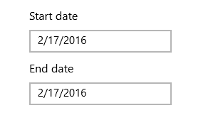
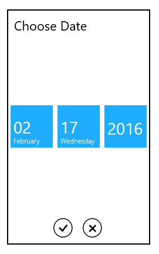

# UWP DatePicker (SfDatePicker) Overview

The SfDatePicker control allows the user to select date values in a touch friendly manner.

### Normal view:

### Expanded view:

### Key Features

Formatting – The Control displays  the selected Date value in a various formats.

Date Selector – The drop-down portion used for selecting the date can be customized.

N> You can refer to our [UWP DatePicker](https://www.syncfusion.com/uwp-ui-controls/datepicker)feature tour page to know about its other groundbreaking feature representations. You can also explore our [UWP DatePicker example](https://apps.microsoft.com/store/detail/syncfusion-essential-studio-for-uwp/9NBLGGH5WNGV) that shows you how to render and configure the datepicker in UWP.

