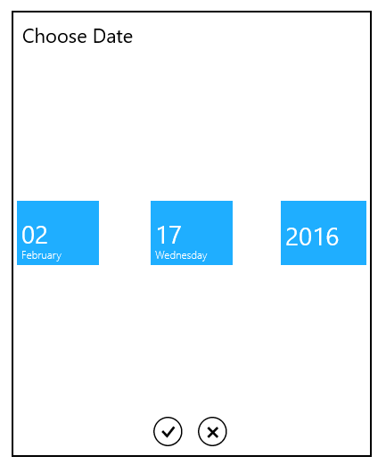

# SelectorItem Customization in UWP DatePicker (SfDatePicker)

## SelectorItemWidth and SelectorItemHeight

The item size in the SfDateSelector control can be changed by setting the SelectorItemWidth and SelectorItemHeight properties.

## SelectorItemSpacing 

The SelectorItemSpacing property provides the space between the items in SfDateSelector.

## SelectorItemCount

The SelectorItemCount property is used to specify the number of items to be used in SfDateSelector.

The following code sample shows the usage of the SelectorItemWidth, SelectorItemHeight, SelectorItemSpacing, and SelectorItemCount properties. 





<Grid Background="{StaticResource ApplicationPageBackgroundThemeBrush}">

            <syncfusion:SfDatePicker VerticalAlignment="Center"

               Width="200" x:Name="datePicker" SelectorItemWidth="100"

                SelectorItemHeight="100"

                SelectorItemSpacing="50"

                SelectorItemCount="4"/>

</Grid>









datePicker.SelectorItemWidth = 100;
datePicker.SelectorItemHeight = 100;
datePicker.SelectorItemSpacing = 50;
datePicker.SelectorItemCount = 4;





 datePicker.SelectorItemWidth = 100
 datePicker.SelectorItemHeight = 100
 datePicker.SelectorItemSpacing = 50
 datePicker.SelectorItemCount = 4





The output is displayed in the following image:

