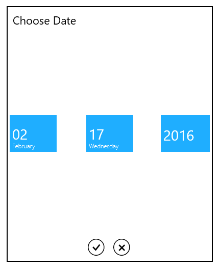

# SelectorItem Customization in UWP DatePicker

## SelectorItemWidth and SelectorItemHeight

The item size in the SfDateSelector control can be changed by setting the SelectorItemWidth and SelectorItemHeight properties.

## SelectorItemSpacing

The SelectorItemSpacing property provides the space between the items in the SfDateSelector.

## SelectorItemCount

The SelectorItemCount property is used to specify the number of items to be displayed in the SfDateSelector.

The following code sample shows the usage of the SelectorItemWidth, SelectorItemHeight, SelectorItemSpacing, and SelectorItemCount properties. 





<Page
   ...
   xmlns:input="using:Syncfusion.UI.Xaml.Controls.Input">

    <Grid Background="{StaticResource ApplicationPageBackgroundThemeBrush}">

                    <syncfusion:SfDatePicker VerticalAlignment="Center"

                   Width="200" x:Name="datePicker" SelectorItemWidth="100"

                    SelectorItemHeight="100"

                    SelectorItemSpacing="50"

                    SelectorItemCount="4"/>

    </Grid>

</Page>









using Syncfusion.UI.Xaml.Controls.Input;

datePicker.SelectorItemWidth = 100;
datePicker.SelectorItemHeight = 100;
datePicker.SelectorItemSpacing = 50;
datePicker.SelectorItemCount = 4;





Imports Syncfusion.UI.Xaml.Controls.Input;

 datePicker.SelectorItemWidth = 100
 datePicker.SelectorItemHeight = 100
 datePicker.SelectorItemSpacing = 50
 datePicker.SelectorItemCount = 4





The output is displayed in the following image:

