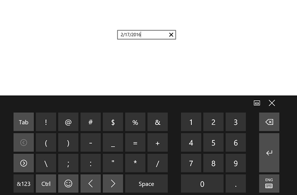

# Setting Null Value in UWP DatePicker

The AllowNull property can be used to set the SfDatePicker value to null. When this property is enabled along with the Value property set to null, the SfDatePicker control will not display any value.

The following code example and screenshot illustrate the usage of the AllowNull property.



<Page
   ...
   xmlns:input="using:Syncfusion.UI.Xaml.Controls.Input">

    <Grid Background="{StaticResource ApplicationPageBackgroundThemeBrush}">

    <syncfusion:SfDatePicker VerticalAlignment="Center" Width="200" Value="{x:Null}" AllowNull="true"/>

    </Grid>

</Page>



## Setting the Input Scope for the On-Screen Keyboard

To set the input scope of the on-screen keyboard, use the InputScope property. When the InputScope property is set to Number, only the numeric keypad will be visible in the on-screen keyboard.
The following code example and screenshot illustrate this property.

N> The AllowInlineEditing property must be set to `true` for this property to take effect.



<Page
   ...
   xmlns:input="using:Syncfusion.UI.Xaml.Controls.Input">

    <Grid Background="{StaticResource ApplicationPageBackgroundThemeBrush}">

    <syncfusion:SfDatePicker VerticalAlignment="Center" Width="200"

    AllowInlineEditing="true" InputScope="Number"/>

    </Grid>

</Page>



