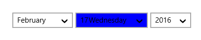
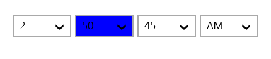
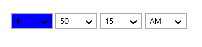
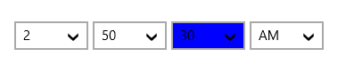
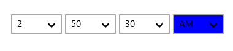
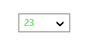
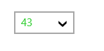
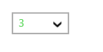

# Customization in UWP DateTimePicker (SfDateTimeCombo)

The DateTimeItem drop-down lists displayed in this control include date or time parts that can be customized in a user-friendly manner using the properties below.

## DayComboStyle

The DayComboStyle property is used to customize the style of the DateTimeItem containing the day part of the DateTime set in the SfDateTimeCombo control.



   <syncfusion:SfDateTimeCombo FormatString="Mdy" Name="SfDateTimeCombo" 

                               Width="430" HorizontalAlignment="Left">

            <syncfusion:SfDateTimeCombo.DayComboStyle>

                

            </syncfusion:SfDateTimeCombo.DayComboStyle>

        </syncfusion:SfDateTimeCombo>



## MonthComboStyle

The MonthComboStyle property is used to customize the style of the DateTimeItem containing the month part of the DateTime set in the SfDateTimeCombo control.

## YearComboStyle

The YearComboStyle property is used to customize the style of the DateTimeItem containing the year part of DateTime set in the SfDateTimeCombo control.

## MinuteComboStyle

The MinuteComboStyle property is used to customize the style of the DateTimeItem containing the minute part of the DateTime set in the SfDateTimeCombo control.

## TwelveHourComboStyle

The TwelveHourComboStyle property is used to customize the style of the DateTimeItem containing the twelve hour part of the DateTime set in the SfDateTimeCombo control.

## TwentyFourHourComboStyle

The TwentyFourHourComboStyle property is used to customize the style of the DateTimeItem containing the twenty-four hour part of the DateTime set in the SfDateTimeCombo control.

## SecondComboStyle

The SecondComboStyle property is used to customize the style of the DateTimeItem containing the second part of the DateTime set in the SfDateTimeCombo control. 

## AMPMDesignatorComboStyle

The AMPMDesignatorComboStyle property is used to customize the style of the DateTimeItem containing the AM/PM part of DateTime set in the SfDateTimeCombo control.

## Item template

The Item template property is used to decorate the DateTimeItem drop-down list containing the date or time lists with custom visuals. 

N>  The DataContext of a DateTimeItem drop-down list containing date or time parts is Syncfusion.UI.Xaml.Primitives.DateTimeWrapper.

### DayItemTemplate

The DayItemTemplate property is used to define the DateTimeItem template of the day section set in the SfDateTimeCombo control.



<syncfusion:SfDateTimeCombo FormatString="d" Name="SfDateTimeCombo" 

                               Width="430" HorizontalAlignment="Left">

            <syncfusion:SfDateTimeCombo.DayItemTemplate>

                <DataTemplate>

                    <Grid>

                        <Grid.ColumnDefinitions>

                            <ColumnDefinition Width="*"></ColumnDefinition>

                            <ColumnDefinition Width="20"></ColumnDefinition>

                        </Grid.ColumnDefinitions>

                        <TextBlock Grid.Column="0" Text="{Binding DayName}" />

                        <TextBlock Grid.Column="1" Text="{Binding DayNumber}" />

                    </Grid>

                </DataTemplate>

            </syncfusion:SfDateTimeCombo.DayItemTemplate>

    </syncfusion:SfDateTimeCombo>



### MonthItemTemplate

The MonthItemTemplate property is used to define the DateTimeItem template of the month set in the SfDateTimeCombo control.

### YearItemTemplate

The YearItemTemplate property is used to define the DateTimeItem template of the year part in the SfDateTimeCombo control.

### MinuteItemTemplate

The MinuteItemTemplate property is used to define the DateTimeItem template of the minute part in the SfDateTimeCombo control.

### SecondItemTemplate

The SecondItemTemplate property is used to define the DateTimeItem template of the second part in the SfDateTimeCombo control.

### TwelveHourItemTemplate

The TwelveHourItemTemplate property is used to define the DateTimeItem template of twelve hour part in the SfDateTimeCombo control.

### TwentyFourHourItemTemplate

The TwentyFourHourItemTemplate property is used to define the DateTimeItem template of twenty-four hour part in the SfDateTimeCombo control.

### AMPMDesignatorItemTemplate

The AMPMDesignatorItemTemplate property is used to define the DateTimeItem template of the AM/PM part set in the SfDateTimeCombo control.

