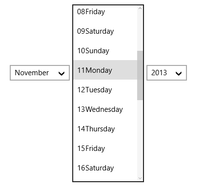
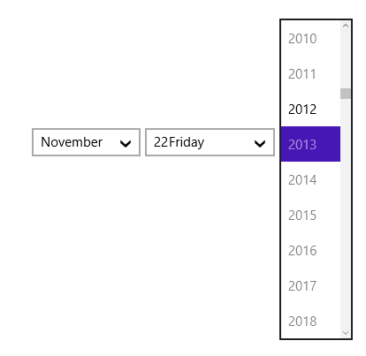
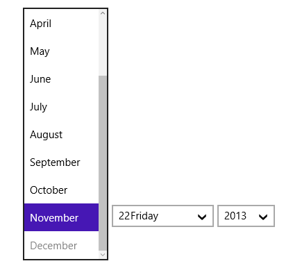

# Displaying Minimum and Maximum Dates in UWP DateTimePicker (SfDateTimeCombo)

To display the minimum and maximum dates in SfDateTimeCombo, use DisplayMinDate and DisplayMaxDate properties respectively.

The following code example and screen shots illustrate this.





<Grid Background="{StaticResource ApplicationPageBackgroundThemeBrush}">

<syncfusion:SfDateTimeCombo FormatString="mdy" x:Name="combo" Width="350" HorizontalAlignment="Left"/>   

</Grid> 









combo.DisplayMinDate = new DateTime(2012,10,2);

combo.DisplayMaxDate = new DateTime(2013,11,22);





combo.DisplayMinDate = New Date(2012,10,2)

combo.DisplayMaxDate = New Date(2013,11,22)





