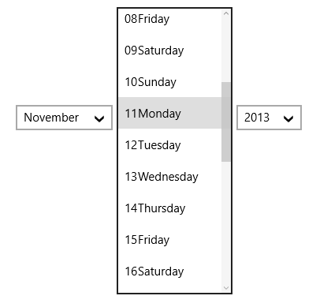
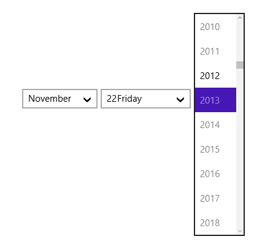
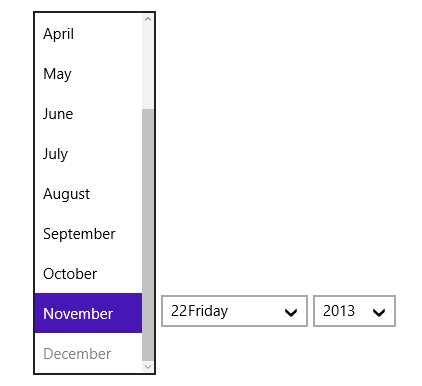

# Displaying Minimum and Maximum Dates in UWP DateTimePicker

To display the minimum and maximum dates in SfDateTimeCombo, use the DisplayMinDate and DisplayMaxDate properties, respectively.

The following code example and screenshots illustrate this.





<Page
   ...
   xmlns:input="using:Syncfusion.UI.Xaml.Controls.Input">

    <Grid Background="{StaticResource ApplicationPageBackgroundThemeBrush}">

    <syncfusion:SfDateTimeCombo FormatString="Mdy" x:Name="combo" Width="350" HorizontalAlignment="Left"/>

    </Grid>

</Page>









using Syncfusion.UI.Xaml.Controls.Input;

combo.DisplayMinDate = new DateTime(2012,10,2);

combo.DisplayMaxDate = new DateTime(2013,11,22);





Imports Syncfusion.UI.Xaml.Controls.Input;

combo.DisplayMinDate = New Date(2012,10,2)

combo.DisplayMaxDate = New Date(2013,11,22)





