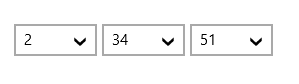

# Formatting in UWP DateTimePicker (SfDateTimeCombo)

The SfDateTimeCombo control allows the user to format the display text in various ways.

## Using the FormatString

The FormatString property determines the format specifier by which the DateTime has to be formatted.





<Grid Background="{StaticResource ApplicationPageBackgroundThemeBrush}">

            <syncfusion:SfDateTimeCombo FormatString="hms" x:Name="datetimeCombo"

                               Width="350" HorizontalAlignment="Left"/>
</Grid>









datetimeCombo.FormatString = "hms";





datetimeCombo.FormatString = "hms"





N>  The result string produced by these format specifiers is influenced by the settings in the Regional Options control panel. Computers with different cultures or different date and time settings will generate different result strings.
