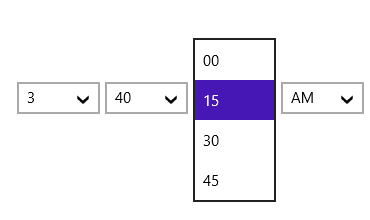
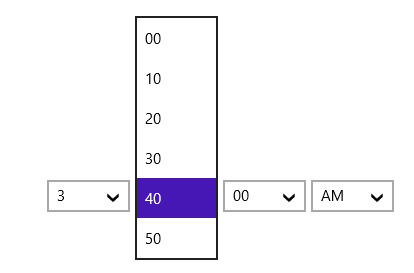

# Setting Minutes and Seconds Intervals in UWP DateTimePicker (SfDateTimeCombo)

MinuteInterval and SecondInterval properties can be used to specify the interval for minutes and seconds to be displayed in the SfDateTimeCombo control

The following code examples and screenshots illustrate this.





<syncfusion:SfDateTimeCombo FormatString="hmst" x:Name="combo" Width="350" HorizontalAlignment="Left" MinuteInterval="10" SecondsInterval="15"/>   









combo.MinuteInterval = 10;

combo.SecondsInterval = 15;





combo.MinuteInterval = 10

combo.SecondsInterval = 15





### MinuteInterval

### SecondInterval

