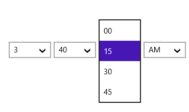
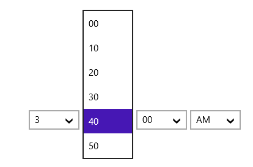

# Setting Minutes and Seconds Intervals in UWP DateTimePicker  (SfDateTimeCombo)

MinuteInterval and SecondsInterval properties can be used to specify the interval for minutes and seconds to be displayed in the SfDateTimeCombo control.

The following code examples and screenshots illustrate this.





<Page
   ...
   xmlns:input="using:Syncfusion.UI.Xaml.Controls.Input">

    <syncfusion:SfDateTimeCombo FormatString="hmst" x:Name="combo" Width="350" HorizontalAlignment="Left" MinuteInterval="10" SecondsInterval="15"/>    

</Page>









using Syncfusion.UI.Xaml.Controls.Input;

combo.MinuteInterval = 10;

combo.SecondsInterval = 15;





Imports Syncfusion.UI.Xaml.Controls.Input;

combo.MinuteInterval = 10

combo.SecondsInterval = 15





### MinuteInterval

### SecondsInterval

