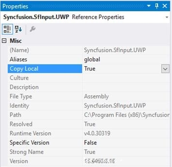

# Deployment

## Copy Local

Copying assemblies to local folder is supported by Syncfusion&reg; components. It can be achieved by setting the assembly’s Copy Local property to true, so that it can be copied to Bin\Release, Bin\Debug folders. The files .exe, .dll, .xml, .pri, rd.xml, .xaml  are copied to client machines.

## Installed Location

The following table represents installed location of Assemblies and Samples.

<table>
<tr>
<td>
Assemblies/Samples</td><td>
Installed location</td></tr>
<tr>
<td>
SDK package</td><td>
C:\Program Files (x86)\Syncfusion\Essential Studio\Universal Windows\{{ site.releaseversion }}\Universal Windows\10.0\SDK</td></tr>
<tr>
<td>
Assemblies</td><td>
C:\Program Files (x86)\Syncfusion\Essential Studio\Universal Windows\{{ site.releaseversion }}\Assemblies for Universal Windows\10.0</td></tr>
<tr>
<td>
Samples</td><td>
C:\Users\Public\Documents\Syncfusion\Universal Windows\{{ site.releaseversion }}</td></tr>
</table>

N> In above table, Latest Essential Studio version details has been provided. User can refer installed Essential Studio version instead of mentioned version.
