# Annotation in UWP Diagram (SfDiagram)

Annotation is a block of text that can be displayed over a Node or Connector. Annotation is used to textually represent an object with a string that can be edited at run time. 
You can add Multiple Labels to a Node/Connector.

## Create Annotation

You can add an Annotation to a Node/Connector by defining the IAnnotation object and adding that to the `Annotations` property of Node/Connector.The `Content` property of IAnnotation defines the object to be displayed. The following code illustrates how to create an Annotation.



//Creates the Node Collection
ObservableCollection<NodeViewModel> nodes = new ObservableCollection<NodeViewModel>();
NodeViewModel node = new NodeViewModel()
{
	UnitWidth = 100,
	UnitHeight = 100,
	OffsetX = 100,
	OffsetY = 100,
	//Creates Annotation Collection
	Annotations=new ObservableCollection<IAnnotation>()
	{
		new AnnotationEditorViewModel()
		{
			Content="Annotation",
			Alignment=ConnectorAnnotationAlignment.Center,
			HorizontalAlignment=HorizontalAlignment.Center,
			VerticalAlignment=VerticalAlignment.Center,
		}
	},
	Shape = new RectangleGeometry() { Rect = new Rect(0, 0, 10, 10) },
	ShapeStyle = this.diagram.Resources["shapestyle"] as Style
};
//Adds Nodes to the SfDiagram
nodes.Add(node);
diagram.Nodes = nodes;

//Creates the Connector Collection
ObservableCollection<ConnectorViewModel> lines = new ObservableCollection<ConnectorViewModel>();
ConnectorViewModel connector = new ConnectorViewModel()
{
	SourcePoint = new Point(200, 50),
	TargetPoint = new Point(300, 150),
	
	//Creates the Segment Collection
	Segments=new ObservableCollection<IConnectorSegment>()
	{
		new OrthogonalSegment()
		{
			Direction=OrthogonalDirection.Bottom,
			Length=50
		}
	},
	
	//Creates the Annotation collection
	Annotations = new ObservableCollection<IAnnotation>()
	{
		new AnnotationEditorViewModel()
		{
			Content="Annotation",
		}
	},
	TargetDecoratorStyle = this.diagram.Resources["decoratorstyle1"] as Style,
};
//Adds Connectors to the SfDiagram
lines.Add(connector);
diagram.Connectors = lines;   



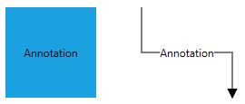

## Alignment

Annotation can be aligned relative to the Node boundaries. It has Margin, Offset, Horizontal and Vertical Alignment settings. It is quite tricky when all four alignments are used together but gives you more control over alignment.

### Offset

The `Offset` property of IAnnotation is used to align the Annotations based on fractions. 0 represents Top/Left corner, 1 represents Bottom/Right corner, and 0.5 represents half of Width/Height.

The following image shows the relationship between the Annotation position (black colored circle) and Offset (fraction values).

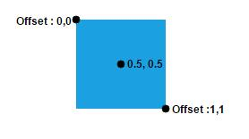

By using Offset property, without creating the template we can arrange the Annotation.

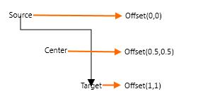

### Horizontal and Vertical alignments

The `HorizontalAlignment` property of IAnnotation is used to set how the Annotation is horizontally aligned at the Annotation position determined from the fraction values. The VerticalAlignment property is used to set how Annotation is vertically aligned at the Annotation position.

The following table illustrates all the possible alignments visually with **Offset (0, 0)**.

| Horizontal Alignment | Vertical Alignment | Output with Offset(0,0) |
|---|---|---|
| Left | Top | 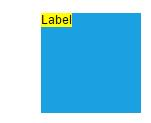 |
| Center | | 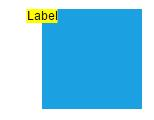 |
| Right | | 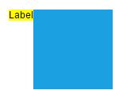 |
| Left | Center | 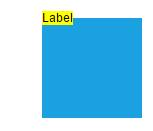 |
| Center | | 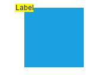 |
| Right | | 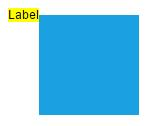 |
| Left | Bottom | 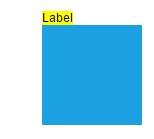 |
| Center | | 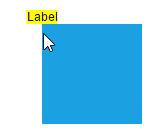 |
| Right | | 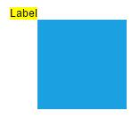 |

The following codes illustrates how to align Annotations.



//Creates the Node Collection
ObservableCollection<NodeViewModel> nodes = new ObservableCollection<NodeViewModel>();
NodeViewModel node = new NodeViewModel()
{
	UnitWidth = 100,
	UnitHeight = 100,
	OffsetX = 100,
	OffsetY = 100,
	Annotations=new ObservableCollection<IAnnotation>()
	{
		new AnnotationEditorViewModel()
		{
			Content="Annotation",
			Offset=new Point(0,0.5),
			Alignment=ConnectorAnnotationAlignment.Center,
			HorizontalAlignment=HorizontalAlignment.Left,
			VerticalAlignment=VerticalAlignment.Center,
		}
	},
	Shape = new RectangleGeometry() { Rect = new Rect(0, 0, 10, 10) },
	ShapeStyle = this.diagram.Resources["shapestyle"] as Style
};

//Adds Nodes to the SfDiagram
nodes.Add(node);
diagram.Nodes = nodes;



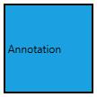

### Margin

**Margin** is an absolute value used to add some blank space in any one of its four sides. You can displace the Annotations with the `Margin` property. The following code example illustrates how to align an Annotation based on its Offset, HorizontalAlignment, VerticalAlignment and Margin values.



//Creates the Node collection
ObservableCollection<NodeViewModel> nodes = new ObservableCollection<NodeViewModel>();
NodeViewModel node = new NodeViewModel()
{
	UnitWidth = 100,
	UnitHeight = 100,
	OffsetX = 100,
	OffsetY = 100,
	//Creates Annotation collection
	Annotations=new ObservableCollection<IAnnotation>()
	{
		new AnnotationEditorViewModel()
		{
			Content="Annotation",
			Margin=new Thickness(0,10,0,0),
			Offset=new Point(0.5,1),
			Alignment=ConnectorAnnotationAlignment.Center,
			HorizontalAlignment=HorizontalAlignment.Center,
			VerticalAlignment=VerticalAlignment.Top,
		}
	},
	Shape = new RectangleGeometry() { Rect = new Rect(0, 0, 10, 10) },
	ShapeStyle = this.diagram.Resources["shapestyle"] as Style
};

//Adds Nodes to the SfDiagram
nodes.Add(node);
diagram.Nodes = nodes;



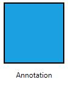

The following code illustrates how to displace Annotation through with the Margin property.



new AnnotationEditorViewModel()
{
	Content="Annotation",

	//Based on Offset value, we can align the Annotation
	Offset = new Point(0,0),

	//Align the Annotation with respect to absolute position
	Margin = new Thickness(100,100,0,0),
}



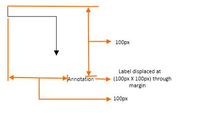

## Wrapping

When text overflows Node boundaries, you can control it by using Text Wrapping. So, it is wrapped into multiple lines. The Wrapping property of Annotation defines how the Content should be wrapped. The following code illustrates how to wrap a Annotation in a Node.



//Creates the Node collection
ObservableCollection<NodeViewModel> nodes = new ObservableCollection<NodeViewModel>();
NodeViewModel node = new NodeViewModel()
{
	UnitWidth = 100,
	UnitHeight = 100,
	OffsetX = 100,
	OffsetY = 100,
	//Creates Annotation collection
	Annotations=new ObservableCollection<IAnnotation>()
	{
		new AnnotationEditorViewModel()
		{
			Content="Annotation Text Wrapping",
			WrapText=TextWrapping.Wrap
		}
	},
	Shape = new RectangleGeometry() { Rect = new Rect(0, 0, 10, 10) },
	ShapeStyle = this.diagram.Resources["shapestyle"] as Style
};

//Adds Node to the SfDiagram
nodes.Add(node);
diagram.Nodes = nodes;



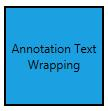

| Values | Description | Node | Connector|
|---|---|---|---|
| NoWrap | Text will not be wrapped. | 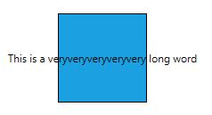 | 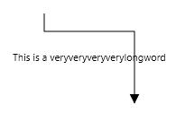 |
| Wrap | Text-wrapping occurs when the text overflows beyond the available Node width. | 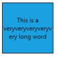 | 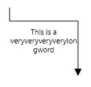 |

## Appearance 

You can change the appearance by ViewTemplate. The following code illustrates how to customize the appearance of an Annotation.

[XAML]



<DataTemplate x:Key="viewtemplate">
  <TextBlock Text="{Binding Path=Content, Mode=TwoWay}" FontStyle="Italic" 
             FontSize="12" FontFamily="TimesNewRoman"
             TextDecorations="Underline" FontWeight="Bold"
             Foreground="Black"/> 
</DataTemplate>



[C#]



//Creates Node collection
ObservableCollection<NodeViewModel> nodes = new ObservableCollection<NodeViewModel>();
NodeViewModel node = new NodeViewModel()
{
	UnitWidth = 100,
	UnitHeight = 100,
	OffsetX = 100,
	OffsetY = 100,
	//Creates Annotation collection
	Annotations = new ObservableCollection<IAnnotation>()
	{
		new AnnotationEditorViewModel()
		{
			Content="Annotation Text",
			ViewTemplate=this.diagram.Resources["viewtemplate"] as DataTemplate
		}
	},
	Shape = new RectangleGeometry() { Rect = new Rect(0, 0, 10, 10) },
	ShapeStyle = this.diagram.Resources["shapestyle"] as Style
};

//Adds Nodes to the SfDiagram
nodes.Add(node);
diagram.Nodes = nodes;



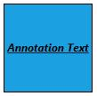

The Appearance of the Annotation can also be customized with appearance specific properties. The following code illustrates how to customize background and border of a Annotation.

[XAML]



<DataTemplate x:Key="viewtemplate">
  <Border BorderBrush="Black" BorderThickness="1">
    <TextBlock Text="{Binding Path=Content, Mode=TwoWay}"  Background="White" 
               Foreground="Black"/>
  </Border>
</DataTemplate>



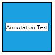

## Edit

Diagram provides support to edit an Annotation at runtime, either programmatically or interactively.

Double-clicking any Annotation will enables editing of that. Double-clicking the Node enables first Annotation editing. When the focus of editor is lost, the Annotation for the Node is updated.

The following code illustrates how to edit the Annotation programmatically.



//Creates the Node collection
ObservableCollection<NodeViewModel> nodes = new ObservableCollection<NodeViewModel>();
NodeViewModel node = new NodeViewModel()
{
	UnitWidth = 100,
	UnitHeight = 100,
	OffsetX = 200,
	OffsetY = 200,
	//Creates Annotation collection
	Annotations = new ObservableCollection<IAnnotation>()
	{
		new AnnotationEditorViewModel()
		{
			Content="Annotation",
			EditTemplate=this.diagram.Resources["edittemplate"] as DataTemplate,
		}
	},
	Shape = new RectangleGeometry() { Rect = new Rect(0, 0, 10, 10) },
	ShapeStyle = this.diagram.Resources["shapestyle"] as Style
};
NodeViewModel node1 = new NodeViewModel()
{
	UnitWidth = 100, 
	UnitHeight = 100,
	OffsetX = 350,
	OffsetY = 200,
	Constraints = NodeConstraints.Default | NodeConstraints.DragAnnotation,
	//Creates Annotation collection
	Annotations = new ObservableCollection<IAnnotation>()
	{
		new AnnotationEditorViewModel()
		{
			Content="Annotation",
			ViewTemplate=this.diagram.Resources["viewtemplate"] as DataTemplate
		}
	},
	Shape = new RectangleGeometry() { Rect = new Rect(0, 0, 10, 10) },
	ShapeStyle = this.diagram.Resources["shapestyle"] as Style
};

//Adds Nodes to the SfDiagram
nodes.Add(node);
nodes.Add(node1);
diagram.Nodes = nodes;



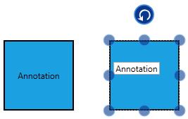

## Interaction

Annotation can be Selectable, Draggable, Resizable and Rotatable.The Interaction can be controlled by Annotation and it's Parent (Node/Connector). The following code example illustrates how to set `Constraints` to Annotation.



            //Create NodeViewModel (Shape and ShapeStyle Applied from "Data-Binding"
            NodeViewModel node = new NodeViewModel()
            {
                OffsetX = 200,
                OffsetY = 200,
                UnitWidth = 100,
                UnitHeight = 50,
                //Initialize and Add annotation to NodeViewModel
                Annotations = new ObservableCollection<IAnnotation>()
                    {
                        //Create a AnnotationEditorViewModel
                        new AnnotationEditorViewModel()
                        {
                            Content = "Annotation",
                            //Assign Constraint to Select, Drag, Resize and Rotate Annotation
                            Constraints = AnnotationConstraints.Default
                        }          
                    }
            };
            //Add NodeViewModel to Nodes Collection
            (Diagram.Nodes as NodeCollection).Add(node);



## Rotation
Automatic annotation orientation based on Parent(Node/Connector) or Page direction. To make Annotation of the Node as always horizontal when Node is rotated. We have provided `RotationReference` property to the Annotation.

//Create NodeViewModel (Shape and ShapeStyle Applied from "Data-Binding"
            NodeViewModel node = new NodeViewModel()
            {
                OffsetX = 200,
                OffsetY = 200,
                UnitWidth = 100,
                UnitHeight = 50,
                //Initialize and Add annotation to NodeViewModel
                Annotations = new ObservableCollection<IAnnotation>()
                    {
                        //Create a AnnotationEditorViewModel
                        new AnnotationEditorViewModel()
                        {
                            Content = "Annotation",
                            //Assign Constraint to Select, Drag and Rotate Annotation
                            Constraints = AnnotationConstraints.Default,
                           //This is stop the rotation of Annotation along with its Parent.
                            RotationReference=RotationReference.Page
                        }          
                    }
            };
            //Add NodeViewModel to Nodes Collection
            (Diagram.Nodes as NodeCollection).Add(node);


The below image represents " RotationReference=RotationReference.Page" for Annotation (Node).

The below image represents " RotationReference=RotationReference.Parent" for Annotation(Connector).

## Read Only Annotation

Diagram allows to create read only Annotation. You have to set the readOnly property of Annotation to enable/disable the read only mode. The following code illustrates how to enable **ReadOnly** mode.



NodeViewModel node1 = new NodeViewModel()
{
	UnitWidth = 100, 
	UnitHeight = 100,
	OffsetX = 100,
	OffsetY = 100,
	//Creates Annotation collection
	Annotations = new ObservableCollection<IAnnotation>()
	{
		new AnnotationEditorViewModel()
		{
			Content = "Annotation",
			ViewTemplate = this.diagram.Resources["viewtemplate"] as DataTemplate,
			ReadOnly = true
		}
	},
	Shape = new RectangleGeometry() { Rect = new Rect(0, 0, 10, 10) },
	ShapeStyle = this.diagram.Resources["shapestyle"] as Style
};



## Multiple Annotations

You can add any number of Annotations to a Node or Connector. The following code illustrates how to add multiple Annotations to a Node.



//Creates Annotation collection
ObservableCollection<AnnotationEditorViewModel> annotations = new ObservableCollection<AnnotationEditorViewModel>();
            
AnnotationEditorViewModel annotation1 = new AnnotationEditorViewModel()
{
	Content = "Left",
	ViewTemplate=this.diagram.Resources["viewtemplate"] as DataTemplate,
	Offset = new Point(0.1, 0.12)
};
AnnotationEditorViewModel annotation2 = new AnnotationEditorViewModel()
{
	Content = "Center",
	ViewTemplate = this.diagram.Resources["viewtemplate"] as DataTemplate,
	Offset = new Point(0.5, 0.5)
};
AnnotationEditorViewModel annotation3 = new AnnotationEditorViewModel()
{
	Content = "Right",
	ViewTemplate = this.diagram.Resources["viewtemplate"] as DataTemplate,
	Offset = new Point(0.82, 0.9)
};

//Adds multiple Annotations to a Node
annotations.Add(annotation1);
annotations.Add(annotation2);
annotations.Add(annotation3);

//Creates the Node collection
ObservableCollection<NodeViewModel> nodes = new ObservableCollection<NodeViewModel>();
NodeViewModel node = new NodeViewModel()
{
	UnitWidth = 100,
	UnitHeight = 100,
	OffsetX = 200,
	OffsetY = 200,
	Annotations = annotations,
	Shape = new RectangleGeometry() { Rect = new Rect(0, 0, 10, 10) },
	ShapeStyle = this.diagram.Resources["shapestyle"] as Style
};

//Adds Node to the SfDiagram
nodes.Add(node);
diagram.Nodes = nodes;



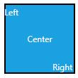
