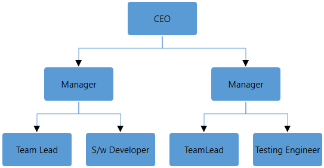
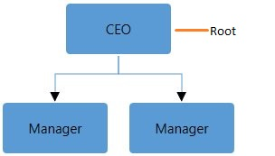

# DataSource in UWP Diagram (SfDiagram)

Diagram can be populated with the nodes and connectors based on the information provided from an external data source.

* The DataSourceSettings of `DataSource` property is used to define the data source as a collection of objects which needs to be populated as diagram.

* The DataSourceSettings `Id` property is used to define the unique field of each data.

* The DataSourceSettings `ParentId` property is used to defines the parent field which builds the relationship between id and parent field.

* The DataSourceSettings `Root` property is used to define root node for the diagram populated from the data source.

To explore those properties, see [DataSourceSettings](https://help.syncfusion.com/cr/uwp/Syncfusion.UI.Xaml.Diagram.DataSourceSettings.html)




<!-- Initializes the employee collection-->
<local:Employees x:Key="employees">
    <local:Employee Name="Steve" EmployeeId="1" ParentId="" Designation="CEO"/>
    <local:Employee Name="Kevin" EmployeeId="2" ParentId="1" Designation="Manager"/>
    <local:Employee Name="John" EmployeeId="3" ParentId="1" Designation="Manager"/>
    <local:Employee Name="Raj" EmployeeId="4" ParentId="2" Designation="Team Lead"/>
    <local:Employee Name="Will" EmployeeId="5" ParentId="2" Designation="S/w Developer"/>
    <local:Employee Name="Sarah" EmployeeId="6" ParentId="3" Designation="TeamLead"/>
    <local:Employee Name="Mike" EmployeeId="7" ParentId="3" Designation="Testing Engineer"/>
</local:Employees>

<!--Initializes the DataSourceSettings -->
<syncfusion:DataSourceSettings x:Key="DataSourceSettings" DataSource="{StaticResource employees}"
                               ParentId="ParentId" Id="EmployeeId" Root="1"/>
               
<!--Initializes the Layout-->                
<syncfusion:DirectedTreeLayout x:Key="treeLayout" HorizontalSpacing="80" VerticalSpacing="50" 
                               SpaceBetweenSubTrees="20" Orientation="TopToBottom"/>
<syncfusion:LayoutManager x:Key="layoutManager" Layout="{StaticResource treeLayout}"/>                               
         
<!--Initializes the SfDiagram-->          
<syncfusion:SfDiagram x:Name="diagram" LayoutManager="{StaticResource layoutManager}"                           
                      DataSourceSettings="{StaticResource DataSourceSettings}">
    <!--Initializes the NodeCollection-->                  
    <syncfusion:SfDiagram.Nodes>
        <syncfusion:NodeCollection/>
    </syncfusion:SfDiagram.Nodes>
    <!--Initializes the ConnectorCollection-->
    <syncfusion:SfDiagram.Connectors>
        <syncfusion:ConnectorCollection/>
    </syncfusion:SfDiagram.Connectors>
</syncfusion:SfDiagram>



/// 

/// Business object class for creating datasource
/// 

public class Employee
{
    public string ParentId { get; set; }
    public string Name { get; set; }
    public string Designation { get; set; }
    public string EmployeeId { get; set; }
}

//Employee Collection
public class Employees : ObservableCollection<Employee>
{
}

// Initialize DataSourceSettings for SfDiagram
Diagram.DataSourceSettings = new DataSourceSettings()
{
    Id = "EmployeeId",
    ParentId = "ParentId",
    Root = "1",
    DataSource = GetData(),
};

// Initialize layout manager for SfDiagram
Diagram.LayoutManager = new Syncfusion.UI.Xaml.Diagram.Layout.LayoutManager()
{
    Layout = new DirectedTreeLayout()
    {
        HorizontalSpacing = 80,
        VerticalSpacing = 50,
        SpaceBetweenSubTrees = 20,
        Orientation = TreeOrientation.TopToBottom,
    }
};

// Method to initialize the value for DataSource
private Employees GetData()
{
    Employees employees = new Employees();

    employees.Add(new Employee()
    {
        Name = "Steve",
        EmployeeId = "1",
        ParentId = "",
        Designation = "CEO"
    });
    employees.Add(new Employee()
    {
        Name = "Kevin",
        EmployeeId = "2",
        ParentId = "1",
        Designation = "Manager"
    });
    employees.Add(new Employee()
    {
        Name = "John",
        EmployeeId = "3",
        ParentId = "1",
        Designation = "Manager"
    });
    employees.Add(new Employee()
    {
        Name = "Raj",
        EmployeeId = "4",
        ParentId = "2",
        Designation = "Team Lead"
    });
    employees.Add(new Employee()
    {
        Name = "Will",
        EmployeeId = "5",
        ParentId = "2",
        Designation = "S/w Developer"
    });
    employees.Add(new Employee()
    {
        Name = "Sarah",
        EmployeeId = "6",
        ParentId = "3",
        Designation = "TeamLead"
    });
    employees.Add(new Employee()
    {
        Name = "Mike",
        EmployeeId = "7",
        ParentId = "3",
        Designation = "Testing Engineer"
    });

    return employees;
}




For more information about Node, Connector and Business Class[Employee] , Please refer the below sample.

Sample Link : [DataSource Sample](https://github.com/SyncfusionExamples/UWP-Diagram-Examples/tree/main/Samples/DataSource)

## Root

By default, the node without parent is treated as root of the layout. Now, `DataSourceSettings` have option to specify the root node of the layout.




//object with id “CEO”, is considered as root of tree layout.
diagram.DataSourceSettings.Root = “CEO”;




