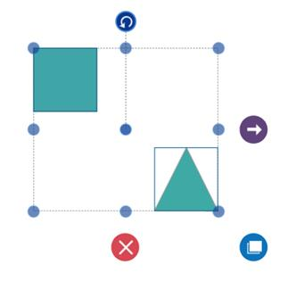

# Interaction in UWP Diagram (SfDiagram)

## Selection

Selector provides a visual representation of selected elements. It behaves like a container and enables you to update the size, position, and rotation angle of the selected elements through interaction and programmatically. Single or multiple elements can be selected at a time.

### Single Selection

An element can be selected by clicking that element. During single click, all previously selected items are cleared.

### Selecting a Group

When a child element of any Group is clicked, its contained Group is selected instead of the child element. With consecutive clicks on the selected element, selection is changed from top to bottom in the hierarchy of parent Group to its children.

### Multiple Selection

Multiple elements can be selected with the following ways.

* Ctrl+Click
* Selection rectangle / Rubber band selection

#### Ctrl+Click

During single click, any existing item in the selection list be cleared, and only the item clicked recently is there in the selection list. To avoid cleaning the old selected item, Ctrl key must be on hold when clicking.

#### Selection rectangle / Rubber band selection

Clicking and dragging the Diagram area allows to create a rectangular region. The elements that are covered under the rectangular region are selected at the end.

Multiple selected elements are visually represented as shown.

* `SelectorChangedEvent` will notify you the OffsetX, OffsetY, Height, Width, Rotate Angle and interaction state with their old and new values.To explore about arguments, please refer to [SelectorChangedEventArgs](https://help.syncfusion.com/cr/uwp/Syncfusion.UI.Xaml.Diagram.SelectorChangedEventArgs.html) .

### Select/Unselect the elements programmatically

The `IsSelected` Property is used to select/unselect the elements at runtime.

The following code example illustrates how to select/unselect an item through programmatically.




// Selects an elements 

node.IsSelected = true;

// Unselect an element

node.IsSelected = false;




* `ItemSelectingEvent` and `ItemSelectedEvent` for selecting an element, will notify you the item and its original source. To explore about arguments ,please refer to [DiagramPreviewEventArgs](https://help.syncfusion.com/cr/uwp/Syncfusion.UI.Xaml.Diagram.DiagramPreviewEventArgs.html) and [ItemSelectedEventArgs](https://help.syncfusion.com/cr/wpf/Syncfusion.UI.Xaml.Diagram.ItemSelectedEventArgs.html) .

* `ItemUnselectingEvent` and `ItemUnselectedEvent` for unselecting an element, will notify you the item and its original source.To explore about arguments ,please refer to [DiagramPreviewEventArgs](https://help.syncfusion.com/cr/uwp/Syncfusion.UI.Xaml.Diagram.DiagramPreviewEventArgs.html) and [DiagramEventArgs](https://help.syncfusion.com/cr/wpf/Syncfusion.UI.Xaml.Diagram.DiagramEventArgs.html) .

## Deletion

Selected objects can be deleted by <kdb> Delete </kdb> and In-built Delete command. 

* `ItemDeletedEvent` will notify you with the deleted item in argument. To explore about arguments , please refer to [ItemDeletedEventArgs](https://help.syncfusion.com/cr/wpf/Syncfusion.UI.Xaml.Diagram.ItemDeletedEventArgs.html).

* `ItemDeletingEvent` will notify you with the item , option to cancel the deleting operation of item. To explore about arguments , please refer to [DiagramPreviewEventArgs](https://help.syncfusion.com/cr/uwp/Syncfusion.UI.Xaml.Diagram.DiagramPreviewEventArgs.html)   

#### Selection Indicator Style

Multiple Selection will show the preview for the selected Items. We have provided customization option for the appearance of the Preview.

| Style | Behavior |
| --|--|
| NodeSelectionIndicatorStyle | Defines the customization option for Selection Preview for the Node. |
| ConnectorSelectionIndicatorStyle | Defines the customization option for Selection Preview for the Connector.|
| FirstSelectionIndicatorStyle | Defines the customization option for selection preview of first selected item.|

## Events

The below events are common for Node, Connector, Group, Port and Annotation.

* `ItemTappedEvent` is invoked on clicking the diagramming element. To explore about arguments, please refer to [ItemTappedEventArgs](https://help.syncfusion.com/cr/uwp/Syncfusion.UI.Xaml.Diagram.ItemTappedEventargs.html).
* `ItemDoubleTappedEvent` is invoked on double clicking the diagramming element. To explore about arguments, please refer to [ItemDoubleTappedEventArgs](https://help.syncfusion.com/cr/uwp/Syncfusion.UI.Xaml.Diagram.ItemDoubleTappedEventargs.html).
* `MouseDown` and `MouseUp` are invoked as similar to framework element, which is raised together with either MouseLeftButtonUp or MouseRightButtonUp. To explore about arguments, please refer to [MouseDownEventArgs](https://help.syncfusion.com/cr/uwp/Syncfusion.UI.Xaml.Diagram.MouseDownEventArgs.html) and
[MouseUpEventArgs](https://help.syncfusion.com/cr/uwp/Syncfusion.UI.Xaml.Diagram.MouseUpEventArgs.html).  

## Drag and Drop Nodes over other elements

Diagram provides support to drop a node/connector over another node/connector. Drop event is raised to notify that an element is dropped over another one and it is disabled by default. It can enabled with the constraints property. The following code illustrates how to enable **dropping**.



// Registering an event
(diagram.Info as IGraphInfo).ItemDropEvent += MainWindow_ItemDropEvent;

//Creates the Node collection
ObservableCollection<Node> nodes = new ObservableCollection<Node>();

//Creates Node
Node node = new Node()
{
	UnitHeight = 100,
       UnitWidth = 100,
       OffsetX = 400,
       OffsetY = 400,
       Shape = new RectangleGeometry() { Rect = new Rect(0, 0, 10, 10) },
       ShapeStyle = this.Resources["shapestyle"] as Style,
       Constraints = NodeConstraints.Default |  NodeConstraints.AllowDrop
};

//Creates Connector
Connector connector = new Connector()
{
	SourcePoint = new Point(500, 500),
       TargetPoint = new Point(600, 600),
       Constraints = ConnectorConstraints.Default | ConnectorConstraints.AllowDrop
};

//Creates the Group collection
ObservableCollection<Group> groups = new ObservableCollection<Group>();

Creates Group
Group group = new Group()
{
      //Defines the Nodes and Connector collection
	Nodes = new ObservableCollection<Node>
       {
       	Node
	},
       Connectors = new ObservableCollection<Connector>
       {
       	connector
      	},
};

groups.Add(group);
diagram.Groups = groups;

//Creates Node
Node node1 = new Node()

{
	 UnitWidth = 100,
       UnitHeight = 100,
       OffsetX = 300,
       OffsetY = 300,
       Shape = new RectangleGeometry() { Rect = new Rect(0, 0, 10, 10) },
       ShapeStyle = this.Resources["shapestyle"] as Style,
       Constraints=NodeConstraints.Default | NodeConstraints.AllowDrop
};

//Adds the Node to the SfDiagram
nodes.Add(node1);
diagram.Nodes = nodes;

private void MainWindow_ItemDropEvent(object sender, ItemDropEventArgs args)
{
	//Source - Node
      //Target – Group
}



## Zoom pan

* When a large Diagram is loaded, only certain portion of the Diagram is visible. The remaining portions are clipped. Clipped portions can be explored by scrolling the scrollbars or panning the Diagram.

* Diagram can be zoomed in or out by using Ctrl + mouse wheel.

## Keyboard

Diagram provides support to interact with the elements with key gestures. By default, some in-built commands are bound with a relevant set of key combinations.

The following table illustrates List of Commands with key Gesture.

| Shortcut Key | Command | Description |
|---|---|---|
| Ctrl + A | Select all | Select all the Nodes/Connectors in diagram. |
| Ctrl + C | Copy | Copy the selected elements in the diagram. |
| Ctrl + X | Cut | Cut the selected elements in the diagram. |
| Ctrl + V | Paste | Paste the cut or copy the elements in the diagram. |
| Ctrl + Z | Undo | Undo(Reverse the last editing action performed on diagram). |
| Ctrl + Y | Redo | Redo(Restores the last editing action when no other actions have occurred since the last undo on diagram). |
| Ctrl + D | Duplicate | Copies the selected element from the diagram and pastes the copied element into the diagram. |
| Delete | Delete | Delete the selected elements in the diagram. |
| LeftArrow | MoveLeft | MoveLeft (move the selected elements towards left by one pixel). |
| RightArrow | MoveRight | MoveRight (move the selected elements towards right by one pixel). |
| UpArrow | MoveUp | MoveUp (move the selected elements towards up by one pixel). |
| DownArrow | MoveDown | MoveDown (move the selected elements towards up by one pixel). |
| Ctrl + MouseScroll | Zoom | Zoom(Zoom in/Zoom out the diagram). |
| Ctrl + G | Group | Grouping the element in the diagram. |
| Ctrl + G | UnGroup | UnGrouping the element in the diagram. |
| Ctrl + Shift + [ | SendToBack | Moves the selected element behind all the other overlapped elements. |
| Ctrl + [ | SendBackward | Moves the selected element behind the underlying element. |
| Ctrl + Shift + ] | BringFront | Brings the selected element to front over all the other overlapped elements. |
| Ctrl + ] | BringForward | Moves the selected element over the nearest overlapping element. |

To add custom commands, configure or modify key/mouse gesture through [Command Manager](/uwp/sfdiagram/commands#command-manager "Command Manager").

