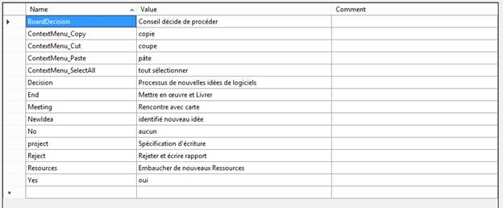
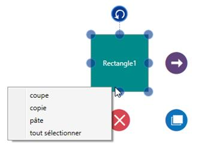

# Localization in UWP Diagram (SfDiagram)

Localization is the process of providing controls in different cultures to help you set your own culture easily. Diagram provides localization support for Context Menu items.

## Customizing Context Menu

The following code illustrates how to provide localization support for Context Menu items.



//Sets the Culture 
System.Threading.Thread.CurrentThread.CurrentUICulture = new System.Globalization.CultureInfo("fr");//French

System.Resources.ResourceManager manager;

//Sets the Assembly
Assembly assembly = Application.Current.GetType().Assembly;

manager = new System.Resources.ResourceManager("Localization.Resources.Syncfusion.SfDiagram.UWP", 
          assembly);



N> You have to define the textual descriptions of the context menu items for your custom cultures.
