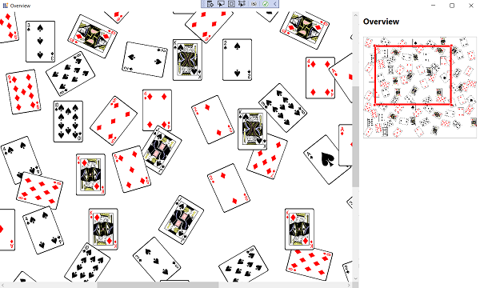
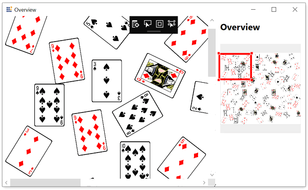
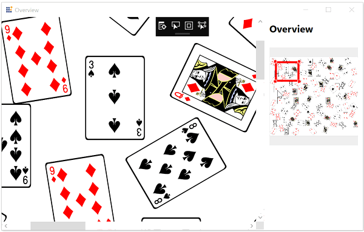

# UWP Diagram (SfDiagram) Overview

Overview control is used to display a preview (overall view) of the entire content of a Diagram. This helps you to look overall picture of large Diagram and also to navigate (pan or zoom) to a particular position of the page.

## Usage scenario

When you work on a very large Diagram, You may not know the part where you are actually working or navigation from one part to another might be a difficult. To navigation, you can zoom out entire Diagram and find where you are. This solution is not suitable when you need some frequent navigation.

Overview control solved this problem by displaying a preview (overall view) of the entire Diagram. A rectangle indicated viewport of the Diagram. Navigation becomes easy by dragging this rectangle.

N> Supported platform: WPF, WinRT 8.1, Universal, UWP

## Define overview

Overview control can be added to the application by dragging it from the toolbox and dropping it in Designer view. The required assembly references will be added automatically.

Steps to add Overview control manually in XAML:

1. Add the following required assembly reference to the project, `Syncfusion.SfDiagram.UWP`

2. Import Syncfusion® WPF schema `http://schemas.syncfusion.com/uwp` or SfDiagram control namespace `Syncfusion.UI.Xaml.Diagram.Controls` in XAML page.

3. Declare Overview control in XAML page.




<Page x:Class="OverviewControl.MainWindow"
        xmlns="http://schemas.microsoft.com/winfx/2006/xaml/presentation"
        xmlns:x="http://schemas.microsoft.com/winfx/2006/xaml"
        xmlns:syncfusion="using:Syncfusion.UI.Xaml.Diagram"
        xmlns:overview="using:Syncfusion.UI.Xaml.Diagram.Controls"
        WindowStartupLocation="CenterScreen"
        Title="Overview" Height="720" Width="1200">
    
    <!--Initialize the overview control and bind the diagram control elements to overview-->
    <overview:Overview Source="{Binding ElementName=diagram}" Height="300" Margin="0,25,0,0"/>

    <!--Initialize the SfDiagram-->
    <syncfusion:SfDiagram x:Name="diagram"/>
</Page>
	
	


## ZoomSlider

The [ShowZoomSlider](https://help.syncfusion.com/cr/uwp/Syncfusion.UI.Xaml.Diagram.Controls.Overview.html#Syncfusion_UI_Xaml_Diagram_Controls_Overview_ShowZoomSliderProperty) property is used to show or hide the zoom slider in the overview control. By default, the ShowZoomSlider is true.

You can zoom in or zoom out the overview as well as the diagram by changing the slider or click on the zoom in or zoom out button.

 The following code example explains how to hide the zoom slider.




<Page x:Class="OverviewControl.MainWindow"
        xmlns="http://schemas.microsoft.com/winfx/2006/xaml/presentation"
        xmlns:x="http://schemas.microsoft.com/winfx/2006/xaml"
        xmlns:syncfusion="using:Syncfusion.UI.Xaml.Diagram"
        xmlns:overview="using:Syncfusion.UI.Xaml.Diagram.Controls"
        WindowStartupLocation="CenterScreen"
        Title="Overview" Height="720" Width="1200">
    
    <!--Initialize the overview control and bind the diagram control elements to overview-->
    <overview:Overview Source="{Binding ElementName=diagram}" Height="300" ShowZoomSlider="False" Margin="0,25,0,0"/>

    <!--Initialize the SfDiagram-->
    <syncfusion:SfDiagram x:Name="diagram"/>
</Page>
	
	


## Interaction

Overview control allows Zoom and Pan interactions. The red rectangle indicates the area currently displayed on the diagram page. The red box can be moved within the panel to pan around the diagram. You can click and drag the corner of the rectangle to change the level of zooming on the diagram page or you can draw a new rectangle by clicking and dragging anywhere within the panel to zoom an area.




<!--Initialize the overview control with its constraint-->
<overview:Overview Source="{Binding ElementName=diagram}" 
                     Constraint="Default" 
                     Height="300" Margin="0,25,0,0"/>

<!--Initialize the SfDiagram-->
<overview:SfDiagram x:Name="diagram"/>

	


The [Constraint](https://help.syncfusion.com/cr/uwp/Syncfusion.UI.Xaml.Diagram.Controls.Overview.html#Syncfusion_UI_Xaml_Diagram_Controls_Overview_ConstraintProperty) property of the Overview class allows you to control the Pan and Zoom interactions based the value assigned to that property. The following table explains the various values and their behaviors:

| OverviewConstraints | Description | Output |
|---|---|---|
| Pan | Allows users to pan the diagram page by dragging the focused rectangle. | |
| Zoom | Allows users to perform zoom by resizing the corners of the focused rectangle. | |
| DrawFocus | Allows users to draw new focused rectangle anywhere within the overview panel, that is corresponding region in the diagram will be brought into the view.| |
| TapFocus | Allows users move the focused rectangle to any area within the panel by just tapping it.| |
| Default | Allows users to perform drag, resize, draw, and tap the overview control.| |
| None |No interaction can be performed on the focused rectangle.||

## Deferred scrolling

Diagram supports the deferred scrolling behaviour to improve the zoom and pan performances.

To learn more about deferred scrolling, refer to [Deferred Scrolling](/uwp/diagram/virtualization#deferred-scrolling "DeferredScrolling").

## Event

The `OverviewChangedEvent` will notify the interactions in Overview control with [OverviewChangedEventArgs](https://help.syncfusion.com/cr/uwp/Syncfusion.UI.Xaml.Diagram.Controls.OverviewChangedEventArgs.html) as argument. This argument will provide the dragging and interaction state value of the overview.

Find the [Overview control sample](https://github.com/SyncfusionExamples/UWP-Diagram-Examples/tree/main/Samples/OverviewControl) to depict the overview.



[How to virtualize the diagram control](/uwp/diagram/virtualization)

[How to serialize the diagram control](/uwp/diagram/serialization)

[How to localize the diagram control](/uwp/diagram/localization)

