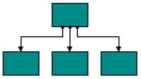
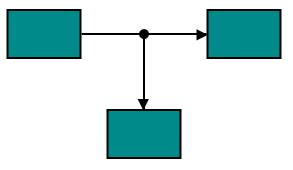
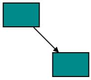
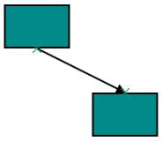
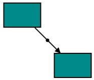
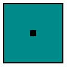
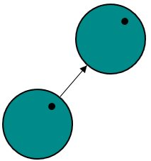
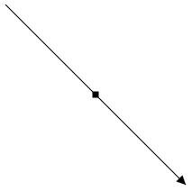
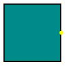

# Port in UWP Diagram (SfDiagram)

Essential Diagram for UWP provides support to define custom ports for making connections.

When a Connector is connected between two Nodes, its end points are automatically docked to Node’s nearest boundary as shown in the following image.

Port act as the connection points of node and allows to create connections with only specific points as shown in the following image.

## Node Port

### Add ports to Node

To add a collection port, you need to define the port object and add it to Ports property of Node. The `NodeOffsetX` and `NodeOffsetY` property of Port accepts an object of fractions and used to determine the position of Ports. The following code illustrates how to add ports when initializing the Node.

The following code illustrates how to add ports to Node.

[XAML]



<!--Style for Node-->

		</Setter.Value>
	</Setter>
    <Setter Property="Shape">
    	<Setter.Value>
        	<RectangleGeometry Rect="0,0,10,10"/>
        </Setter.Value>
    </Setter>
</Style>

<!--Style for NodePort-->

		</Setter.Value>
	</Setter>
    <Setter Property="Shape">
    	<Setter.Value>
    		<RectangleGeometry Rect="0,0,10,10"/>
         </Setter.Value>
	</Setter>
</Style>



[C#]



//Create port collection
public class PortCollection : ObservableCollection<IPort>
{

}



[XAML]



<!--Initializes the SfDiagram-->
<syncfusion:SfDiagram x:Name="diagram" PortVisibility="Visible">
	<!--Initializes the NodeCollection-->
	<syncfusion:SfDiagram.Nodes>
		<syncfusion:NodeCollection>
		        <!--Initializes the Node-->
              	<syncfusion:NodeViewModel x:Name="node" OffsetX="100" 
				                          OffsetY="100" UnitHeight="100"
										  UnitWidth="100">   
				<!--Initializes the PortCollection-->						                                   
				<syncfusion:NodeViewModel.Ports>
					<local:PortCollection>
					    <!--Initializes the NodePort-->
						<syncfusion:NodePortViewModel x:Name="port" UnitWidth="10"
                                                      UnitHeight="10" NodeOffsetX="0.5"
                                                      NodeOffsetY="0.5">
						</syncfusion:NodePortViewModel>
					</local:PortCollection>
                     	</syncfusion:NodeViewModel.Ports>
              	</syncfusion:NodeViewModel>
       	</syncfusion:NodeCollection>
	</syncfusion:SfDiagram.Nodes>
</syncfusion:SfDiagram>



## Connection to Boundary with Port

By default, Port will make connection to specific Point on Node. Now, We have provided `Dynamic` constraint for `NodePort` to establish the connection at a relative point on Node’s boundary and direction of the Connector is dependent with that Port.

We can enable the `Dynamic` constraint in PortConstraints to achieve this behavior.

Following code illustrates how to enable the `Dynamic` constraint to the NodePort.



//Enable the Dynamic constraints to the Port
port.Constraints |= PortConstraints.Dynamic;



To know more about bitwise operators, refer to [Bitwise Operations](/uwp/sfdiagram/constraints#bitwise-operations).

## Connector Port

### Add Port to Connector
To add a collection port, you need to define the port object and add it to `Ports` property of Connector. The `Length` property of Port accepts an object of fractions and used to determine the position of Ports. The following code illustrates how to add ports to the Connector.

The following code illustrates how to add ports to Connector.

[XAML]



<!--Style for Connector-->

		</Setter.Value>
	</Setter>
</Style>

<!--Style for ConnectorPort-->

       	</Setter.Value>
   	</Setter>
   	<Setter Property="Shape">
    	<Setter.Value>
        	<RectangleGeometry Rect="0,0,10,10"/>
        </Setter.Value>
   	</Setter>
</Style>



[C#]



//Create port collection
public class PortCollection : ObservableCollection<IPort>
{

}



[XAML]



<!--Initializes the SfDiagram-->
<syncfusion:SfDiagram x:Name="diagram" PortVisibility="Visible" DefaultConnectorType="Line">
	<!--Initializes the ConnectorCollection-->
	<syncfusion:SfDiagram.Connectors>
    	<syncfusion:ConnectorCollection>
		    <!--Initializes the Connector-->
        	<syncfusion:ConnectorViewModel x:Name="connector" SourcePoint="100,100" TargetPoint="300,300">
			    <!--Initializes the PortCollection-->
				<syncfusion:ConnectorViewModel.Ports>
                	<local:PortCollection>
					    <!--Initializes the ConnectorPort-->
                    	<syncfusion:ConnectorPortViewModel x:Name="port" UnitWidth="7"
                                                           UnitHeight="7" 
                                                           Length="0.5">
						</syncfusion:ConnectorPortViewModel>
                	</local:PortCollection>
				</syncfusion:ConnectorViewModel.Ports>
			</syncfusion:ConnectorViewModel>
       	</syncfusion:ConnectorCollection>
	</syncfusion:SfDiagram.Connectors>
</syncfusion:SfDiagram>



## Connect with ports

Connector’s `SourcePort` and `TargetPort` properties allow to create connections between some specific points of Source/Target Nodes. For more information about creating connections with port, refer to [Connections with Ports](/uwp/sfdiagram/connector#connections-with-ports "Connections with Ports").

##Appearance

You can change the shape of port by using its shape property. The appearance of ports can be customized with a set of style specific properties.

The following code illustrates how to change the appearance of port.

[XAML]



<!--Style for NodePort-->

        </Setter.Value>
	</Setter>
    <Setter Property="Shape">
    	<Setter.Value>
        	<EllipseGeometry RadiusX="10" RadiusY="10"/>
        </Setter.Value>
	</Setter>
</Style>



[XAML]



<!--Initializes the SfDiagram-->
<syncfusion:SfDiagram x:Name="diagram" PortVisibility="Visible">
	<!--Initializes the NodeCollection-->
	<syncfusion:SfDiagram.Nodes>
		<syncfusion:NodeCollection>
		    <!--Initializes the Node-->
        	<syncfusion:NodeViewModel x:Name="node" OffsetX="100" OffsetY="100" 	
				  		              UnitHeight="100" UnitWidth="100">   
				<!--Initializes the PortCollection-->						                                 
				<syncfusion:NodeViewModel.Ports>
					<local:PortCollection>
					    <!--Initializes the NodePort-->
						<syncfusion:NodePortViewModel x:Name="port" UnitWidth="7"
                                                      UnitHeight="7"
                                                      NodeOffsetX="1"
                                                      NodeOffsetY="0.5">
						</syncfusion:NodePortViewModel>
					</local:PortCollection>
        		</syncfusion:NodeViewModel.Ports>
        	</syncfusion:NodeViewModel>
       	</syncfusion:NodeCollection>
	</syncfusion:SfDiagram.Nodes>
</syncfusion:SfDiagram>



## Constraints

The Constraints property allows to enable/disable certain behaviors of ports. For more information about port constraints, refer to [Port Constraints](/uwp/sfdiagram/constraints#port-constraints "Port Constraints").
