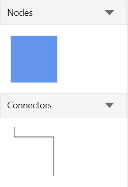
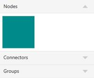
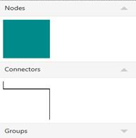
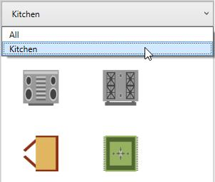
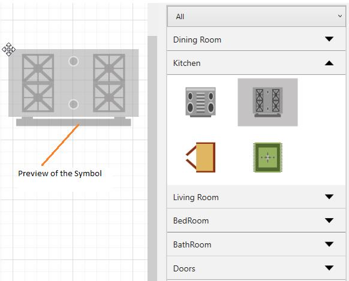

# Stencil in UWP Diagram (SfDiagram)

Stencil has a collection of Symbols. Stencil is used to clone the desired symbol by dragging it from the Stencil and dropping it into the SfDiagram. Each symbol can be grouped together by using the SymbolGroupProvider and filters by using the SymbolFilterProvider through delegates.



xmlns:stencil="using:Syncfusion.UI.Xaml.Diagram.Stencil"



"

Key Terms Table

| Key Terms | Description |
|---|---|
| Symbol | To visualize the items in Stencil. |

Properties Table

| Properties | Description |
|---|---|
| SymbolGroups | Collection of SymbolGroupProvider To Group the Symbols based on the MappingName Property. |
| SymbolFilters | Collection of SymbolFilterProvider To filter/Hide the Symbols based on MappingName Property. |
| SymbolSource | ItemSource for Stencil to populate the SymbolGroups with symbol. | 

## Symbol

Symbol is used to implement the ISymbol interface. The ISymbol interface consists of two properties to visualize symbols in Stencil:

### Symbol and SymbolTemplate




public class SymbolItem : ISymbol
{
	//Symbol-Any Object
    public object Symbol { get; set; }

    //Custom property for grouping.
    public object GroupName { get; set; }

	//Data template to visualize the object.
    public DataTemplate SymbolTemplate { get; set; }

    //For cloning the symbol from the given object and data template.
    public ISymbol Clone()
    {
    	return new SymbolItem()
        {
        	Symbol = this.Symbol,
			SymbolTemplate = this.SymbolTemplate
		};
	}

    public object Key { get; set; }
}




### Symbol Filter




        stencil.SelectedFilter = new SymbolFilterProvider { SymbolFilter = SymbolFilter };
        
        // For separating each symbol group
        private bool SymbolFilter(SymbolFilterProvider sender, object symbol)
        {
            return true;
        }




### Adding the Symbol

The following example illustrates how to add the Symbol into a Collection:

#### Define the SymbolTemplate.




<DataTemplate x:Key="Star">
	<Path Stretch="Fill" Data="M 9,2 11,7 17,7 12,10 14,15 9,12 4,15 6,10 1,7 7,7 Z"
          Stroke="Black" StrokeThickness="1" />
</DataTemplate>




#### Create the ISymbol with Symbol and SymbolTemplate properties.




<local:SymbolItem GroupName="Flow Chart" Symbol="Star"
                           SymbolTemplate="{StaticResource Star}"/>




#### Add the ISymbol into the Collection.




    // SymbolSource to Stencil
    public class Symbols : ObservableCollection<ISymbol>
    {

    }







<local:Symbols x:Key="symbolcollection">
	<!--Adding Symbol into a collection-->
	<local:SymbolItem GroupName="Flow Chart" Symbol="Star"
                               SymbolTemplate="{StaticResource Star}"/>
</local:Symbols>




"

Sample Link : [Stencil With ISymbol](http://www.syncfusion.com/downloads/support/directtrac/218913/ze/Stencil_Isymbol-925417050).

This Collection will be the SymbolSource to the Stencil. Based on the SymbolSource, the Stencil will populate the Symbols.

### Add Node and Connector to Stencil

####  Create a Node and Connector to SymbolCollection.




            <!--Collection of Symbols-->
            <syncfusion:SymbolCollection x:Key="symbols">
                <!--Creates the NodeViewModel-->
                <syncfusion:NodeViewModel UnitHeight="100" UnitWidth="100" ShapeStyle="{StaticResource shapeStyle}"
			                  Shape="{StaticResource Rectangle}" Key="Nodes"/>

                <!--Creates the ConnectorViewModel-->
                <syncfusion:ConnectorViewModel SourcePoint="100,100" TargetPoint="200,200"
                                   Key="Connectors"/>

            </syncfusion:SymbolCollection>




#### Add SymbolCollection to SymbolSource of Stencil.




            <stencil:Stencil x:Name="stencil" ExpandMode="All" 
                             SymbolSource="{StaticResource symbols}">




## Symbol Groups

The SymbolGroupProvider groups the symbols into SymbolGroup based on the MappingName property.

| Name | Description |
|---|---|
| MappingName | Used to group the symbols by mapping this property to the custom property of Symbols. |

The following code example illustrates how to create a SymbolGroup.




<stencil:Stencil x:Name="stencil" ExpandMode="All" 
		         SymbolSource="{StaticResource symbols}">
	<!--SymbolGroup-->
    <stencil:Stencil.SymbolGroups>
    	<stencil:SymbolGroups>
        	<!--To Map Symbols based on GroupName-->
			<stencil:SymbolGroupProvider MappingName="Key"/>
		</stencil:SymbolGroups>
	</stencil:Stencil.SymbolGroups>
</stencil:Stencil>




"

Sample Link: [Stencil With Node and Connector](http://www.syncfusion.com/downloads/support/directtrac/218913/ze/Stencil_Node,_Connector-1184387452).

### Expand or Collapse SymbolGroup

Expand and Collapse can be performed on SymbolGroup (updating the Visibility of the Symbols) based on the ExpandMode property. It includes the following options. The default option is One.

| Expand Mode | Description | Images |
|---|---|---|
| One | Always one SymbolGroup is in expanded state. | " |
| OneOrMore | At least one SymbolGroup is in expanded state. | " | " |
| ZeroOrOne | Not more than a single SymbolGroup is in expanded state. All ‘SymbolGroup’ can be in collapsed state. | " | " |
| ZeroOrMore | Any number of SymbolGroup can be in the expanded state. All ‘SymbolGroup’ can be in collapsed state. | " | " |
| All | All the SymbolGroup is in expanded state. | " |

## Symbol Filters

`SymbolFilterProvider` is used to filter or hide the symbols by using delegates. SymbolFilters are the collection of SymbolFilterProvider.

The following code example shows how to create and add the SymbolFilter. Based on the return Boolean value of the SymbolFilter delegate, the corresponding item is removed from Stencil. When a SymbolGroup does not have any Symbols, the corresponding SymbolGroup is also removed.




stencil.SymbolFilters = new SymbolFilters();

//Creates the SymbolFilterProvider
SymbolFilterProvider allFilter = new SymbolFilterProvider
{
	Content = "All",
    Filter = SymbolFilter
};

SymbolFilterProvider kitchenFilter = new SymbolFilterProvider
{
	Content = "Kitchen",
    Filter = SymbolFilter
};

//Add the SymbolFilterProvider to SymbolFilters collection
stencil.SymbolFilters.Add(allFilter);
stencil.SymbolFilters.Add(kitchenFilter);

// sender: used to get the selected SymbolFilters
private bool SymbolFilter(SymbolFilterProvider sender, object symbol)
{
	if (sender.Content.ToString() == "All")
    {
    	return true;
	}
    if ((symbol as SymbolItem).GroupName == sender.Content.ToString())
    {
    	return true;
    }
	return false;
}




"

### SelectedFilter

There can be multiple SymbolFilters, but only one filter can be selected at a time. These SymbolFilters are visually represented in a combo box. When the selected item is changed in the combo box, SelectedFilter is updated accordingly.

"

## Preview for Drag and Drop

SfDiagram provides preview support for Stencil. When you drag an item from Stencil to Diagram, a preview of the dragged item will be displayed. You can enable or disable the preview support. You can also customize the preview.

### Use Case Scenario

This feature displays a preview of the item you drag from Stencil, enabling you to identify the item you are dragging from the Stencil to the SfDiagram control. It also it gives a preview of the size and appearance of the item before it is dropped.

### Enabling preview

To enable preview for the dragged item from Stencil, set the Constraints property of Stencil to ShowPreview. To disable preview, remove ShowPreview from Constraints property. By default, preview for drag and drop is enabled.

The following code example illustrates how to enable preview support.




//Enables the drag and drop preview.
stencil.Constraints = stencil.Constraints | StencilConstraints.ShowPreview;

//Disables the drag and drop preview.
stencil.Constraints = stencil.Constraints & ~StencilConstraints.ShowPreview;




Here, Stencil is an instance of Stencil.

### Preview of the dragging Symbol

"

### Dragged Symbol

"

### Customization of Preview for Drag and Drop

You can customize the preview content by overriding the PrepareDragDropPreview method of the Stencil feature. The following code example illustrates how to customize preview content.




public class CustomStencil : Stencil
{
	//Virtual method to customize the preview of dragging the symbol from Stencil.
    protected override void PrepareDragDropPreview()
    {
		this.SymbolPreview = new ContentPresenter()
        {
        	Content = new Rectangle()
            {
            	Width = 50,
				Height = 50,
				Fill = new SolidColorBrush(Colors.SteelBlue)
			}
		};
	}
}




"

## Events

Stencil declares number of events that can be invoked by the user or by the system. These events can be subscribed in application side, which means application will be notified when these events occurred.

Following table describes stencil related events.

| Event | Event Handler | Description |
|---|---|---|
| ExpandEvent | [SymbolGroupExpandEventHandler](https://help.syncfusion.com/cr/uwp/Syncfusion.UI.Xaml.Diagram.Stencil.SymbolGroupExpandEventHandler.html  "SymbolGroupExpandEventHandler") | Occurs when expand the symbol group in the Stencil. |
| CollpaseEvent | [SymbolGroupCollapseEventHandler](https://help.syncfusion.com/cr/uwp/Syncfusion.UI.Xaml.Diagram.Stencil.SymbolGroupCollapseEventHandler.html "SymbolGroupCollapseEventHandler") | Occurs when collapse the symbol group in the Stencil. |

### StencilExpandCollapseEventArgs

Following table describes the details of the parameters for StencilExpandCollapseEventArgs.

| Property | Description |
|---|---|
| GroupName | Gets the header of the Symbol group. |
| Cancel | To cancel the action that should be performed because of the event. |
