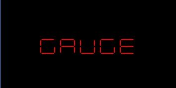
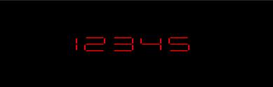
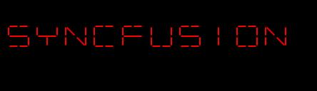
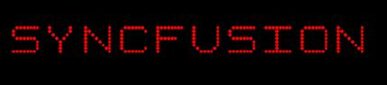

# Digital Characters in UWP Digital Gauge (SfDigitalGauge)

The digital characters in the digital gauge can be viewed in different types of segments. These digital characters are displayed in the digital gauge by setting the [Value](https://help.syncfusion.com/cr/uwp/Syncfusion.UI.Xaml.Gauges.SfDigitalGauge.html#Syncfusion_UI_Xaml_Gauges_SfDigitalGauge_Value) property of type string.

By default, the [CharacterType](https://help.syncfusion.com/cr/uwp/Syncfusion.UI.Xaml.Gauges.SfDigitalGauge.html#Syncfusion_UI_Xaml_Gauges_SfDigitalGauge_CharacterType) property is set to `SegmentSeven`. The following sample uses the default segment type to render the value "GAUGE".




<syncfusion:SfDigitalGauge Value="GAUGE" />





SfDigitalGauge digital = new SfDigitalGauge();
digital.Value = "GAUGE";
this.Grid.Children.Add(digital);




The segment type can be changed using the [CharacterType](https://help.syncfusion.com/cr/uwp/Syncfusion.UI.Xaml.Gauges.SfDigitalGauge.html#Syncfusion_UI_Xaml_Gauges_SfDigitalGauge_CharacterType) property. The `CharacterType` enum supports the following values: `SegmentSeven`, `SegmentFourteen`, `SegmentSixteen`, and `EightCrossEightDotMatrix`. Unsupported characters are rendered as blank segments. The [Value](https://help.syncfusion.com/cr/uwp/Syncfusion.UI.Xaml.Gauges.SfDigitalGauge.html#Syncfusion_UI_Xaml_Gauges_SfDigitalGauge_Value) property accepts alphanumeric and special characters and is case-sensitive.

## 7-Segments

When [CharacterType](https://help.syncfusion.com/cr/uwp/Syncfusion.UI.Xaml.Gauges.SfDigitalGauge.html#Syncfusion_UI_Xaml_Gauges_SfDigitalGauge_CharacterType) is set to `SegmentSeven`, the value is displayed in 7-segment format. This type is mainly used to display numbers (0–9), though a limited set of letters is also supported.




<syncfusion:SfDigitalGauge Value="12345" CharacterType="SegmentSeven" />





SfDigitalGauge digital = new SfDigitalGauge();
digital.Value = "12345";
digital.CharacterType = CharacterType.SegmentSeven;
this.Grid.Children.Add(digital);




## 14-Segments

When [CharacterType](https://help.syncfusion.com/cr/uwp/Syncfusion.UI.Xaml.Gauges.SfDigitalGauge.html#Syncfusion_UI_Xaml_Gauges_SfDigitalGauge_CharacterType) is set to `SegmentFourteen`, the value is displayed in 14-segment format. This type is used to display both letters and numbers.




<syncfusion:SfDigitalGauge Value="SYNCFUSION" CharacterType="SegmentFourteen" />





SfDigitalGauge digital = new SfDigitalGauge();
digital.Value = "SYNCFUSION";
digital.CharacterType = CharacterType.SegmentFourteen;
this.Grid.Children.Add(digital);




## 16-Segments

When [CharacterType](https://help.syncfusion.com/cr/uwp/Syncfusion.UI.Xaml.Gauges.SfDigitalGauge.html#Syncfusion_UI_Xaml_Gauges_SfDigitalGauge_CharacterType) is set to `SegmentSixteen`, the value is displayed in 16-segment format. This type is used to display both letters and numbers. Compared to the 14-segment display, it splits the top and bottom horizontal bars into two segments each, which produces a more refined look and is preferred when each character needs to be rendered with finer detail.




<syncfusion:SfDigitalGauge Value="SYNCFUSION" CharacterType="SegmentSixteen" />





SfDigitalGauge digital = new SfDigitalGauge();
digital.Value = "SYNCFUSION";
digital.CharacterType = CharacterType.SegmentSixteen;
this.Grid.Children.Add(digital);




## 8*8 Dot Matrix Segments

When [CharacterType](https://help.syncfusion.com/cr/uwp/Syncfusion.UI.Xaml.Gauges.SfDigitalGauge.html#Syncfusion_UI_Xaml_Gauges_SfDigitalGauge_CharacterType) is set to `EightCrossEightDotMatrix`, the value is displayed in an 8 × 8 dot matrix. This type is used to display special characters along with letters and numbers.




<syncfusion:SfDigitalGauge Value="SYNCFUSION" CharacterType="EightCrossEightDotMatrix" />





SfDigitalGauge digital = new SfDigitalGauge();
digital.Value = "SYNCFUSION";
digital.CharacterType = CharacterType.EightCrossEightDotMatrix;
this.Grid.Children.Add(digital);




