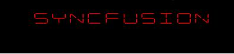
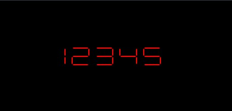

# Getting Started with UWP Digital Gauge (SfDigitalGauge)

This section explains the steps required to configure the [SfDigitalGauge](https://help.syncfusion.com/cr/uwp/Syncfusion.UI.Xaml.Gauges.SfDigitalGauge.html) and also explains the steps to add basic elements of [SfDigitalGauge](https://help.syncfusion.com/cr/uwp/Syncfusion.UI.Xaml.Gauges.SfDigitalGauge.html) through various APIs available within it.

## Prerequisites

* **Visual Studio 2015** or later with the **Windows 10 SDK** installed.
* A UWP project targeting **Windows 10** (build 14393 or later).
* The **Syncfusion.SfGauge.UWP** NuGet package referenced in your project. For installation details, see the Syncfusion UWP installation guide.
* A `Grid` container (default named `Grid`) in your page to host the control when adding it via C#.

## Configuring SfDigitalGauge

SfDigitalGauge is available in the following assembly and namespace.

**Assembly**: Syncfusion.SfGauge.UWP

**Namespace**: Syncfusion.UI.Xaml.Gauges

By default, the [Value](https://help.syncfusion.com/cr/uwp/Syncfusion.UI.Xaml.Gauges.SfDigitalGauge.html#Syncfusion_UI_Xaml_Gauges_SfDigitalGauge_Value) property is empty and [CharacterType](https://help.syncfusion.com/cr/uwp/Syncfusion.UI.Xaml.Gauges.SfDigitalGauge.html#Syncfusion_UI_Xaml_Gauges_SfDigitalGauge_CharacterType) defaults to `SegmentSeven`.




<syncfusion:SfDigitalGauge />





SfDigitalGauge digital = new SfDigitalGauge();
this.Grid.Children.Add(digital);




Run the above code and the default [SfDigitalGauge](https://help.syncfusion.com/cr/uwp/Syncfusion.UI.Xaml.Gauges.SfDigitalGauge.html) is displayed as follows.

The UI component of the digital gauge can be customized by adding segments and setting the [Value](https://help.syncfusion.com/cr/uwp/Syncfusion.UI.Xaml.Gauges.SfDigitalGauge.html#Syncfusion_UI_Xaml_Gauges_SfDigitalGauge_Value) property, which will be explained in the next section.

## Displaying Values

You can add alphanumeric characters to [SfDigitalGauge](https://help.syncfusion.com/cr/uwp/Syncfusion.UI.Xaml.Gauges.SfDigitalGauge.html) using the [Value](https://help.syncfusion.com/cr/uwp/Syncfusion.UI.Xaml.Gauges.SfDigitalGauge.html#Syncfusion_UI_Xaml_Gauges_SfDigitalGauge_Value) property in SfDigitalGauge.




<syncfusion:SfDigitalGauge Value="GAUGE" />





SfDigitalGauge digital = new SfDigitalGauge();
digital.Value = "GAUGE";
this.Grid.Children.Add(digital);




The values are displayed as follows.

## Changing segments

You can view the digital characters in [SfDigitalGauge](https://help.syncfusion.com/cr/uwp/Syncfusion.UI.Xaml.Gauges.SfDigitalGauge.html) using different types of segments available in the [CharacterType](https://help.syncfusion.com/cr/uwp/Syncfusion.UI.Xaml.Gauges.SfDigitalGauge.html#Syncfusion_UI_Xaml_Gauges_SfDigitalGauge_CharacterType) property. The `CharacterType` enum (defined in the `Syncfusion.UI.Xaml.Gauges` namespace) supports the following values: `SegmentSeven`, `SegmentFourteen`, `SegmentSixteen`, and `EightByEightDotMatrix`. For the full list of supported segment types and the characters each one renders, see [Digital Characters](./Digital-Characters.md).

The `SegmentSeven` type primarily supports digits (0–9) and a limited set of characters, which is why the sample below renders numeric values.




<syncfusion:SfDigitalGauge Value="12345" CharacterType="SegmentSeven" />





SfDigitalGauge digital = new SfDigitalGauge();
digital.Value = "12345";
digital.CharacterType = CharacterType.SegmentSeven;
this.Grid.Children.Add(digital);




The segments are displayed as follows.

