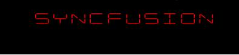
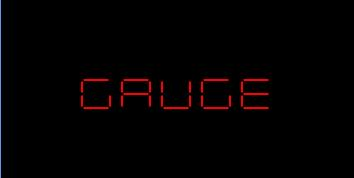
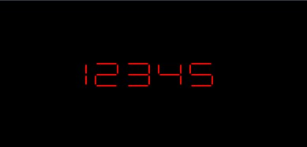

# Getting Started with UWP Digital Gauge (SfDigitalGauge)

This section explains you the steps required to configure the **SfDigitalGauge** and also explains the steps to add basic elements of **SfDigitalGauge** through various API’s available within it.

## Configuring SfDigitalGauge

SfDigitalGauge is existing in the following assembly and namespace.

**Assembly**: Syncfusion.SfGauge.UWP

**Namespace**: Syncfusion.UI.Xaml.Gauges




    <syncfusion:SfDigitalGauge />





    SfDigitalGauge digital = new SfDigitalGauge();
    this.Grid.Children.Add(digital);
     



Run the above code and now the default **SfDigitalGauge** can be displayed as follows. UI component of the digital gauge can be customized by adding segments and passing Values which will be explained in the next section.

## Displaying Values 

You can add alphanumeric characters to SfDigitalGauge using **Value** property in SfDigitalGauge.




    <syncfusion:SfDigitalGauge Value="GAUGE" />    





    SfDigitalGauge digital = new SfDigitalGauge();
    digital.Value = "GAUGE";
    this.Grid.Children.Add(digital);




SfDigitalGauge Values are displayed as follows.

## Changing segments

You can view the digital characters in SfDigitalGauge using different types of Segments available in **CharacterType** property.




    <syncfusion:SfDigitalGauge Value="12345"  CharacterType="SegmentSeven" />





    SfDigitalGauge digital = new SfDigitalGauge();
    digital.Value = "12345";
    digital.CharacterType = CharacterType.SegmentSeven;
    this.Grid.Children.Add(digital);




SfDigitalGauge Segments are displayed as follows.

