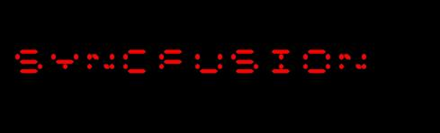
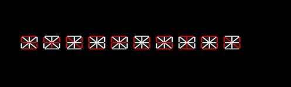
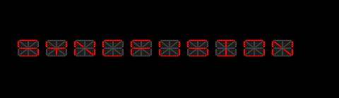

# Settings in UWP Digital Gauge (SfDigitalGauge)

Other elements and behaviors in [SfDigitalGauge](https://help.syncfusion.com/cr/uwp/Syncfusion.UI.Xaml.Gauges.SfDigitalGauge.html) can be customized as well. For transformation properties such as [CharacterHeight](https://help.syncfusion.com/cr/uwp/Syncfusion.UI.Xaml.Gauges.SfDigitalGauge.html#Syncfusion_UI_Xaml_Gauges_SfDigitalGauge_CharacterHeight), [CharacterWidth](https://help.syncfusion.com/cr/uwp/Syncfusion.UI.Xaml.Gauges.SfDigitalGauge.html#Syncfusion_UI_Xaml_Gauges_SfDigitalGauge_CharacterWidth), [SkewAngleX](https://help.syncfusion.com/cr/uwp/Syncfusion.UI.Xaml.Gauges.SfDigitalGauge.html#Syncfusion_UI_Xaml_Gauges_SfDigitalGauge_SkewAngleX), and [SkewAngleY](https://help.syncfusion.com/cr/uwp/Syncfusion.UI.Xaml.Gauges.SfDigitalGauge.html#Syncfusion_UI_Xaml_Gauges_SfDigitalGauge_SkewAngleY), see [Transformation of Characters](./Transformation-of-Characters.md).

They are:

* Character Spacing
* Character Stroke
* Segment Thickness
* RTL (Right to Left) Support
* Dimmed Brush Stroke
* Dimmed Brush Opacity

## Character Spacing

The distance between the characters can be set by using the [CharactersSpacing](https://help.syncfusion.com/cr/uwp/Syncfusion.UI.Xaml.Gauges.SfDigitalGauge.html#Syncfusion_UI_Xaml_Gauges_SfDigitalGauge_CharactersSpacing) property. The default value is `10`, and the valid range is any non-negative numeric value.




<syncfusion:SfDigitalGauge Value="SYNCFUSION" CharactersSpacing="50"/>





SfDigitalGauge digital = new SfDigitalGauge();
digital.Value = "SYNCFUSION";
digital.CharacterSpacing = 50;
this.Grid.Children.Add(digital);




## Character Stroke

The stroke of the character can be changed by the [CharacterStroke](https://help.syncfusion.com/cr/uwp/Syncfusion.UI.Xaml.Gauges.SfDigitalGauge.html#Syncfusion_UI_Xaml_Gauges_SfDigitalGauge_CharacterStroke) property. The default value is `Red`.




<syncfusion:SfDigitalGauge Value="SYNCFUSION" CharacterType="SegmentFourteen" CharacterStroke="Yellow" />





SfDigitalGauge digital = new SfDigitalGauge();
digital.Value = "SYNCFUSION";
digital.CharacterType = CharacterType.SegmentFourteen;
digital.CharacterStroke = new SolidColorBrush(Colors.Yellow);
this.Grid.Children.Add(digital);




## Segment Thickness

You can adjust the thickness of the segment using the [SegmentThickness](https://help.syncfusion.com/cr/uwp/Syncfusion.UI.Xaml.Gauges.SfDigitalGauge.html#Syncfusion_UI_Xaml_Gauges_SfDigitalGauge_SegmentThickness) property. The default value is `2`, and the valid range is any positive numeric value.




<syncfusion:SfDigitalGauge Value="SYNCFUSION" CharacterType="SegmentFourteen" SegmentThickness="5"/>





SfDigitalGauge digital = new SfDigitalGauge();
digital.Value = "SYNCFUSION";
digital.SegmentThickness = 5;
digital.CharacterType = CharacterType.SegmentFourteen;
this.Grid.Children.Add(digital);




## RTL (Right to Left) support

The Characters are aligned using the [EnableRTLFormat](https://help.syncfusion.com/cr/uwp/Syncfusion.UI.Xaml.Gauges.SfDigitalGauge.html#Syncfusion_UI_Xaml_Gauges_SfDigitalGauge_EnableRTLFormat) property. The default value of `EnableRTLFormat` is `false`.




<syncfusion:SfDigitalGauge Value="SYNCFUSION" CharacterType="SegmentFourteen" EnableRTLFormat="True" />





SfDigitalGauge digital = new SfDigitalGauge();
digital.Value = "SYNCFUSION";
digital.EnableRTLFormat = true;
digital.CharacterType = CharacterType.SegmentFourteen;
this.Grid.Children.Add(digital);




## Dimmed Brush stroke

The [DimmedBrush](https://help.syncfusion.com/cr/uwp/Syncfusion.UI.Xaml.Gauges.SfDigitalGauge.html#Syncfusion_UI_Xaml_Gauges_SfDigitalGauge_DimmedBrush) property is used to apply a brush to the dimmed (inactive) segments of the digital gauge. The dimmed segments are the segments that are not part of the active character being displayed. This property helps the dimmed segments blend with the background of the digital gauge. The default value is `Transparent`.




<syncfusion:SfDigitalGauge Value="SYNCFUSION" CharacterType="SegmentFourteen" DimmedBrush="White" />





SfDigitalGauge digital = new SfDigitalGauge();
digital.Value = "SYNCFUSION";
digital.DimmedBrush = new SolidColorBrush(Colors.White);
digital.CharacterType = CharacterType.SegmentFourteen;
this.Grid.Children.Add(digital);




## Dimmed Brush opacity

The [DimmedBrushOpacity](https://help.syncfusion.com/cr/uwp/Syncfusion.UI.Xaml.Gauges.SfDigitalGauge.html#Syncfusion_UI_Xaml_Gauges_SfDigitalGauge_DimmedBrushOpacity) property is used to set the opacity of the dimmed segment brush. The default value is `50`, and the valid range is `0` to `100` (percentage).




<syncfusion:SfDigitalGauge  Value="SYNCFUSION" DimmedBrush="White"  DimmedBrushOpacity="20" CharacterType="SegmentFourteen" />





SfDigitalGauge digital = new SfDigitalGauge();
digital.Value = "SYNCFUSION";
digital.DimmedBrush = new SolidColorBrush(Colors.White);
digital.CharacterType = CharacterType.SegmentFourteen;
digital.DimmedBrushOpacity = 20;
this.Grid.Children.Add(digital);




