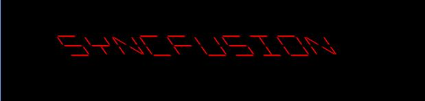

# Transformation of Characters in UWP Digital Gauge (SfDigitalGauge)

The digital characters in the digital gauge can be transformed by setting certain properties in the digital gauge. Two kinds of transformations are done using this property. They are:

* Scaling
* Skewing

## Scaling

The value of the digital characters is scaled by altering the height and width of the digital characters. It is achieved by setting the **CharacterHeight** and **CharacterWidth** property in the digital gauge.

### CharacterHeight




    <syncfusion:SfDigitalGauge Value="SYNCFUSION"  CharacterHeight="70"
    CharacterType="SegmentFourteen" />





    SfDigitalGauge digital = new SfDigitalGauge();
    digital.Value = "SYNCFUSION";
    digital.CharacterHeight = 70;
    digital.CharacterType = CharacterType.SegmentFourteen;
    this.Grid.Children.Add(digital);




### CharacterWidth




    <syncfusion:SfDigitalGauge  Value="SYNCFUSION"  CharacterWidth="60"
    CharacterType="SegmentFourteen" />





    SfDigitalGauge digital = new SfDigitalGauge();
    digital.Value = "SYNCFUSION";
    digital.CharacterWidth = 60;
    digital.CharacterType = CharacterType.SegmentFourteen;
    this.Grid.Children.Add(digital);
    



## Skewing

The digital gauge also performs skew transformation for the digital characters. It can be done on both x-axis and y-axis through **SkewAngleX** and **SkewAngleY** properties respectively.

### SkewAngleX




    <syncfusion:SfDigitalGauge  Value="SYNCFUSION"  SkewAngleX="35"
    CharacterType="SegmentFourteen" />





    SfDigitalGauge digital = new SfDigitalGauge();
    digital.Value = "SYNCFUSION";
    digital.SkewAngleX = 35;
    digital.CharacterType = CharacterType.SegmentFourteen;
    this.Grid.Children.Add(digital);




### SkewAngleY




    <syncfusion:SfDigitalGauge  Value="SYNCFUSION"  SkewAngleY="30"
    CharacterType="SegmentFourteen" />   





    SfDigitalGauge digital = new SfDigitalGauge();
    digital.Value = "SYNCFUSION";
    digital.SkewAngleY = 30;
    digital.CharacterType = CharacterType.SegmentFourteen;
    this.Grid.Children.Add(digital);




