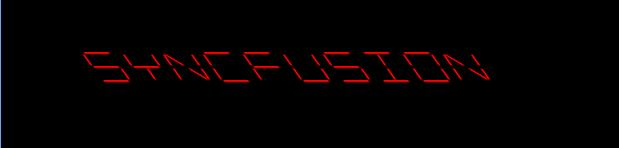

# Transformation of Characters in UWP Digital Gauge (SfDigitalGauge)

The digital characters in the digital gauge can be transformed by setting certain properties in the [SfDigitalGauge](https://help.syncfusion.com/cr/uwp/Syncfusion.UI.Xaml.Gauges.SfDigitalGauge.html). Two kinds of transformations are supported: Scaling and Skewing.

* Scaling
* Skewing

## Scaling

Digital characters are scaled by altering their height and width. It is achieved by setting the [CharacterHeight](https://help.syncfusion.com/cr/uwp/Syncfusion.UI.Xaml.Gauges.SfDigitalGauge.html#Syncfusion_UI_Xaml_Gauges_SfDigitalGauge_CharacterHeight) and [CharacterWidth](https://help.syncfusion.com/cr/uwp/Syncfusion.UI.Xaml.Gauges.SfDigitalGauge.html#Syncfusion_UI_Xaml_Gauges_SfDigitalGauge_CharacterWidth) properties in the digital gauge. The two properties can be set independently to scale each dimension. The default values and valid ranges are as follows:

* [CharacterHeight](https://help.syncfusion.com/cr/uwp/Syncfusion.UI.Xaml.Gauges.SfDigitalGauge.html#Syncfusion_UI_Xaml_Gauges_SfDigitalGauge_CharacterHeight) — default value is `40`; valid range is any positive numeric value.
* [CharacterWidth](https://help.syncfusion.com/cr/uwp/Syncfusion.UI.Xaml.Gauges.SfDigitalGauge.html#Syncfusion_UI_Xaml_Gauges_SfDigitalGauge_CharacterWidth) — default value is `25`; valid range is any positive numeric value.

### CharacterHeight




<syncfusion:SfDigitalGauge Value="SYNCFUSION" CharacterHeight="70" CharacterType="SegmentFourteen" />





SfDigitalGauge digital = new SfDigitalGauge();
digital.Value = "SYNCFUSION";
digital.CharacterHeight = 70;
digital.CharacterType = CharacterType.SegmentFourteen;
this.Grid.Children.Add(digital);




### CharacterWidth




<syncfusion:SfDigitalGauge Value="SYNCFUSION" CharacterWidth="60" CharacterType="SegmentFourteen" />





SfDigitalGauge digital = new SfDigitalGauge();
digital.Value = "SYNCFUSION";
digital.CharacterWidth = 60;
digital.CharacterType = CharacterType.SegmentFourteen;
this.Grid.Children.Add(digital);




## Skewing

The digital gauge also supports skew transformation of digital characters. It can be done on the x-axis and y-axis through the [SkewAngleX](https://help.syncfusion.com/cr/uwp/Syncfusion.UI.Xaml.Gauges.SfDigitalGauge.html#Syncfusion_UI_Xaml_Gauges_SfDigitalGauge_SkewAngleX) and [SkewAngleY](https://help.syncfusion.com/cr/uwp/Syncfusion.UI.Xaml.Gauges.SfDigitalGauge.html#Syncfusion_UI_Xaml_Gauges_SfDigitalGauge_SkewAngleY) properties, respectively. Both skew angles can be applied simultaneously. The default values, valid ranges, and units are as follows:

* [SkewAngleX](https://help.syncfusion.com/cr/uwp/Syncfusion.UI.Xaml.Gauges.SfDigitalGauge.html#Syncfusion_UI_Xaml_Gauges_SfDigitalGauge_SkewAngleX) — default value is `0`; valid range is any numeric value (in degrees).
* [SkewAngleY](https://help.syncfusion.com/cr/uwp/Syncfusion.UI.Xaml.Gauges.SfDigitalGauge.html#Syncfusion_UI_Xaml_Gauges_SfDigitalGauge_SkewAngleY) — default value is `0`; valid range is any numeric value (in degrees).

### SkewAngleX




<syncfusion:SfDigitalGauge Value="SYNCFUSION" SkewAngleX="35" CharacterType="SegmentFourteen" />





SfDigitalGauge digital = new SfDigitalGauge();
digital.Value = "SYNCFUSION";
digital.SkewAngleX = 35;
digital.CharacterType = CharacterType.SegmentFourteen;
this.Grid.Children.Add(digital);




### SkewAngleY




<syncfusion:SfDigitalGauge Value="SYNCFUSION" SkewAngleY="30" CharacterType="SegmentFourteen" />





SfDigitalGauge digital = new SfDigitalGauge();
digital.Value = "SYNCFUSION";
digital.SkewAngleY = 30;
digital.CharacterType = CharacterType.SegmentFourteen;
this.Grid.Children.Add(digital);




