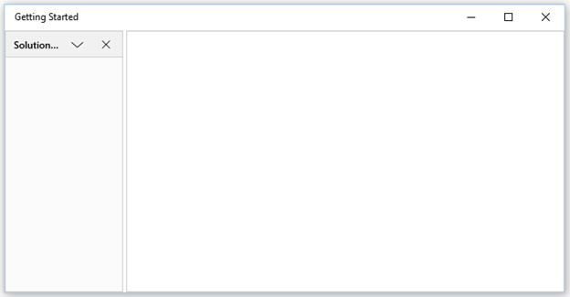
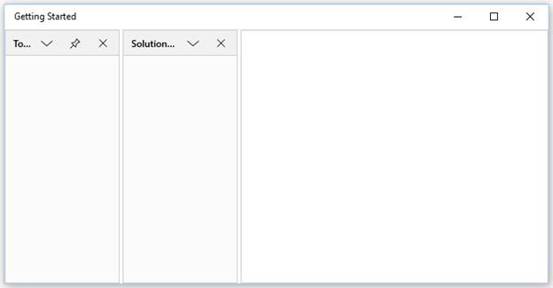

# Auto Hide Window in UWP Docking (SfDockingManager)

`AutoHide` window is one of the state in the `SfDockingManager`. To enable Auto hidden for SfDockingManager’s children, set `SfDockingManager` child `DockState` value as `AutoHidden`.

## Configuring Window in Different Side

`AutoHidden` window can be placed in four different sides such as Top, Bottom, Left and Right. To place the four auto hidden children in four different sides, set `SideInDockedMode` property according to its corresponding values in the `SfDockingManager`.





<layout:SfDockingManager>

<ContentControl layout:SfDockingManager.Header="Top" x:Name="AutoHideWindow1"
                layout:SfDockingManager.DockState="AutoHidden"
				layout:SfDockingManager.SideInDockedMode="Top" />

<ContentControl layout:SfDockingManager.Header="Left" x:Name="AutoHideWindow2"
                layout:SfDockingManager.DockState="AutoHidden"
				layout:SfDockingManager.SideInDockedMode="Left" />

<ContentControl layout:SfDockingManager.Header="Right" x:Name="AutoHideWindow3"
                layout:SfDockingManager.DockState="AutoHidden"
				layout:SfDockingManager.SideInDockedMode="Right" />

<ContentControl layout:SfDockingManager.Header="Bottom" x:Name="AutoHideWindow4"
                layout:SfDockingManager.DockState="AutoHidden"
				layout:SfDockingManager.SideInDockedMode="Bottom" />

</layout:SfDockingManager>





## Side Panel and TabItem Customization

The side panel and side panel header can be customized through `SidePanelBackground`, `SidePanelItemsBackground` and `SidePanelItemsForeground` properties of the `SfDockingManager`.





<layout:SfDockingManager SidePanelBackground="Brown"
                         SidePanelItemsForeground="White" SidePanelItemsBackground="Green">

<ContentControl layout:SfDockingManager.Header="SolutionExplorer"
                layout:SfDockingManager.DockState="AutoHidden" />

<ContentControl layout:SfDockingManager.Header="ToolBox" />

</layout:SfDockingManager>





### Scrollable Panel

Side panel have scroll support, when AutoHidden tab items overflow onto the side panel.

## Configuring AutoHide Animation

The Animation speed while auto hiding a window can be configured by setting required time delay in `AutoHideAnimationSpeed` property.





<layout:SfDockingManager AutoHideAnimationSpeed="400">

<ContentControl layout:SfDockingManager.Header="SolutionExplorer"
                layout:SfDockingManager.DockState="AutoHidden" />

</layout:SfDockingManager>





## Making Different Animations for AutoHide window

`SfDockingManager` supports three different built–in animations while auto-hiding the windows such as Fade, Scale and Slide that can be set through the property `AutoHideAnimationMode`.

`Fade` – AutoHidden window fades while auto hiding.





<layout:SfDockingManager AutoHideAnimationMode="Fade">

<ContentControl layout:SfDockingManager.Header="SolutionExplorer"
                layout:SfDockingManager.DockState="AutoHidden" />

</layout:SfDockingManager>





`Scale` – AutoHidden Window scales while auto hiding.





<layout:SfDockingManager AutoHideAnimationMode="Scale">

<ContentControl layout:SfDockingManager.Header="SolutionExplorer"
                layout:SfDockingManager.DockState="AutoHidden" />

</layout:SfDockingManager>





`Slide` – AutoHidden Window slides while auto hiding.





<layout:SfDockingManager AutoHideAnimationMode="Slide">

<ContentControl layout:SfDockingManager.Header="SolutionExplorer"
                layout:SfDockingManager.DockState="AutoHidden" />

</layout:SfDockingManager>





## Enabling and Disabling the AutoHide functionality

The Pin button, that performs Auto Hide functionality will be visible by default. It should be collapsed to disable the AutoHide functionality. Visibility of the Pin button can be changed by `ShowPinButton` property.





<layout:SfDockingManager ShowPinButton="false">

<ContentControl layout:SfDockingManager.Header="SolutionExplorer" />

</layout:SfDockingManager>





To show or collapse the AutoHide button for a specific child in the `SfDockingManager`, `IsPinButtonVisible` AttachedProperty can be used. By default, `IsPinButtonVisible` value is true. This functionality can be disabled by setting its value as false.





<layout:SfDockingManager>

<ContentControl layout:SfDockingManager.Header="SolutionExplorer"
                layout:SfDockingManager.IsPinButtonVisible="false"/>

<ContentControl layout:SfDockingManager.Header="ToolBox"
                layout:SfDockingManager.IsPinButtonVisible="true"/>

</layout:SfDockingManager>





To enable or disable the AutoHide functionality for a specific child in the `SfDockingManager`, `CanAutoHide` AttachedProperty can be used. By default, `CanAutoHide` value is true. This functionality can be disabled by setting its value as false.





<layout:SfDockingManager>

<ContentControl layout:SfDockingManager.Header="SolutionExplorer"
                layout:SfDockingManager.CanAutoHide="false"/>

<ContentControl layout:SfDockingManager.Header="ToolBox"
                layout:SfDockingManager.CanAutoHide="true"/>

</layout:SfDockingManager>




