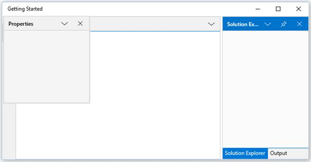

# Dealing with Windows in UWP Docking (SfDockingManager)

## Activating a window

A particular child window can be activated in `SfDockingManager` using its name or instance reference through the property `ActiveWindow` and `ActivateWindow` method that passes the element as argument to activate.





<layout:SfDockingManager x:Name="docking">

<ContentControl x:Name="SolutionExplorer" layout:SfDockingManager.Header="Solution Explorer"
                                          layout:SfDockingManager.SideInDockedMode="Right"/>

<ContentControl x:Name="ToolBox" layout:SfDockingManager.Header="ToolBox"
                                 layout:SfDockingManager.DockState="AutoHidden"/>
								 
<ContentControl x:Name="Properties" layout:SfDockingManager.Header="Properties"
                                    layout:SfDockingManager.DockState="Float"/>
									
<ContentControl x:Name="Output" layout:SfDockingManager.Header="Output"
                                layout:SfDockingManager.SideInDockedMode="Tabbed"
								layout:SfDockingManager.TargetNameInDockedMode="SolutionExplorer"/>
								
<ContentControl x:Name="StartPage" layout:SfDockingManager.Header="Start Page"
                                   layout:SfDockingManager.DockState="Document"/>
								   
</layout:SfDockingManager>









public MainPage()

{

this.InitializeComponent();

docking.Loaded += Docking_Loaded;

}

private void Docking_Loaded(object sender, RoutedEventArgs e)

{

docking.ActivateWindow(SolutionExplorer);

}





## Adding Window Programmatically

Any UI element can be added inside the `SfDockingManager` as its child windows. The windows are added as Dock windows, since the default value of the `DockState` is Dock. The UI element is added in the `SfDockingManager` using the Add method of the `DockItems` property of the `SfDockingManager`.

For example, `ContentControl` is added as a window for `SfDockingManager`.





SfDockingManager DockingManager1 = new SfDockingManager();

ContentControl content1 = new ContentControl();

SfDockingManager.SetHeader(content1, "Window1");

ContentControl content2 = new ContentControl();

SfDockingManager.SetHeader(content2, "Window2");

ContentControl content3 = new ContentControl();

SfDockingManager.SetHeader(content3, "Window3");

ContentControl content4 = new ContentControl();

SfDockingManager.SetHeader(content4, "Window4");

ContentControl content5 = new ContentControl();

SfDockingManager.SetHeader(content5, "Window5");

DockingManager1.DockItems.Add(content1);

DockingManager1.DockItems.Add(content2);

DockingManager1.DockItems.Add(content3);

DockingManager1.DockItems.Add(content4);

DockingManager1.DockItems.Add(content5);





## Hiding Window Programmatically

To hide the window, set `DockState` AttachedProperty of the `SfDockingManager` as Hidden.





SfDockingManager.SetDockState(content1, DockState.Hidden);





## Customizing Docking window

A Docking window can be customized using the property `DockWindowCaptionBackground`, `DockWindowCaptionForeground`, `DockWindowCaptionFontFamily` and `DockWindowCaptionMargin` with the desired values.





<layout:SfDockingManager DockWindowCaptionBackground="Red" DockWindowCaptionForeground="Yellow">

<ContentControl layout:SfDockingManager.Header="Dock1" Content="Content 1"/>

<ContentControl layout:SfDockingManager.Header="Dock2" Content="Content 2"/>

<ContentControl layout:SfDockingManager.Header="Dock3" Content="Content 3"/>

</layout:SfDockingManager>





## Customizing Active Docking Window

Active docking window can be customized using the property `DockWindowActiveForeground`, `DockWindowActiveBackground` with desired brush values.





<layout:SfDockingManager DockWindowActiveForeground="Red" DockWindowActiveBackground="Green">

<ContentControl layout:SfDockingManager.Header="Dock"/>

<ContentControl layout:SfDockingManager.Header="Dock1"/>

<ContentControl layout:SfDockingManager.Header="Dock2"/>

</layout:SfDockingManager>





## Customizing Inactive Document window

ForeColor and BackColor of Inactive document window can be customized using the properties `DocumentTabItemBackground`, `DocumentTabItemForeground` with the desired values. 





<layout:SfDockingManager x:Name="dockingmanager" DocumentTabItemBackground="#FF353535" DocumentTabItemForeground="White">

<ContentControl layout:SfDockingManager.Header="Item 1" layout:SfDockingManager.DockState="Document"/>

<ContentControl layout:SfDockingManager.Header="Item 2" layout:SfDockingManager.DockState="Document"/>

<ContentControl layout:SfDockingManager.Header="Item 3" layout:SfDockingManager.DockState="Document"/>

<ContentControl layout:SfDockingManager.Header="Item 4" layout:SfDockingManager.DockState="Document"/>

</layout:SfDockingManager>





## Customizing Selected Document window

Selected Document window can be customized using the property `DocumentTabItemSelectedBackground`, `DocumentTabItemSelectedForeground` with desired brush values. Font size of the selected document window can be customized through `DocumentTabItemSelectedFontSize` property of DockingManager.





<layout:SfDockingManager x:Name="dockingmanager" DocumentTabItemSelectedBackground="DarkBlue" DocumentTabItemSelectedForeground="White" DocumentTabItemSelectedFontSize="20">

<ContentControl layout:SfDockingManager.Header="Item 1" layout:SfDockingManager.DockState="Document"/>

<ContentControl layout:SfDockingManager.Header="Item 2" layout:SfDockingManager.DockState="Document"/>

<ContentControl layout:SfDockingManager.Header="Item 3" layout:SfDockingManager.DockState="Document"/>

<ContentControl layout:SfDockingManager.Header="Item 4" layout:SfDockingManager.DockState="Document"/>

</layout:SfDockingManager>





## Customizing Floating Window

The float window can be customized by setting `FloatWindowBackground`, `FloatWindowActiveBackground`, `FloatWindowContentBackground`, `FloatWindowContentForeground`, `FloatWindowBorderBrush`, `FloatWindowBorderThickness`, `FloatWindowCaptionBackground`, `FloatWindowContentBorderBrush`, `FloatWindowContentMargin` and `FloatWindowContentBorderThickness` properties with the required values.





<layout:SfDockingManager FloatWindowBackground="Pink" FloatWindowActiveBackground="Green">

<ContentControl Content="Content 1" layout:SfDockingManager.Header="Dock1"
                                    layout:SfDockingManager.DockState="Float"/>

<ContentControl layout:SfDockingManager.Header="Toolbox"/>

</layout:SfDockingManager>





## Handling state changing of DockingManager child element

DockStateChanging event will raise whenever the child element changing its State. StateChanging of child element can now be restricted by setting args.Cancel to true. “args” represents the event argument of DockStateChangingEventArgs for `DockStateChanging` event. The default value of args.Cancel is false. 





<syncfusion:SfDockingManager Name="docking" DockStateChanging="docking_DockStateChanging">

<ContentControl syncfusion:SfDockingManager.Header="Solution Explorer"  syncfusion:SfDockingManager.SideInDockedMode="Right"  syncfusion:SfDockingManager.DesiredWidthInDockedMode="200"/>

<ContentControl syncfusion:SfDockingManager.Header="Toolbox" syncfusion:SfDockingManager.DesiredWidthInDockedMode="200"/>

<ContentControl syncfusion:SfDockingManager.Header="MainPage.xaml.cs" syncfusion:SfDockingManager.DockState="Document"/>

<ContentControl syncfusion:SfDockingManager.Header="MainPage.xaml" syncfusion:SfDockingManager.DockState="Document"/>

</syncfusion:SfDockingManager>





private void docking_DockStateChanging(object sender, DockStateChangingEventArgs args)

{

FrameworkElement element = args.TargetElement as FrameworkElement;

if (SfDockingManager.GetHeader(element) == "Toolbox")

{

args.Cancel = true;

}

}





## Restricting DockingManager child element closing

State of the child element will change to `Hidden` while closing it. It can be restricted by changing the value of args.Cancel to true. The following code describes how to handle the closing of a child using DockStateChanging event.





<syncfusion:SfDockingManager Name="docking" DockStateChanging="docking_DockStateChanging">

<ContentControl syncfusion:SfDockingManager.Header="Solution Explorer"  syncfusion:SfDockingManager.SideInDockedMode="Right"  syncfusion:SfDockingManager.DesiredWidthInDockedMode="200"/>

<ContentControl syncfusion:SfDockingManager.Header="Toolbox" syncfusion:SfDockingManager.DesiredWidthInDockedMode="200"/>

<ContentControl syncfusion:SfDockingManager.Header="MainPage.xaml.cs" syncfusion:SfDockingManager.DockState="Document"/>

<ContentControl syncfusion:SfDockingManager.Header="MainPage.xaml" syncfusion:SfDockingManager.DockState="Document"/>

</syncfusion:SfDockingManager>





private void docking_DockStateChanging(object sender, DockStateChangingEventArgs args)

{

if (args.NewState == DockState.Hidden)

{

args.Cancel = true;

}

}





## Enable/Disable Dragging a Window

The AttachedProperty `IsDragEnabled` helps to enable or disable the dragging functionality of a window by setting its value as true or false respectively. By default, `IsDragEnabled` value is true. This functionality can be disabled by setting its value as false. 





<layout:SfDockingManager>

<ContentControl layout:SfDockingManager.Header="Item1"
                layout:SfDockingManager.IsDragEnabled="false"/>

</layout:SfDockingManager>





## Customizing Hint Shadow Fill Color

The fill color of hint shadow/dock preview element can be customized using `DockPreviewColor` property of `SfDockingManager`.





<layout:SfDockingManager DockPreviewColor="Red" >

<ContentControl layout:SfDockingManager.Header="Item1" />

</layout:SfDockingManager>





## Sizing Docking Windows

`SfDockingManager` allows to set the desired width and height for the docking windows. 

The desired height and width can be set for the Dock windows through the AttachedProperty `DesiredWidthInDockedMode` and `DesiredHeightInDockedMode` with the desired values.





<layout:SfDockingManager>

<ContentControl layout:SfDockingManager.Header="Item1"
                layout:SfDockingManager.DesiredHeightInDockedMode="400"
				layout:SfDockingManager.DesiredWidthInDockedMode="300"/>

</layout:SfDockingManager>





## Occupy Whole Window

To arrange the dock windows to a whole available space in the `SfDockingManager`, set `DockFill` property of `SfDockingManager` as true.





<layout:SfDockingManager DockFill="true">

<ContentControl layout:SfDockingManager.Header="Item1"/>

</layout:SfDockingManager>





## Enable/Disable ContextMenus

`SfDockingManager` provides ContextMenu's for docking, floating, auto hiding and document windows. 

### Enable/Disable context menu for docking, floating, auto hiding windows

Docking, floating and auto hiding windows have a ContextMenu button that contains options for switching between states.  The button can be enabled/disabled using `ShowMenuButton` property. By default, `ShowMenuButton` value is true. This functionality can be disabled by setting its value as false. 





<layout:SfDockingManager ShowMenuButton="false">

<ContentControl layout:SfDockingManager.Header="Item1"/>

</layout:SfDockingManager>





### Enable/Disable ContextMenu for Document windows

Document windows have a ContextMenu button, that contains options for switching between TabItems.  The button can be enabled/disabled using `ShowDocumentTabStripMenu` property. By default, `ShowDocumentTabStripMenu` value is true. This functionality can be disabled by setting its value as false. 





<layout:SfDockingManager ShowDocumentTabStripMenu="true">

<ContentControl layout:SfDockingManager.Header="Item1"
                layout:SfDockingManager.DockState="Document"/>

</layout:SfDockingManager>





### Enable/Disable context menu of DocumentTabItems

One or more `DocumentTabItems` can be closed using Document TabItem ContextMenu. This ContextMenu can be enabled/disabled through `ShowDocumentTabItemContextMenu` property. By default, `ShowDocumentTabItemContextMenu` value is true. This functionality can be disabled by setting its value as false. 





<layout:SfDockingManager ShowDocumentTabItemContextMenu="true">

<ContentControl layout:SfDockingManager.Header="Item1"
                layout:SfDockingManager.DockState="Document"/>

</layout:SfDockingManager>





