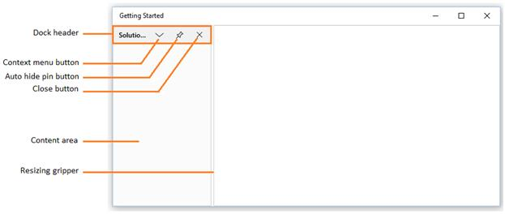
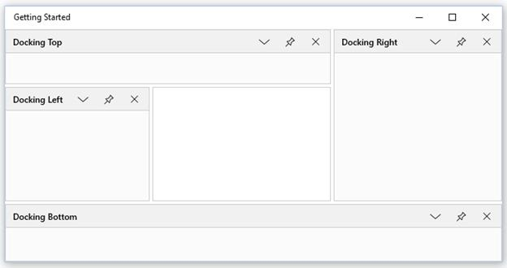
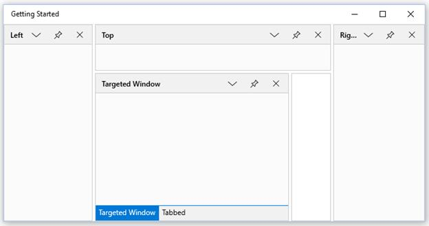
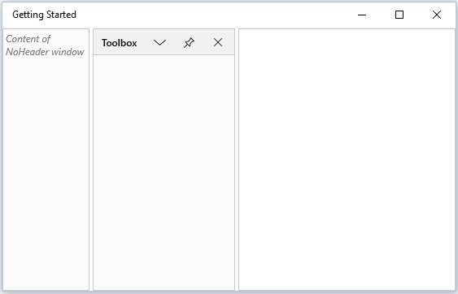

# Docking Window in UWP Docking (SfDockingManager)

Docking window is one of the state of `SfDockingManager`. Since Dock is the default value, initially all the children stay as Docking Window.

## Configuring Window in Different Sides

The Fives sides where the children can be docked are

* Left
* Right
* Top
* Bottom
* Tabbed

To Dock four children of `SfDockingManager` to each sides, set `SideInDockedMode` property with appropriate values.





<layout:SfDockingManager x:Name="docking">

<ContentControl layout:SfDockingManager.Header="Docking Left"
                layout:SfDockingManager.SideInDockedMode="Left"/>

<ContentControl layout:SfDockingManager.Header="Docking Top"
                layout:SfDockingManager.SideInDockedMode="Top"/>

<ContentControl layout:SfDockingManager.Header="Docking Right"
                layout:SfDockingManager.SideInDockedMode="Right"/>

<ContentControl layout:SfDockingManager.Header="Docking Bottom"
                layout:SfDockingManager.SideInDockedMode="Bottom"/>

</layout:SfDockingManager>





## Docking Window in Various Targets

Docking window can be docked on any side of the Target Docking Window using an AttachedProperty named `TargetNameInDockedMode`.

To set the child window as TabbedWindow, the window should aware of a Target window name. The following code helps to arrange children of `SfDockingManager` that targets a single Docking window docked along Left, Top, Right and Tabbed.





<layout:SfDockingManager>

<ContentControl layout:SfDockingManager.Header="Targeted Window" x:Name="DockingWindow1"/>

<!--Targeted to Docking Window1 on Top Side-->

<ContentControl layout:SfDockingManager.Header="Top"
                layout:SfDockingManager.SideInDockedMode="Top"
				layout:SfDockingManager.TargetNameInDockedMode="DockingWindow1"/>

<!--Targeted to DockingWindow1 on Right Side-->

<ContentControl layout:SfDockingManager.Header="Right"
                layout:SfDockingManager.SideInDockedMode="Right"
				layout:SfDockingManager.TargetNameInDockedMode="DockingWindow1"/>

<!--Targeted to DockingWindow1 on Left Side-->

<ContentControl layout:SfDockingManager.Header="Left"
                layout:SfDockingManager.SideInDockedMode="Left"
				layout:SfDockingManager.TargetNameInDockedMode="DockingWindow1"/>

<!--Targeted to DockingWindow to tab-->

<ContentControl layout:SfDockingManager.Header="Tabbed"
                layout:SfDockingManager.SideInDockedMode="Tabbed"
				layout:SfDockingManager.TargetNameInDockedMode="DockingWindow1"/>

</layout:SfDockingManager>





## Enabling or Disabling the Header Visibility

`NoHeader` is an AttachedProperty, that is used to hide the header of Dock Window. Default value of `NoHeader` is false. To hide the Header change the value of NoHeader property to true.





<layout:SfDockingManager>

<ContentControl layout:SfDockingManager.Header="Toolbox"/>

<ContentControl layout:SfDockingManager.Header="Solution Explorer"
                layout:SfDockingManager.NoHeader="true">
                
<TextBlock Text="Content of NoHeader window" FontStyle="Italic"
           Foreground="Gray" TextWrapping="Wrap"/>

</ContentControl>

</layout:SfDockingManager>





## Enabling or Disabling the Dock Functionality

The `CanDock` AttachedProperty used to enable or disable the docking functionality by setting its value as true or false. By default, `CanDock` value is true. This functionality can be disabled by setting its value as false.





<layout:SfDockingManager>

<ContentControl layout:SfDockingManager.Header="Toolbox"
                layout:SfDockingManager.CanDock="false"/>

</layout:SfDockingManager>




