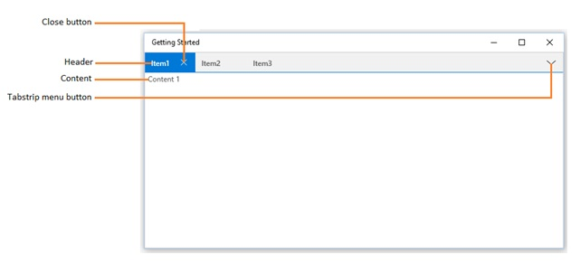
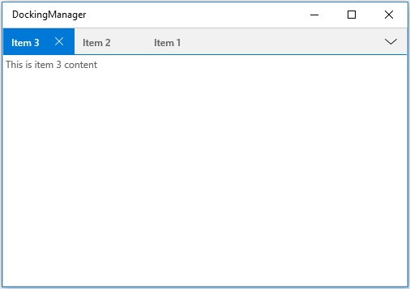

# Document Window in UWP Docking (SfDockingManager)

Document window is one of the states available in the `SfDockingManager`. To make the children of the `SfDockingManager` as Document, set child's `DockState` value as Document.

All the Document windows are added in a `DocumentContainer`. Content can be switched by clicking the item header or choosing item from TabStripMenu.

## Closing Document Windows

A Document window can be closed using the close button provided in header or using the `Close` ContextMenu item.

`CloseAll` ContextMenu item is used to close all the document tab items in the DocumentContainer.

`CloseAllButThis` ContextMenu item is used to close all the document tab items except the active document in the Document Container.

## Floating Document Windows

A Document window can be moved to float state by dragging or double clicking the item header.

## Document Container behavior with DockFill

Dock windows are allowed to occupy the remaining space when DockFill property is set to true. SfDockingManager does not reserve space for DocumentContainer. So, child windows with Document State are hidden in the layout.

## Specify Placement for Document Window

A Document window can be added either at start or end index position in the `DocumentContainer` by setting the `DocumentTabItemPlacement` property in `SfDockingManager`. The `DocumentTabItemPlacement` enumeration values are `Start` and `End`, default value is `Start`.

* Adding Documents at Start position





<syncfusion:SfDockingManager DocumentTabItemPlacement="Start" x:Name="dockingManager">

<ContentControl x:Name="dock1" syncfusion:SfDockingManager.Header="Item 1"
                               syncfusion:SfDockingManager.DockState="Document">

<TextBlock Text="This is item 1 content"/>

</ContentControl>

<ContentControl syncfusion:SfDockingManager.Header="Item 2"
                syncfusion:SfDockingManager.DockState="Document">

<TextBlock Text="This is item 2 content"/>

</ContentControl>

<ContentControl syncfusion:SfDockingManager.Header="Item 3"
                syncfusion:SfDockingManager.DockState="Document">

<TextBlock Text="This is item 3 content"/>

</ContentControl>

</syncfusion:SfDockingManager>









dockingManager.DocumentTabItemPlacement = Syncfusion.UI.Xaml.Controls.Layout.DocumentTabItemPlacement.Start;





* Adding Documents at End position





<syncfusion:SfDockingManager DocumentTabItemPlacement="End" x:Name="dockingManager">

<ContentControl x:Name="dock1" syncfusion:SfDockingManager.Header="Item 1"
                               syncfusion:SfDockingManager.DockState="Document">

<TextBlock Text="This is item 1 content"/>

</ContentControl>

<ContentControl syncfusion:SfDockingManager.Header="Item 2"
                syncfusion:SfDockingManager.DockState="Document">

<TextBlock Text="This is item 2 content"/>

</ContentControl>

<ContentControl syncfusion:SfDockingManager.Header="Item 3"
                syncfusion:SfDockingManager.DockState="Document">

<TextBlock Text="This is item 3 content"/>

</ContentControl>

</syncfusion:SfDockingManager>









dockingManager.DocumentTabItemPlacement = Syncfusion.UI.Xaml.Controls.Layout.DocumentTabItemPlacement.End;





